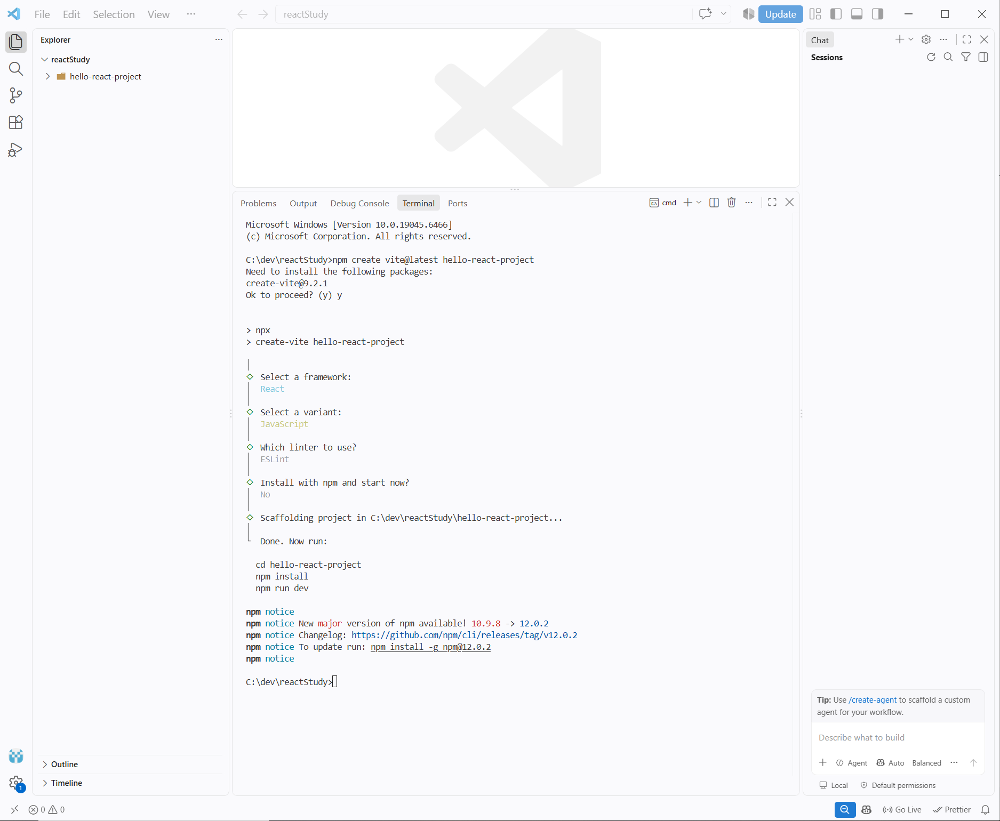
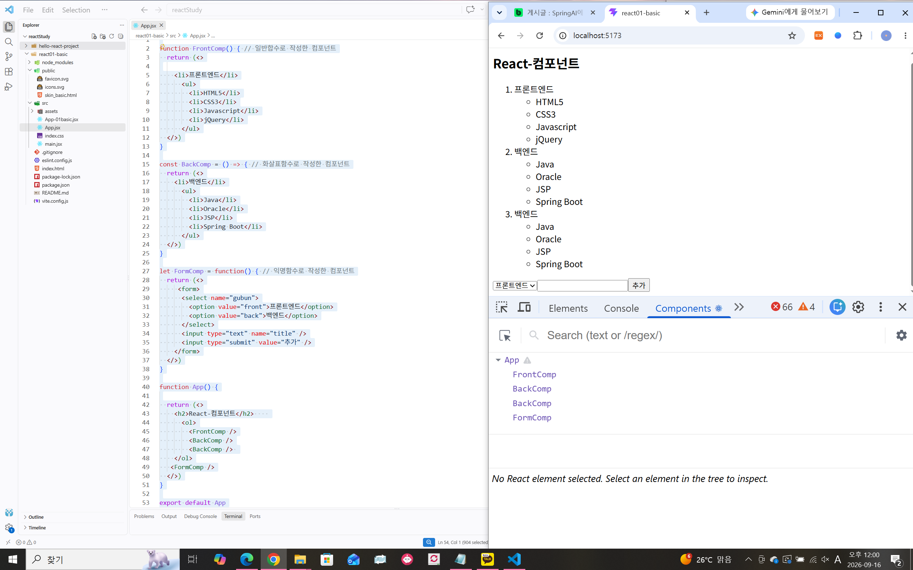
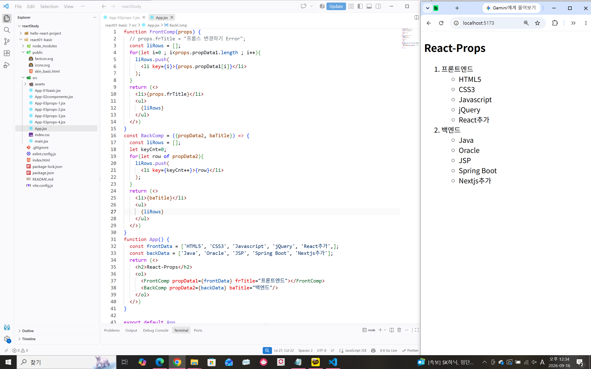
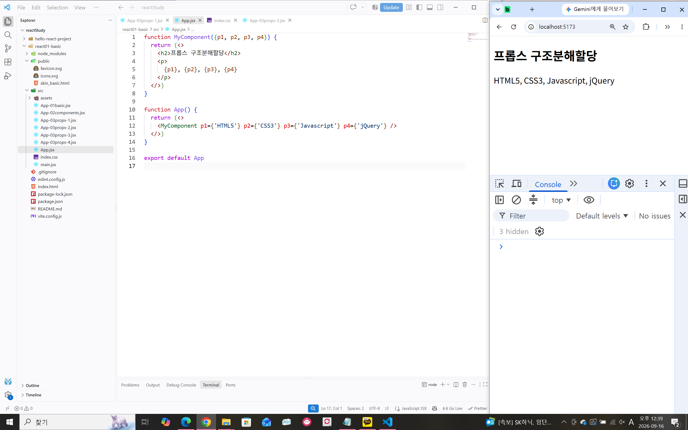
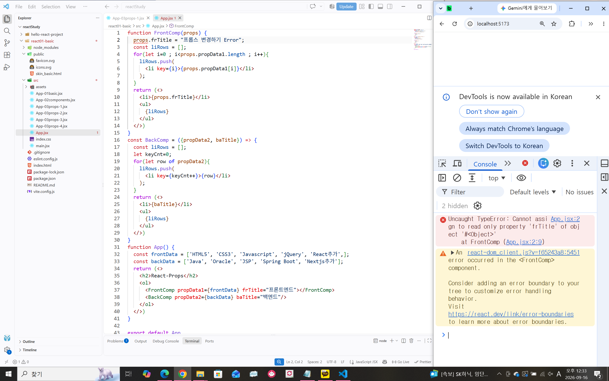
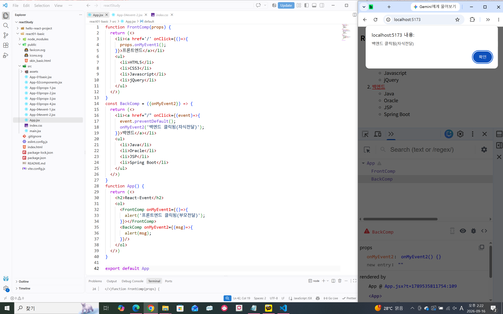
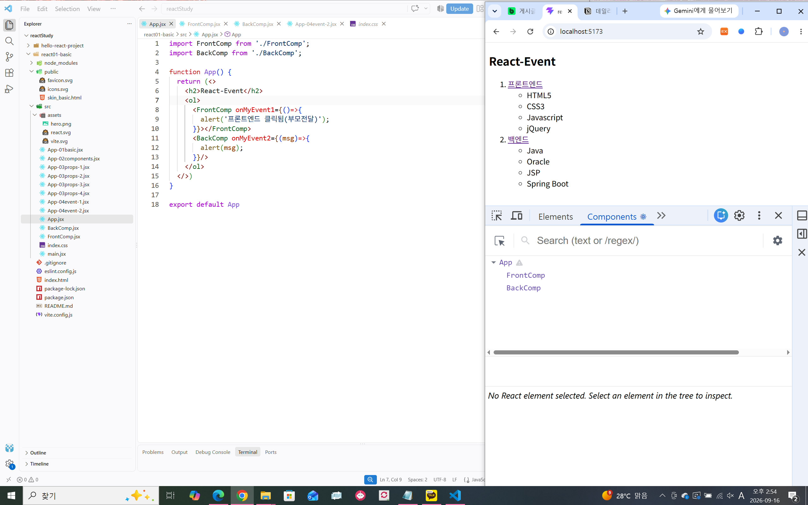
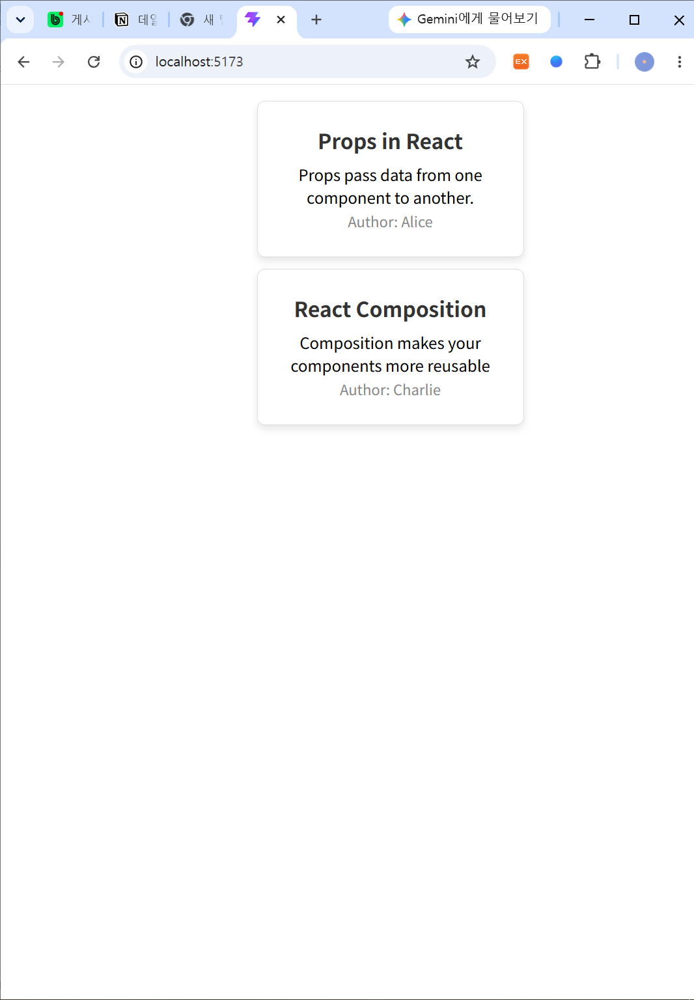

# DAY 46 — React 기초: Vite·컴포넌트·props와 이벤트

> 2026-09-16 · SPA, JSX, 컴포넌트, props, 이벤트, 컴포넌트 모듈화

오늘은 React의 특징과 단방향 데이터 흐름을 이해하고, Vite로 React 프로젝트를 생성해
개발 서버를 실행했다. JSX로 화면을 작성하고 함수 컴포넌트를 구성했으며, props를 이용한
부모·자식 컴포넌트 사이의 데이터 전달과 이벤트 콜백, 컴포넌트 파일 분리를 실습했다.

## 1. React와 SPA

React는 사용자 인터페이스를 만들기 위한 JavaScript 라이브러리다. 페이지 전체를 매번 새로
불러오지 않고 필요한 화면을 갱신하는 SPA(Single Page Application)를 구성할 때 활용할 수 있다.

| 특징 | 정리 |
| --- | --- |
| 컴포넌트 기반 | 화면을 작고 독립적인 단위로 나누어 조합한다. |
| 단방향 데이터 흐름 | 데이터는 기본적으로 부모에서 자식 방향으로 전달된다. |
| JSX | JavaScript 안에서 HTML과 비슷한 문법으로 UI를 표현한다. |
| 생태계 | 개발 도구와 다양한 라이브러리를 함께 사용할 수 있다. |

## 2. Vite로 React 프로젝트 만들기

Vite의 프로젝트 생성 도구에서 React와 JavaScript를 선택하고, 의존성을 설치한 뒤 개발 서버를
실행했다.

```bash
npm create vite@latest react01-basic
cd react01-basic
npm install
npm run dev
```

개발 서버가 실행되면 터미널에 표시된 `localhost` 주소로 접속해 결과를 확인할 수 있다.



`main.jsx`는 `createRoot()`로 React 애플리케이션을 시작하고, 최상위 `App` 컴포넌트를
브라우저의 `root` 요소에 렌더링한다.

```jsx
import { createRoot } from 'react-dom/client';
import App from './App.jsx';

createRoot(document.getElementById('root')).render(<App />);
```

## 3. JSX와 함수 컴포넌트

컴포넌트는 화면을 구성하는 단위다. 일반 함수, 화살표 함수, 함수 표현식 등으로 작성할 수 있고,
컴포넌트 이름은 HTML 요소와 구분할 수 있도록 대문자로 시작한다.

```jsx
function FrontComp() {
  return (
    <>
      <li>프론트엔드</li>
      <ul>
        <li>HTML5</li>
        <li>CSS3</li>
        <li>JavaScript</li>
      </ul>
    </>
  );
}

const BackComp = () => (
  <>
    <li>백엔드</li>
    <ul>
      <li>Java</li>
      <li>Spring Boot</li>
    </ul>
  </>
);
```

JSX를 작성할 때 확인할 점은 다음과 같다.

- 컴포넌트가 반환하는 최상위 요소는 하나여야 한다.
- 불필요한 DOM 요소를 만들고 싶지 않다면 Fragment(`<>...</>`)로 감싼다.
- JavaScript 표현식은 중괄호(`{}`) 안에 작성한다.
- 인라인 스타일은 문자열이 아니라 JavaScript 객체로 전달한다.



## 4. props로 데이터 전달하기

props는 부모 컴포넌트가 자식 컴포넌트에 데이터를 전달할 때 사용하는 객체다. 문자열뿐 아니라
배열과 함수 등 여러 값을 전달할 수 있으며, 자식 컴포넌트에서는 읽기 전용으로 다뤄야 한다.

```jsx
function MyComponent({ p1, p3 }) {
  return (
    <>
      <h2>props 구조 분해 할당</h2>
      <p>{p1}, {p3}</p>
    </>
  );
}

function App() {
  return <MyComponent p1="HTML5" p2="CSS3" p3="JavaScript" p4="jQuery" />;
}
```

배열을 JSX 요소로 변환할 때는 각 항목에 React가 구분할 수 있는 `key`를 지정한다.





자식이 전달받은 props를 직접 변경하려 하면 읽기 전용 속성 오류가 발생한다. 값의 변경이
필요하다면 부모가 새로운 값을 내려주도록 구성해야 한다.



## 5. React 이벤트와 콜백 props

React 이벤트 속성은 `onClick`처럼 camelCase로 작성하고, 실행할 함수를 값으로 전달한다.
React는 브라우저마다 다른 이벤트 동작을 일관되게 다룰 수 있도록 합성 이벤트 객체를 제공한다.

자식 컴포넌트에서 부모의 동작을 실행하려면 부모가 콜백 함수를 props로 전달하고, 자식이
이벤트 발생 시 그 함수를 호출할 수 있다.

```jsx
const BackComp = ({ onMyEvent }) => (
  <a
    href="/"
    onClick={(event) => {
      event.preventDefault();
      onMyEvent('백엔드 클릭됨(자식 전달)');
    }}
  >
    백엔드
  </a>
);

function App() {
  return <BackComp onMyEvent={(message) => alert(message)} />;
}
```

`preventDefault()`는 링크 이동이나 폼 제출 같은 브라우저의 기본 동작을 막을 때 사용한다.



## 6. 컴포넌트 모듈화

컴포넌트를 별도 파일로 분리하면 필요한 곳에서 다시 사용할 수 있고, 파일별 책임이 분명해져
가독성과 유지보수성, 협업 편의성이 좋아진다.

```jsx
// Components/FrontComp.jsx
function FrontComp() {
  return <li>프론트엔드</li>;
}

export default FrontComp;
```

```jsx
// App.jsx
import FrontComp from './Components/FrontComp.jsx';

function App() {
  return <FrontComp />;
}
```



## 7. props 카드 실습

마지막으로 제목·내용·작성자를 props로 받는 `InfoCard` 컴포넌트를 만들었다. 같은 컴포넌트에
서로 다른 데이터를 전달해 두 개의 카드를 만들고 CSS로 여백·테두리·그림자를 적용했다.

```jsx
const InfoCard = ({ title, content, author }) => (
  <div className="card">
    <h2>{title}</h2>
    <p>{content}</p>
    <p>Author: {author}</p>
  </div>
);
```



## 오늘의 정리

- Vite로 React 프로젝트를 만들고 개발 서버를 실행했다.
- JSX의 최상위 요소, Fragment, 중괄호 표현식 규칙을 익혔다.
- 함수 컴포넌트를 조합하고 props로 부모에서 자식에게 데이터를 전달했다.
- props가 읽기 전용임을 오류 실습으로 확인하고 구조 분해 할당을 적용했다.
- 이벤트 콜백을 props로 전달해 자식에서 부모의 동작을 실행했다.
- 컴포넌트를 파일별로 분리하고 `export`·`import`로 연결했다.

> 공개 자료에는 수업 PDF를 포함하지 않았으며, 개인 정보나 인증 정보가 없는 실습 화면만
> 선별해 정리했다.
