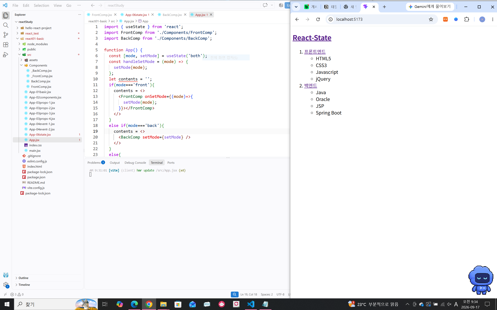
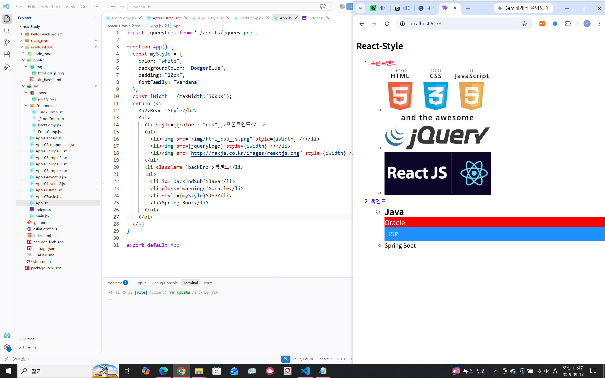
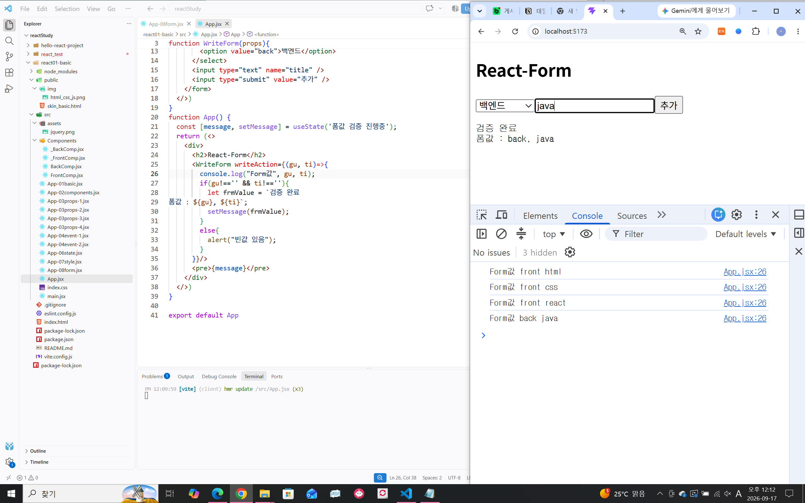
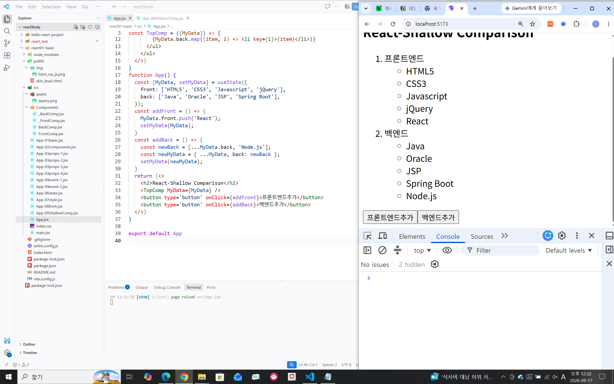
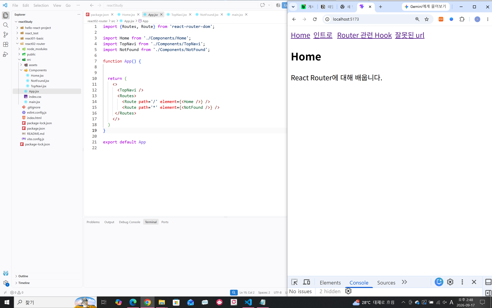
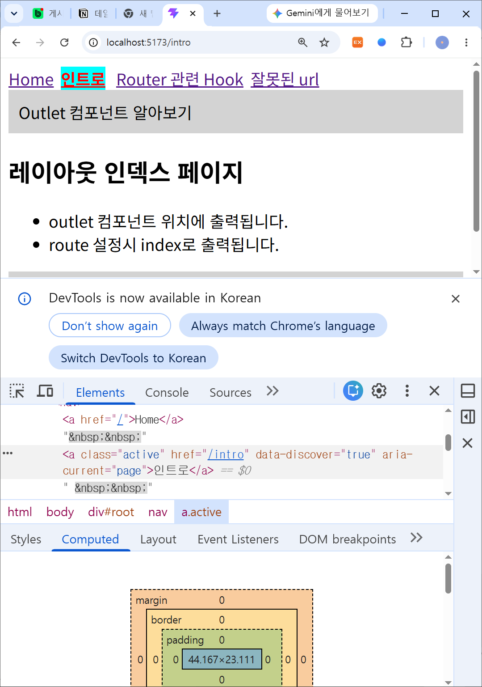
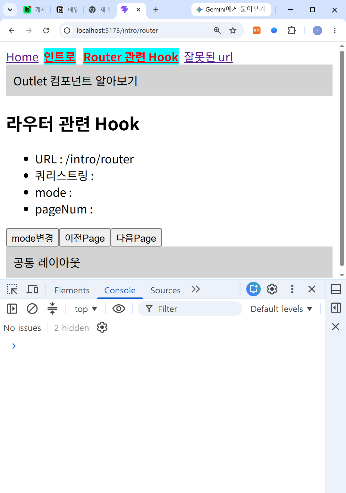
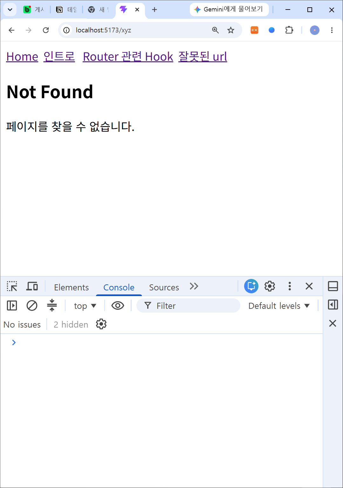

# DAY 47 — React 상태·스타일·폼 처리와 React Router

> 2026-09-17 · useState, 조건부 렌더링, 스타일·이미지, 폼, 불변성, React Router

오늘은 `useState`로 컴포넌트의 동적인 데이터를 관리하고, 상태에 따라 화면을 다르게
렌더링하는 방법을 실습했다. React에서 스타일과 이미지를 적용하고 폼 입력값을 처리했으며,
객체 상태의 얕은 비교와 불변성이 필요한 이유를 확인했다. 이어서 React Router로 URL에 따라
화면을 전환하고 중첩 라우트, 활성 링크, 쿼리스트링과 Not Found 화면을 구성했다.

## 1. useState와 조건부 렌더링

props가 부모로부터 전달받는 읽기 전용 데이터라면, state는 컴포넌트가 직접 관리하며 변경할 수
있는 데이터다. `useState`는 현재 상태값과 그 값을 바꾸는 함수를 배열로 반환한다. 변경 함수를
호출하면 React가 상태 변화를 확인하고 화면을 다시 렌더링한다.

```jsx
const [mode, setMode] = useState('both');

let contents;
if (mode === 'front') {
  contents = <FrontComp onSetMode={setMode} />;
} else if (mode === 'back') {
  contents = <BackComp setMode={setMode} />;
} else {
  contents = (
    <>
      <FrontComp onSetMode={setMode} />
      <BackComp setMode={setMode} />
    </>
  );
}
```

자식 컴포넌트에는 상태 자체가 아니라 상태 변경 함수를 props로 전달했다. 자식에서 링크를
클릭하면 `preventDefault()`로 기본 이동을 막고 전달받은 함수를 호출해 부모 상태를 변경했다.



## 2. React의 스타일과 이미지

JSX의 인라인 스타일은 CSS 문자열이 아니라 JavaScript 객체로 작성한다. 속성 이름은
`backgroundColor`, `fontFamily`처럼 camelCase를 사용하고, CSS 클래스는 `class` 대신
`className`으로 지정한다.

```jsx
const myStyle = {
  color: 'white',
  backgroundColor: 'DodgerBlue',
  padding: '10px',
  fontFamily: 'Verdana',
};

<li style={{ color: 'red' }}>프론트엔드</li>
<li className="warning">Oracle</li>
<li style={myStyle}>JSP</li>
```

이미지는 저장 위치에 따라 접근 방법이 달랐다.

- `public` 폴더의 이미지는 루트 경로(`/img/example.png`)로 접근한다.
- `src/assets`의 이미지는 `import`한 뒤 JSX의 `src`에 전달한다.
- 외부 이미지는 URL을 사용할 수 있지만, 서비스 환경에서는 출처와 접근 가능 여부를 함께
  확인해야 한다.



## 3. 폼 입력값 처리

폼의 `onSubmit` 이벤트에서 `preventDefault()`를 호출해 페이지 새로고침을 막고,
`event.target`을 통해 입력값을 읽었다. 입력값을 처리하는 함수는 props로 전달해 폼 컴포넌트와
결과를 관리하는 컴포넌트의 역할을 나눴다.

```jsx
function WriteForm({ writeAction }) {
  return (
    <form
      onSubmit={(event) => {
        event.preventDefault();
        const category = event.target.category.value;
        const title = event.target.title.value;
        writeAction(category, title);
      }}
    >
      <select name="category">
        <option value="front">프론트엔드</option>
        <option value="back">백엔드</option>
      </select>
      <input type="text" name="title" />
      <button type="submit">추가</button>
    </form>
  );
}
```

입력값이 있으면 검증 결과를 state에 저장해 화면에 표시하고, 비어 있으면 경고창을 보여 주도록
구성했다.



## 4. 얕은 비교와 불변성

React는 상태가 바뀌었는지 판단할 때 객체 내부의 모든 값을 재귀적으로 비교하지 않고, 이전
참조와 새로운 참조를 비교하는 얕은 비교를 사용한다. 기존 배열을 `push()`로 직접 수정한 뒤
같은 객체를 다시 전달하면 참조가 같기 때문에 화면 갱신이 일어나지 않을 수 있다.

```jsx
// 기존 상태를 직접 수정하므로 피해야 하는 방식
data.front.push('React');
setData(data);

// 새 배열과 새 객체를 만들어 참조를 변경하는 방식
setData((previous) => ({
  ...previous,
  back: [...previous.back, 'Node.js'],
}));
```

스프레드 문법으로 새 배열과 객체를 만들면 기존 상태를 훼손하지 않으면서 React가 변경을
정확하게 감지할 수 있다.



## 5. React Router 기본 구성

React Router는 URL 경로에 따라 표시할 컴포넌트를 정한다. 애플리케이션의 최상위에서
`BrowserRouter`로 감싸고, `Routes` 안에 각 `Route`의 경로와 화면을 연결했다.

```jsx
createRoot(document.getElementById('root')).render(
  <BrowserRouter>
    <App />
  </BrowserRouter>,
);
```

```jsx
<Routes>
  <Route path="/" element={<Home />} />
  <Route path="/intro" element={<CommonLayout />}>
    <Route index element={<LayoutIndex />} />
    <Route path="router" element={<RouterHooks />} />
  </Route>
  <Route path="*" element={<NotFound />} />
</Routes>
```



## 6. Link·NavLink와 중첩 라우트

`Link`는 전체 페이지를 새로 불러오지 않고 React Router가 경로를 바꾸게 한다. `NavLink`는
현재 경로와 일치할 때 `active` 상태를 제공하므로 활성 메뉴 스타일을 적용하기 편리하다.

`/intro` 아래에는 중첩 라우트를 만들었다. 부모 컴포넌트의 공통 헤더와 푸터는 유지하고,
자식 화면만 `Outlet` 위치에 출력했다. 부모 경로 자체로 들어왔을 때는 `index` 라우트가
기본 화면을 담당한다.



## 7. 라우터 Hook과 쿼리스트링

`useLocation()`으로 현재 경로와 쿼리스트링을 확인하고, `useSearchParams()`로 URL의
`mode`와 `pageNum` 값을 읽고 변경했다. 화면 상태를 URL에 표현하면 새로고침하거나 주소를
공유해도 같은 조건을 다시 확인할 수 있다.

```jsx
const location = useLocation();
const [searchParams, setSearchParams] = useSearchParams();

const mode = searchParams.get('mode');
const pageNum = searchParams.get('pageNum');

setSearchParams({ mode: 'list', pageNum: 1 });
```



## 8. 잘못된 경로 처리

등록되지 않은 주소는 `path="*"` 라우트가 받아 Not Found 컴포넌트를 표시하도록 했다.
사용자에게 페이지를 찾지 못했다는 안내와 홈으로 돌아갈 링크를 제공할 수 있다.



## 오늘의 정리

- `useState`로 동적인 데이터를 관리하고 상태에 따라 컴포넌트를 조건부 렌더링했다.
- 상태 변경 함수를 props로 전달해 자식 컴포넌트의 이벤트로 부모 상태를 바꿨다.
- JSX에서 인라인 스타일, CSS 클래스와 `public`·`assets` 이미지를 적용했다.
- 폼 제출의 기본 동작을 막고 입력값 검증 결과를 state에 반영했다.
- 얕은 비교의 동작을 확인하고 배열·객체를 불변하게 갱신하는 이유를 익혔다.
- React Router로 기본·중첩·Not Found 라우트를 만들고 `Link`, `NavLink`, `Outlet`을 사용했다.
- `useLocation`과 `useSearchParams`로 경로와 쿼리스트링을 읽고 변경했다.

> 공개 자료에는 수업 PDF와 원본 실습 프로젝트를 포함하지 않았다. 캡처 화면은 비밀번호,
> 인증 토큰, 이메일, 사용자명이 포함된 로컬 경로가 없는지 확인한 뒤 학습에 필요한 화면만
> 선별했다.
