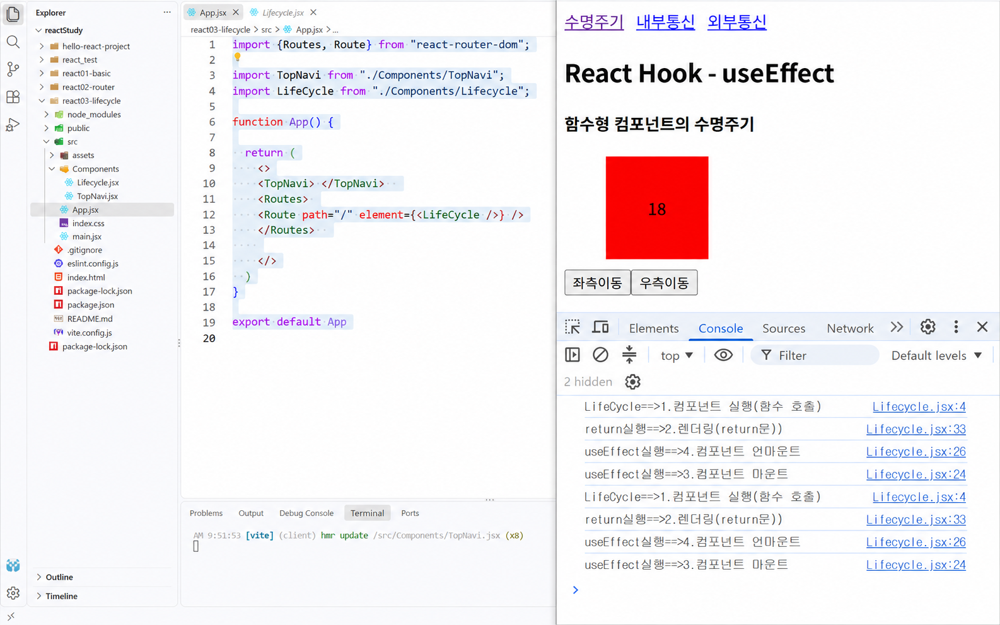

# DAY 49 — React 라이프사이클과 useEffect 데이터 통신

> 2026-09-19 · 마운트·업데이트·언마운트, useEffect, 의존성 배열, cleanup, fetch

오늘은 함수형 컴포넌트가 화면에 나타나고, 상태나 props의 변화로 다시 렌더링되며, 화면에서
사라지는 라이프사이클을 학습했다. `useEffect`의 실행 시점과 의존성 배열에 따른 차이를
콘솔에서 확인하고, 로컬 JSON과 외부 API를 불러와 state에 저장한 뒤 화면에 출력하는 실습으로
사이드 이펙트 처리 과정을 익혔다.

## 1. 컴포넌트의 라이프사이클

React 컴포넌트는 크게 세 단계의 생명주기를 가진다.

- **마운트(Mount)**: 컴포넌트가 처음 생성되어 화면에 나타나는 단계
- **업데이트(Update)**: state나 props가 바뀌어 컴포넌트가 다시 렌더링되는 단계
- **언마운트(Unmount)**: 컴포넌트가 화면에서 제거되는 단계

함수형 컴포넌트에서는 함수 본문이 실행되고 JSX가 반환된 다음 화면이 렌더링된다. 렌더링이
끝난 뒤 `useEffect`에 등록한 함수가 실행된다.

```jsx
function MoveBox({ initPosition }) {
  console.log('1. 컴포넌트 함수 실행');

  const [position, setPosition] = useState(initPosition);
  const [leftCount, setLeftCount] = useState(1);

  console.log('2. JSX 반환과 렌더링');
  return <div>{leftCount}</div>;
}
```



## 2. useEffect의 역할

`useEffect`는 렌더링 자체가 아닌 부수 작업을 처리하는 Hook이다. 콘솔 기록, 데이터 요청처럼
화면이 그려진 뒤 실행할 작업을 effect 함수에 작성한다.

```jsx
useEffect(() => {
  console.log('3. useEffect 실행');

  return () => {
    console.log('4. cleanup 실행');
  };
}, []);
```

effect에서 함수를 반환하면 cleanup 함수가 된다. 빈 의존성 배열을 사용한 경우 컴포넌트가
언마운트될 때 실행되며, 의존성이 있는 effect에서는 다음 effect가 실행되기 전에도 이전 작업을
정리한다.

## 3. 의존성 배열에 따른 실행 차이

`useEffect`의 두 번째 인자인 의존성 배열에 따라 다시 실행되는 시점이 달라진다.

```jsx
// 렌더링이 끝날 때마다 실행
useEffect(() => {
  console.log('매 렌더링 후 실행');
});

// 최초 마운트 후 한 번 실행
useEffect(() => {
  console.log('마운트 후 실행');
}, []);

// 최초 마운트 후 실행하고 leftCount가 바뀔 때마다 다시 실행
useEffect(() => {
  console.log('leftCount 변경:', leftCount);
}, [leftCount]);
```

의존성 배열을 생략하면 모든 렌더링 뒤에 실행되고, 빈 배열을 전달하면 최초 마운트 뒤에 한 번
실행된다. 배열에 state나 props를 넣으면 해당 값이 바뀔 때 effect가 다시 실행된다.

## 4. state 변경과 업데이트

실습에서는 빨간 상자를 좌우로 이동시키면서 `position`과 `leftCount` state를 변경했다.
버튼을 누르면 state가 바뀌고 컴포넌트 함수가 다시 실행되어 새 위치와 횟수가 화면에
반영되는 과정을 확인했다.

```jsx
const moveLeft = () => {
  setPosition((previous) => previous - 20);
  setLeftCount((previous) => previous + 1);
};

const moveRight = () => {
  setPosition((previous) => previous + 20);
};
```

이때 의존성 배열을 바꾸어 보면서 이동 버튼을 누를 때 `useEffect`가 언제 다시 실행되는지도
콘솔 로그로 비교했다.

## 5. useEffect에서 로컬 JSON 불러오기

컴포넌트가 마운트된 뒤 로컬 JSON 목록을 한 번 가져오도록 `useEffect`와 `fetch()`를 함께
사용했다. 응답을 `json()`으로 변환한 뒤 state에 저장하면 컴포넌트가 다시 렌더링되고,
`map()`으로 목록을 화면에 표시할 수 있다.

```jsx
const [items, setItems] = useState([]);

useEffect(() => {
  fetch('/json/myData.json')
    .then((response) => response.json())
    .then((data) => setItems(data));
}, []);
```

목록의 링크를 클릭할 때는 이벤트의 기본 이동을 막고 `data-*` 속성에서 식별자를 읽어 부모가
전달한 콜백을 호출했다. 선택한 식별자로 상세 JSON을 다시 요청하고 결과를 별도 state에
저장했다.

## 6. 외부 API 데이터 요청

로컬 파일과 같은 방식으로 외부 API에도 `fetch()`를 요청하고, 받은 JSON을 state에 담아
목록으로 렌더링했다. 비동기 요청을 `async/await`로 작성하고 `try-catch-finally`에서 성공,
오류와 로딩 상태를 나누는 실습도 진행했다.

```jsx
useEffect(() => {
  const fetchItems = async () => {
    try {
      const response = await fetch('/json/books.json');
      const data = await response.json();
      setItems(data);
    } catch (error) {
      console.error('데이터 요청 실패:', error);
    } finally {
      setLoading(false);
    }
  };

  fetchItems();
}, []);
```

날씨 API를 호출해 온도·날씨 설명·아이콘을 state에 저장하는 연습도 했지만, 공개 일지에는
API 키나 원본 응답값을 포함하지 않았다.

## 오늘의 정리

- 컴포넌트의 마운트·업데이트·언마운트 단계를 구분했다.
- 함수 실행, JSX 반환·렌더링, `useEffect` 실행 순서를 콘솔에서 확인했다.
- 의존성 배열 생략, 빈 배열, 특정 state 지정의 차이를 실습했다.
- cleanup 함수가 언마운트와 effect 재실행 전에 이전 작업을 정리한다는 것을 익혔다.
- state 변경이 재렌더링을 일으키는 과정을 상자 이동 예제로 확인했다.
- `useEffect`에서 로컬 JSON과 외부 API를 요청하고 응답을 state에 저장했다.
- `map()`, 이벤트 객체와 props 콜백으로 데이터 목록과 상세 화면을 연결했다.
- `async/await`, `try-catch-finally`로 요청·오류·로딩 상태를 나누어 처리했다.

> 수업 PDF, 원본 메모와 실습 프로젝트는 공개하지 않았다. 원본 API 응답에는 예제용이라도
> 이름·이메일·전화번호·비밀번호·해시 형태의 데이터가 포함되어 있어 모두 제외했다. 공개한
> 화면은 이미지 편집 지침에 따라 브라우저 탭과 작업표시줄을 제거하고 라이프사이클 코드와
> 콘솔 로그만 남겼다.
