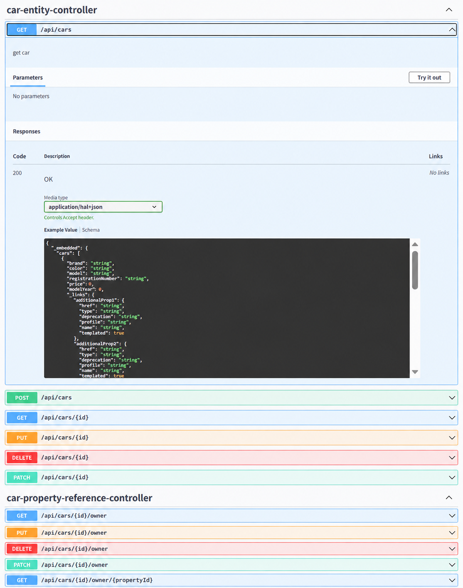

# DAY 50 — React 성능 최적화 훅과 Spring Boot REST API 연동

> 2026-09-21 · useRef, useMemo, useCallback, useId, JPA, REST API, CORS, Axios, Swagger

오늘은 React에서 렌더링 사이에 값을 유지하거나 불필요한 계산과 함수 생성을 줄이는 Hook을
학습했다. 이어서 Spring Boot와 JPA로 REST API를 만들고, React에서 API를 호출해 데이터를
표로 출력했다. 서로 다른 포트에서 실행되는 프런트엔드와 백엔드를 CORS로 연결하고 Swagger
UI에서 API 명세를 확인하는 과정까지 실습했다.

## 1. React 성능 최적화 Hook

| Hook | 역할 | 사용할 때 |
| --- | --- | --- |
| `useRef` | 렌더링 사이에 같은 참조값을 유지 | DOM 접근, 렌더링과 무관한 값 보관 |
| `useMemo` | 계산 결과를 메모이제이션 | 비용이 큰 계산 결과를 재사용할 때 |
| `useCallback` | 함수 자체를 메모이제이션 | 함수 참조의 불필요한 변경을 줄일 때 |
| `useId` | 컴포넌트마다 고유한 ID 생성 | `label`과 입력 요소를 연결할 때 |

메모이제이션은 이전 계산 결과나 함수 참조를 저장해 두었다가 의존성이 바뀌지 않으면 다시
사용하는 방법이다. 모든 값에 적용하기보다 계산 비용이 크거나 참조 동일성이 중요한 경우에
선택해서 사용하는 것이 좋다.

## 2. useRef로 값과 DOM 참조 유지하기

`useRef`가 반환하는 객체는 컴포넌트가 다시 렌더링되어도 유지된다. `current` 값을 변경해도
재렌더링을 일으키지 않으므로 화면 출력용 state와 목적이 다르다. 입력 요소에 연결하면
버튼을 눌렀을 때 직접 포커스를 이동할 수도 있다.

```jsx
function SearchForm() {
  const inputRef = useRef(null);

  const focusInput = () => {
    inputRef.current?.focus();
  };

  return (
    <>
      <input ref={inputRef} />
      <button onClick={focusInput}>입력창으로 이동</button>
    </>
  );
}
```

## 3. useMemo와 useCallback의 차이

`useMemo`는 함수의 **결과값**을 저장하고, `useCallback`은 **함수 참조**를 저장한다. 두 Hook
모두 의존성 배열의 값이 바뀌면 새 값을 계산하거나 새 함수를 만든다.

```jsx
const primeResult = useMemo(
  () => checkPrime(number),
  [number],
);

const createBoxStyle = useCallback(
  () => ({
    width: `${boxSize}px`,
    height: `${boxSize}px`,
    backgroundColor: boxColor,
  }),
  [boxSize, boxColor],
);
```

숫자와 관계없는 텍스트가 바뀔 때에는 소수 판별을 다시 하지 않도록 `useMemo`를 적용했고,
크기와 색상이 그대로라면 같은 스타일 생성 함수를 재사용하도록 `useCallback`을 적용했다.

## 4. useId로 폼 요소 연결하기

`useId`는 여러 컴포넌트가 동시에 렌더링되어도 충돌하지 않는 ID를 만든다. 접근성을 위해
`label`의 `htmlFor`와 입력 요소의 `id`를 연결할 때 유용하다. 다만 배열 항목의 `key`에는
데이터가 가진 고유 식별자를 사용해야 한다.

```jsx
function InputField({ label, name }) {
  const id = useId();

  return (
    <>
      <label htmlFor={id}>{label}</label>
      <input id={id} name={name} />
    </>
  );
}
```

## 5. Spring Boot와 JPA로 데이터 계층 만들기

JPA는 Java 객체와 관계형 데이터베이스 테이블을 연결한다. `@Entity`로 영속화할 클래스를
정의하고 `JpaRepository`를 상속하면 기본적인 저장·조회·수정·삭제 기능을 사용할 수 있다.
자동차와 소유자 예제에서는 `@ManyToOne`과 `@OneToMany` 관계도 확인했다.

```java
@Entity
public class Member {
    @Id
    @GeneratedValue(strategy = GenerationType.IDENTITY)
    private Long id;

    private String name;
    private String email;
    private Integer age;
}

public interface MemberRepository extends JpaRepository<Member, Long> {
}
```

## 6. REST API와 CORS

컨트롤러에서는 HTTP 메서드와 URL을 Java 메서드에 연결했다.

| 요청 | 경로 예시 | 역할 |
| --- | --- | --- |
| `GET` | `/api/members` | 전체 목록 조회 |
| `GET` | `/api/members/{id}` | 한 건 조회 |
| `POST` | `/api/members` | 새 데이터 등록 |
| `PUT` | `/api/members/{id}` | 기존 데이터 수정 |
| `DELETE` | `/api/members/{id}` | 데이터 삭제 |

React 개발 서버와 Spring Boot 서버는 포트가 달라 서로 다른 출처로 판단된다. 백엔드에서
허용할 출처와 HTTP 메서드를 명시해 브라우저의 CORS 정책을 통과하도록 설정했다.

```java
@Configuration
public class WebConfig implements WebMvcConfigurer {
    @Override
    public void addCorsMappings(CorsRegistry registry) {
        registry.addMapping("/api/**")
                .allowedOrigins("http://localhost:5173")
                .allowedMethods("GET", "POST", "PUT", "DELETE", "OPTIONS");
    }
}
```

## 7. React에서 백엔드 데이터 불러오기

컴포넌트가 마운트되면 `useEffect`에서 API를 한 번 호출하고, 응답을 state에 저장했다. 요청
중에는 로딩 문구를, 실패한 경우에는 오류 문구를 표시하고, 성공하면 `map()`으로 데이터를
표에 렌더링했다. `fetch()`와 Axios를 사용하는 흐름도 비교했다.

```tsx
const [members, setMembers] = useState<Member[]>([]);
const [loading, setLoading] = useState(true);
const [error, setError] = useState<string | null>(null);

useEffect(() => {
  axios.get<Member[]>('http://localhost:8080/api/members')
    .then((response) => setMembers(response.data))
    .catch(() => setError('목록을 불러오지 못했습니다.'))
    .finally(() => setLoading(false));
}, []);
```

## 8. Swagger로 API 확인하기

OpenAPI 설정을 추가하고 Swagger UI에서 생성된 엔드포인트와 응답 구조를 확인했다. 브라우저나
Postman에서 주소를 직접 입력하는 것보다 지원하는 HTTP 메서드, 경로와 스키마를 한 화면에서
확인할 수 있었다.



## 오늘의 정리

- `useRef`로 렌더링 사이에 참조값을 유지하고 DOM 요소에 접근했다.
- `useMemo`와 `useCallback`이 각각 결과값과 함수 참조를 메모이제이션한다는 차이를 익혔다.
- `useId`로 접근 가능한 폼의 `label`과 입력 요소를 연결했다.
- JPA 엔티티와 Repository를 만들고 객체를 관계형 데이터베이스에 저장했다.
- Spring Boot에서 REST CRUD 엔드포인트와 CORS 설정을 구성했다.
- React에서 `useEffect`, `fetch()`와 Axios로 API 데이터를 불러와 표에 렌더링했다.
- Swagger UI와 Postman으로 요청 경로와 응답을 확인했다.

> 수업 PDF 3개, 원본 메모, 전체 실습 프로젝트와 빌드 산출물은 공개하지 않았다. 원본에는
> 데이터베이스 계정·비밀번호와 개인 정보처럼 보일 수 있는 예제 데이터가 포함되어 있어 모두
> 제외했다. 공개한 화면은 이미지 편집 절차로 IDE, 브라우저 탭과 작업표시줄을 제거하고 API
> 문서 영역만 남겼다.
