# DAY 35 — Spring Boot IoC·DI, AOP와 Lombok

> 2026-09-03 · 객체의 생성과 의존 관계를 Spring에 맡기고 반복 코드를 줄이기

오늘은 백엔드 개발의 기본 개념을 살펴본 뒤 Spring Framework와 Spring Boot의 차이를
이해했다. 커피 머신 예제로 객체를 직접 생성할 때 생기는 강한 결합을 확인하고, 인터페이스와
의존성 주입을 거쳐 Spring 컨테이너가 Bean을 생성·연결하도록 바꾸었다. 여러 구현체를 선택하거나
모두 주입하는 방법, AOP의 역할과 Lombok·SLF4J 사용법도 실습했다.

## 오늘 배운 내용

- IP와 포트, DBMS·RDB·SQL·NoSQL의 기초
- 라이브러리와 프레임워크의 차이
- Spring Framework와 Spring Boot
- IoC, DI, Spring Container와 Bean
- XML 설정과 애노테이션 기반 Bean 등록
- `@Component`, `@Autowired`, `@Qualifier`, `@Order`, `@PostConstruct`
- 여러 구현체를 `List<CoffeeMachine>`으로 주입하기
- AOP와 `@Aspect`, `@Around`
- Lombok의 `@Getter`, `@Setter`, `@Data`, 생성자, Builder
- `@EqualsAndHashCode`와 `@Slf4j`

## 백엔드와 Spring Boot의 기본 개념

IP는 네트워크에서 컴퓨터를 구분하는 주소이고, 포트는 한 컴퓨터에서 실행되는 여러 서비스를
구분하는 번호다. 데이터베이스는 DBMS가 관리하며, 관계형 데이터베이스에서는 테이블 사이의
관계와 SQL을 중심으로 데이터를 다룬다.

라이브러리는 필요한 기능을 개발자가 호출해 사용하는 코드 모음이고, 프레임워크는 프로그램의
전체 실행 구조를 제공하고 정해진 지점에서 개발자의 코드를 호출한다. Spring은 Java 애플리케이션의
객체 생성과 관계 설정을 관리하는 프레임워크다. Spring Boot는 Spring을 기반으로 자동 설정,
Starter 의존성, 내장 웹 서버 등을 제공해 초기 설정과 실행 과정을 줄여준다.

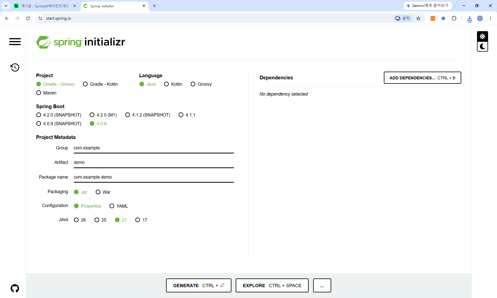

Spring Initializr에서 프로젝트 정보와 필요한 의존성을 선택해 기본 프로젝트를 만들었다. 생성된
애플리케이션은 `@SpringBootApplication`과 `SpringApplication.run()`을 시작점으로 실행했다.

## 객체를 직접 생성할 때의 결합

처음에는 `CoffeeMaker`가 필요한 `EspressoMachine`을 클래스 내부에서 직접 생성했다.

```java
public class CoffeeMaker {
    private EspressoMachine espressoMachine;

    public CoffeeMaker() {
        this.espressoMachine = new EspressoMachine();
    }
}
```

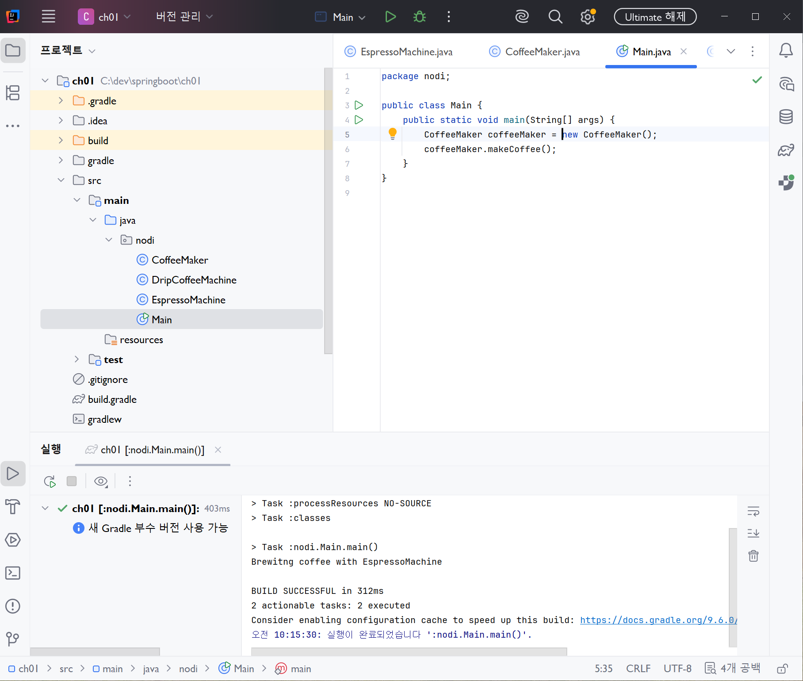

이 방식에서는 드립 커피 머신으로 바꾸려면 `CoffeeMaker`의 필드와 생성자까지 수정해야 한다.
즉, 사용하는 객체와 사용되는 객체가 강하게 결합되어 변경 범위가 커진다.

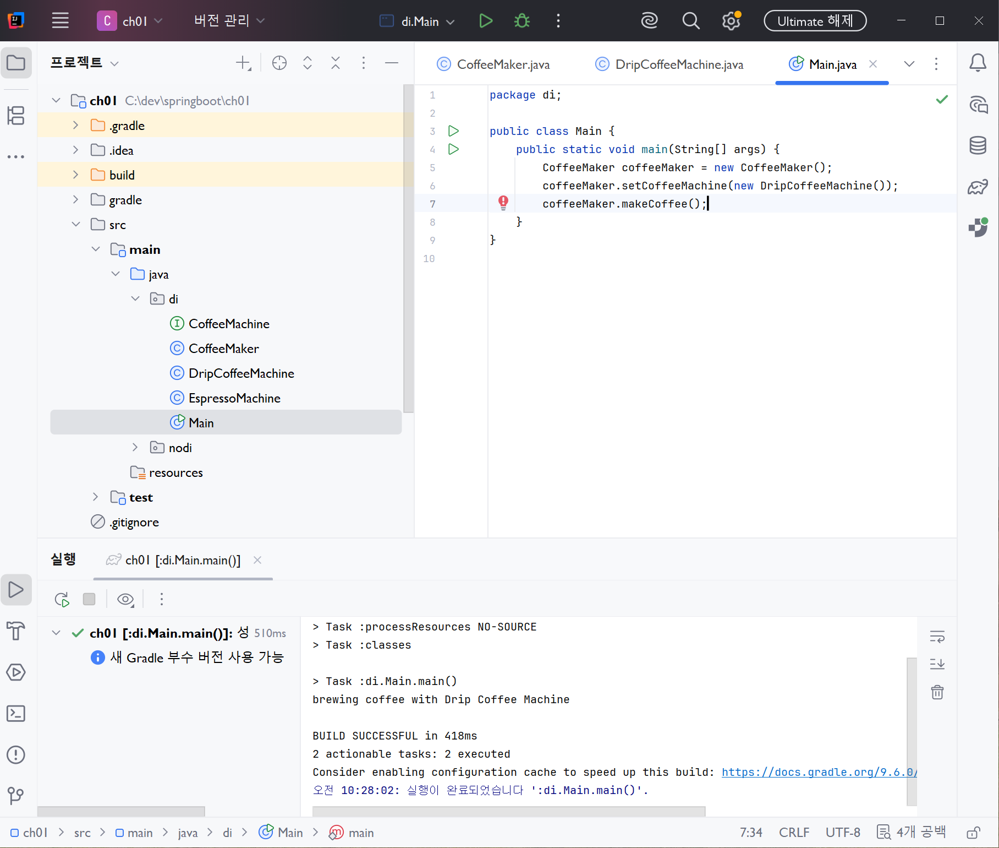

## 인터페이스와 의존성 주입

공통 기능을 `CoffeeMachine` 인터페이스로 정의하고 `EspressoMachine`, `DripCoffeeMachine`,
`MochaCoffeeMachine`이 이를 구현하도록 만들었다. `CoffeeMaker`는 구체적인 클래스가 아니라
인터페이스에만 의존하고, 실제 구현 객체는 외부에서 전달받는다.

```java
public interface CoffeeMachine {
    String brew();
}

public class CoffeeMaker {
    private CoffeeMachine coffeeMachine;

    public void setCoffeeMachine(CoffeeMachine coffeeMachine) {
        this.coffeeMachine = coffeeMachine;
    }
}
```

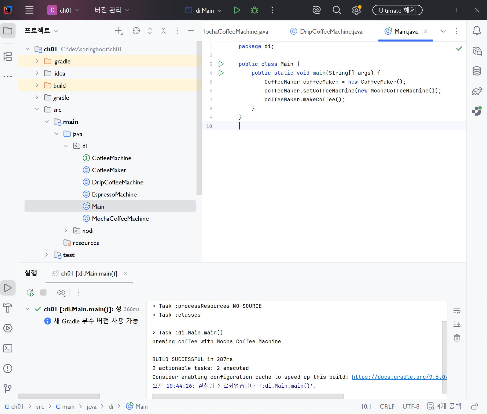

이것이 DI(Dependency Injection)다. `CoffeeMaker`를 수정하지 않아도 전달하는 구현체만 바꿀 수
있어 결합도가 낮아지고 테스트와 유지보수가 쉬워진다.

## IoC, Spring Container와 Bean

IoC(Inversion of Control)는 개발자가 직접 하던 객체의 생성과 연결, 생명주기 관리를 프레임워크가
담당하도록 제어권을 넘기는 원리다. Spring Container는 이 역할을 수행하며, 컨테이너가 생성하고
관리하는 객체를 Spring Bean이라고 한다.

### XML 기반 설정

`beans.xml`에 Bean과 의존 관계를 선언하고 `@ImportResource`로 설정 파일을 불러오는 방식을
실습했다.

```xml
<bean id="espressoMachine" class="com.example.demo.EspressoMachine" />
<bean id="coffeeMaker" class="com.example.demo.CoffeeMaker"
      init-method="makeCoffee">
    <property name="coffeeMachine" ref="espressoMachine" />
</bean>
```

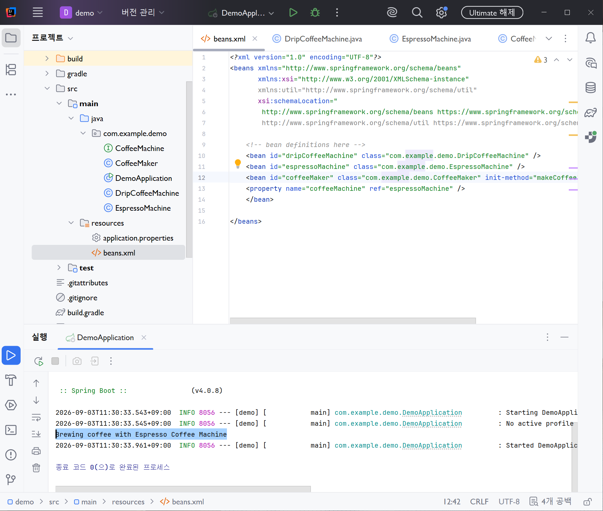

### 애노테이션 기반 설정

`@Component`를 붙이면 Component Scan이 클래스를 찾아 Bean으로 등록한다. 오늘 실습에서는
`@Autowired`로 `CoffeeMachine` 타입의 Bean을 주입하고, 모든 의존성 주입이 끝난 뒤 실행할
메서드에 `@PostConstruct`를 사용했다.

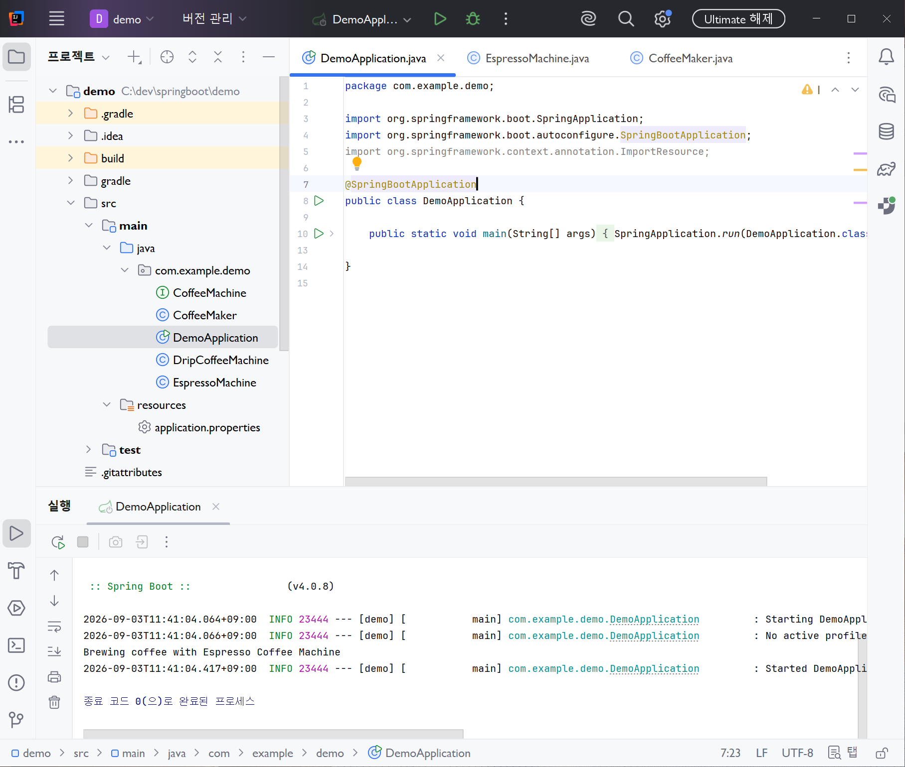

같은 인터페이스를 구현한 Bean이 여러 개라면 어느 객체를 사용할지 구분해야 한다.
`@Qualifier("dripCoffeeMachine")`로 이름을 지정해 하나를 선택할 수 있다.

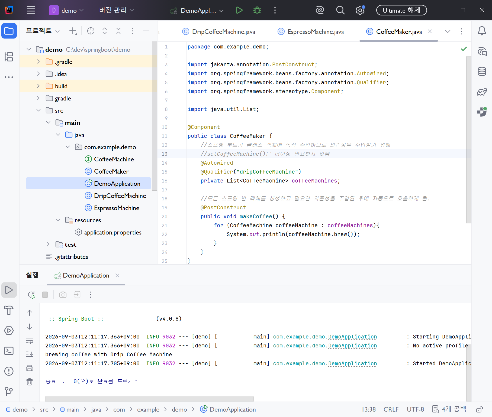

모든 구현체가 필요할 때는 `List<CoffeeMachine>`으로 한 번에 주입할 수 있다.

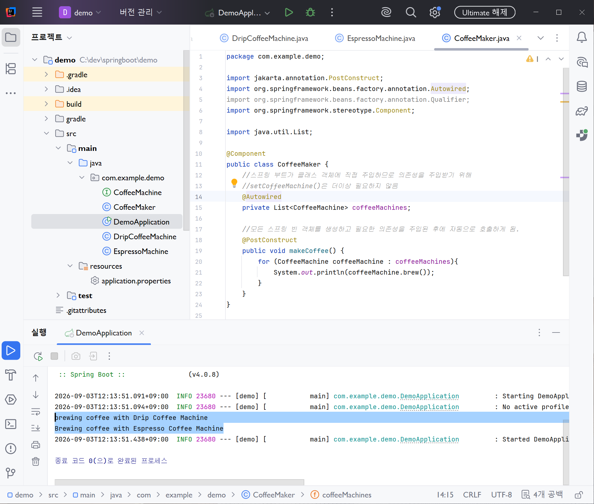

`@Order`를 구현체에 지정하면 컬렉션으로 주입되는 Bean의 순서를 정할 수 있다.

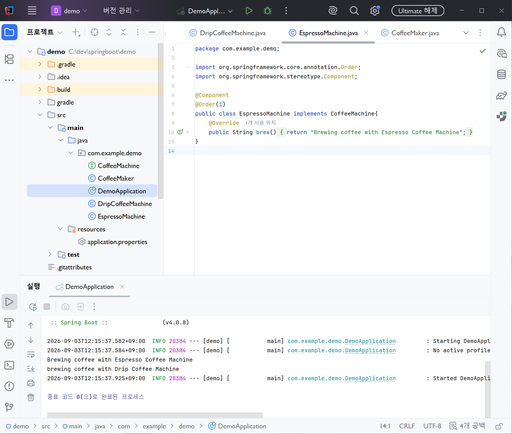

## AOP로 공통 관심사 분리하기

AOP(Aspect-Oriented Programming)는 여러 클래스와 메서드에 반복되는 로깅, 실행 시간 측정,
트랜잭션, 권한 검사 같은 공통 관심사를 핵심 로직에서 분리하는 방법이다. 객체지향 프로그래밍과
대립하는 방식이 아니라 객체지향 구조를 보완한다.

`@Aspect`로 공통 기능을 모은 클래스를 정의하고 `@Around`에서 대상 메서드의 실행 전후를
감쌀 수 있다. 오늘 실습에서는 원주율 계산 메서드의 실행 전·후와 반환값을 기록하고, 입력 크기에
따른 실행 시간을 로그로 확인했다.

```text
핵심 로직 실행 전 시간 기록
        ↓
대상 메서드 실행
        ↓
실행 후 시간 기록 → 전체 실행 시간 계산
```

## Lombok으로 반복 코드 줄이기

Lombok은 컴파일 과정에서 Getter, Setter, 생성자, `toString()`, Builder 같은 반복 코드를
생성해주는 라이브러리다.

| 애노테이션 | 생성하거나 제공하는 기능 |
| --- | --- |
| `@Getter`, `@Setter` | 필드 접근 메서드 |
| `@ToString` | 객체 내용을 문자열로 표현 |
| `@NoArgsConstructor` | 매개변수가 없는 생성자 |
| `@AllArgsConstructor` | 모든 필드를 받는 생성자 |
| `@Data` | Getter·Setter·toString·equals·hashCode 등을 묶어서 제공 |
| `@Builder` | 이름을 보며 값을 설정하는 Builder 방식 |
| `@EqualsAndHashCode` | 객체 비교에 사용할 필드를 지정 |
| `@Slf4j` | SLF4J Logger 필드 생성 |

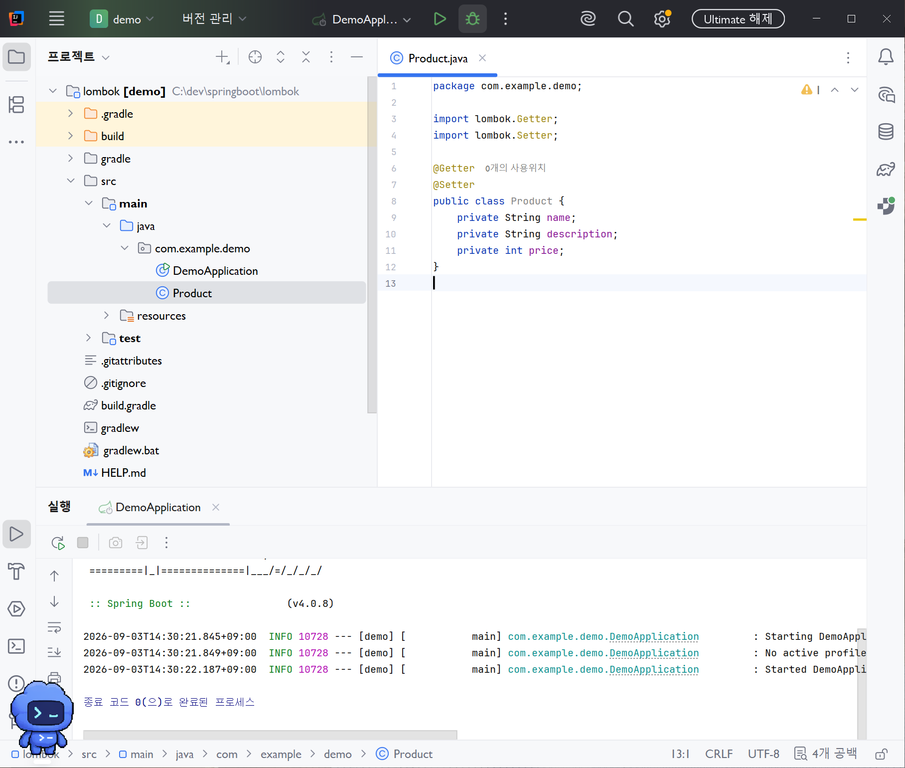

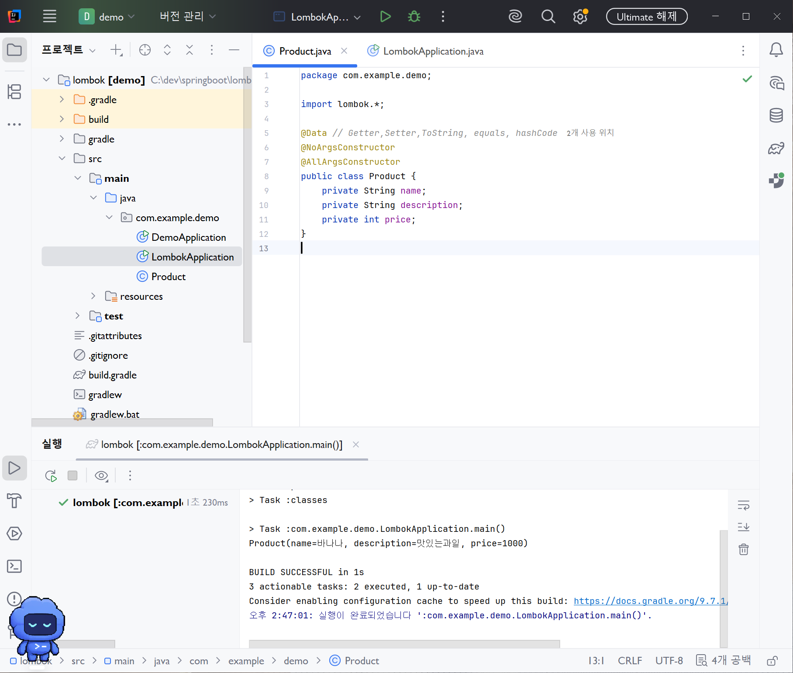

`@Builder`를 사용하면 생성자 매개변수의 순서를 외우지 않고 필드 이름을 지정해 객체를 만들 수
있어 값이 많은 객체를 읽기 쉽게 생성할 수 있다.

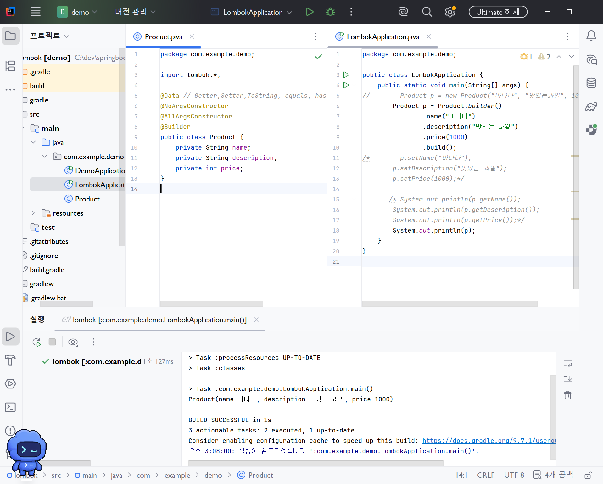

`@EqualsAndHashCode(of = {"name", "price"})`로 비교 기준을 지정하면 설명이 달라도 이름과
가격이 같은 두 객체를 같은 값으로 비교할 수 있다. 비교 기준은 실제 도메인에서 객체의 동일성을
어떻게 정의할지 먼저 정한 뒤 선택해야 한다.

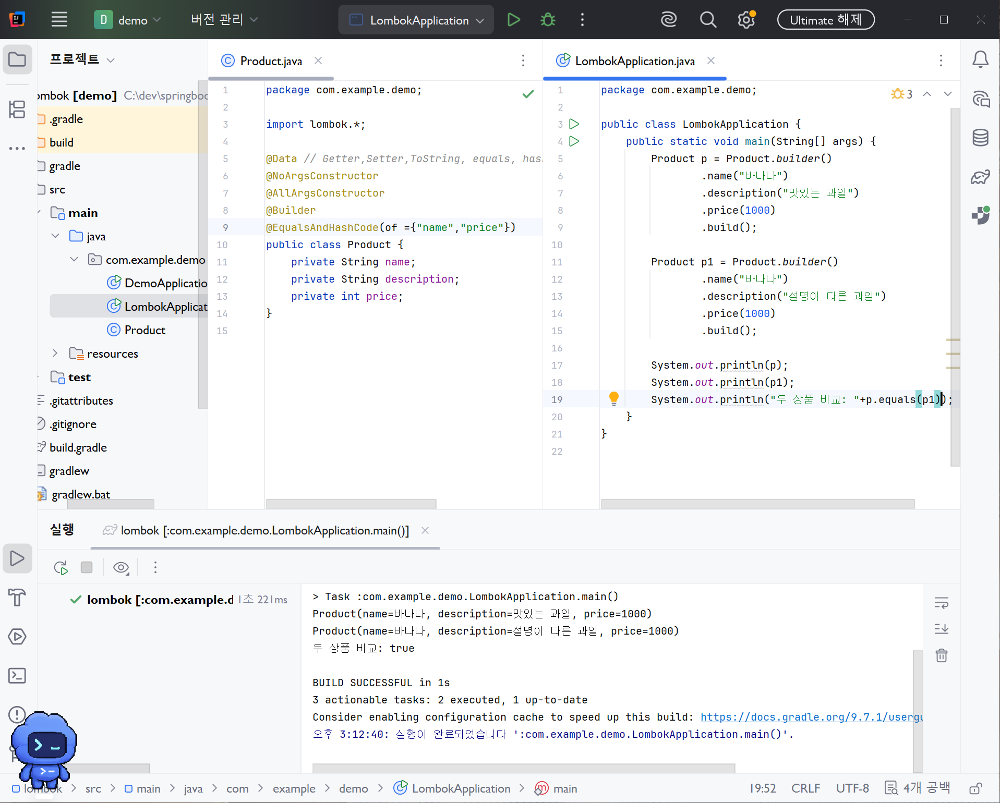

## SLF4J 로그

`@Slf4j`는 `log` 객체를 자동으로 만들어 `info`, `warn`, `error` 같은 수준별 로그를 남길 수
있게 한다. 단순 출력보다 로그 수준과 출력 형식을 관리하기 쉬우며, 운영 환경의 문제를 추적하는
데 도움이 된다.

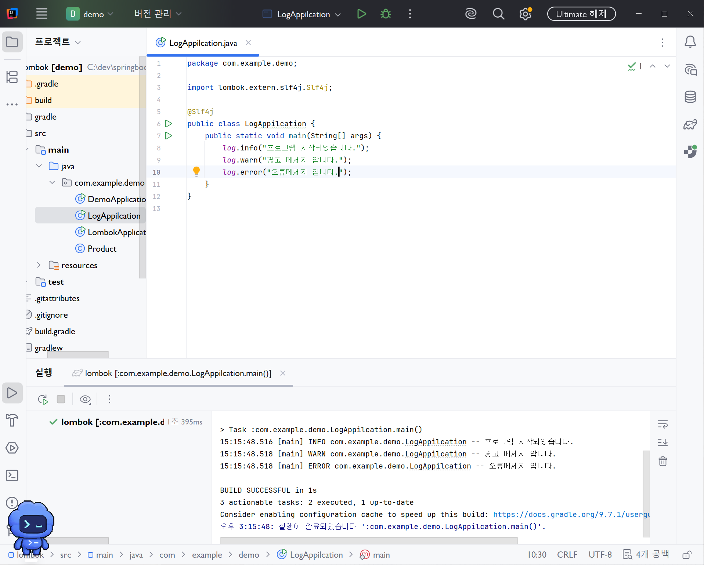

## 개념 정리

| 개념 | 오늘 이해한 역할 |
| --- | --- |
| DI | 객체가 필요한 의존성을 외부에서 전달받는다. |
| IoC | 객체 생성과 연결의 제어권을 Spring에 맡긴다. |
| Container | Bean을 생성하고 의존 관계와 생명주기를 관리한다. |
| Bean | Spring Container가 관리하는 객체다. |
| AOP | 여러 기능에 반복되는 공통 로직을 핵심 로직과 분리한다. |
| Lombok | Java의 반복적인 보일러플레이트 코드를 생성한다. |

## 회고

커피 머신 구현체를 직접 교체해 본 뒤 인터페이스와 DI를 적용하니 결합도가 낮아지는 이유가
구체적으로 보였다. Spring의 핵심은 단순히 애노테이션을 붙이는 것이 아니라 객체 생성과 의존
관리를 컨테이너에 맡기는 데 있다는 점을 이해했다. 여러 Bean을 선택·정렬하는 과정과 AOP,
Lombok까지 살펴보면서 Spring Boot가 애플리케이션의 구조와 반복 작업을 어떻게 관리하는지도
확인했다. 다음에는 필드 주입과 생성자 주입을 비교하고, REST API를 만들어 요청과 응답이
Controller·Service·Repository를 거쳐 처리되는 흐름을 실습하고 싶다.
