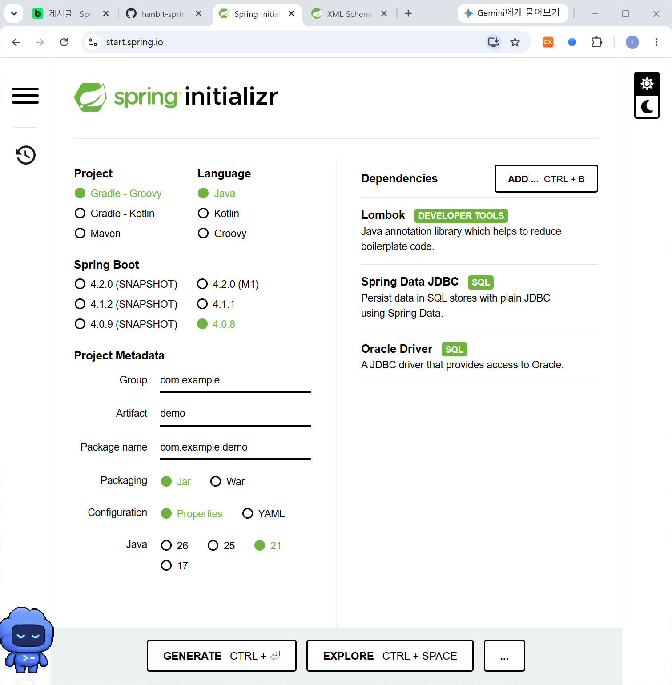
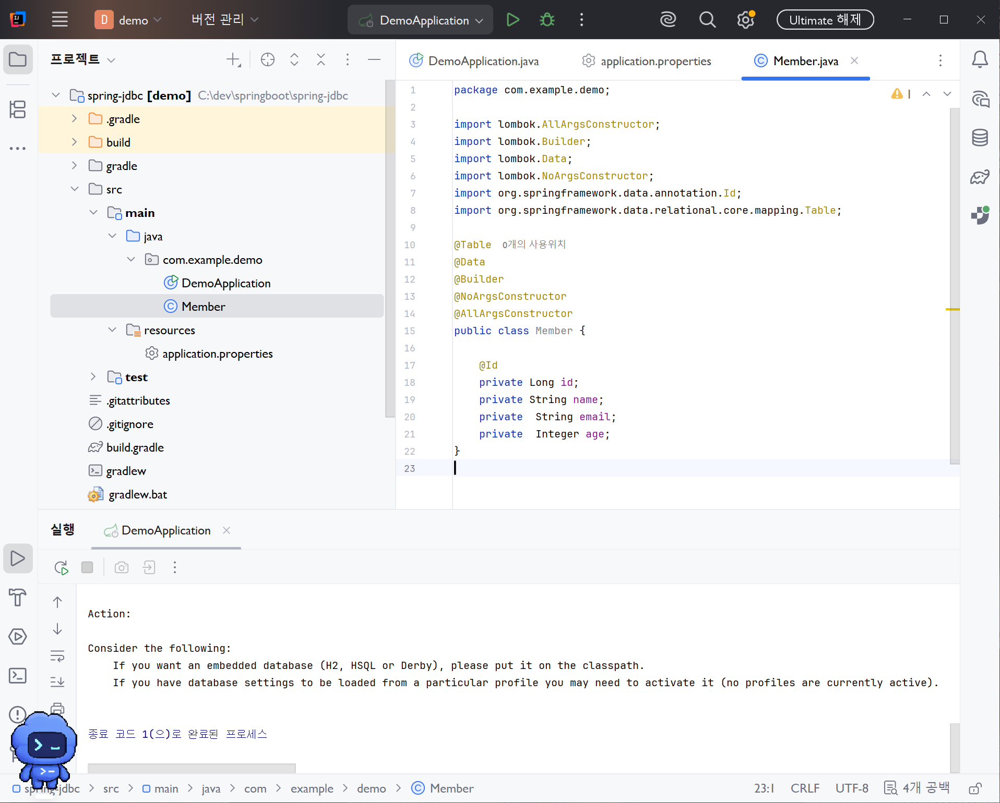
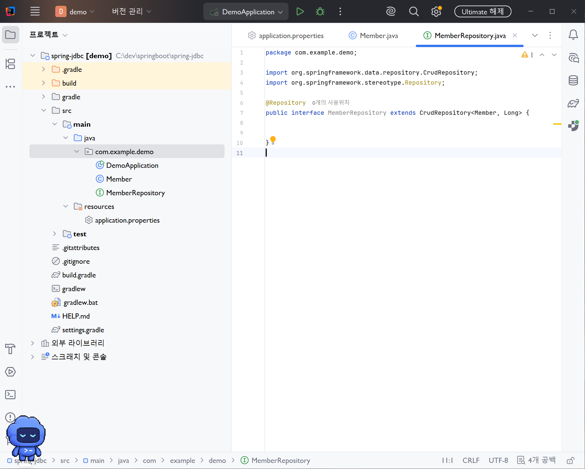
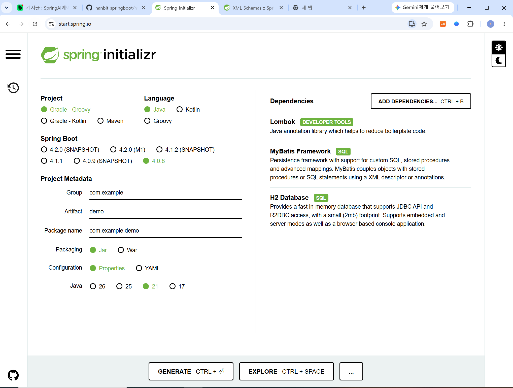
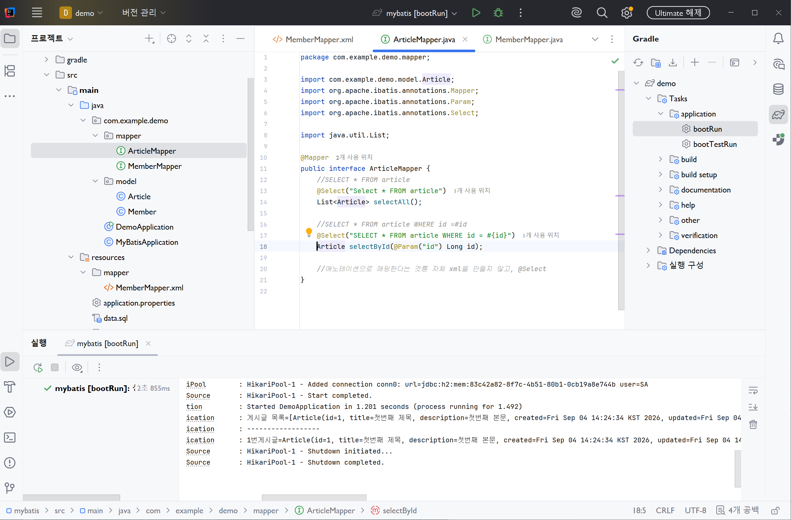

# DAY 36 — Spring Boot 데이터베이스와 MyBatis

> 2026-09-04 · Spring Data JDBC로 Oracle을 다루고 MyBatis로 SQL을 직접 매핑하기

오늘은 Spring Boot 애플리케이션과 데이터베이스를 연결하는 방법을 배웠다. 먼저 Spring Data
JDBC와 Oracle Driver를 사용해 `Member` 테이블을 Java 객체로 매핑하고, `CrudRepository`로
회원 저장·조회·수정·삭제를 실습했다. 이어서 H2 데이터베이스와 MyBatis를 사용해 Mapper
인터페이스의 메서드를 XML 또는 애노테이션 SQL과 연결했다.

## 오늘 배운 내용

- Spring Data JDBC와 Oracle Driver 설정
- `@Table`, `@Id`를 이용한 테이블·기본키 매핑
- `CrudRepository<Entity, Id>`와 기본 CRUD
- Repository 메서드 이름을 이용한 조건 조회
- `application.properties`의 DataSource 설정
- HikariCP 커넥션 풀의 역할과 크기 설정
- H2 인메모리 데이터베이스와 `schema.sql`, `data.sql`
- MyBatis Mapper 인터페이스와 XML SQL 매핑
- `@Mapper`, `@Param`, `@Select` 애노테이션
- Spring Data JDBC, MyBatis, JPA의 차이

## Spring Boot와 데이터베이스 연결 흐름

Spring Boot에서 데이터베이스를 사용할 때는 드라이버와 연결 정보가 필요하다. 애플리케이션은
DataSource를 통해 연결을 얻고, Spring Data JDBC 또는 MyBatis 같은 데이터 접근 기술로 SQL을
실행한다.

```text
Spring Boot Application
        ↓
Repository 또는 Mapper
        ↓
Spring Data JDBC / MyBatis
        ↓
DataSource · HikariCP
        ↓
Oracle 또는 H2 Database
```



Spring Initializr에서 Lombok, Spring Data JDBC, Oracle Driver를 선택해 프로젝트를 생성했다.
Lombok은 데이터 클래스의 반복 코드를 줄이고, Spring Data JDBC는 Repository 중심의 데이터
접근 기능을 제공한다. Oracle Driver는 Java와 Oracle DB 사이의 통신을 담당한다.

## Member 객체와 테이블 매핑

`Member` 클래스에 `@Table`을 적용해 테이블과 연결하고, 기본키 필드에는 `@Id`를 사용했다.
Lombok의 `@Data`, `@Builder`, 생성자 애노테이션도 함께 적용했다.

```java
@Table
@Data
@Builder
@NoArgsConstructor
@AllArgsConstructor
public class Member {
    @Id
    private Long id;
    private String name;
    private String email;
    private Integer age;
}
```



Java의 `Member` 객체 한 개가 테이블의 한 행을 표현한다. `id`는 각 회원을 식별하는 기본키이며,
이 값이 없는 새 객체를 저장하면 INSERT 대상으로, 기존 식별자를 가진 객체를 저장하면 UPDATE
대상으로 판단할 수 있다.

## CrudRepository로 CRUD 구현

`CrudRepository`는 엔티티 타입과 기본키 타입을 제네릭으로 받는다. 인터페이스를 상속하는 것만으로
기본적인 저장·조회·수정·삭제 메서드를 사용할 수 있다.

```java
@Repository
public interface MemberRepository extends CrudRepository<Member, Long> {
    List<Member> findByName(String name);
    List<Member> findByEmail(String email);
    List<Member> findByAgeGreaterThan(Integer age);
    List<Member> findByNameAndEmail(String name, String email);
}
```



| 작업 | 사용한 메서드 | 의미 |
| --- | --- | --- |
| 저장 | `save(member)` | 새로운 회원 행을 저장한다. |
| 전체 조회 | `findAll()` | 모든 회원을 조회한다. |
| 수정 | 값을 변경한 뒤 `save(member)` | 같은 식별자의 회원 정보를 갱신한다. |
| 삭제 | `deleteById(id)` | 기본키로 회원을 삭제한다. |

`ApplicationRunner`를 구현한 클래스에 Repository를 주입하고 애플리케이션 시작 직후 CRUD 코드를
실행했다. `@RequiredArgsConstructor`를 사용해 `final MemberRepository`를 생성자 방식으로
주입하고, 결과는 `@Slf4j` 로그로 확인했다.

## 메서드 이름으로 조건 조회하기

Spring Data는 정해진 규칙에 맞는 Repository 메서드 이름을 분석해 조회 조건을 만든다.

| 메서드 | 조회 조건 |
| --- | --- |
| `findByName(name)` | 이름이 같은 회원 |
| `findByEmail(email)` | 이메일이 같은 회원 |
| `findByAgeGreaterThan(age)` | 입력한 나이보다 많은 회원 |
| `findByNameAndEmail(name, email)` | 이름과 이메일이 모두 같은 회원 |

직접 SQL을 작성하지 않고도 간단한 조건 조회를 구현할 수 있다는 장점이 있다. 다만 메서드 이름이
길어질 정도로 복잡한 조회라면 쿼리를 분리하거나 다른 데이터 접근 방식을 검토해야 한다.

## DataSource와 커넥션 풀

DataSource에는 JDBC URL, 데이터베이스 계정과 비밀번호를 설정한다. 비밀번호를 GitHub에 직접
올리지 않도록 실제 프로젝트에서는 환경 변수 또는 외부 설정으로 분리하는 것이 안전하다.

```properties
spring.datasource.url=${DB_URL}
spring.datasource.username=${DB_USERNAME}
spring.datasource.password=${DB_PASSWORD}

spring.datasource.hikari.maximum-pool-size=20
spring.datasource.hikari.minimum-idle=10
```

HikariCP는 데이터베이스 연결을 미리 만들어 풀에 보관하고 재사용한다. 요청마다 연결을 새로 만드는
비용을 줄일 수 있으며, `maximum-pool-size`는 풀이 가질 수 있는 최대 연결 수,
`minimum-idle`은 유지할 최소 유휴 연결 수를 뜻한다. 값은 항상 크게 잡는 것이 아니라 DB가
허용하는 연결 수와 애플리케이션의 실제 부하를 함께 고려해야 한다.

## 오류를 통해 확인한 연결 기준

처음 실행할 때 오타와 테이블 위치 문제로 오류가 발생했다. 같은 Oracle 서버에 접속했더라도
애플리케이션이 사용하는 사용자(스키마)와 테이블을 만든 사용자가 다르면 해당 테이블을 바로 찾지
못할 수 있다.

오류를 해결할 때 다음 순서로 확인했다.

1. `application.properties`의 URL과 사용자 이름이 올바른지 확인한다.
2. 애플리케이션이 접속한 사용자에게 대상 테이블이 존재하는지 확인한다.
3. 클래스·필드·Repository 메서드의 철자를 확인한다.
4. 테이블과 객체의 컬럼 이름 및 기본키 매핑을 확인한다.
5. 실행 로그에서 가장 처음 발생한 예외 원인을 확인한다.

이번 실습을 통해 코드만 맞아도 되는 것이 아니라 연결 계정, 스키마와 테이블 위치까지 한 흐름으로
확인해야 한다는 점을 배웠다.

## H2와 MyBatis 프로젝트 구성

다음 실습에서는 MyBatis Framework와 H2 Database를 선택했다. H2 인메모리 DB는 별도의 서버를
준비하지 않고도 빠르게 SQL 매핑을 연습하기 좋다. 메모리 모드의 데이터는 애플리케이션이 종료되면
사라지므로 영구 데이터 저장보다는 학습과 테스트에 적합하다.



`schema.sql`에는 `member`, `article` 테이블 생성문을 작성하고, `data.sql`에는 실행 시 사용할
예제 행을 넣었다. Spring Boot는 내장 데이터베이스를 시작하면서 이 초기화 파일을 적용할 수 있다.

```sql
CREATE TABLE article (
    id BIGINT AUTO_INCREMENT PRIMARY KEY,
    title VARCHAR(256),
    description VARCHAR(4096),
    created TIMESTAMP,
    updated TIMESTAMP,
    member_id BIGINT
);
```

## MyBatis XML 매핑

MyBatis는 Mapper 인터페이스의 메서드와 SQL을 연결한다. XML 방식에서는 Mapper의 전체 클래스
경로를 `namespace`로 지정하고, SQL 태그의 `id`를 메서드 이름과 맞춘다.

```xml
<mapper namespace="com.example.demo.mapper.MemberMapper">
    <select id="selectById">
        SELECT *
        FROM member
        WHERE id = #{id}
    </select>

    <insert id="save">
        INSERT INTO member (name, email, age)
        VALUES (#{member.name}, #{member.email}, #{member.age})
    </insert>
</mapper>
```

`#{id}`와 `#{member.name}`은 전달받은 매개변수를 안전하게 바인딩하는 자리다. Mapper
인터페이스에서는 `@Param`으로 XML에서 사용할 이름을 지정했다.

```java
@Mapper
public interface MemberMapper {
    List<Member> selectAll();
    Member selectById(@Param("id") Long id);
    List<Member> findByName(@Param("name") String name);
    int save(@Param("member") Member member);
}
```

## MyBatis 애노테이션 매핑

짧고 단순한 SQL은 Mapper 메서드에 `@Select`를 붙여 XML 없이 작성할 수도 있다.

```java
@Mapper
public interface ArticleMapper {
    @Select("SELECT * FROM article")
    List<Article> selectAll();

    @Select("SELECT * FROM article WHERE id = #{id}")
    Article selectById(@Param("id") Long id);
}
```



애노테이션 방식은 SQL이 짧을 때 한 파일에서 구조를 파악하기 쉽다. 동적 SQL이나 길고 복잡한
쿼리는 XML로 분리하는 편이 읽고 관리하기 좋다.

## 데이터 접근 방식 비교

| 방식 | 특징 | 적합한 상황 |
| --- | --- | --- |
| Spring Data JDBC | Repository와 단순한 객체 매핑 중심 | 구조가 단순하고 SQL 반복을 줄이고 싶을 때 |
| MyBatis | 작성한 SQL과 객체를 직접 매핑 | SQL을 세밀하게 제어하거나 기존 쿼리를 활용할 때 |
| JPA | 엔티티와 관계, 영속성 컨텍스트 중심 | 객체 관계와 변경 감지를 활용하는 도메인 모델 |

오늘은 Spring Data JDBC와 MyBatis를 직접 실습했고, JPA는 이후 학습할 데이터 접근 기술로
개념을 확인했다. 세 방식 모두 목적이 다르므로 한 가지가 항상 더 좋은 것이 아니라 프로젝트의
쿼리 복잡도, 객체 관계와 팀의 관리 방식에 맞춰 선택해야 한다.

## 회고

이전 JDBC 수업에서는 `Connection`, `PreparedStatement`, `ResultSet`을 직접 다뤘다면 오늘은
Spring Boot가 DataSource와 Repository 구성을 통해 반복 작업을 줄여주는 과정을 확인했다.
`CrudRepository`의 간단함과 MyBatis의 명시적인 SQL 제어가 어떻게 다른지도 비교할 수 있었다.
특히 연결 오류를 해결하면서 애플리케이션 설정뿐 아니라 실제 접속 사용자와 테이블이 존재하는
스키마를 함께 확인해야 한다는 점이 기억에 남았다. 다음에는 Service 계층과 트랜잭션을 추가해
여러 데이터 변경을 하나의 작업 단위로 처리하는 방법을 실습하고 싶다.
