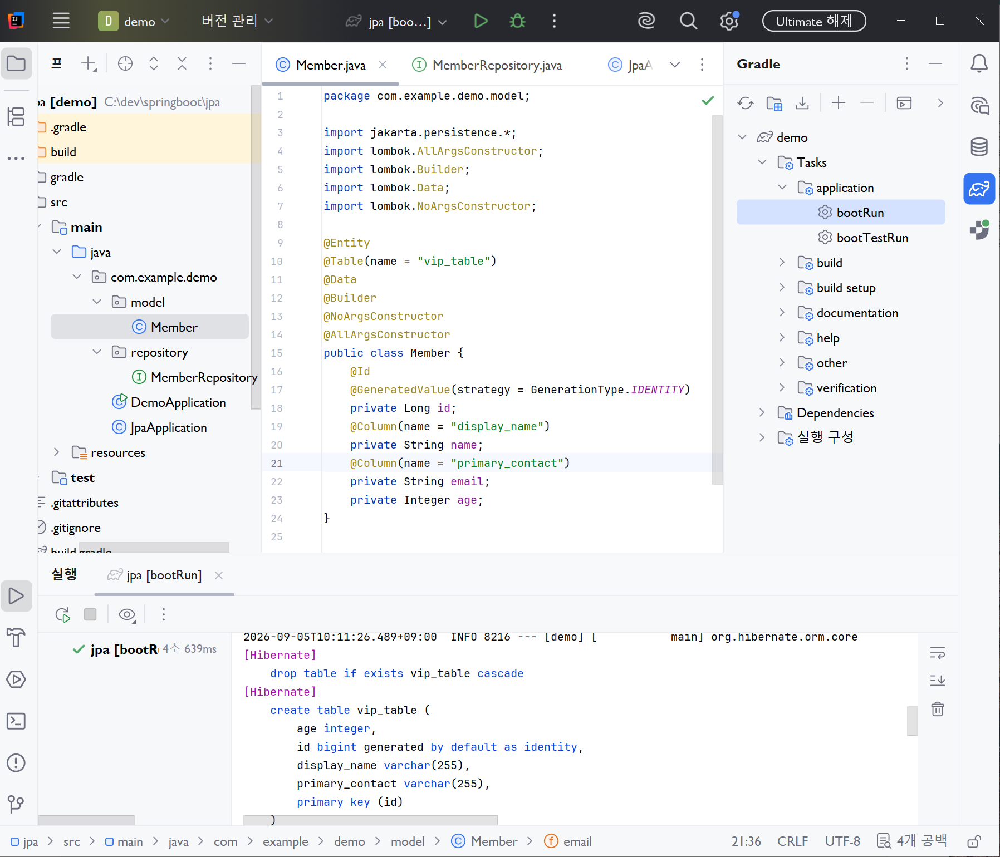
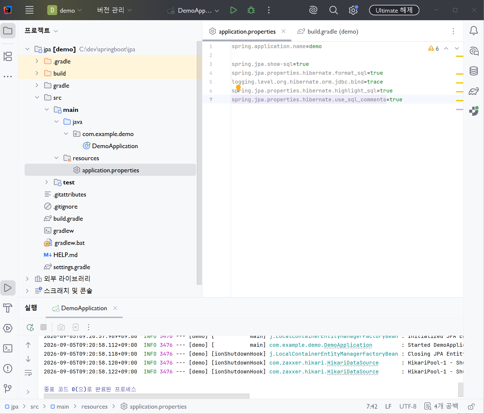
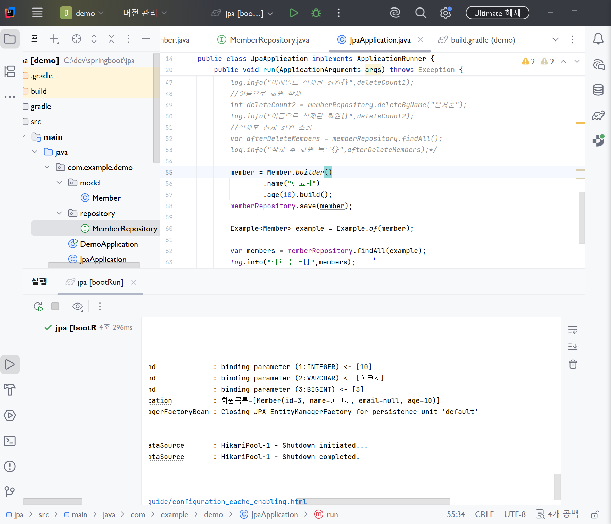
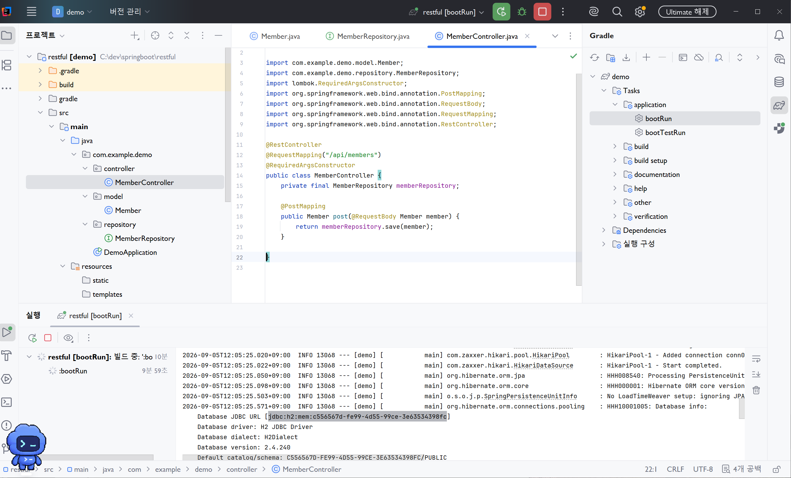
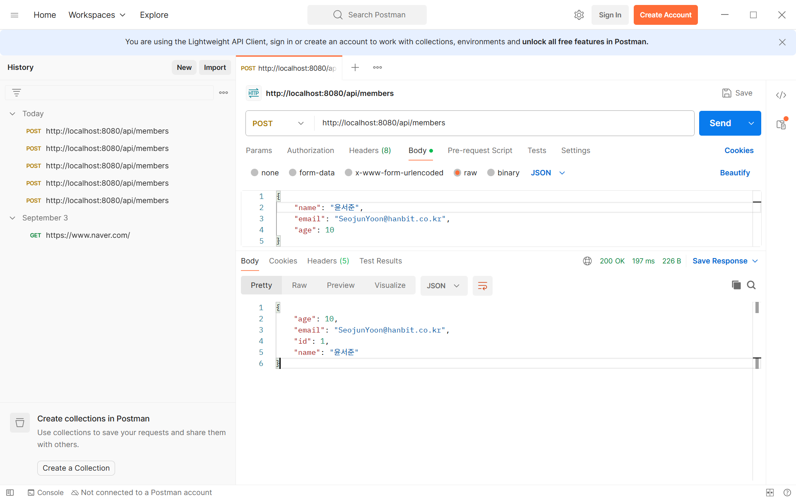
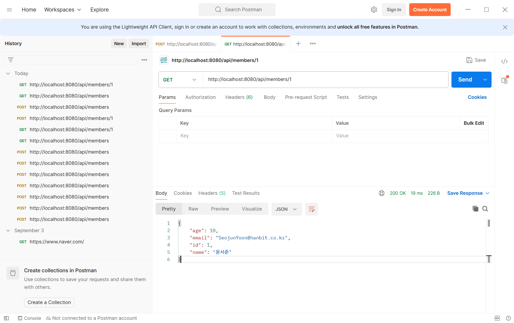
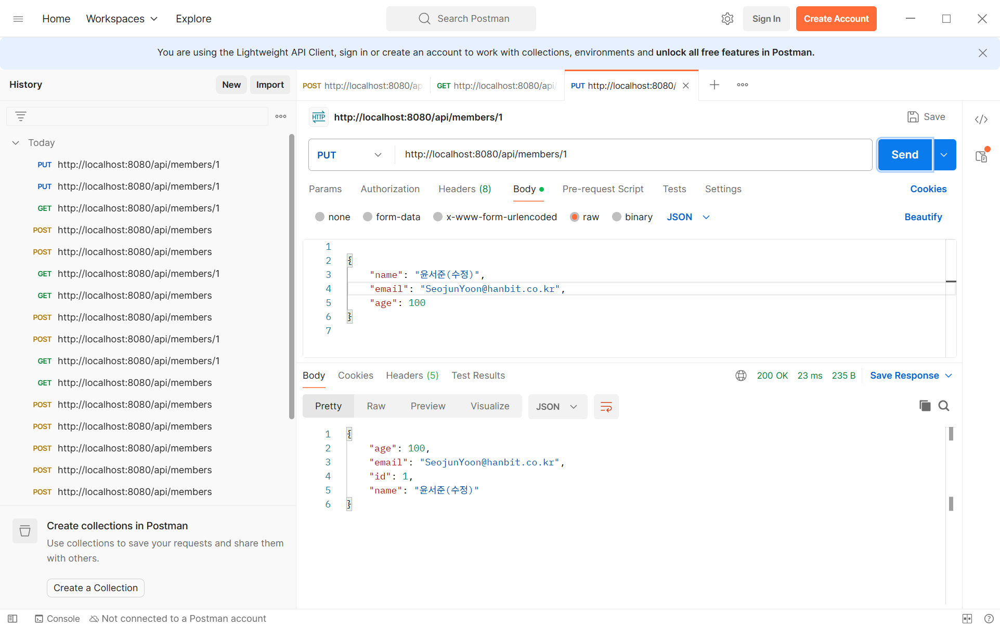
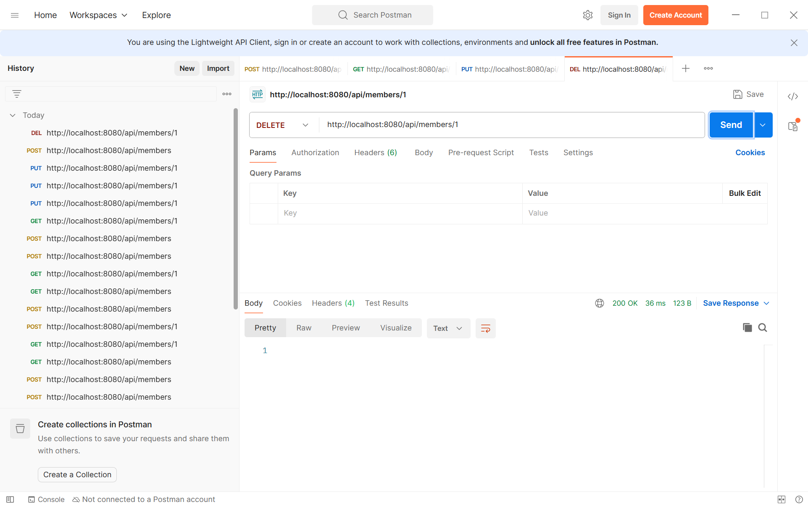

# DAY 37 — Spring Data JPA와 RESTful CRUD API

> 2026-09-05 · 엔티티를 데이터베이스에 매핑하고 회원 CRUD를 REST API로 연결하기

오늘은 Spring Boot에서 JPA를 이용해 Java 객체와 데이터베이스 테이블을 연결하는 방법을 배웠다.
`Member` 엔티티와 `JpaRepository`를 만들고 저장·조회·조건 검색·삭제를 실습한 뒤, 같은 데이터
접근 기능을 REST Controller와 연결했다. Postman으로 `POST`, `GET`, `PUT`, `DELETE` 요청을
보내고 H2 데이터베이스에 실제로 반영되는 흐름도 확인했다.

## 오늘 배운 내용

- JPA와 ORM의 역할, 엔티티 객체 매핑
- `@Entity`, `@Table`, `@Id`, `@GeneratedValue`, `@Column`
- `JpaRepository`가 제공하는 기본 CRUD
- 메서드 이름 기반 조회·삭제 쿼리
- Query by Example을 이용한 동적 조건 조회
- RESTful API의 URI와 HTTP 메서드 설계
- `@RestController`, `@RequestMapping`, `@RequestBody`, `@PathVariable`
- Postman과 H2 Console을 이용한 API·DB 결과 검증
- 전체 수정인 `PUT`과 일부 수정인 `PATCH`의 차이

## JPA와 엔티티 매핑

JPA(Java Persistence API)는 Java 객체를 관계형 데이터베이스의 테이블과 연결하기 위한 표준이다.
개발자는 SQL의 반복보다 엔티티 객체를 중심으로 데이터를 다룰 수 있고, 실제 매핑과 SQL 생성은
Hibernate와 같은 JPA 구현체가 담당한다.

```text
REST Controller
       ↓
JpaRepository
       ↓
JPA · Hibernate
       ↓
H2 Database
```

`Member` 클래스에는 `@Entity`를 붙여 JPA가 관리하는 엔티티임을 표시했다. 기본키인 `id`에는
`@Id`와 `@GeneratedValue`를 적용해 데이터베이스가 식별자를 생성하도록 했다. 기본형 `int`와
달리 `Integer`는 값이 없는 상태인 `null`을 표현할 수 있어 선택 입력이나 동적 조회에 활용할 수
있다.

```java
@Entity
@Table(name = "vip_table")
@Data
@Builder
@NoArgsConstructor
@AllArgsConstructor
public class Member {
    @Id
    @GeneratedValue(strategy = GenerationType.IDENTITY)
    private Long id;

    @Column(name = "display_name")
    private String name;

    @Column(name = "primary_contact")
    private String email;

    private Integer age;
}
```



`@Table`과 `@Column`을 생략하면 기본 이름 규칙으로 매핑되지만, 실제 테이블·컬럼 이름이 다를
때는 애노테이션으로 명시할 수 있다. 실행 로그에서 `vip_table`, `display_name`,
`primary_contact`가 포함된 테이블 생성 SQL을 확인해 매핑 결과를 검증했다.

## SQL 로그로 동작 확인하기

JPA가 생성한 SQL과 바인딩 값을 학습 중에 확인할 수 있도록 설정을 추가했다.

```properties
spring.jpa.show-sql=true
spring.jpa.properties.hibernate.format_sql=true
logging.level.org.hibernate.orm.jdbc.bind=trace
spring.jpa.properties.hibernate.highlight_sql=true
spring.jpa.properties.hibernate.use_sql_comments=true
```



SQL을 보기 좋게 출력하면 Repository 메서드가 어떤 쿼리로 실행되는지 이해하기 쉽다. 다만
바인딩 값까지 출력하는 `trace` 로그는 개인정보가 기록될 수 있으므로 실제 운영 환경에서는
로그 수준을 낮추는 것이 안전하다.

## JpaRepository로 CRUD 구현

`JpaRepository<Member, Long>`을 상속하면 `save`, `saveAll`, `findAll`, `findById`,
`deleteById` 같은 기본 메서드를 바로 사용할 수 있다. 첫 번째 타입은 관리할 엔티티, 두 번째
타입은 엔티티 기본키의 자료형이다.

```java
@Repository
public interface MemberRepository extends JpaRepository<Member, Long> {
    List<Member> findByName(String name);
    List<Member> findByEmail(String email);
    List<Member> findByAgeGreaterThan(Integer age);

    @Transactional
    int deleteByEmail(String email);

    @Transactional
    int deleteByName(String name);
}
```

| 작업 | 메서드 | 역할 |
| --- | --- | --- |
| 한 건 저장 | `save(member)` | 새 엔티티를 저장하거나 기존 엔티티를 갱신한다. |
| 여러 건 저장 | `saveAll(members)` | 여러 엔티티를 한 번에 저장한다. |
| 전체 조회 | `findAll()` | 모든 회원을 조회한다. |
| 기본키 조회 | `findById(id)` | 기본키가 같은 회원을 `Optional`로 반환한다. |
| 기본키 삭제 | `deleteById(id)` | 기본키가 같은 회원을 삭제한다. |

Repository 메서드 이름을 `findBy속성명`, `deleteBy속성명` 규칙에 맞추면 JPA가 조건을 분석해
쿼리를 만든다. `GreaterThan` 같은 키워드를 조합할 수 있고, 데이터를 변경하는 파생 삭제
메서드에는 트랜잭션이 필요하다는 점도 확인했다.

## Query by Example으로 조건 조합하기

조회 조건이 실행 시점에 달라질 때는 검색용 엔티티인 probe를 만들고 `Example.of()`로 감싸서
전달할 수 있다. 기본 설정에서는 `null`인 필드는 조건에서 제외되고 값이 있는 필드만 비교된다.

```java
Member probe = Member.builder()
        .name("테스트회원")
        .age(10)
        .build();

Example<Member> example = Example.of(probe);
List<Member> members = memberRepository.findAll(example);
```



간단한 검색 화면처럼 선택된 조건만 조합할 때 편리하다. 복잡한 범위 검색이나 조인 조건이
필요한 경우에는 전용 쿼리 메서드나 다른 조회 방식을 검토해야 한다.

## RESTful API 설계

REST API는 URI에는 자원을 나타내는 명사를 사용하고, 수행할 작업은 HTTP 메서드로 구분한다.
각 요청은 필요한 정보를 모두 포함해 독립적으로 처리하는 무상태성을 지향한다.

| HTTP 메서드 | URI | 의미 |
| --- | --- | --- |
| `POST` | `/api/members` | 회원을 생성한다. |
| `GET` | `/api/members` | 전체 회원을 조회한다. |
| `GET` | `/api/members/{id}` | 특정 회원을 조회한다. |
| `PUT` | `/api/members/{id}` | 특정 회원의 전체 정보를 수정한다. |
| `DELETE` | `/api/members/{id}` | 특정 회원을 삭제한다. |

Controller는 클라이언트의 HTTP 요청을 받아 JSON을 Java 객체로 바꾸고 Repository에 전달한 뒤,
처리 결과를 다시 JSON으로 응답한다.

```java
@RestController
@RequestMapping("/api/members")
@RequiredArgsConstructor
public class MemberController {
    private final MemberRepository memberRepository;

    @PostMapping
    public List<Member> create(@RequestBody List<Member> members) {
        return memberRepository.saveAll(members);
    }

    @GetMapping
    public List<Member> getAll() {
        return memberRepository.findAll();
    }

    @GetMapping("/{id}")
    public Member getOne(@PathVariable Long id) {
        return memberRepository.findById(id).orElse(null);
    }
}
```



`@RequestBody`는 요청 본문의 JSON을 `Member` 객체로 변환하고, `@PathVariable`은 URI의
`{id}` 값을 메서드 매개변수에 연결한다. `@RequiredArgsConstructor`는 `final` Repository를
주입받는 생성자를 만들어 준다.

## Postman으로 생성과 조회 검증

Postman에서 JSON 본문을 담은 `POST /api/members` 요청을 보내 회원이 저장되고, 응답에 생성된
`id`가 포함되는지 확인했다.



이어서 `GET /api/members/1` 요청으로 기본키가 1인 회원을 조회했다. 요청 주소, HTTP 메서드,
응답 상태 `200 OK`와 JSON 본문을 한 번에 확인할 수 있었다.



## 수정과 삭제 검증

전체 수정은 `PUT`으로 처리했다. URI에서 받은 `id`를 요청 객체에 설정한 뒤 `save()`를 호출해
같은 식별자의 행을 갱신했다.

```java
@PutMapping("/{id}")
public Member update(@PathVariable Long id, @RequestBody Member member) {
    member.setId(id);
    return memberRepository.save(member);
}

@DeleteMapping("/{id}")
public void delete(@PathVariable Long id) {
    memberRepository.deleteById(id);
}
```



`PUT` 요청에서 일부 필드를 보내지 않으면 해당 값이 `null`로 저장될 수 있다는 것도 확인했다.
따라서 `PUT`은 전체 상태를 전달하는 방식으로 사용하고, 일부 속성만 변경하려면 기존 엔티티를
조회해 필요한 값만 바꾸는 `PATCH` 로직을 별도로 만드는 편이 안전하다.



삭제 요청까지 실행하면서 Controller → Repository → JPA → H2로 이어지는 CRUD 흐름을
끝까지 검증했다. 현재 실습 코드는 단순화를 위해 조회 실패 시 `null`을 반환하지만, 실제 API라면
존재하지 않는 회원에 `404 Not Found`, 생성 성공에 `201 Created`처럼 상황에 맞는 HTTP 상태
코드를 응답하도록 개선할 수 있다.

## 회고

전날에는 Spring Data JDBC와 MyBatis로 데이터 접근 방법을 비교했다면, 오늘은 JPA가 엔티티를
기준으로 테이블과 SQL을 관리하는 과정을 직접 확인했다. Repository 메서드만 만든 뒤 끝내지 않고
REST Controller와 연결해 Postman 요청과 데이터베이스 결과까지 확인하니 백엔드의 전체 흐름이
더 선명해졌다. 특히 `PUT`으로 일부 값만 보냈을 때 누락된 필드가 `null`이 되는 결과를 보면서
HTTP 메서드의 의미와 수정 로직을 함께 설계해야 한다는 점을 배웠다.
