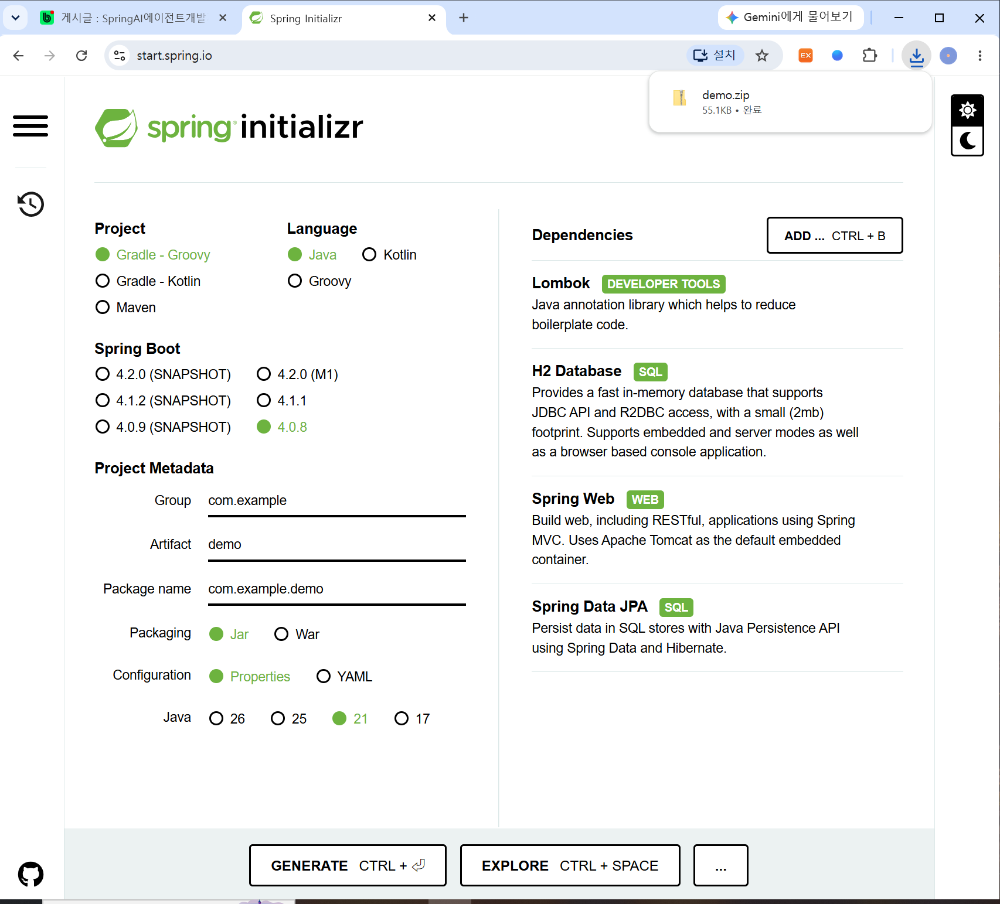
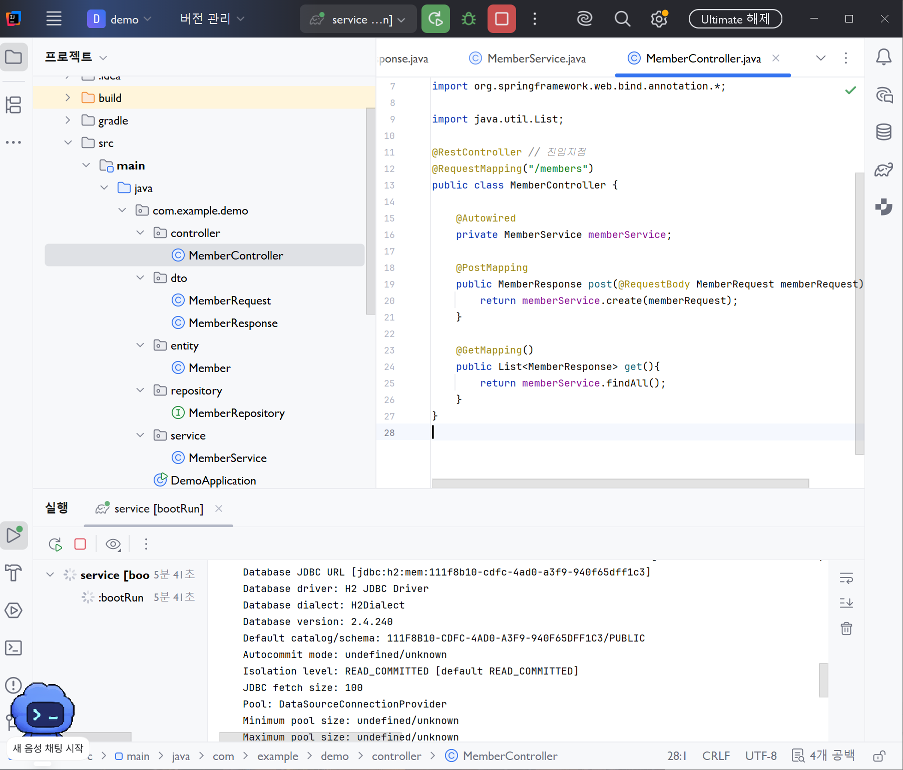
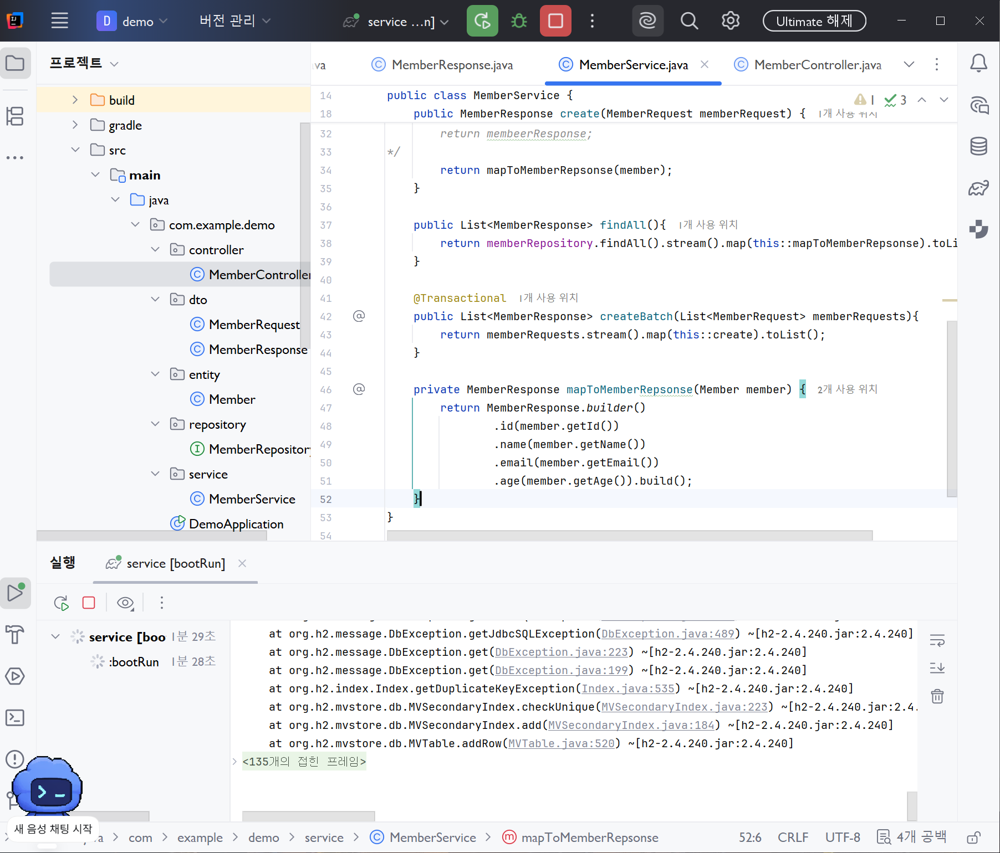
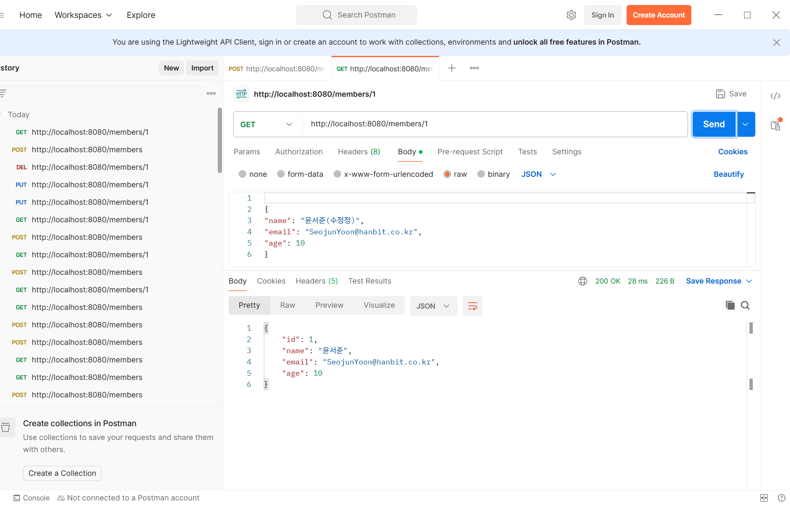
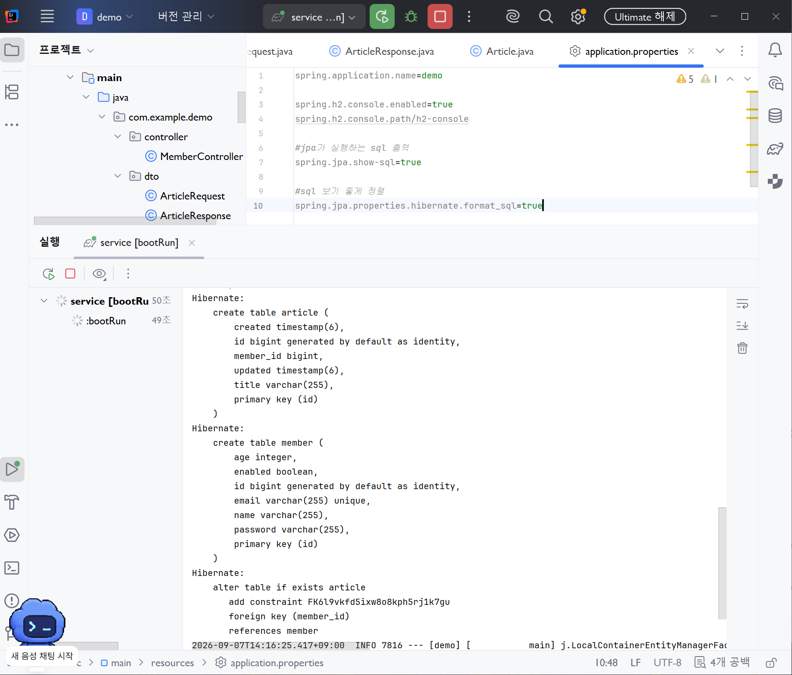
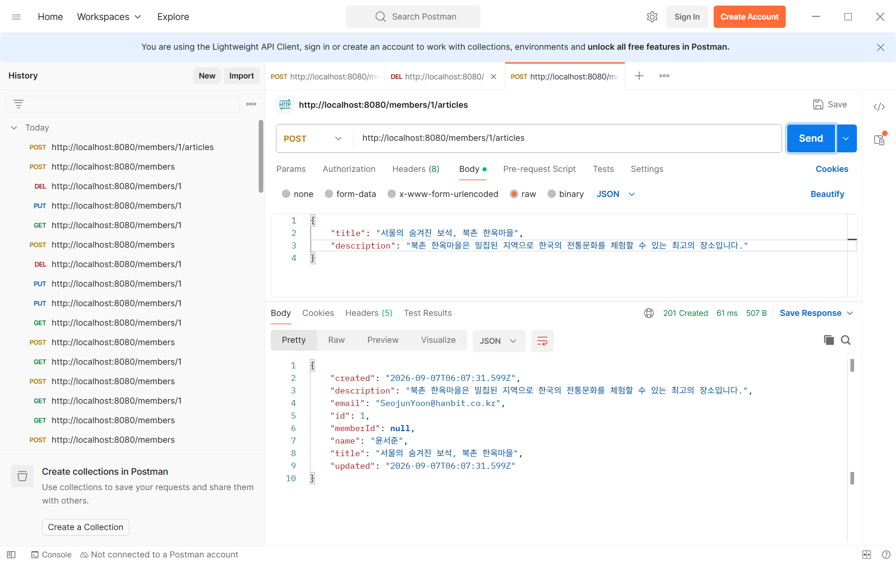
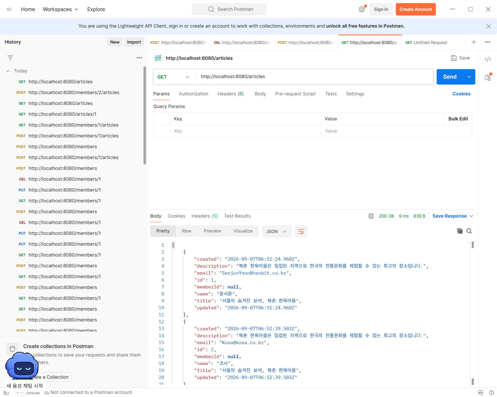
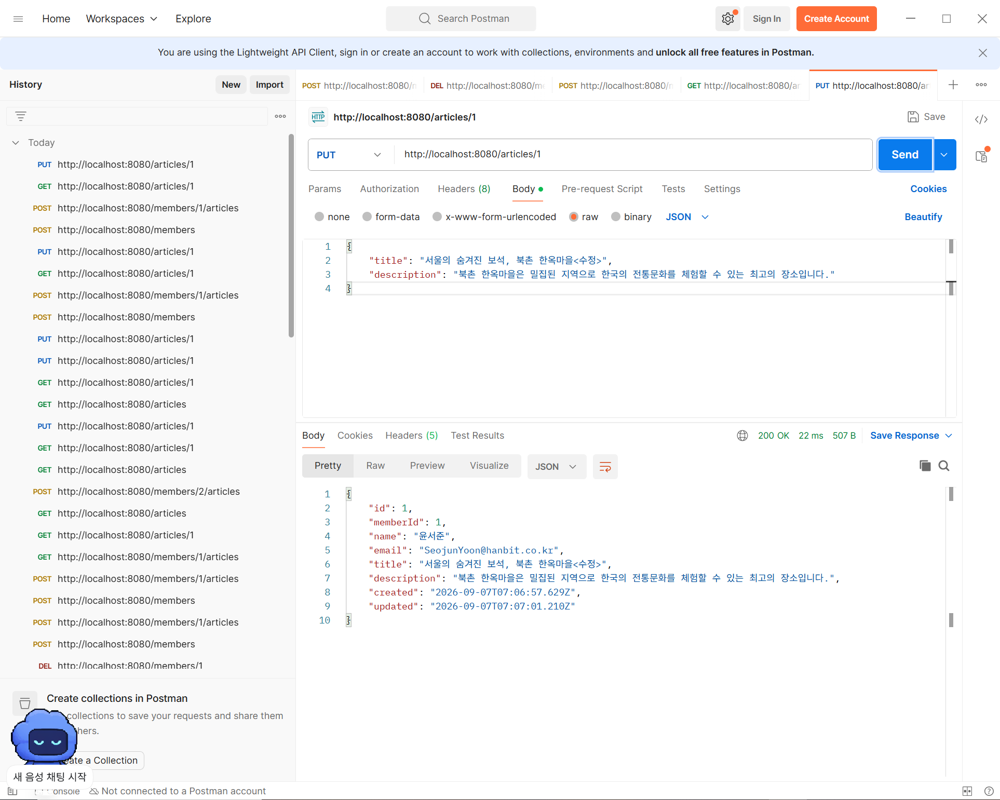
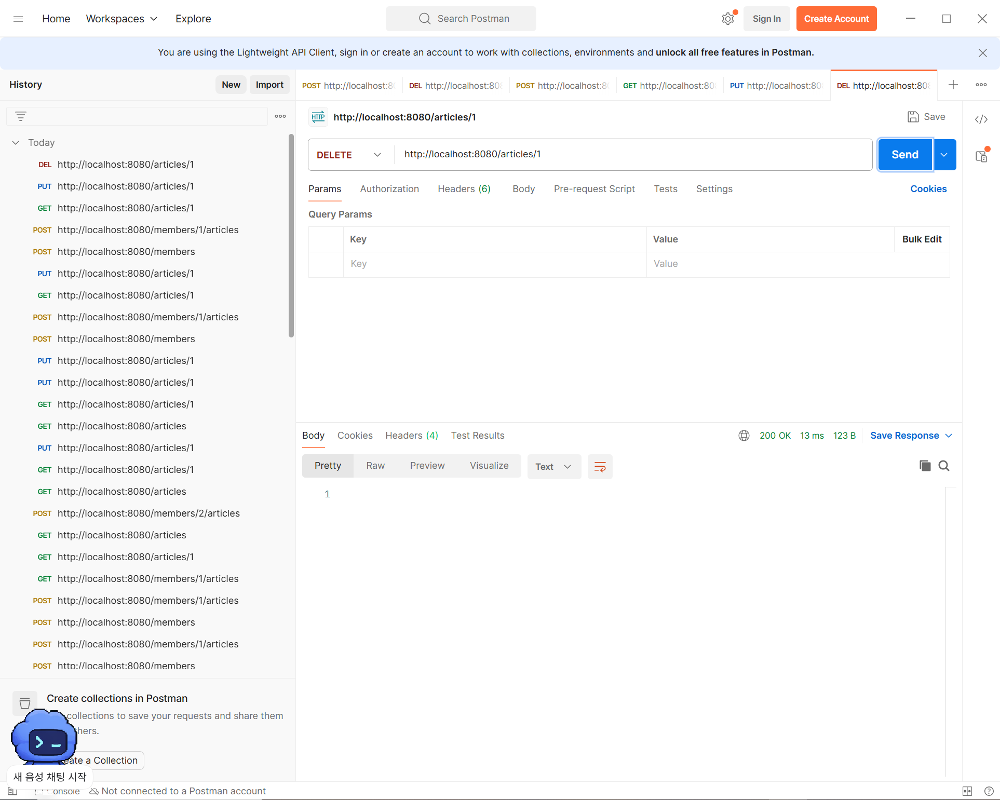

# DAY 38 — Spring Boot 서비스 계층, DTO와 JPA 연관관계

> 2026-09-07 · 계층을 분리하고 트랜잭션과 엔티티 관계를 적용한 REST API 만들기

오늘은 Spring Boot REST API의 구조를 Controller, Service, Repository 계층으로 나누고,
Entity가 API에 직접 노출되지 않도록 요청·응답 DTO를 사용하는 방법을 배웠다. 회원 여러 명을
저장하는 작업에는 트랜잭션을 적용했고, 회원과 게시글 사이의 다대일 관계와 생성·수정 시간 자동
기록도 구현했다. 마지막으로 Postman에서 회원과 게시글의 생성·조회·수정·삭제를 검증했다.

## 오늘 배운 내용

- 표현·비즈니스·영속성 계층의 역할
- Entity와 Request·Response DTO 분리
- Stream을 이용한 Entity → DTO 목록 변환
- 여러 건 저장과 `@Transactional` 롤백
- 회원·게시글의 `@ManyToOne` 연관관계
- `@CreatedDate`, `@LastModifiedDate`와 JPA Auditing
- 연관 엔티티의 식별자를 이용한 Repository 조회
- 회원·게시글 REST CRUD API와 Postman 검증
- 비밀번호처럼 외부에 공개하면 안 되는 필드 보호

## 계층형 구조로 역할 나누기

Controller가 요청 처리부터 데이터베이스 접근까지 모두 담당하면 코드가 커질수록 수정과 테스트가
어려워진다. 오늘은 각 계층이 한 가지 역할에 집중하도록 구조를 분리했다.

```text
Client · JSON
      ↓
Controller     요청과 응답, URL과 HTTP 메서드
      ↓
Service        비즈니스 규칙, DTO 변환, 트랜잭션
      ↓
Repository     JPA를 이용한 데이터 접근
      ↓
H2 Database
```

| 계층 | 주요 역할 | 오늘 작성한 클래스 |
| --- | --- | --- |
| 표현 계층 | HTTP 요청을 받고 결과를 반환 | `MemberController`, `ArticleController` |
| 비즈니스 계층 | 처리 순서와 규칙을 관리 | `MemberService`, `ArticleService` |
| 영속성 계층 | 엔티티 저장·조회·수정·삭제 | `MemberRepository`, `ArticleRepository` |

Spring Initializr에서 Spring Web, Spring Data JPA, H2 Database와 Lombok을 선택해 계층형 API
실습 프로젝트를 구성했다.



## Entity와 DTO 분리

`Member` 엔티티에는 데이터베이스에 저장할 `password`, `enabled` 필드까지 포함되어 있다.
하지만 Entity를 그대로 응답하면 클라이언트가 알 필요 없는 내부 상태나 비밀번호가 노출될 수 있다.
이를 막기 위해 입력용 `MemberRequest`와 출력용 `MemberResponse`를 따로 만들었다.

```java
@Entity
public class Member {
    @Id
    @GeneratedValue(strategy = GenerationType.IDENTITY)
    private Long id;

    @Column(unique = true)
    private String email;

    private String name;
    private Integer age;
    private String password;
    private Boolean enabled;
}
```

```java
public class MemberRequest {
    private String name;
    private String email;
    private Integer age;
}

public class MemberResponse {
    private Long id;
    private String name;
    private String email;
    private Integer age;
}
```

Request DTO에는 클라이언트가 입력할 값만, Response DTO에는 공개해도 되는 값만 담는다. 이렇게
구분하면 데이터베이스 구조가 바뀌어도 API 형식을 독립적으로 관리할 수 있다.

## Service에서 변환과 비즈니스 로직 처리

Controller는 요청을 Service에 전달하고, Service는 Request DTO를 Entity로 바꿔 저장한 뒤
Response DTO로 변환해 반환한다.

```java
@Service
public class MemberService {
    private final MemberRepository memberRepository;

    public MemberResponse create(MemberRequest request) {
        Member member = Member.builder()
                .name(request.getName())
                .email(request.getEmail())
                .age(request.getAge())
                .enabled(true)
                .build();

        memberRepository.save(member);
        return mapToMemberResponse(member);
    }

    private MemberResponse mapToMemberResponse(Member member) {
        return MemberResponse.builder()
                .id(member.getId())
                .name(member.getName())
                .email(member.getEmail())
                .age(member.getAge())
                .build();
    }
}
```

목록 조회에서는 `stream().map(...).toList()`를 이용해 Entity 목록을 Response DTO 목록으로
변환했다. 이 변환을 Service의 메서드로 모아 두면 Controller마다 같은 코드를 반복하지 않아도 된다.



## 여러 건 저장과 트랜잭션

회원 여러 명을 한 요청으로 저장할 때는 전체 작업을 하나의 단위로 묶어야 한다. 두 번째 회원을
저장하다가 이메일 중복 같은 오류가 발생했는데 첫 번째 회원만 남는다면 데이터가 불완전해진다.

```java
@Transactional
public List<MemberResponse> createBatch(List<MemberRequest> requests) {
    return requests.stream()
            .map(this::create)
            .toList();
}
```

`@Transactional`을 적용하면 모두 성공했을 때만 변경 내용을 확정한다. 처리 도중 런타임 예외가
발생하면 앞에서 저장한 내용까지 롤백되어 여러 건 저장의 원자성을 지킬 수 있다.



이번 실습에서는 `email` 컬럼에 `unique = true`를 지정해 중복을 제한했다. 데이터베이스
제약조건과 Service 트랜잭션을 함께 사용하면 잘못된 데이터가 일부만 저장되는 상황을 줄일 수 있다.

## 회원 CRUD를 Service로 이동

회원 한 건 조회, 수정과 삭제도 Controller가 Repository를 직접 호출하지 않고 Service를 거치게
했다.

```java
public MemberResponse findById(Long id) {
    return memberRepository.findById(id)
            .map(this::mapToMemberResponse)
            .orElse(null);
}

public MemberResponse update(MemberResponse response) {
    Member member = memberRepository.findById(response.getId())
            .orElseThrow();

    member.setName(response.getName());
    member.setEmail(response.getEmail());
    member.setAge(response.getAge());

    return mapToMemberResponse(memberRepository.save(member));
}

public void deleteById(Long id) {
    memberRepository.deleteById(id);
}
```



존재하지 않는 식별자를 `null`이나 기본 예외로 처리하는 것은 학습 단계에서는 단순하지만, 실제
API에서는 예외를 변환해 `404 Not Found`처럼 의미 있는 상태 코드를 반환하도록 개선할 수 있다.

## 회원과 게시글의 연관관계

게시글은 한 명의 회원이 작성하고, 한 회원은 여러 게시글을 작성할 수 있다. 게시글 입장에서는
다대일 관계이므로 `Article` 엔티티에 `@ManyToOne`을 적용했다.

```java
@Entity
@EntityListeners(AuditingEntityListener.class)
public class Article {
    @Id
    @GeneratedValue(strategy = GenerationType.IDENTITY)
    private Long id;

    private String title;
    private String description;

    @CreatedDate
    private Date created;

    @LastModifiedDate
    private Date updated;

    @ManyToOne
    private Member member;
}
```

JPA는 `article` 테이블에 `member_id` 외래 키 컬럼을 만들고 회원 테이블과 연결한다. 게시글
응답에는 회원 Entity 전체 대신 작성자의 식별자, 이름과 이메일처럼 화면에 필요한 값만 DTO에
담았다.



## JPA Auditing으로 시간 자동 기록

메인 애플리케이션에 `@EnableJpaAuditing`을 적용하고 엔티티에
`AuditingEntityListener`를 등록했다.

```java
@EnableJpaAuditing
@SpringBootApplication
public class DemoApplication {
    public static void main(String[] args) {
        SpringApplication.run(DemoApplication.class, args);
    }
}
```

- `@CreatedDate`: 엔티티가 처음 저장될 때 생성 시간을 기록한다.
- `@LastModifiedDate`: 엔티티가 수정될 때 마지막 수정 시간을 갱신한다.

직접 시간을 입력하는 코드를 줄일 수 있고, 생성 시점과 변경 시점을 일관되게 관리할 수 있다.

## 연관된 게시글 저장과 조회

게시글을 만들 때 URL에서 작성자 회원 번호를 받고, Service에서 먼저 회원을 조회한 뒤 게시글과
연결했다.

```java
public ArticleResponse create(Long memberId, ArticleRequest request) {
    Member member = memberRepository.findById(memberId).orElseThrow();

    Article article = Article.builder()
            .title(request.getTitle())
            .description(request.getDescription())
            .member(member)
            .build();

    articleRepository.save(article);
    return mapToArticleResponse(article);
}
```

`POST /members/1/articles` 요청으로 1번 회원의 게시글을 저장하고, 생성에 성공했다는
`201 Created` 응답과 자동 기록된 시간을 확인했다.



Repository 메서드 이름에서 연관 엔티티의 속성까지 탐색할 수 있다.

```java
public interface ArticleRepository extends JpaRepository<Article, Long> {
    List<Article> findByMemberId(Long memberId);
}
```

전체 목록은 `GET /articles`, 특정 회원의 목록은 `GET /articles?memberId=1`처럼 서로
구분해 설계할 수 있다. 특정 게시글 한 건은 `GET /articles/{id}`로 조회한다.



## 게시글 수정과 삭제

게시글 수정은 먼저 기존 엔티티를 찾은 뒤 요청으로 받은 제목과 내용을 변경했다. 이 방식은
게시글에 이미 연결된 회원과 생성 시간을 유지하면서 필요한 값만 갱신할 수 있다.

```java
public ArticleResponse update(Long id, ArticleRequest request) {
    Article article = articleRepository.findById(id).orElseThrow();
    article.setTitle(request.getTitle());
    article.setDescription(request.getDescription());
    return mapToArticleResponse(articleRepository.save(article));
}
```



`DELETE /articles/{id}` 요청은 Repository의 `deleteById(id)`와 연결했다. Postman에서
요청이 정상 처리되고 응답 본문이 비어 있는 것을 확인했다.



## 오늘의 핵심 정리

| 주제 | 핵심 |
| --- | --- |
| 계층 분리 | Controller는 HTTP, Service는 규칙, Repository는 DB 접근에 집중한다. |
| DTO | Entity의 내부 필드를 숨기고 API 요청·응답 형식을 분리한다. |
| 트랜잭션 | 여러 저장 작업이 전부 성공하거나 전부 취소되도록 보장한다. |
| 연관관계 | `@ManyToOne`으로 게시글과 작성자 회원을 연결한다. |
| Auditing | 생성·수정 시간을 엔티티 생명주기에 맞춰 자동 기록한다. |
| REST API | URI와 HTTP 메서드로 회원·게시글 CRUD를 표현한다. |

## 회고

이전 실습에서는 Controller가 Repository를 바로 호출해 JPA CRUD의 동작을 확인했다면, 오늘은
Service와 DTO를 추가해 실제 애플리케이션에 가까운 구조로 확장했다. 특히 Entity에 비밀번호가
있더라도 Response DTO에서 제외하면 외부에 노출되지 않는다는 점과, 여러 건 저장 중 하나가
실패했을 때 트랜잭션이 데이터의 일관성을 지켜 준다는 점이 기억에 남았다. 회원과 게시글 관계,
생성·수정 시간까지 연결하면서 데이터베이스 모델과 REST API를 함께 설계해야 한다는 것도 배웠다.
