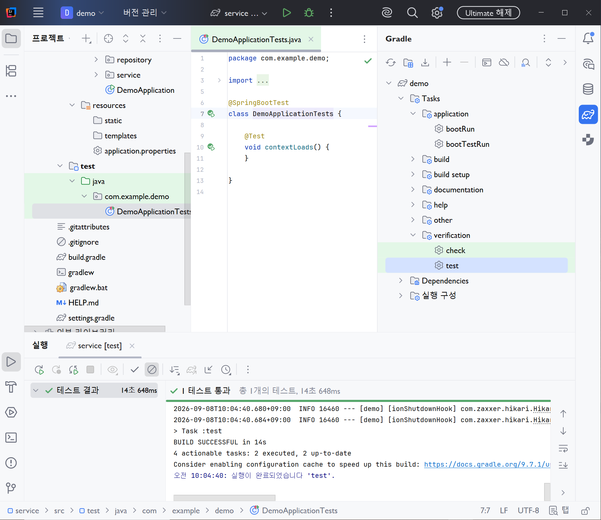
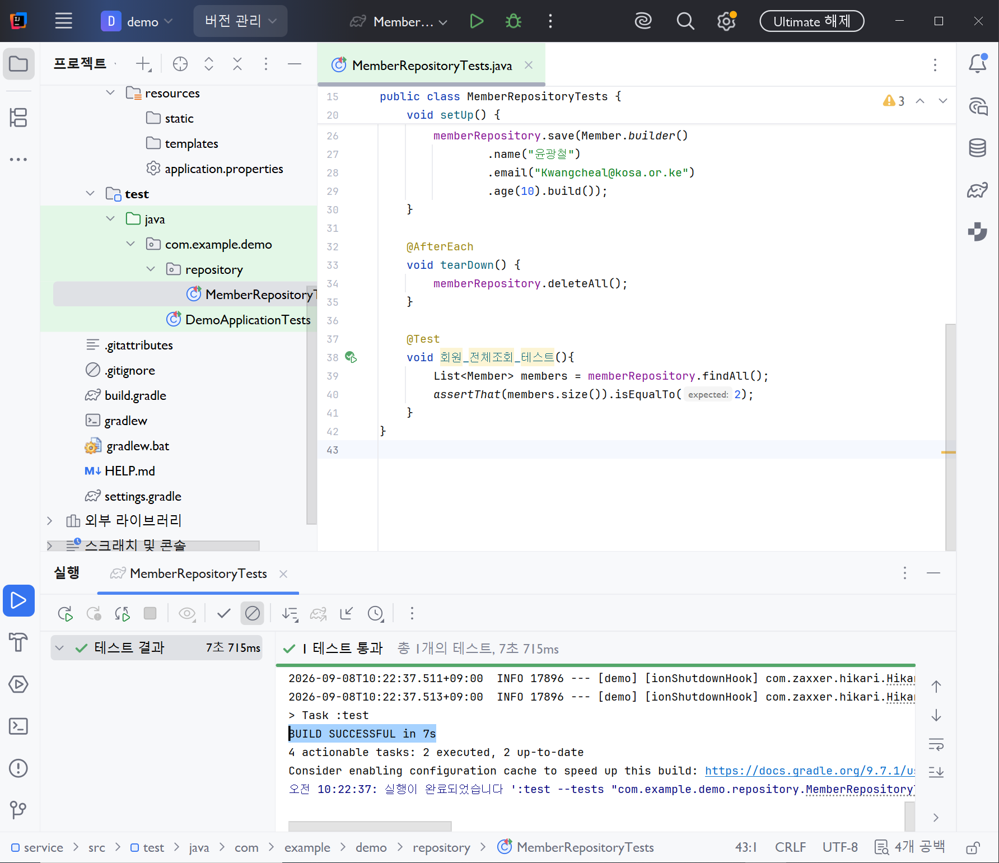
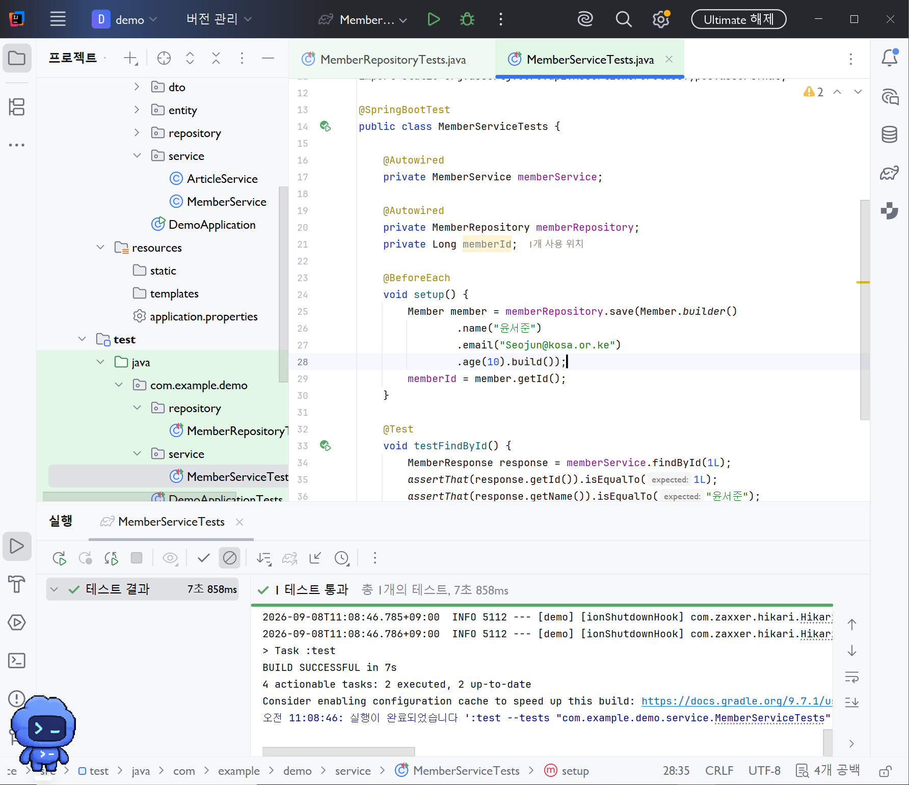
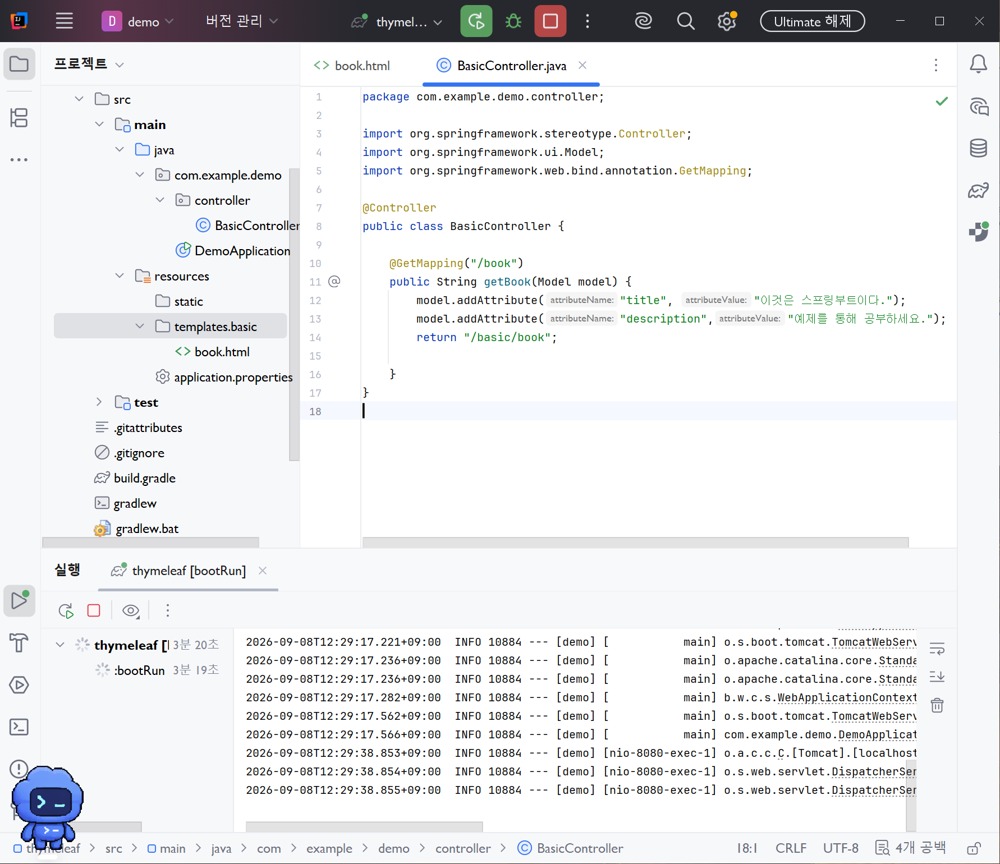
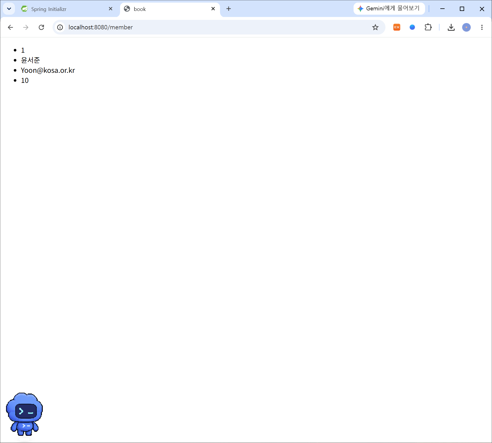
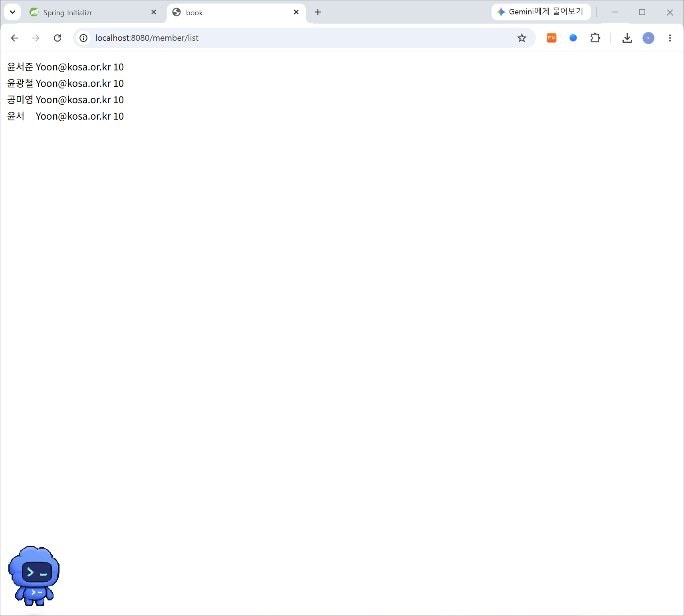
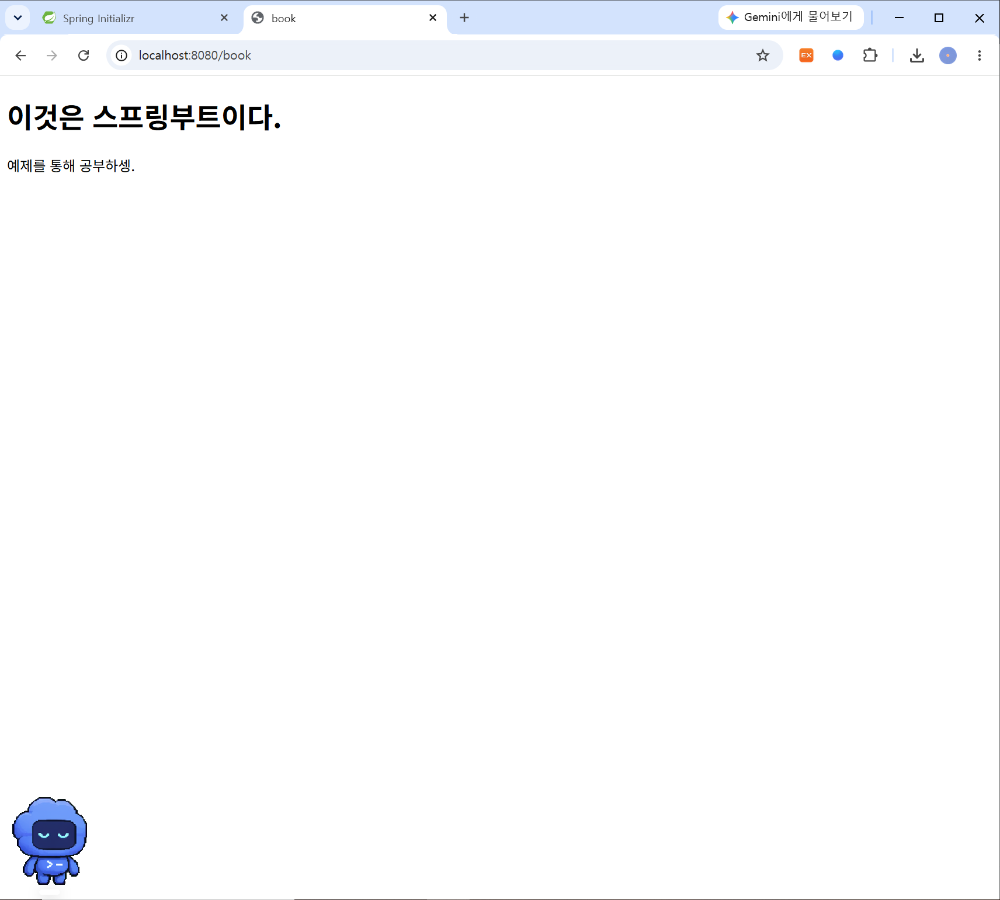
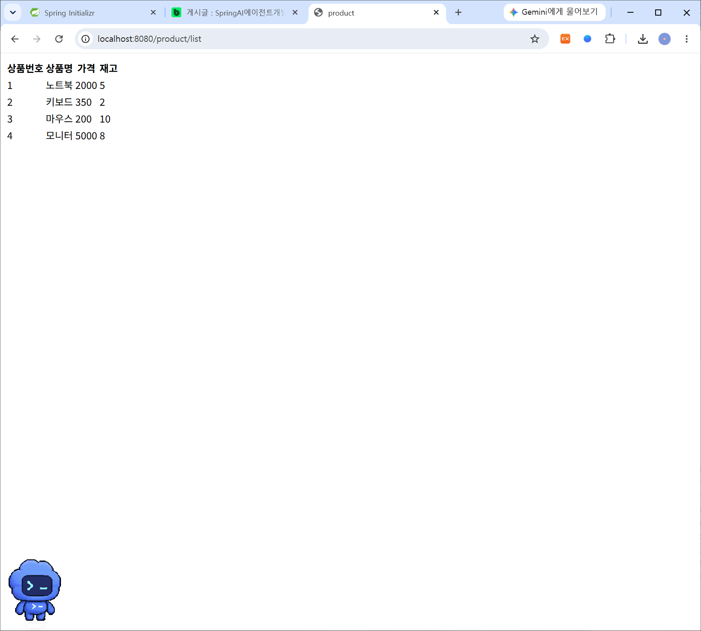

# DAY 39 — Spring Boot 테스트, MVC와 Thymeleaf

> 2026-09-08 · 테스트로 계층을 검증하고 Controller의 데이터를 HTML 화면에 출력하기

오늘은 Spring Boot 애플리케이션을 테스트하는 방법과 웹 요청이 화면으로 이어지는 흐름을
배웠다. Repository와 Service의 동작을 JUnit으로 검증하고, Spring MVC의 Controller가
`Model`에 데이터를 담아 Thymeleaf 템플릿으로 전달하는 과정을 직접 구현했다. 한 객체뿐 아니라
회원과 상품 목록을 반복 출력하면서 서버에서 만든 데이터가 동적인 HTML이 되는 과정도 확인했다.

## 오늘 배운 내용

- `@SpringBootTest`로 Spring Context를 포함한 통합 테스트 실행
- `@BeforeEach`, `@Test`, `@AfterEach`의 실행 순서
- Repository와 Service 테스트의 준비·실행·검증·정리
- 저장 결과의 ID를 사용해 테스트를 독립적으로 만드는 방법
- 웹 Filter의 역할과 요청 URL·처리 시간 기록
- Spring MVC의 Model·View·Controller 구조
- `@Controller`, `@GetMapping`, `Model.addAttribute()`
- Thymeleaf의 `th:text`, `${...}`, `th:each`
- 메시지 표현식 `#{...}`과 `th:utext`
- 회원·상품 단건 및 목록 화면 출력

## Spring Boot 테스트의 시작

Spring Initializr로 만든 프로젝트에는 애플리케이션 Context가 정상적으로 시작되는지 확인하는
기본 테스트가 포함된다.

```java
@SpringBootTest
class DemoApplicationTests {

    @Test
    void contextLoads() {
    }
}
```

`@SpringBootTest`는 실제 애플리케이션과 비슷하게 Spring Context를 구성한다. 따라서 Bean 등록,
의존성 주입과 설정을 함께 확인하는 통합 테스트에 적합하다. 기본 테스트가 성공하면 적어도 현재
설정으로 애플리케이션이 시작될 수 있다는 것을 알 수 있다.



## 테스트 데이터의 생명주기

여러 테스트가 같은 데이터베이스를 사용하면 앞선 테스트의 데이터가 다음 결과에 영향을 줄 수 있다.
이를 줄이기 위해 테스트마다 필요한 데이터를 준비하고, 검증이 끝나면 정리하도록 구성했다.

```java
@BeforeEach
void setUp() {
    memberRepository.save(Member.builder()
            .name("테스트 회원 1")
            .email("member1@example.com")
            .age(20)
            .build());

    memberRepository.save(Member.builder()
            .name("테스트 회원 2")
            .email("member2@example.com")
            .age(21)
            .build());
}

@Test
void 회원_전체조회_테스트() {
    List<Member> members = memberRepository.findAll();
    assertThat(members).hasSize(2);
}

@AfterEach
void tearDown() {
    memberRepository.deleteAll();
}
```

실행 순서는 다음과 같다.

```text
@BeforeEach  테스트에 필요한 상태 준비
     ↓
@Test        기능 실행과 결과 검증
     ↓
@AfterEach   다음 테스트를 위한 데이터 정리
```

`@RepeatedTest`는 같은 테스트를 지정한 횟수만큼 반복하고, `@Disabled`는 아직 실행하지 않을
테스트를 잠시 제외할 때 사용한다.



## 고정된 ID에 의존하지 않는 Service 테스트

데이터베이스의 자동 증가 ID는 테스트 실행 순서나 이전 데이터에 따라 달라질 수 있다. 따라서
`1L`처럼 값을 예상하기보다 준비 단계에서 저장된 엔티티의 실제 ID를 받아 사용하는 편이 안전하다.

```java
private Long memberId;

@BeforeEach
void setUp() {
    Member saved = memberRepository.save(Member.builder()
            .name("테스트 회원")
            .email("service@example.com")
            .age(20)
            .build());
    memberId = saved.getId();
}

@Test
void 회원_한건조회_테스트() {
    MemberResponse response = memberService.findById(memberId);

    assertThat(response.getId()).isEqualTo(memberId);
    assertThat(response.getName()).isEqualTo("테스트 회원");
}
```

이렇게 하면 테스트가 특정 실행 순서나 데이터베이스의 현재 시퀀스 값에 묶이지 않는다. 테스트를
여러 번 실행해도 같은 조건에서 같은 결과를 기대할 수 있다.



## 웹 요청과 MVC 구조

Spring MVC에서는 요청 처리, 데이터와 화면을 분리한다. 브라우저의 요청을 Controller가 받고,
필요한 데이터를 Model에 넣은 다음 View 이름을 반환한다. Thymeleaf는 View 템플릿을 실제 HTML로
렌더링한다.

```text
Browser
   ↓ HTTP Request
Filter              요청 URL·처리 시간 등을 기록
   ↓
DispatcherServlet   요청에 맞는 Controller 탐색
   ↓
Controller          처리할 데이터 준비
   ↓
Model               화면에 전달할 값 보관
   ↓
Thymeleaf View      HTML 생성
   ↓ HTTP Response
Browser
```

Filter는 Controller보다 앞뒤에서 동작하므로 공통 로그, 인증 확인, 요청·응답 가공처럼 여러 화면에
반복되는 처리를 넣기에 적합하다. 오늘은 요청 URL과 처리 시간을 기록하는 로그 Filter의 역할도
함께 배웠다.

## Controller에서 View로 데이터 전달

`@Controller`는 JSON 자체를 반환하는 `@RestController`와 달리 주로 View 이름을 반환한다.
`Model.addAttribute()`로 등록한 값은 Thymeleaf 템플릿에서 사용할 수 있다.

```java
@Controller
public class BasicController {

    @GetMapping("/book")
    public String getBook(Model model) {
        model.addAttribute("title", "이것은 스프링부트이다.");
        model.addAttribute("description", "예제를 통해 공부하세요.");
        return "basic/book";
    }
}
```



View 이름이 `basic/book`이면 기본 설정에서
`src/main/resources/templates/basic/book.html`을 찾는다.

## Thymeleaf로 값 출력하기

Thymeleaf 템플릿은 일반 HTML 형태를 유지하면서 `th:*` 속성으로 서버 데이터를 연결한다.
브라우저에서 파일을 직접 열었을 때는 태그 안의 기본 문구가 보이고, 서버를 거치면
`th:text`의 값으로 교체된다. 이를 Natural Template이라고 한다.

```html
<!DOCTYPE html>
<html lang="ko" xmlns:th="http://www.thymeleaf.org">
<body>
  <h1 th:text="${title}">스프링부트 입문서</h1>
  <p th:text="${description}">책 설명이 표시됩니다.</p>
</body>
</html>
```

`${title}`은 Model에 담은 `title` 값을 읽는 변수 표현식이다. 실행 결과에서 Controller가 준비한
두 문장이 HTML에 표시되는 것을 확인했다.



## 객체의 속성 출력

Model에 객체를 담으면 점 표기법으로 각 필드에 접근할 수 있다.

```java
@GetMapping("/member")
public String getMember(Model model) {
    Member member = Member.builder()
            .id(1L)
            .name("테스트 회원")
            .email("member@example.com")
            .age(20)
            .build();

    model.addAttribute("member", member);
    return "member-info";
}
```

```html
<ul>
  <li th:text="${member.id}">회원 번호</li>
  <li th:text="${member.name}">회원 이름</li>
  <li th:text="${member.email}">이메일</li>
  <li th:text="${member.age}">나이</li>
</ul>
```



## `th:each`로 목록 반복 출력

회원이나 상품처럼 여러 객체를 보여 줄 때는 `th:each`를 사용한다.

```html
<tr th:each="member : ${memberList}">
  <td th:text="${member.name}">이름</td>
  <td th:text="${member.email}">이메일</td>
  <td th:text="${member.age}">나이</td>
</tr>
```

`memberList`의 요소를 하나씩 `member`에 담아 `<tr>`을 반복 생성한다. Controller는 목록을
준비하는 역할을 하고, View는 그 목록을 화면 구조에 맞게 표현한다.



상품 번호, 상품명, 가격과 재고도 같은 방식으로 표에 출력했다. 데이터 종류가 달라도
Controller → Model → View 흐름은 동일하다.



## 메시지 표현식

Thymeleaf의 `#{welcome}`은 메시지 파일에서 키에 해당하는 문장을 가져온다. 화면 문구를 코드와
분리할 수 있고, 언어별 메시지 파일을 준비하면 국제화에도 활용할 수 있다.

```html
<p th:text="#{welcome}">Welcome</p>
<p th:text="#{welcome.description}">Description</p>
```

`th:text`는 HTML 특수 문자를 이스케이프하지만 `th:utext`는 HTML을 그대로 해석한다.
사용자가 입력한 값을 `th:utext`로 출력하면 스크립트가 실행될 위험이 있으므로, 신뢰할 수 있는
문구에만 제한적으로 사용해야 한다.

## 오늘의 정리

오늘은 기능을 구현하는 것뿐 아니라 테스트로 기대한 결과를 확인하고, Controller가 만든 데이터를
HTML 화면으로 연결하는 전체 흐름을 경험했다. 특히 테스트에서 자동 생성 ID를 고정하지 않고 저장된
값을 사용하는 것이 안정적인 테스트에 중요하다는 점을 알게 되었다. 다음에는 MockMvc로 HTTP 요청과
응답까지 검증하고, 실제 Repository 데이터를 Thymeleaf 목록에 연결해 보고 싶다.
