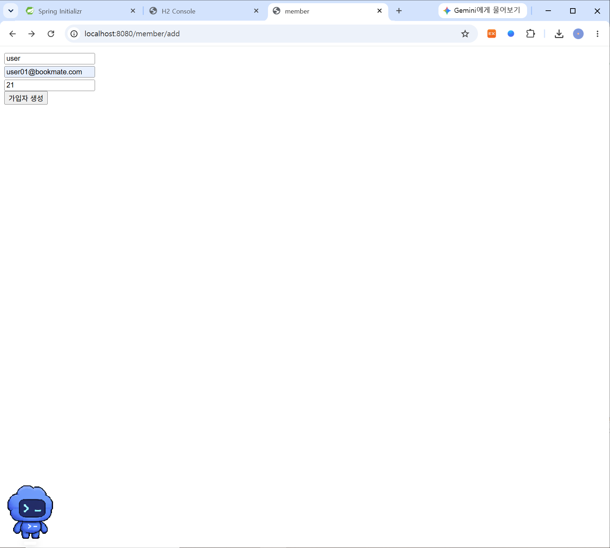
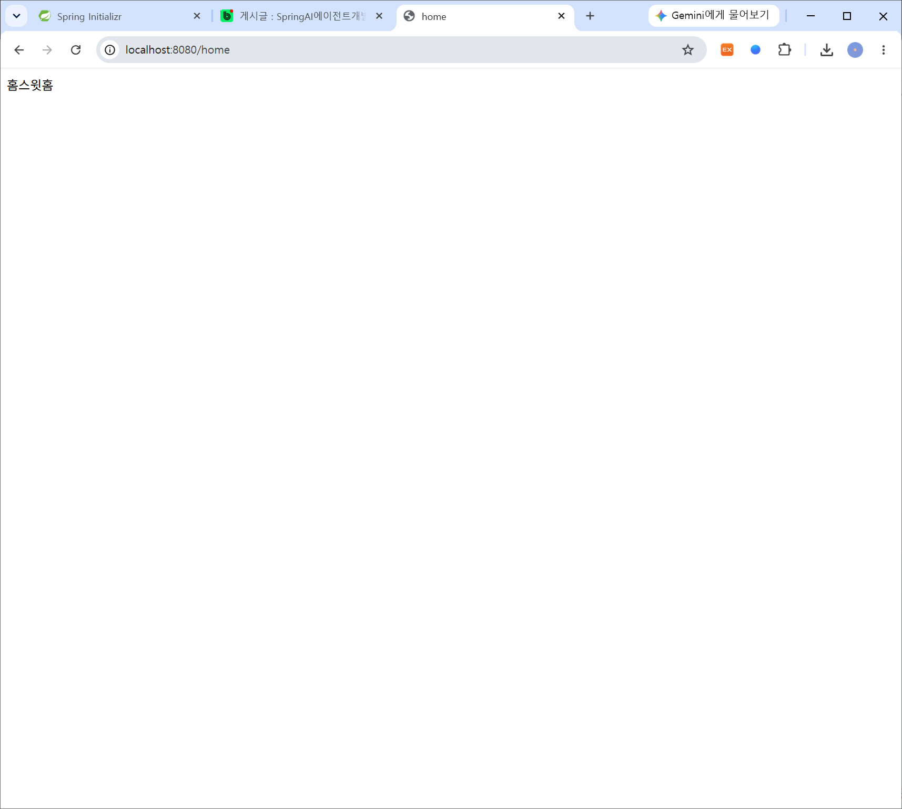
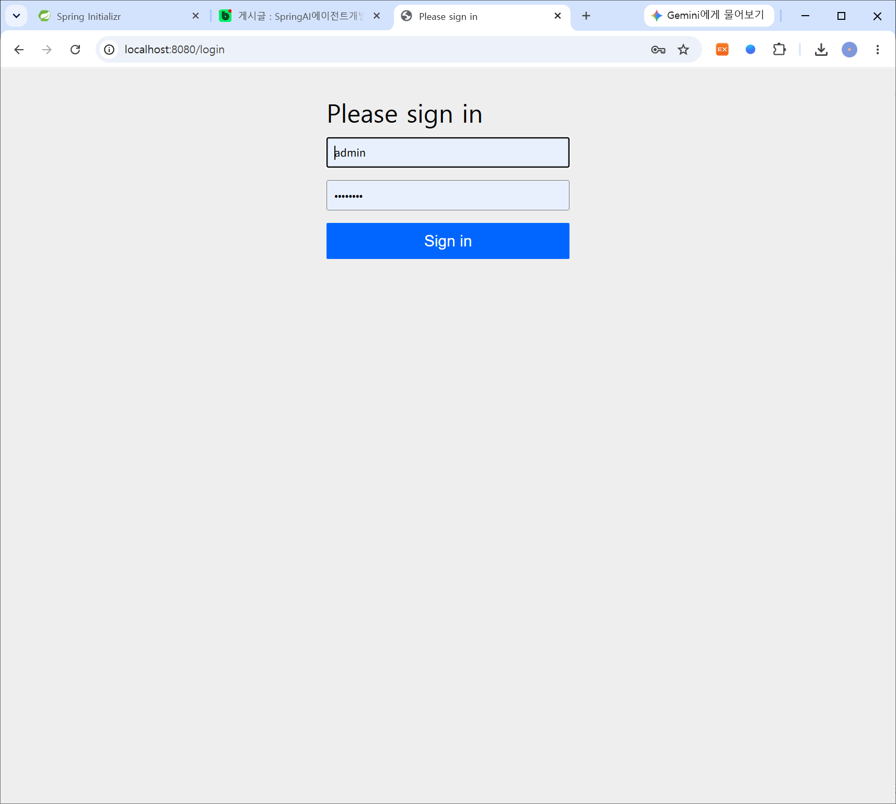
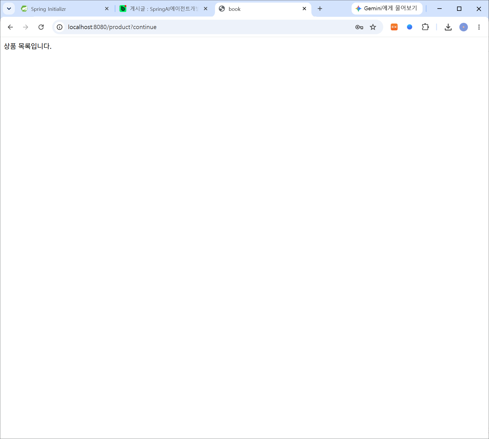
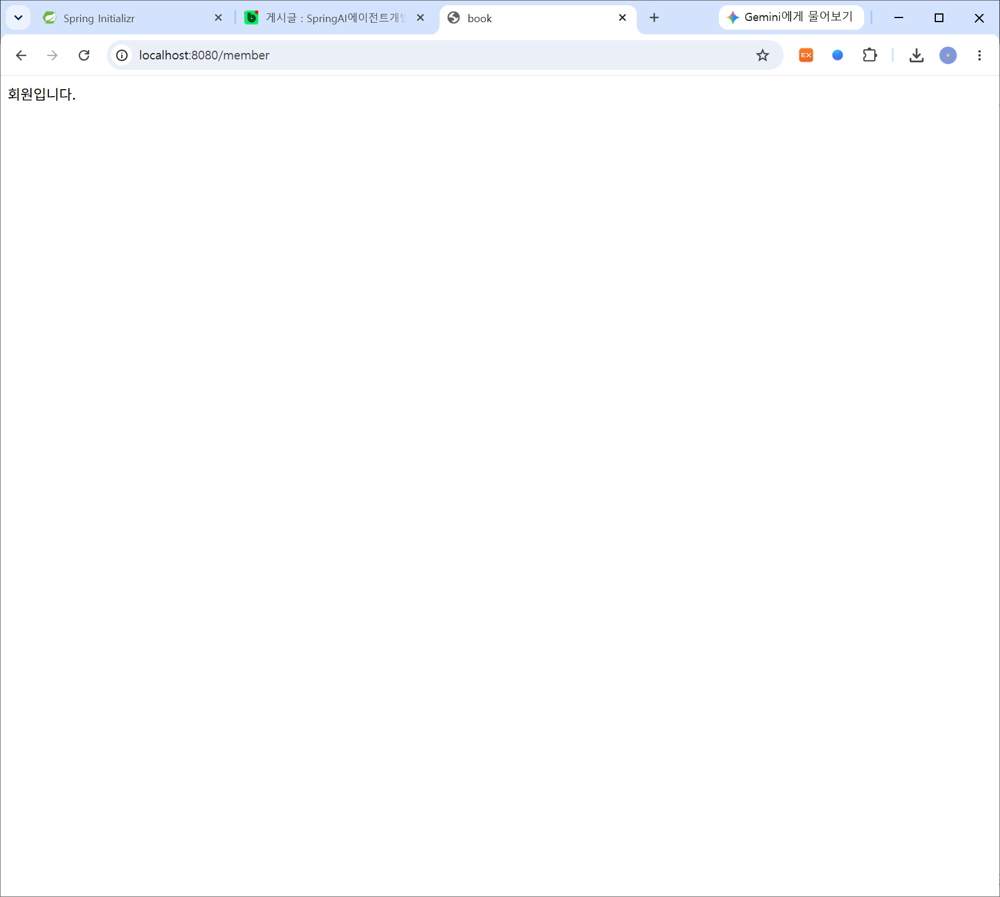
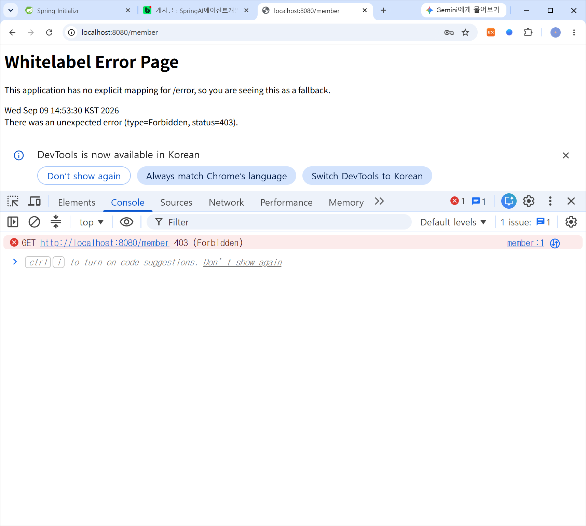
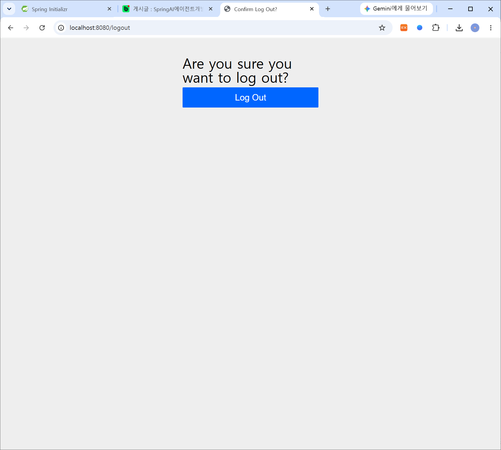

# DAY 40 — Spring MVC 폼 처리와 Spring Security 인증·인가

> 2026-09-09 · 폼 데이터를 JPA로 저장·수정하고 사용자 역할에 따라 URL 접근 제어하기

오늘은 전날 만들었던 Spring MVC 화면을 실제 데이터 저장 기능과 연결했다. Thymeleaf 폼에서
입력한 회원 정보를 Controller가 받아 JPA Repository로 저장하고, 수정 화면에서는 기존 데이터를
조회해 다시 저장하는 흐름을 구현했다. 이어서 Spring Security를 적용해 로그인 여부와 사용자 역할에
따라 접근할 수 있는 URL을 나누고, 허용되지 않은 요청이 차단되는 과정까지 확인했다.

## 오늘 배운 내용

- Thymeleaf 폼과 Spring MVC Controller의 데이터 바인딩
- `JpaRepository`를 이용한 회원 등록·조회·수정
- 저장 후 새로고침에 의한 중복 요청을 줄이는 리다이렉트
- Spring Security의 인증(Authentication)과 인가(Authorization)
- `BCryptPasswordEncoder`를 이용한 비밀번호 해시 저장
- DB 회원을 조회하는 `UserDetailsService`
- `SecurityFilterChain`을 이용한 URL별 접근 권한 설정
- 로그인 세션, 로그아웃과 403 Forbidden 응답 확인

## 1. HTML 폼 데이터를 JPA로 저장하기

회원 등록은 다음 순서로 동작한다.

```text
등록 화면(GET)
    ↓
Thymeleaf 폼 입력
    ↓
Controller가 POST 요청 수신
    ↓
요청 값을 Member 객체에 바인딩
    ↓
JpaRepository.save(member)
    ↓
목록 또는 홈으로 redirect
```

### Member 엔티티와 Repository

회원 데이터를 다루는 엔티티를 만들고 `JpaRepository`를 상속하면 기본적인 저장·조회·수정·삭제
메서드를 바로 사용할 수 있다.

```java
@Entity
public class Member {
    @Id
    @GeneratedValue(strategy = GenerationType.IDENTITY)
    private Long id;

    private String name;
    private String email;
}
```

```java
public interface MemberRepository extends JpaRepository<Member, Long> {
}
```

### 등록 폼과 Controller

Thymeleaf 폼은 `POST /member/add`로 입력값을 전송한다. 각 `name` 속성은 Controller가 받는
객체의 필드명과 맞아야 한다.

```html
<form th:action="@{/member/add}" method="post">
  <input type="text" name="name" placeholder="이름">
  <input type="email" name="email" placeholder="이메일">
  <button type="submit">저장</button>
</form>
```

```java
@GetMapping("/member/add")
public String addForm() {
    return "member/add-form";
}

@PostMapping("/member/add")
public String add(Member member) {
    memberRepository.save(member);
    return "redirect:/home";
}
```

Spring MVC는 폼의 `name`, `email` 값을 같은 이름의 `Member` 필드에 넣어준다. 저장을 마친 뒤
View 이름 대신 `redirect:`를 반환하면 브라우저가 새로운 GET 요청을 보내므로, 새로고침할 때
등록 POST 요청이 반복되는 문제를 줄일 수 있다.



### H2에서 저장 결과 확인

폼에서 입력한 값이 애플리케이션 화면에만 표시되는 것이 아니라 실제 DB에 저장되었는지 H2
Console에서 조회해 확인했다.

> H2 Console 주소에 임시 세션 식별자가 포함되어 있어 공개 저장소에서는 화면 캡처를 제외했다.

## 2. 기존 회원 정보 수정하기

수정 화면은 요청으로 받은 회원 번호를 이용해 기존 데이터를 먼저 조회한 뒤 Model에 담는다.
폼에는 `id`를 숨겨서 전달하고, 수정된 객체를 다시 `save()`하면 같은 식별자의 데이터가 갱신된다.

```java
@GetMapping("/member/edit")
public String editForm(@RequestParam("id") Long id, Model model) {
    Member member = memberRepository.findById(id)
        .orElseThrow(() -> new IllegalArgumentException("회원을 찾을 수 없습니다."));

    model.addAttribute("member", member);
    return "member/edit-form";
}

@PostMapping("/member/edit")
public String edit(Member member) {
    memberRepository.save(member);
    return "redirect:/member/list";
}
```

```html
<form th:action="@{/member/edit}" th:object="${member}" method="post">
  <input type="hidden" th:field="*{id}">
  <input type="text" th:field="*{name}">
  <input type="email" th:field="*{email}">
  <button type="submit">수정</button>
</form>
```

실습에서는 Entity를 폼에 직접 연결했지만, 실제 서비스에서는 사용자가 바꿔서는 안 되는 필드까지
요청으로 들어오는 것을 막기 위해 Form DTO를 별도로 만들고 입력값 검증을 추가하는 편이 안전하다.

## 3. Spring Security 시작하기

Spring Security 의존성을 추가하면 기본 보안 설정이 자동으로 적용된다. 별도 설정이 없을 때는
보호된 페이지에 접근하면 로그인 화면으로 이동하고, 로그인에 성공하면 인증 정보가 세션에 저장된다.
따라서 같은 브라우저에서는 로그아웃하거나 세션이 만료될 때까지 인증 상태가 유지된다.

> 회원 목록 화면에는 이름과 이메일이 포함되어 있어 공개 저장소에서 제외했다.

### 인증과 인가의 차이

| 구분 | 의미 | 확인하는 내용 |
| --- | --- | --- |
| 인증(Authentication) | 사용자가 누구인지 확인 | 아이디·비밀번호가 올바른가? |
| 인가(Authorization) | 인증된 사용자의 권한 확인 | 이 사용자가 해당 URL에 접근해도 되는가? |

로그인에 성공했다고 모든 기능을 이용할 수 있는 것은 아니다. 일반 사용자와 관리자를 구분해 각 역할에
맞는 기능만 허용하는 것이 인가다.

## 4. DB 회원으로 로그인하기

메모리에 고정된 계정 대신 DB에서 이메일을 조회해 로그인하도록 구성했다. Repository에 이메일 검색
메서드를 만들고, `UserDetailsService`가 회원 정보와 역할을 Spring Security가 이해할 수 있는 형태로
변환한다.

```java
public interface MemberRepository extends JpaRepository<Member, Long> {
    Optional<Member> findByEmail(String email);
}
```

```java
@Service
@RequiredArgsConstructor
public class CustomUserDetailsService implements UserDetailsService {
    private final MemberRepository memberRepository;

    @Override
    public UserDetails loadUserByUsername(String email) {
        Member member = memberRepository.findByEmail(email)
            .orElseThrow(() -> new UsernameNotFoundException("회원을 찾을 수 없습니다."));

        return User.withUsername(member.getEmail())
            .password(member.getPassword())
            .roles(member.getRole())
            .build();
    }
}
```

### BCrypt로 비밀번호 보호하기

비밀번호는 평문으로 저장하지 않고 단방향 해시 함수인 BCrypt로 변환해 저장한다. 같은 비밀번호라도
매번 다른 해시가 만들어질 수 있지만, `matches()`를 통해 입력값과 저장된 해시가 일치하는지 검증할
수 있다.

```java
@Bean
PasswordEncoder passwordEncoder() {
    return new BCryptPasswordEncoder();
}
```

```java
String encodedPassword = passwordEncoder.encode(rawPassword);
```

초기 테스트 사용자를 넣는 `DataInitializer`에서도 반드시 인코딩된 비밀번호를 저장하고,
`USER`, `ADMIN`처럼 역할 이름을 일관되게 관리해야 한다. 코드나 저장소에는 실제 비밀번호를
하드코딩하지 않고 환경 변수나 안전한 비밀 관리 수단을 사용한다.

## 5. URL별 접근 권한 설정하기

`SecurityFilterChain`에서 공개 URL, 로그인 사용자 URL, 관리자 전용 URL을 구분했다.

```java
@Bean
SecurityFilterChain securityFilterChain(HttpSecurity http) throws Exception {
    http
        .authorizeHttpRequests(auth -> auth
            .requestMatchers("/", "/home").permitAll()
            .requestMatchers("/member/**").hasRole("ADMIN")
            .anyRequest().authenticated()
        )
        .formLogin(Customizer.withDefaults())
        .logout(Customizer.withDefaults());

    return http.build();
}
```

설정 결과는 다음처럼 나뉜다.

| 요청 | 필요한 상태 |
| --- | --- |
| `/`, `/home` | 로그인하지 않아도 접근 가능 |
| 일반 상품·기능 페이지 | 로그인한 사용자 접근 가능 |
| `/member/**` | `ADMIN` 역할만 접근 가능 |

로그인하지 않은 상태에서도 홈 화면은 정상적으로 표시된다.



보호된 기능에 접근하면 로그인 화면으로 이동한다.



로그인한 사용자는 인증이 필요한 상품 화면에 접근할 수 있다.



관리자 역할로 로그인하면 회원 관리 페이지에도 접근할 수 있다.



반면 로그인은 되었지만 필요한 역할이 없다면 서버는 `403 Forbidden`을 반환한다. 이는 사용자를
확인하지 못한 상태가 아니라, 사용자는 확인했지만 해당 기능의 권한이 부족하다는 뜻이다.



로그아웃 요청을 보내면 현재 인증 세션을 종료할 수 있다.



## 6. 구현하며 정리한 보안 포인트

- 비밀번호 원문이나 인증 헤더를 코드·문서·화면 캡처에 남기지 않는다.
- 비밀번호는 `PasswordEncoder`로 해시한 값만 DB에 저장한다.
- `roles()`를 사용하면 내부적으로 `ROLE_` 접두사가 붙으므로 역할 이름을 일관되게 관리한다.
- 공개 URL은 필요한 범위만 `permitAll()`로 열고 나머지는 기본적으로 인증을 요구한다.
- 관리자 기능은 화면에서 링크를 숨기는 것뿐 아니라 서버의 인가 규칙으로 반드시 차단한다.
- Spring Security의 CSRF 보호가 켜져 있다면 POST 폼에 CSRF 토큰이 포함되어야 한다.
  Thymeleaf와 Spring Security를 함께 사용하면 일반적으로 폼에 토큰을 자동으로 연결할 수 있다.

## 마무리

오늘은 화면에 데이터를 출력하는 단계에서 더 나아가 사용자의 폼 입력을 DB에 저장하고 수정하는
전체 흐름을 연결했다. 또한 로그인 성공 여부만 확인하는 것과 역할별 기능 접근을 제어하는 것이 서로
다르다는 점을 실습으로 이해했다. 다음에는 Entity를 직접 요청 객체로 사용하지 않도록 Form DTO와
검증을 추가하고, 인증 실패·접근 거부 화면도 서비스 UI에 맞게 구성해보고 싶다.
