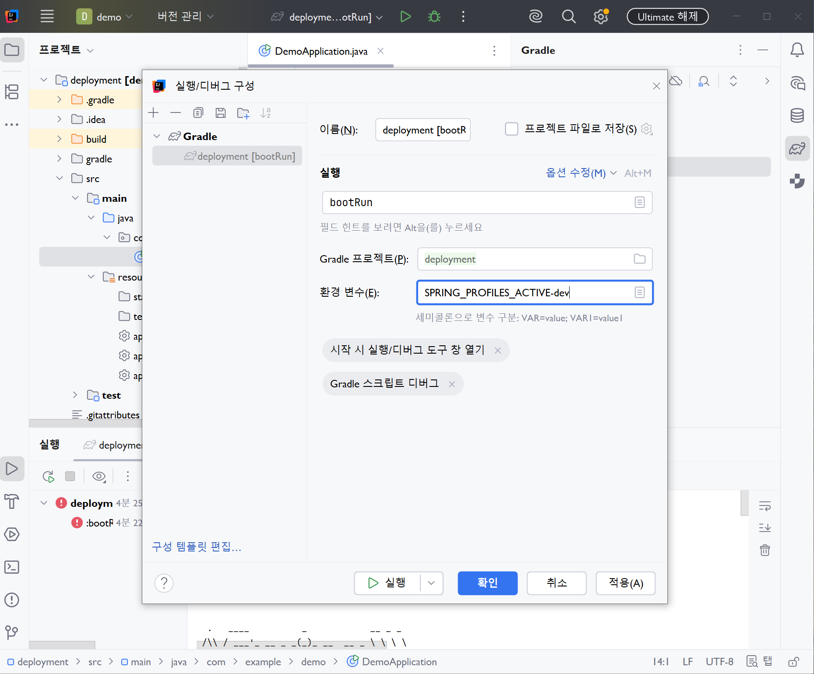
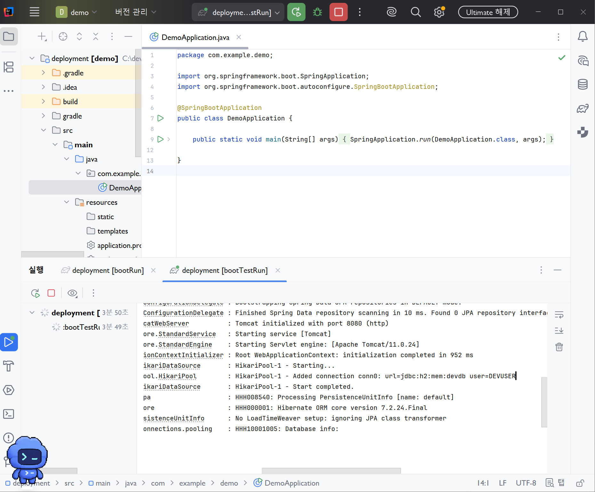
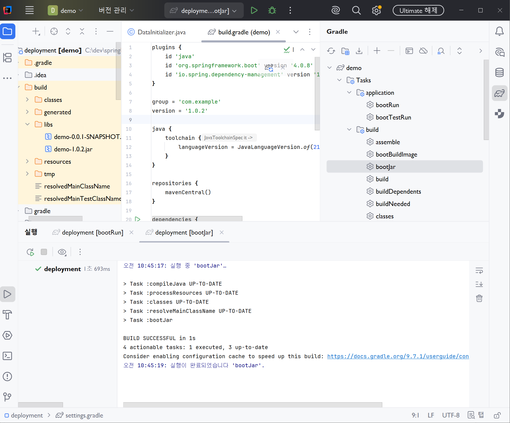
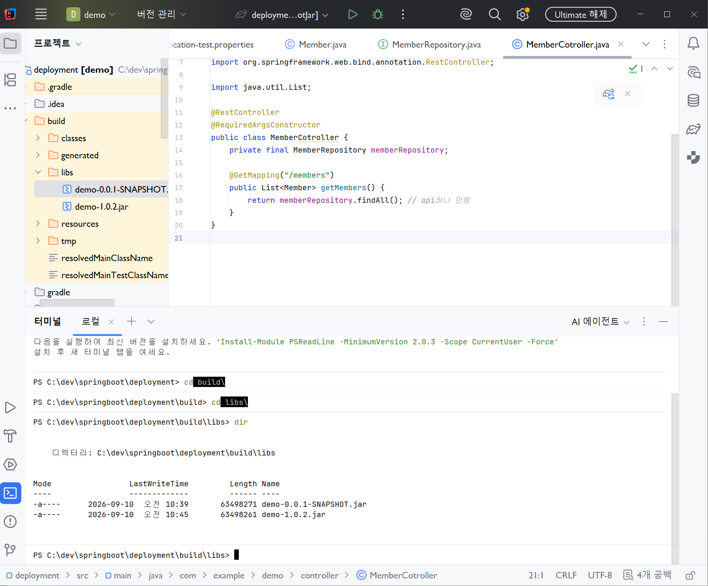
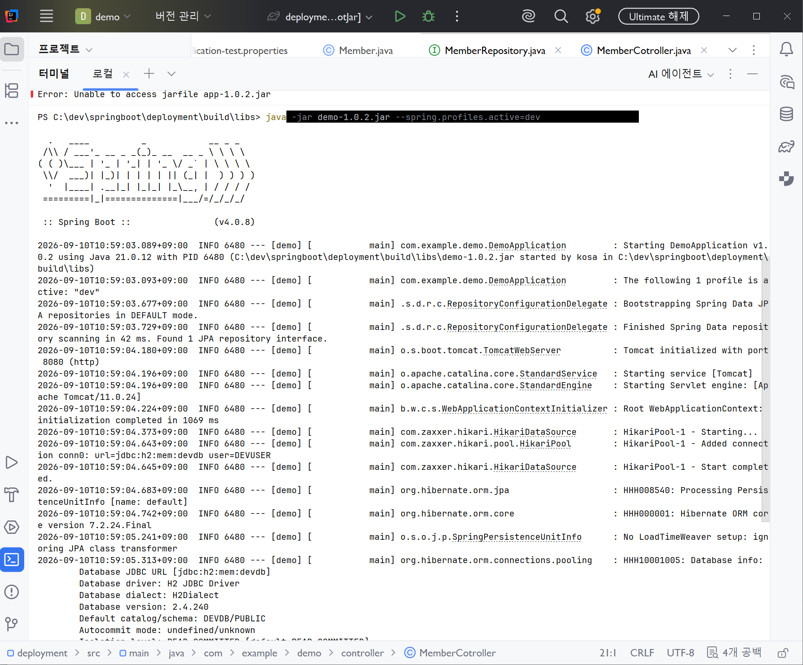
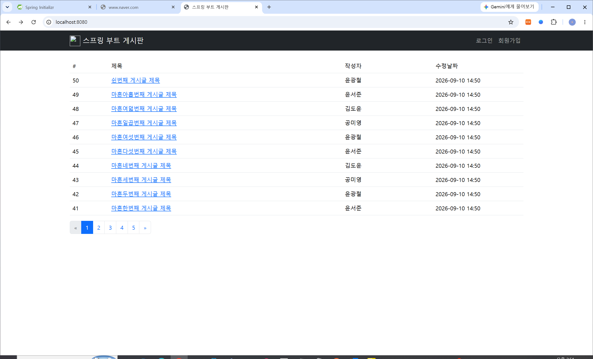

# DAY 41 — Spring Boot 프로필과 애플리케이션 빌드·배포

> 2026-09-10 · 개발·테스트 환경 분리, 실행 가능한 JAR 생성과 클라우드 배포 기초

오늘은 개발한 Spring Boot 애플리케이션을 실행 환경에 맞게 설정하고, 배포 가능한 파일로
패키징하는 과정을 학습했다. Spring Profiles로 개발 환경과 테스트 환경의 설정을 분리하고,
Gradle의 `bootJar` 작업으로 실행 가능한 JAR를 생성해 프로필을 지정하여 직접 실행했다.
JAR와 WAR의 차이, AWS의 기본 구성과 Docker·Compose의 역할도 함께 정리했다.

## 오늘 배운 내용

- Spring Profiles를 이용한 `dev`·`test` 환경 설정 분리
- 환경 변수와 실행 인수로 활성 프로필 지정하기
- JPA 회원 API를 실행해 선택된 데이터베이스 확인하기
- Gradle `bootJar`로 실행 가능한 JAR 만들기
- 버전에 따른 빌드 결과 파일명 확인하기
- JAR와 WAR 패키징 방식의 차이
- AWS, VPC, Elastic Beanstalk의 기본 개념
- Docker와 Docker Compose의 역할
- 게시판 프로젝트의 페이징과 관리자 회원 목록 확인

## 1. Spring Profiles로 환경 설정 분리하기

애플리케이션은 개발, 테스트, 운영 환경마다 연결하는 데이터베이스와 로그 수준 같은 설정이
달라질 수 있다. 하나의 설정 파일을 계속 고치는 대신 프로필별 파일로 나누면 같은 코드를
환경에 맞게 실행할 수 있다.

```text
src/main/resources/
├── application.properties
├── application-dev.properties
└── application-test.properties
```

기본 파일에는 모든 환경에서 공통으로 사용할 값을 두고, `application-{profile}.properties`에는
해당 환경에서만 사용할 설정을 둔다.

```properties
# application.properties
spring.application.name=deployment-practice
```

```properties
# application-dev.properties
spring.datasource.url=jdbc:h2:mem:devdb
spring.datasource.username=${DB_USERNAME}
spring.datasource.password=${DB_PASSWORD}
spring.h2.console.enabled=true
```

```properties
# application-test.properties
spring.datasource.url=jdbc:h2:mem:testdb
spring.datasource.username=${TEST_DB_USERNAME}
spring.datasource.password=${TEST_DB_PASSWORD}
```

실습에서는 로컬 H2 계정을 사용했지만, 실제 프로젝트의 비밀번호는 설정 파일이나 Git 저장소에
직접 적지 않고 환경 변수 또는 배포 환경의 비밀 관리 기능으로 전달해야 한다.

### 활성 프로필 선택하기

IDE 실행 설정에서는 `SPRING_PROFILES_ACTIVE=dev` 환경 변수를 지정할 수 있다.



프로필이 적용되어 실행되면 로그에서 활성 프로필과 `devdb` 데이터베이스 연결을 확인할 수 있다.



실행 방법에 따라 프로필을 다음처럼 전달할 수 있다.

```bash
# 환경 변수 사용
SPRING_PROFILES_ACTIVE=dev ./gradlew bootRun

# JAR 실행 인수 사용
java -jar demo-1.0.2.jar --spring.profiles.active=dev
```

명령행 인수는 배포할 파일을 다시 만들지 않고도 실행 환경을 선택할 수 있다는 장점이 있다.

## 2. 프로필별 데이터로 API 확인하기

실습 프로젝트에는 회원 Entity, `JpaRepository`, 회원 목록 REST API와 초기 데이터 등록 코드를
구성했다.

```java
@Entity
@Getter
@NoArgsConstructor
public class Member {
    @Id
    @GeneratedValue(strategy = GenerationType.IDENTITY)
    private Long id;

    private String name;
    private String email;
    private Integer age;
}
```

```java
public interface MemberRepository extends JpaRepository<Member, Long> {
}
```

```java
@RestController
@RequiredArgsConstructor
public class MemberController {
    private final MemberRepository memberRepository;

    @GetMapping("/members")
    public List<Member> getMembers() {
        return memberRepository.findAll();
    }
}
```

개발 환경에서만 초기 데이터가 생성되도록 `@Profile("dev")`도 사용했다.

```java
@Component
@Profile("dev")
@RequiredArgsConstructor
public class DataInitializer implements ApplicationRunner {
    private final MemberRepository memberRepository;

    @Override
    public void run(ApplicationArguments args) {
        // 개발 환경에서 사용할 샘플 데이터 저장
    }
}
```

`dev` 프로필로 실행한 뒤 Postman에서 `GET /members`를 요청해 샘플 회원이 JSON으로 반환되는 것을
확인했다. 이를 통해 프로필 선택, 데이터베이스 연결, JPA 저장과 REST 응답이 한 흐름으로 동작한다는
것을 검증했다.

> 회원 목록 응답에는 이름과 이메일이 포함되어 있어 공개 저장소에서 화면 캡처를 제외했다.

## 3. Gradle로 실행 가능한 JAR 만들기

개발 중에는 IDE나 `bootRun`으로 애플리케이션을 실행하지만, 서버에 배포하려면 코드와 의존성을
배포 가능한 결과물로 만들어야 한다. Spring Boot의 `bootJar` 작업은 애플리케이션 클래스와 필요한
라이브러리, 내장 서버를 포함한 실행 가능한 JAR를 생성한다.

```bash
# macOS·Linux
./gradlew clean bootJar

# Windows PowerShell
.\gradlew.bat clean bootJar
```

Windows PowerShell에서는 현재 폴더의 실행 파일을 가리킬 때 `./`보다 `.\` 표기를 사용하는 것이
안전하다. 빌드가 성공하면 결과 파일은 일반적으로 `build/libs` 폴더에 생성된다.



### 결과 파일명과 버전

`build.gradle`의 버전은 결과 JAR 파일명에 반영된다.

```groovy
group = 'com.example'
version = '1.0.2'
```

```text
build/libs/demo-1.0.2.jar
```

버전을 바꾼 뒤 다시 `bootJar`를 실행하면 이전 결과물과 새 결과물이 함께 남을 수 있다. 배포하기
전에는 사용할 파일명과 버전을 정확히 확인하고, 필요하면 `clean` 작업으로 오래된 결과물을 지운다.



### 생성한 JAR 직접 실행하기

```bash
java -jar build/libs/demo-1.0.2.jar --spring.profiles.active=dev
```

파일명이 실제 빌드 결과와 다르면 `Unable to access jarfile` 오류가 발생한다. `build/libs`의 파일명을
확인한 뒤 정확한 이름으로 실행해야 한다. 실행 로그에서 `dev` 프로필, 내장 Tomcat 포트와 H2 연결
정보를 확인할 수 있다.



## 4. JAR와 WAR의 차이

| 구분 | JAR | WAR |
| --- | --- | --- |
| 실행 방식 | `java -jar`로 직접 실행 | 외부 Servlet Container에 배포 |
| 웹 서버 | 주로 내장 Tomcat 사용 | 기존 WAS·Tomcat 인프라 사용 |
| Spring Boot 권장 상황 | 새 애플리케이션과 독립 실행 | 기존 조직의 WAS 환경과 연동 |
| Gradle 플러그인 | Spring Boot 기본 구성 | `id 'war'` 추가 |

Spring Boot의 장점 중 하나는 웹 서버를 별도로 설치하지 않아도 JAR 하나로 실행할 수 있다는 것이다.
따라서 새로운 서비스는 JAR 방식이 간단한 경우가 많다. 반면 이미 외부 WAS를 중심으로 운영하는
환경이라면 WAR가 필요할 수 있다.

WAR 배포를 지원할 때는 `SpringBootServletInitializer`를 확장한 초기화 클래스를 둘 수 있다.

```java
public class ServletInitializer extends SpringBootServletInitializer {
    @Override
    protected SpringApplicationBuilder configure(
            SpringApplicationBuilder application) {
        return application.sources(DemoApplication.class);
    }
}
```

패키징 방식은 무조건 하나가 더 좋은 것이 아니라 실제 서버 운영 방식에 맞춰 선택해야 한다.

## 5. 애플리케이션 배포의 의미

배포는 빌드된 애플리케이션을 사용자가 접근할 수 있는 실행 환경에 올리고 정상적으로 서비스하는
과정이다.

```text
소스 코드
   ↓ Gradle build
실행 가능한 JAR 또는 WAR
   ↓ 서버·클라우드로 전달
환경 변수와 네트워크 설정
   ↓ 애플리케이션 실행
사용자가 접속하는 서비스
```

코드만 서버에 복사하는 것으로 끝나는 것이 아니라 다음 항목을 함께 준비해야 한다.

- 실행할 Java 버전과 애플리케이션 포트
- 개발·테스트·운영 프로필과 환경 변수
- 데이터베이스 연결과 비밀 정보 관리
- 외부에서 접속할 수 있는 네트워크와 방화벽
- 실행 상태 확인, 로그와 장애 대응

## 6. AWS와 컨테이너 기초

### AWS와 VPC

클라우드는 인터넷을 통해 가상 서버, 데이터베이스, 스토리지와 네트워크 자원을 필요한 만큼
사용할 수 있게 제공한다. AWS에서 VPC(Virtual Private Cloud)는 이러한 자원을 배치하는 논리적으로
분리된 가상 네트워크다. 공개할 서버와 내부 DB의 접근 범위를 나누는 기반이 된다.

### Elastic Beanstalk

Elastic Beanstalk는 애플리케이션 파일을 올리면 서버 구성, 배포와 실행 환경 관리를 도와주는 AWS의
관리형 서비스다. 직접 모든 인프라를 설정하는 부담을 줄이고 애플리케이션 배포 과정에 집중할 수
있다.

### Docker와 Docker Compose

Docker는 애플리케이션과 실행에 필요한 환경을 이미지로 묶어 컨테이너에서 동일하게 실행할 수 있게
한다. 개발 PC와 배포 서버의 차이 때문에 생기는 문제를 줄이는 데 도움이 된다.

Docker Compose는 애플리케이션, 데이터베이스처럼 여러 컨테이너의 이미지·포트·환경 변수·네트워크
설정을 하나의 파일로 관리하고 함께 실행할 때 사용한다.

## 7. 게시판 프로젝트 동작 확인

함께 제공된 게시판 프로젝트에서는 Spring Data의 `Pageable`을 이용해 게시글을 최신순으로 10개씩
나누고, Thymeleaf에서 페이지 이동 버튼을 표시했다.

```java
@GetMapping("/list")
public String getArticleList(
        @PageableDefault(
            size = 10,
            sort = "id",
            direction = Sort.Direction.DESC
        ) Pageable pageable,
        Model model) {

    model.addAttribute("page", articleService.findAll(pageable));
    return "article-list";
}
```



관리자 권한으로 접근하는 회원 목록에서도 페이징된 데이터를 확인하고 회원 수정·삭제 기능을
연결했다. 화면에서 관리 메뉴를 감추는 것과 별개로 서버의 Spring Security 설정에서도
`/member/**`를 관리자 권한으로 제한해야 한다.

> 관리자 회원 목록 화면에는 개인정보가 포함되어 있어 공개 저장소에서 제외했다.

## 8. 오늘 정리한 배포 체크리스트

1. 배포 환경에 맞는 프로필과 환경 변수를 준비한다.
2. 테스트를 통과한 뒤 `clean bootJar` 또는 필요한 패키징 작업을 실행한다.
3. `build/libs`의 파일명과 버전을 확인한다.
4. 실제 배포 명령에서 프로필과 필요한 비밀 값을 주입한다.
5. 애플리케이션 시작 로그와 활성 프로필을 확인한다.
6. 핵심 API와 화면을 호출해 배포 결과를 검증한다.
7. 비밀번호나 인증 정보를 소스·로그·화면 캡처에 남기지 않는다.

## 마무리

오늘은 Spring Boot 코드를 작성하는 단계에서 한 걸음 더 나아가, 같은 애플리케이션을 환경별로
설정하고 실제 배포 파일로 만드는 흐름을 이해했다. 특히 JAR 파일명과 활성 프로필처럼 작은 설정
하나가 실행 결과를 바꿀 수 있으므로 빌드 결과와 실행 로그를 꼼꼼히 확인하는 것이 중요했다.
다음에는 Docker 이미지로 패키징하고, 운영 프로필의 비밀 값과 상태 확인 기능을 안전하게 구성해
실제 클라우드 배포 흐름까지 이어가고 싶다.
