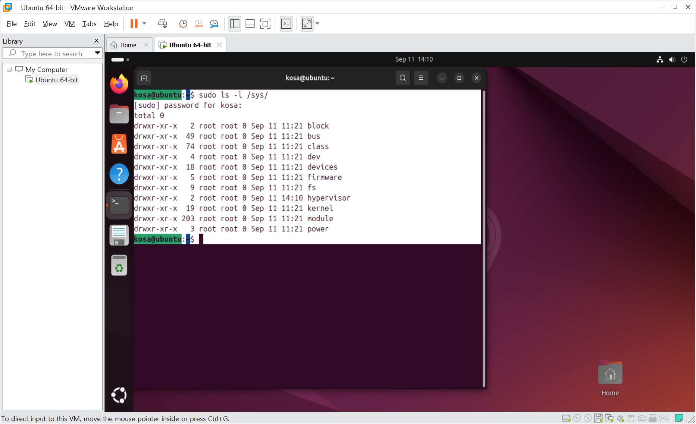
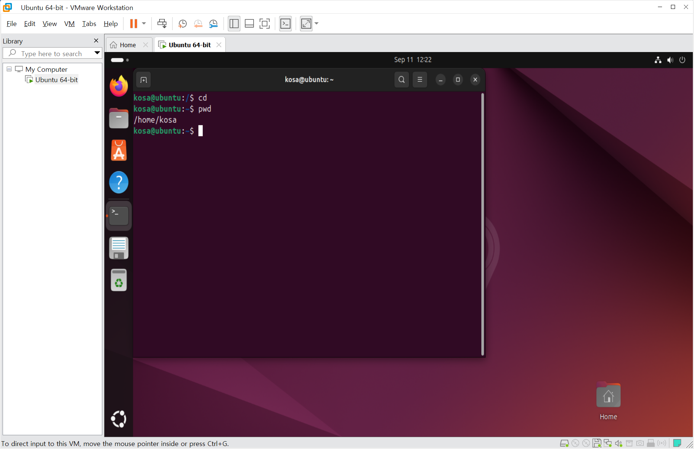
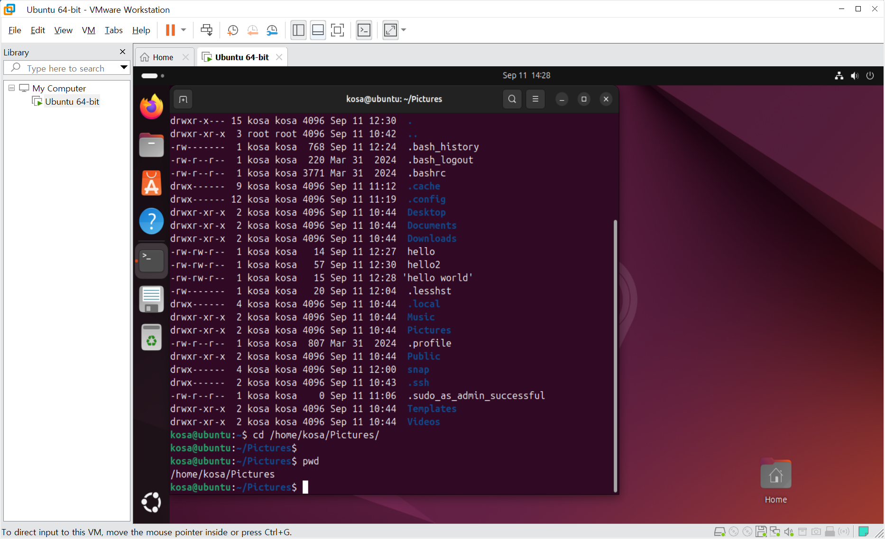
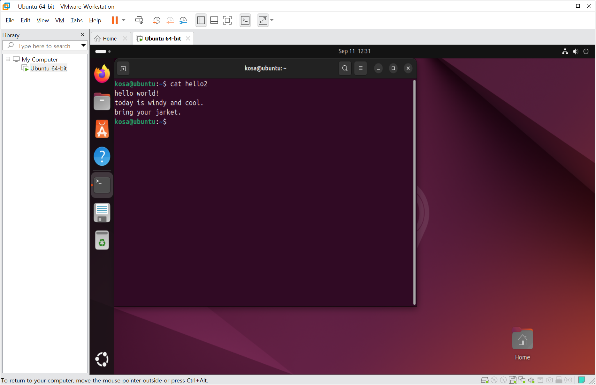
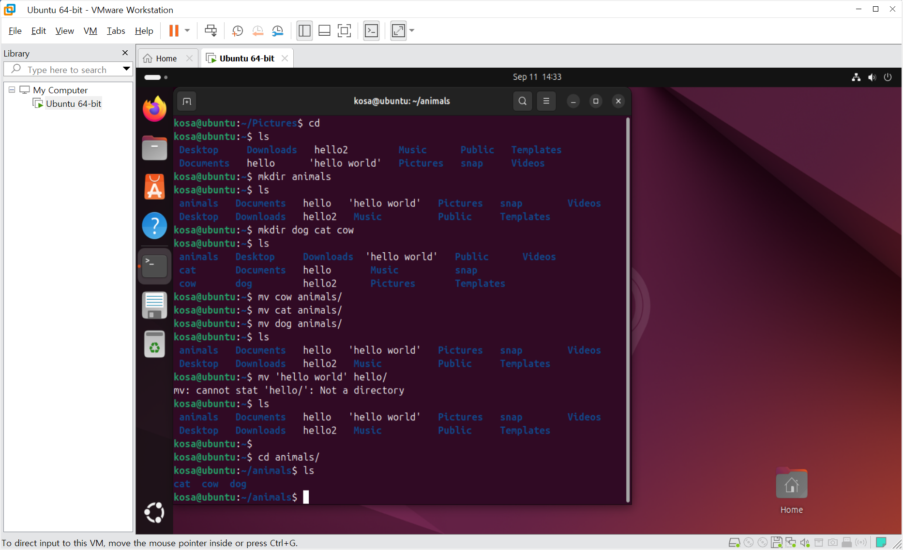

# DAY 42 — 리눅스 기초와 파일·디렉터리 구조

> 2026-09-11 · 교안 1~4장: 운영체제와 리눅스, 가상 머신, 셸 개념, 파일 시스템

이번 기록은 리눅스 입문 교안의 **1장부터 4장까지** 학습한 내용을 정리한다. 3장의 터미널,
셸, 셸 스크립트는 개념을 이해하는 데 집중했으며 **3장의 셸 관련 실습은 진행하지 않았다.**
4장에서는 제공된 화면을 바탕으로 파일과 디렉터리의 구조를 확인하고 경로 이동, 내용 확인,
디렉터리 생성·이동 명령을 정리했다.

## 학습 범위

| 장 | 학습 내용 | 정리 방식 |
| --- | --- | --- |
| 1장 | 운영체제의 역할, 리눅스와 배포판, 활용 분야 | 이론 학습 |
| 2장 | 리눅스 실습 환경 구축 방법, 가상 머신과 Ubuntu | 환경 구성 이해 |
| 3장 | 터미널과 셸, 셸 스크립트, 기본 명령어의 개념 | 개념 학습만 진행(실습 없음) |
| 4장 | 파일 시스템, 파일 계층 구조, 디렉터리와 경로 | 파일·디렉터리 명령 확인 |

## 1. 운영체제와 리눅스

운영체제는 사용자와 하드웨어 사이에서 프로그램이 실행될 수 있도록 자원을 관리하는 시스템
소프트웨어다. Windows는 그래픽 화면을 중심으로 사용할 수 있고, Linux는 그래픽 환경뿐 아니라
명령 기반 환경을 함께 활용한다.

운영체제의 주요 구성 요소를 다음과 같이 정리했다.

- **커널**: CPU, 메모리와 장치 같은 핵심 자원을 관리한다.
- **장치 드라이버**: 운영체제와 하드웨어가 서로 통신하도록 돕는다.
- **파일과 파일 시스템**: 데이터를 저장하고 디렉터리 구조로 관리한다.
- **네트워크 시스템**: 네트워크 장치와 통신 규칙을 관리한다.

운영체제는 프로그램을 메모리에 올려 실행하고, 여러 프로세스에 CPU 사용 순서를 배분한다.
멀티태스킹, 인터럽트 처리, 메모리 할당과 회수도 운영체제가 담당한다.

Linux는 공개된 소스 코드를 바탕으로 다양한 배포판이 만들어진다. Red Hat 계열과 Ubuntu처럼
목적과 관리 방식이 다른 배포판을 선택할 수 있으며 서버, 클라우드, 임베디드 기기와 모바일 등
여러 환경에서 사용된다.

## 2. 가상 머신으로 리눅스 환경 만들기

리눅스를 학습하는 환경은 PC에 직접 설치하거나, 가상 머신을 사용하거나, 클라우드의 Linux
인스턴스를 이용하는 방식으로 구성할 수 있다. 이번 교안에서는 VMware에 Ubuntu를 설치해 기존
운영체제 안에서 별도의 Linux 컴퓨터처럼 사용하는 흐름을 살펴봤다.

가상 머신은 실습 환경을 분리할 수 있어 설정을 바꾸거나 오류가 발생해도 주 운영체제에 미치는
영향이 작다는 장점이 있다. 반면 가상 머신에 CPU와 메모리를 나누어 주므로 PC 자원도 함께
고려해야 한다.

## 3. 터미널과 셸 — 개념 학습

터미널은 사용자가 텍스트로 명령을 입력하고 결과를 확인하는 창이며, 셸은 입력된 명령을 해석해
운영체제에 전달하는 프로그램이다. Bash처럼 종류가 다른 셸이 존재하고, 반복해서 실행할 명령을
파일에 모아 둔 것을 셸 스크립트라고 한다.

> **학습 범위 안내:** 셸과 셸 스크립트의 의미는 교안으로 학습했지만, 3장 범위의 셸 관련 명령이나
> 셸 스크립트를 직접 작성·실행한 실습으로 기록하지 않는다.

## 4. 파일 시스템과 디렉터리

Linux에서는 일반 데이터뿐 아니라 장치와 시스템 정보도 파일 형태로 다루는 경우가 많다.
최상위 디렉터리 `/`에서 여러 디렉터리가 가지처럼 이어지고, `/proc`과 `/sys`에서는 실행 중인
프로세스나 커널·장치와 관련된 정보를 확인할 수 있다.

사용자가 로그인했을 때 주로 작업하는 위치는 홈 디렉터리다. `pwd`는 현재 위치를 보여 주며,
화면에서는 `/home/kosa`가 현재 작업 디렉터리로 출력됐다.

### 절대 경로와 상대 경로

- **절대 경로**는 `/`에서 시작하며 어느 위치에서 실행해도 같은 대상을 가리킨다.
- **상대 경로**는 현재 작업 디렉터리를 기준으로 대상을 찾는다.
- `.`은 현재 디렉터리, `..`은 상위 디렉터리를 뜻한다.

`cd /home/kosa/Pictures`처럼 루트에서 시작하는 전체 경로를 사용해 작업 위치를 바꾸고 `pwd`로
이동 결과를 확인했다.

### 파일과 디렉터리 명령 정리

| 명령 | 역할 | 확인한 내용 |
| --- | --- | --- |
| `pwd` | 현재 작업 디렉터리 출력 | 홈 디렉터리와 이동한 경로 확인 |
| `cd` | 작업 디렉터리 변경 | 절대 경로를 이용해 디렉터리 이동 |
| `ls`, `ls -al` | 파일과 디렉터리 목록 출력 | 숨김 항목과 상세 정보까지 확인 |
| `cat` | 텍스트 파일 내용 출력 | 파일의 여러 줄 내용을 터미널에서 확인 |
| `mkdir` | 새 디렉터리 생성 | `animals`, `dog`, `cat`, `cow` 디렉터리 생성 |
| `mv` | 파일·디렉터리 이동 또는 이름 변경 | 생성한 동물 디렉터리를 `animals` 아래로 이동 |

`cat`으로 텍스트 파일을 열면 별도의 편집기를 실행하지 않고도 저장된 내용을 바로 확인할 수
있다.

여러 디렉터리를 만든 뒤 `mv dog animals`와 같은 방식으로 하위 디렉터리로 이동했다. 화면에 나온
`Not a directory` 오류는 이동 대상인 `hello`가 디렉터리가 아니어서 발생한 것으로, 명령을 실행하기
전에 대상의 종류를 확인해야 한다는 점도 배웠다.

## 오늘의 정리

Linux 명령을 외우기 전에 운영체제가 어떤 자원을 관리하고, Linux가 파일과 디렉터리를 어떤
계층으로 구성하는지 먼저 이해했다. 터미널과 셸은 같은 개념이 아니며, 셸이 명령을 해석하는
프로그램이라는 점도 구분했다. 다음에는 셸 스크립트를 실제로 작성할 때 오늘 정리한 기본 명령과
경로 개념을 연결해 볼 수 있을 것 같다.
