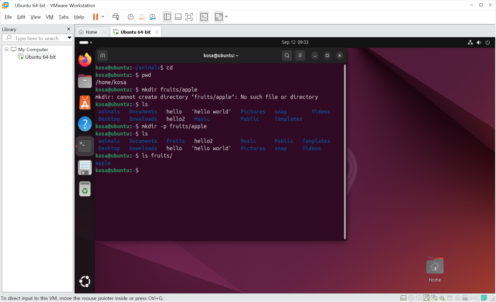
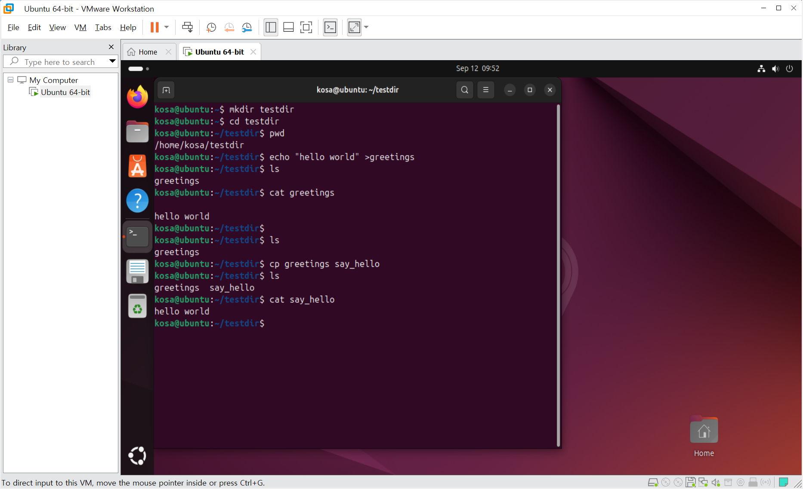
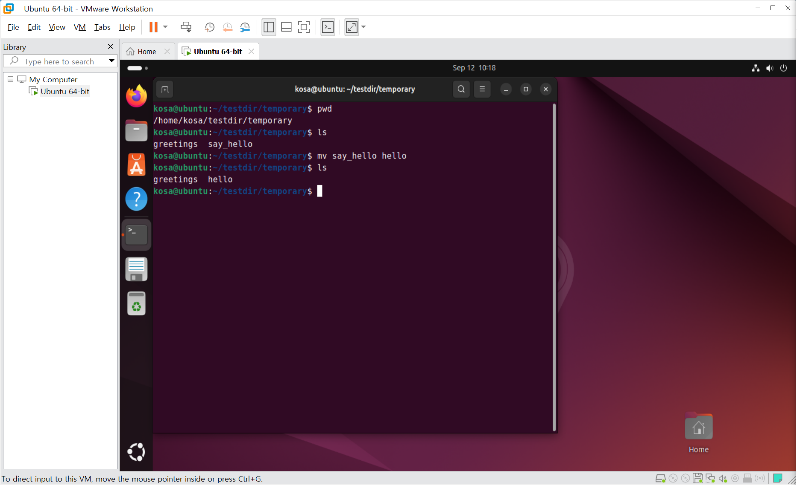
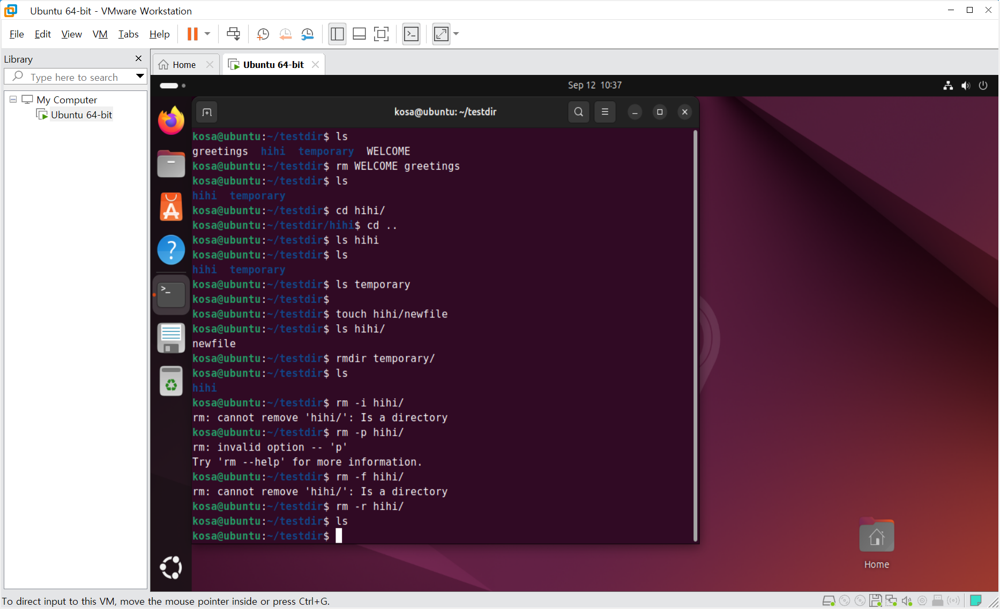
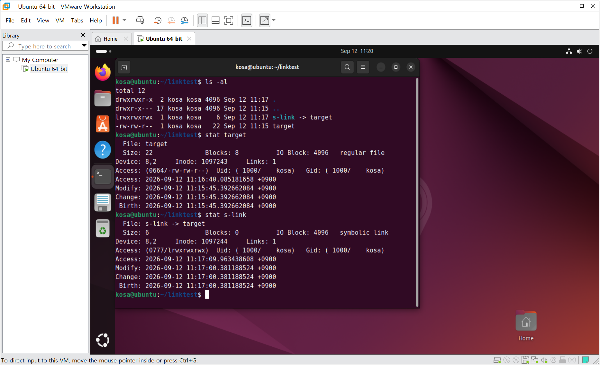
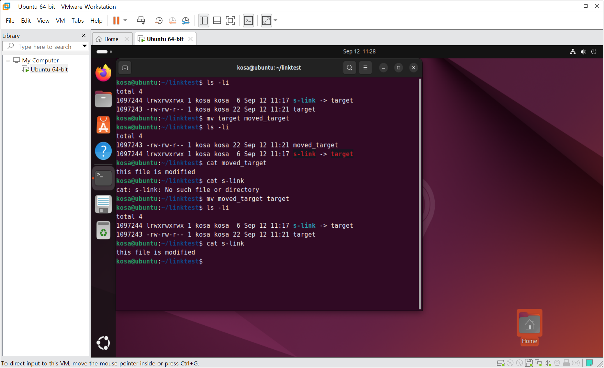
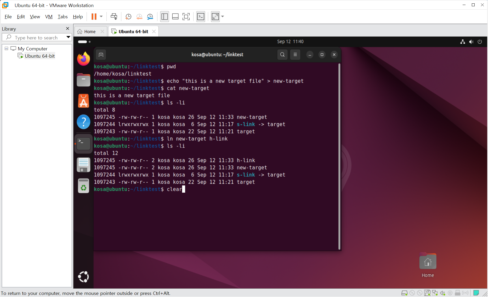
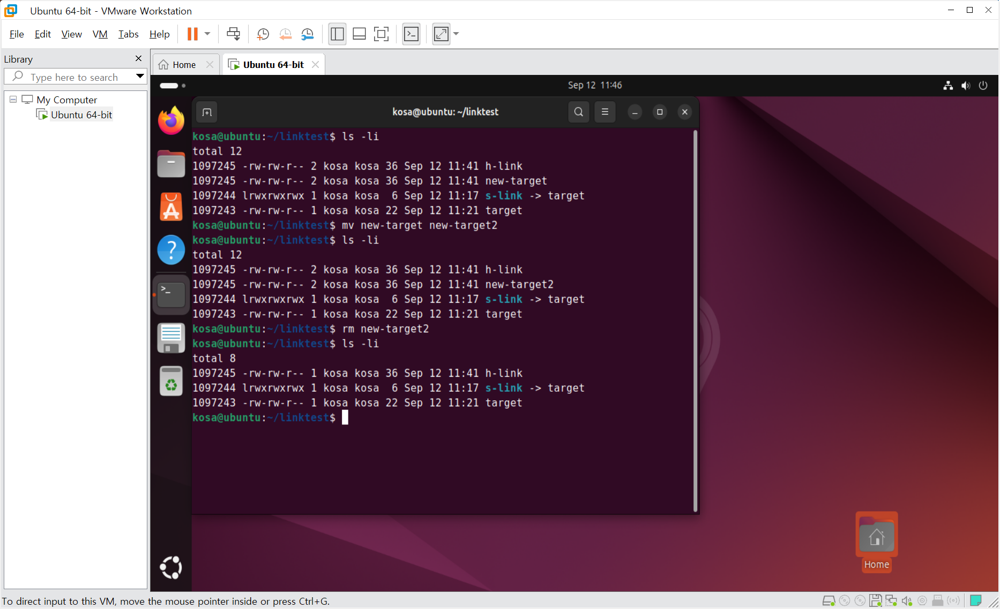
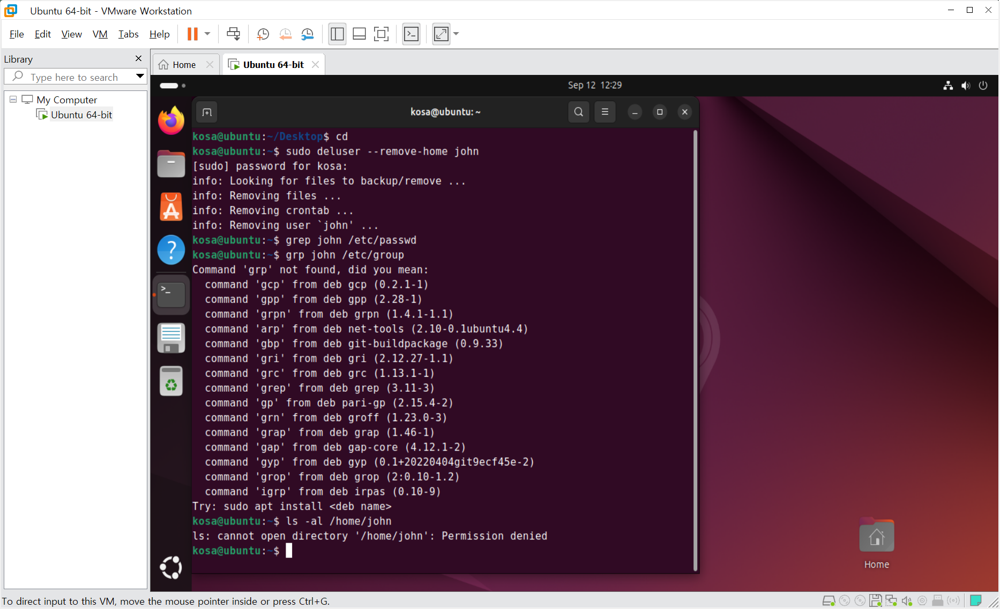

# DAY 43 — 리눅스 파일·링크, 사용자와 권한

> 2026-09-12 · 교안 4~6장: 파일과 디렉터리, 사용자와 그룹, 소유권과 권한

오늘은 리눅스 입문 교안의 **4장부터 6장까지** 학습했다. 파일과 디렉터리를 만들고 복사·이동·삭제한
뒤 소프트 링크와 하드 링크의 차이를 실습으로 확인했다. 사용자 정보와 그룹 파일의 구조를 살펴보고
사용자를 추가·삭제하는 과정도 진행했다. 6장의 소유권과 권한은 교안 내용을 중심으로 정리했으며,
제공된 기록에는 `chown`·`chmod` 실행 결과가 없어 해당 명령을 직접 실습했다고 기록하지 않았다.

## 학습 범위

| 장 | 주요 내용 | 학습 기록 |
| --- | --- | --- |
| 4장 | 파일 시스템, 디렉터리, 복사·이동·삭제, 소프트·하드 링크 | 명령 실습 |
| 5장 | root·시스템·일반 사용자, 사용자 그룹, 사용자 추가·삭제 | 개념 및 명령 실습 |
| 6장 | 소유권, 파일 권한, 디렉터리 권한 | 교안 개념 정리 |

## 1. 파일과 디렉터리 다루기

`mkdir`는 디렉터리를 생성한다. 상위 디렉터리가 없는 상태에서 `mkdir fruits/apple`을 실행하면
실패하지만, `-p` 옵션을 사용하면 필요한 상위 디렉터리까지 함께 만들 수 있다.

```bash
mkdir -p fruits/apple
```



### 자주 사용한 명령

| 명령 | 역할 | 실습에서 확인한 내용 |
| --- | --- | --- |
| `mkdir`, `mkdir -p` | 디렉터리 생성 | 단일·중첩 디렉터리 생성 |
| `rmdir`, `rmdir -p` | 빈 디렉터리 삭제 | 빈 하위 디렉터리와 상위 경로 삭제 |
| `touch` | 빈 파일 생성·시간 정보 갱신 | 디렉터리 안에 `newfile` 생성 |
| `cp` | 파일 복사 | `greetings`를 `say_hello`로 복사 |
| `mv` | 위치 이동·이름 변경 | `say_hello`를 `hello`로 변경 |
| `rm -i` | 확인 후 파일 삭제 | 삭제 여부를 묻는 대화형 삭제 |
| `rm -r` | 하위 항목을 포함해 삭제 | 파일이 든 디렉터리 재귀 삭제 |

`echo`와 출력 리다이렉션 `>`으로 파일을 만든 뒤 `cp`로 복사하고, 두 파일에서 같은 내용이
출력되는지 확인했다.



TXT에서 빠져 있던 08번 기록은 이미지의 명령과 결과를 읽어 다음과 같이 복원했다.

```text
kosa@ubuntu:~/testdir/temporary$ pwd
/home/kosa/testdir/temporary
kosa@ubuntu:~/testdir/temporary$ ls
greetings  say_hello
kosa@ubuntu:~/testdir/temporary$ mv say_hello hello
kosa@ubuntu:~/testdir/temporary$ ls
greetings  hello
```



일반 파일을 대상으로 사용하는 `rm`만으로는 디렉터리를 지울 수 없었다. 파일이 들어 있는
디렉터리는 `rm -r`로 하위 항목까지 재귀적으로 삭제할 수 있으므로, 경로를 다시 확인한 뒤
사용해야 한다.



## 2. 아이노드와 링크

아이노드는 파일의 종류, 크기, 소유권, 권한과 데이터 블록 위치 같은 메타데이터를 저장한다.
덴트리는 파일 이름과 경로를 아이노드에 연결한다. `ls -li`와 `stat`으로 아이노드 번호와 링크
수를 확인하며 소프트 링크와 하드 링크의 구조를 비교했다.

### 소프트 링크

`ln -s target s-link`로 만든 소프트 링크는 대상 파일의 **경로**를 저장하며 별도의 아이노드를
가진다. 링크를 통해 내용을 읽을 수 있지만 대상 파일을 다른 이름으로 옮기면 기존 경로를 찾지
못해 깨진 링크가 된다. 대상 파일을 원래 이름으로 되돌리자 링크도 다시 동작했다.





### 하드 링크

`ln new-target h-link`로 만든 하드 링크는 원본과 **같은 아이노드와 데이터**를 공유한다. 한쪽에서
내용을 바꾸면 다른 이름으로도 변경된 내용이 보이고, 원본 이름을 바꾸거나 삭제해도 남은 하드
링크를 통해 데이터에 접근할 수 있다. `ls -li`에서 두 파일의 아이노드 번호가 같고 링크 수가
2로 증가한 것으로 확인했다.





| 구분 | 소프트 링크 | 하드 링크 |
| --- | --- | --- |
| 저장하는 것 | 대상 파일의 경로 | 대상과 동일한 아이노드 연결 |
| 아이노드 | 대상과 다름 | 대상과 같음 |
| 대상 이동·삭제 | 링크가 깨질 수 있음 | 다른 링크가 있으면 데이터 유지 |
| 디렉터리·다른 파일 시스템 | 연결 가능 | 일반적으로 제한됨 |

## 3. 사용자와 사용자 그룹

Linux 사용자는 모든 권한을 가진 `root` 사용자, 서비스 실행을 위해 시스템이 만든 사용자,
사람이 로그인해 사용하는 일반 사용자로 나눌 수 있다. 관리자 권한이 필요한 한 번의 명령은
`sudo`를 붙여 실행할 수 있다.

- `/etc/passwd`: 사용자 이름, UID, 기본 그룹 GID, 홈 디렉터리, 로그인 셸 등 사용자 정보
- `/etc/group`: 그룹 이름, GID와 그룹에 포함된 사용자 정보

실제 비밀번호는 `/etc/passwd`에 평문으로 저장되지 않고 별도의 보호된 파일에서 해시 형태로
관리된다.

### 사용자 추가와 삭제

`sudo adduser john`으로 사용자와 기본 그룹, 홈 디렉터리를 만들었다. 새 사용자가
`/etc/passwd`에 추가된 것을 확인했으며, 이미지에만 있던 25번 결과도 TXT에 복원했다.

```text
kosa:x:1000:1000:kosa:/home/kosa:/bin/bash
john:x:1001:1001:,,,:/home/john:/bin/bash
```


사용자 실습을 마친 뒤 `sudo deluser --remove-home john`으로 계정과 홈 디렉터리를 제거했다.
`grep john /etc/passwd`에서 결과가 나오지 않는지 확인해 사용자 항목이 삭제된 것을 점검했다.



## 4. 소유권과 권한

파일과 디렉터리는 소유 사용자와 소유 그룹을 가진다. `chown`은 소유권을 변경하고, `chmod`는
소유자(user), 그룹(group), 그 밖의 사용자(other)에게 적용할 읽기·쓰기·실행 권한을 변경한다.

| 권한 | 파일에서의 의미 | 디렉터리에서의 의미 |
| --- | --- | --- |
| `r` | 내용 읽기 | 목록 읽기 |
| `w` | 내용 변경 | 항목 생성·삭제·이름 변경 |
| `x` | 파일 실행 | 디렉터리 진입과 내부 항목 접근 |

권한은 `rwx` 문자를 이용한 의미 표기법과 `r=4`, `w=2`, `x=1`을 더하는 8진수 표기법으로 나타낼
수 있다. 예를 들어 `755`는 소유자에게 읽기·쓰기·실행을, 그룹과 다른 사용자에게 읽기·실행을
허용한다. 디렉터리의 쓰기 권한은 내부 항목에 접근할 수 있는 실행 권한과 함께 사용될 때 의미가
있다는 점도 구분했다.

> 6장의 `chown`·`chmod`와 권한 변경 과정은 이번 교안의 학습 범위에는 포함되지만, 제공된 TXT와
> 이미지에 실행 기록이 없으므로 개념 학습으로만 정리했다.

## 누락 기록 보완

- 08번: `mv say_hello hello` 명령과 변경된 파일 목록 추가
- 25번: `cat /etc/passwd`에서 `john` 계정이 생성된 결과 추가
- 26번: Ubuntu 로그인 화면에서 새 계정이 표시된 결과 설명 보완
- `.`은 현재 디렉터리, `..`은 상위 디렉터리로 잘못 적힌 순서 수정
- `덴드리`, `결로` 오타를 `덴트리`, `경로`로 수정

보완한 전체 명령 기록은 [notes.txt](./notes.txt)에서 확인할 수 있다.

## 오늘의 정리

파일 이름과 데이터가 항상 같은 개념은 아니라는 점을 링크 실습으로 확인했다. 특히 소프트 링크는
경로에 의존하지만 하드 링크는 아이노드를 공유한다. 사용자와 그룹, 소유권과 권한은 여러 사용자가
같은 시스템을 안전하게 사용하도록 범위를 나누는 장치라는 흐름으로 이해할 수 있었다.
