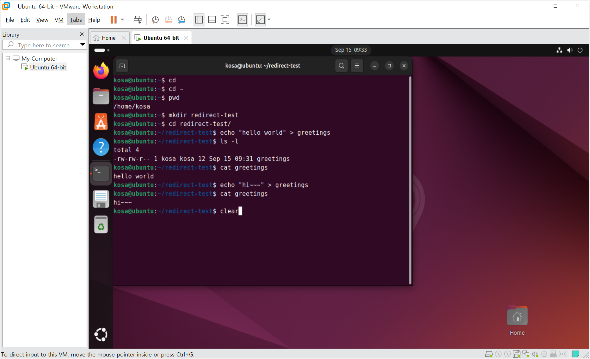
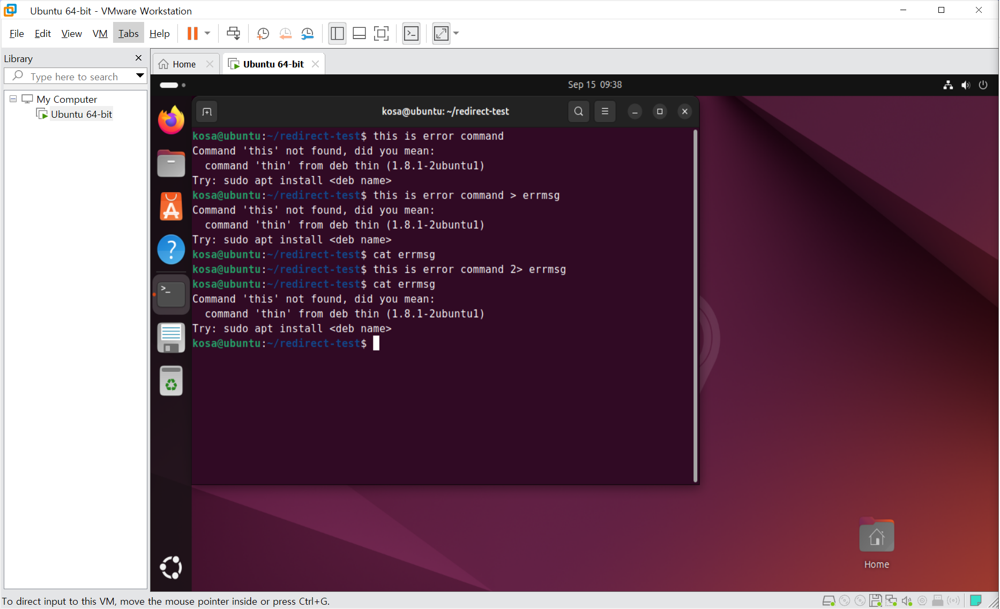
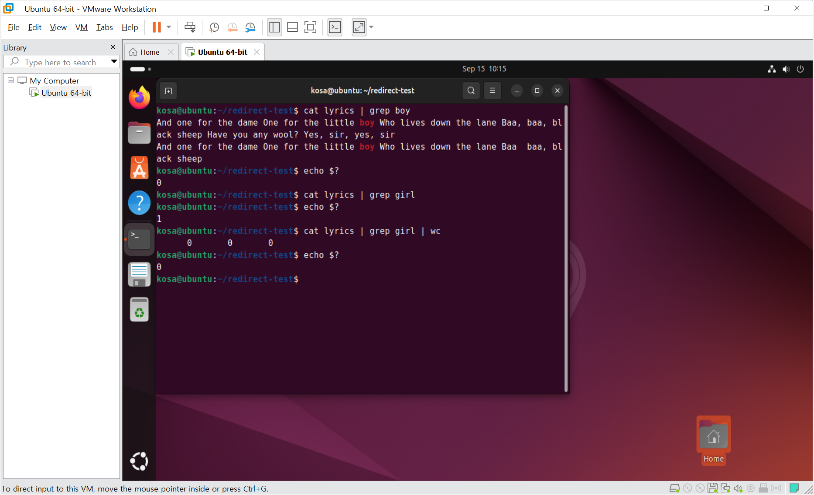
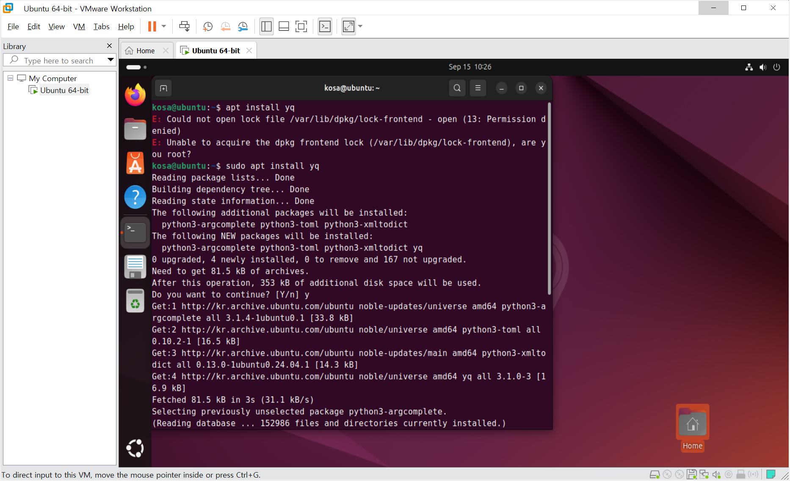
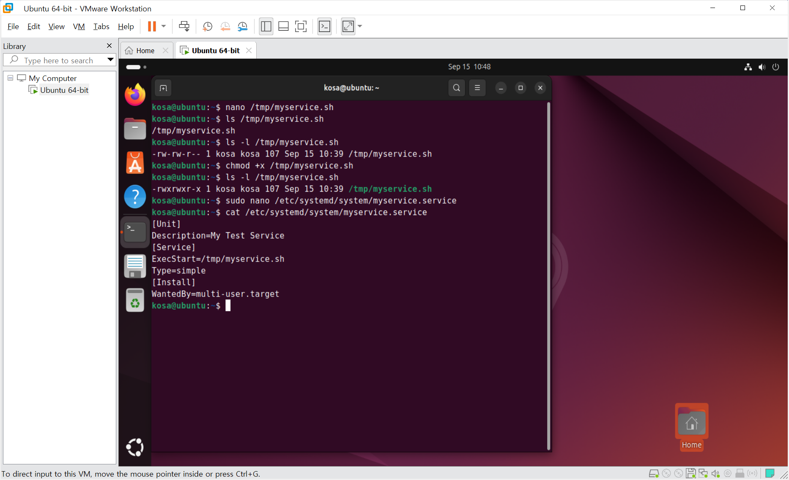
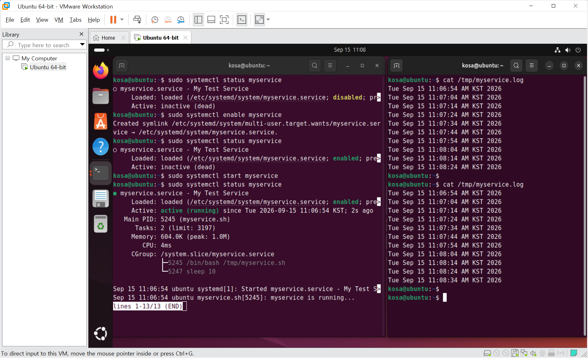
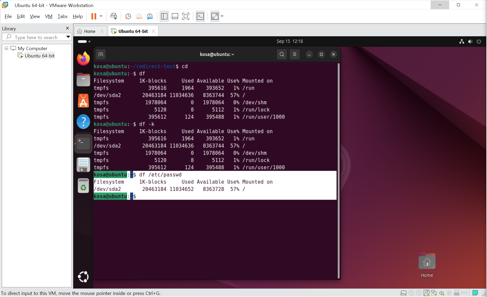
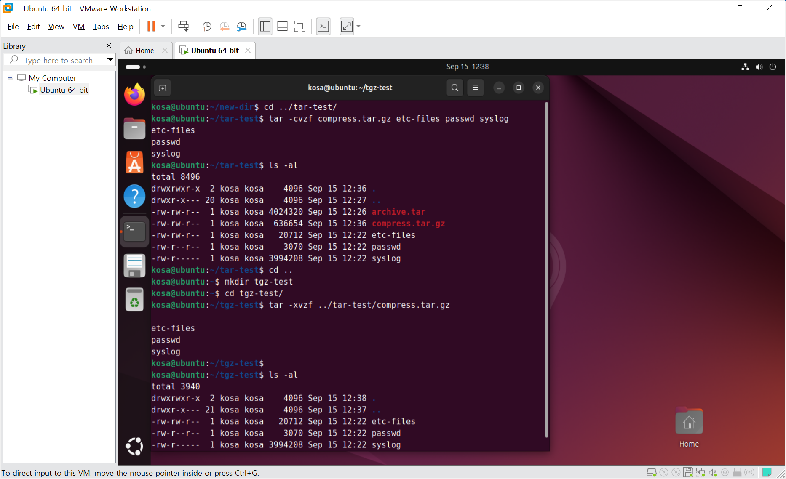

# DAY 45 — 리눅스 리디렉션·파이프라인과 시스템 관리

> 2026-09-15 · 표준 입출력, APT, systemd, 검색·디스크·tar

오늘은 명령의 입력과 출력을 파일로 연결하는 리디렉션과 여러 명령을 이어 주는 파이프라인을
실습했다. 이어서 APT로 패키지를 관리하고 systemd 서비스를 직접 등록·실행했으며,
문자열 검색과 디스크 사용량 확인, tar 아카이브 생성·압축·복원 방법까지 학습했다.

## 1. 표준 입출력과 리디렉션

Linux 명령은 기본적으로 표준 입력, 표준 출력, 표준 오류라는 세 가지 통로를 사용한다.

| 구분 | 파일 디스크립터 | 의미 |
| --- | ---: | --- |
| 표준 입력(stdin) | `0` | 키보드나 파일에서 명령으로 들어오는 입력 |
| 표준 출력(stdout) | `1` | 명령이 정상적으로 출력하는 결과 |
| 표준 오류(stderr) | `2` | 명령 실행 중 발생한 오류 메시지 |

- `>`: 표준 출력을 파일에 새로 기록한다. 기존 내용은 덮어쓴다.
- `>>`: 표준 출력을 기존 파일의 마지막에 이어 쓴다.
- `<`: 파일의 내용을 명령의 표준 입력으로 전달한다.
- `2>`: 표준 오류만 별도의 파일로 보낸다.

```bash
echo "first line" > result.txt
echo "second line" >> result.txt
sort < result.txt
ping -c 1 example.invalid > ping.out 2> ping.err
```





## 2. 파이프라인과 종료 상태

파이프(`|`)는 앞 명령의 표준 출력을 다음 명령의 표준 입력으로 전달한다. 중간 파일 없이
검색·정렬·집계 명령을 조합할 수 있다는 점이 핵심이다.

```bash
cat lyrics.txt | grep -i "boy"
cat lyrics.txt | grep -i "boy" | wc -l
echo $?
```

`$?`에는 직전에 실행한 명령의 종료 상태가 저장된다. 일반적으로 `0`은 성공이고 0이 아닌 값은
실패 또는 별도의 상태를 뜻한다. 파이프라인에서는 기본적으로 마지막 명령의 종료 상태를
확인하므로, 앞 명령의 실패까지 판단하려면 이 점을 함께 고려해야 한다.



## 3. APT 패키지 관리

Ubuntu 계열에서는 APT로 패키지 목록을 갱신하고 프로그램을 설치·제거할 수 있다.

```bash
apt list --upgradable
sudo apt update
sudo apt install <package>
sudo apt remove <package>
sudo apt autoremove
```

`apt update`는 설치 가능한 패키지의 목록을 갱신하고, `apt install`은 지정한 패키지와 필요한
의존성을 설치한다. 시스템 변경이 포함되므로 필요한 명령에만 `sudo`를 사용해야 한다.



## 4. systemd 서비스 만들기

systemd는 Linux 부팅 과정과 백그라운드 서비스를 관리한다. 서비스의 실행 방법과 시작 조건은
unit 파일에 정의한다.

```ini
[Unit]
Description=My Test Service

[Service]
ExecStart=/tmp/myservice.sh
Type=simple

[Install]
WantedBy=multi-user.target
```

```bash
sudo systemctl enable myservice.service
sudo systemctl start myservice.service
sudo systemctl status myservice.service
sudo systemctl stop myservice.service
sudo systemctl disable myservice.service
```

`enable`은 부팅 시 자동 시작을 설정하고, `start`는 현재 서비스의 실행을 시작한다. 설정을
수정했다면 systemd가 변경 사항을 다시 읽도록 한 뒤 상태와 로그를 확인하는 습관이 중요하다.





## 5. `.bashrc`와 별칭

사용자 홈의 `.bashrc`에는 Bash를 시작할 때 적용할 설정과 별칭을 작성할 수 있다. 파일을 수정한
뒤에는 새 셸을 열거나 `source ~/.bashrc`를 실행해 현재 셸에 다시 반영한다.

```bash
alias rm='rm -i'
source ~/.bashrc
```

별칭은 반복 명령을 줄여 주지만, 기존 명령의 동작을 바꿀 수 있으므로 이름과 옵션을 확인하고
사용해야 한다.

## 6. 문자열·파일 검색과 개수 세기

| 명령 | 역할 | 예시 |
| --- | --- | --- |
| `grep` | 파일 내용에서 문자열 검색 | `grep -in "error" app.log` |
| `find` | 지정한 경로에서 파일·디렉터리 검색 | `find . -name "*.txt"` |
| `wc -l` | 줄 수 확인 | `wc -l notes.txt` |
| `wc -w` | 단어 수 확인 | `wc -w notes.txt` |
| `wc -c` | 바이트 수 확인 | `wc -c notes.txt` |

`grep -i`는 대소문자를 구분하지 않고 검색하며, `grep -n`은 일치한 줄 번호를 함께 보여 준다.

## 7. 디스크 사용량 확인과 tar 아카이브

`df`는 파일 시스템 단위의 전체·사용·남은 공간을 확인하고, `du`는 특정 파일이나 디렉터리가
사용하는 공간을 확인한다. `-h` 옵션을 사용하면 사람이 읽기 쉬운 단위로 표시된다.

```bash
df -h
df -T
du -h ./target
```



tar는 여러 파일을 하나의 아카이브로 묶거나 다시 풀 때 사용한다. `z` 옵션을 더하면 gzip으로
압축하거나 압축을 해제할 수 있다.

```bash
tar -cf files.tar file1.txt file2.txt
tar -tf files.tar
tar -rf files.tar file3.txt
tar -xf files.tar
tar -czf files.tar.gz file1.txt file2.txt
tar -xzf files.tar.gz
```



## 오늘의 정리

- 리디렉션은 표준 출력과 표준 오류를 원하는 파일로 분리해 저장할 수 있다.
- 파이프라인은 작은 명령을 연결해 검색과 집계를 효율적으로 수행한다.
- APT와 systemd는 패키지와 서비스를 관리하므로 관리자 권한을 신중하게 사용해야 한다.
- `grep`·`find`·`wc`, `df`·`du`, tar를 조합하면 파일 검색과 시스템 점검, 백업 작업을 수행할 수 있다.
- `>`는 기존 파일을 덮어쓰므로 실행 전 대상 경로를 반드시 확인한다.

> 공개 자료에는 수업 PDF를 포함하지 않았으며, 개인 정보나 인증 정보가 노출될 수 있는 화면은
> 제외하고 학습 내용을 확인하는 데 필요한 안전한 실습 화면만 선별했다.
