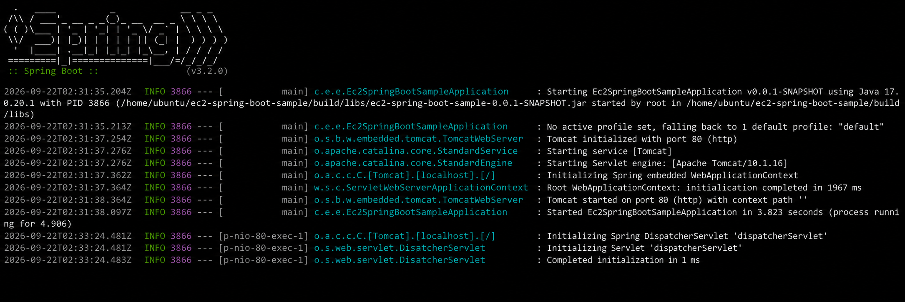

# DAY 51 — AWS EC2에 Spring Boot 애플리케이션 배포하기

> 2026-09-22 · 클라우드 컴퓨팅, AWS, EC2, 보안 그룹, Ubuntu, Java 17, Gradle, Spring Boot 배포

오늘은 클라우드 컴퓨팅과 AWS의 주요 서비스를 살펴보고, EC2 인스턴스를 만들어 Spring Boot
애플리케이션을 실행하는 배포 과정을 실습했다. 보안 그룹에서 접속 포트를 구분하고 Ubuntu
서버에 Java 17을 준비한 뒤, Gradle로 만든 JAR 파일을 실행해 외부 요청이 서버까지 도달하는지
확인했다. 실습을 마친 뒤에는 비용이 계속 발생하지 않도록 인스턴스를 종료했다.

## 1. 클라우드 컴퓨팅과 AWS

클라우드 컴퓨팅은 서버, 스토리지와 데이터베이스 같은 컴퓨팅 자원을 직접 구매하지 않고
필요한 만큼 원격으로 빌려 사용하는 방식이다. AWS에서는 목적에 따라 여러 서비스를 조합할
수 있다.

| 서비스 | 역할 |
| --- | --- |
| EC2 | 가상 서버를 생성하고 실행 |
| Route 53 | 도메인 이름과 DNS 관리 |
| Elastic Load Balancing | 여러 서버로 요청 분산 |
| RDS | 관계형 데이터베이스 운영 |
| S3 | 파일을 객체 형태로 저장 |
| CloudFront | 콘텐츠를 가까운 위치에서 빠르게 전달 |

## 2. 리전과 EC2 인스턴스

AWS 리전은 여러 데이터센터가 모인 물리적 지역이다. 리전마다 자원이 따로 관리되므로 사용자가
가까운 위치, 필요한 서비스의 제공 여부와 운영 요구사항을 고려해 선택한다.

EC2는 클라우드에서 가상 컴퓨터를 빌려 사용하는 서비스다. 실습에서는 운영체제 이미지와
인스턴스 유형을 선택해 Ubuntu 서버를 만들고, 인스턴스의 시작·중지·재시작·종료 상태를
확인했다.

## 3. 보안 그룹과 네트워크 포트

보안 그룹은 EC2 인스턴스에 적용하는 가상 방화벽이다. 인바운드 규칙은 외부에서 서버로
들어오는 트래픽을, 아웃바운드 규칙은 서버에서 외부로 나가는 트래픽을 제어한다.

| 포트 | 용도 | 공개 범위 |
| ---: | --- | --- |
| 22 | SSH 원격 접속 | 실습자 IP처럼 필요한 범위로 제한 |
| 80 | HTTP 웹 요청 | 웹 서비스를 공개할 대상에 맞게 설정 |
| 443 | HTTPS 암호화 웹 요청 | HTTPS 서비스를 공개할 대상에 맞게 설정 |

모든 포트를 무조건 열기보다 애플리케이션에 필요한 포트만 허용하고, 관리용 SSH는 가능한 한
접속 범위를 좁혀야 한다.

## 4. EC2 서버 접속과 Java 환경 구성

브라우저 기반 EC2 Instance Connect로 Ubuntu 서버에 접속한 뒤 패키지 목록을 갱신하고 Java
17을 설치했다. 설치 후 버전을 확인해 Spring Boot 애플리케이션을 실행할 준비가 되었는지
검증했다.

```bash
sudo apt update
sudo apt install openjdk-17-jdk -y
java -version
```

## 5. Spring Boot 프로젝트 빌드

서버에서 실습 프로젝트를 내려받고 Gradle Wrapper로 테스트와 빌드를 실행했다. `clean`은 이전
빌드 결과를 정리하고, `build`는 소스 컴파일과 테스트를 수행한 뒤 실행 가능한 JAR 파일을
`build/libs` 폴더에 만든다.

```bash
git clone <repository-url>
cd <project-directory>
chmod +x gradlew
./gradlew clean build
ls build/libs
```

실행할 때는 폴더 이름이 아니라 실제로 생성된 `.jar` 파일명을 정확히 입력해야 한다. 실습 중
`Unable to access jarfile` 오류를 확인하고 `build/libs`의 파일명을 다시 확인해 해결했다.

## 6. 포트 설정과 애플리케이션 실행

외부 HTTP 요청을 받을 수 있도록 실습용 설정에서 서버 포트를 80으로 변경했다.

```yaml
server:
  port: 80
```

빌드된 JAR 파일을 실행한 뒤 로그에서 내장 Tomcat이 80번 포트로 시작되고 Spring Boot
애플리케이션이 정상 기동한 것을 확인했다.

```bash
java -jar build/libs/<application-name>.jar
```



80번처럼 낮은 번호의 포트는 관리자 권한이 필요할 수 있다. 실제 운영 환경에서는
애플리케이션을 관리자 권한으로 직접 실행하기보다 별도의 서비스 계정과 리버스 프록시,
`systemd` 같은 프로세스 관리 도구를 사용하는 편이 안전하다.

## 7. 외부 접속 결과와 404의 의미

EC2의 공개 주소로 HTTP 요청을 보내 Spring Boot의 Whitelabel Error Page가 표시되는 것을
확인했다. 화면에는 404가 나타났지만 이는 서버 실행 실패가 아니라, 요청이 애플리케이션까지
도달했으나 `/` 경로를 처리하는 컨트롤러가 없다는 뜻이다.

```java
@RestController
public class HomeController {
    @GetMapping("/")
    public String home() {
        return "server is running";
    }
}
```

이처럼 서버 접속 여부와 애플리케이션의 URL 매핑 여부를 나누어 확인하면 배포 문제를 더
정확하게 진단할 수 있다.

## 8. 실습 자원 정리

EC2는 실행 시간과 연결된 자원에 따라 비용이 발생할 수 있다. 실습을 마친 뒤 인스턴스를
종료하고, 더 이상 사용하지 않는 탄력적 IP·볼륨·스냅샷과 보안 그룹이 남아 있지 않은지도
확인해야 한다. 단순 중지는 인스턴스를 삭제하는 것과 다르다는 점도 함께 익혔다.

## 오늘의 정리

- 클라우드 컴퓨팅과 AWS 리전, 주요 서비스의 역할을 구분했다.
- EC2 인스턴스의 생성·시작·중지·재시작·종료 흐름을 실습했다.
- 보안 그룹의 인바운드·아웃바운드 규칙과 22·80·443번 포트의 용도를 익혔다.
- Ubuntu에서 패키지를 갱신하고 OpenJDK 17을 설치했다.
- Gradle로 Spring Boot 프로젝트를 빌드하고 생성된 JAR 파일을 실행했다.
- 내장 Tomcat의 포트 80 기동 로그와 외부 HTTP 접속을 확인했다.
- 404 응답을 서버 접속 성공과 URL 매핑 부재로 나누어 해석했다.
- 실습 후 EC2와 관련 자원을 정리해 불필요한 비용을 방지했다.

> 교재 PDF 2개와 PPTX 2개, 원본 메모와 AWS 화면은 공개하지 않았다. 원본 화면에 표시된
> AWS 계정 번호·인스턴스 ID·공인/사설 IP·DNS·VPC·서브넷 정보도 모두 제외했다. 공개한
> 화면은 내장 이미지 편집 기능으로 Spring Boot 기동 로그 부분만 남긴 별도 사본이다.
