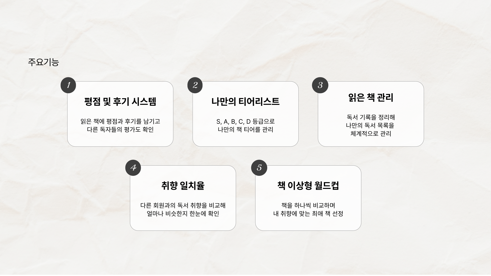
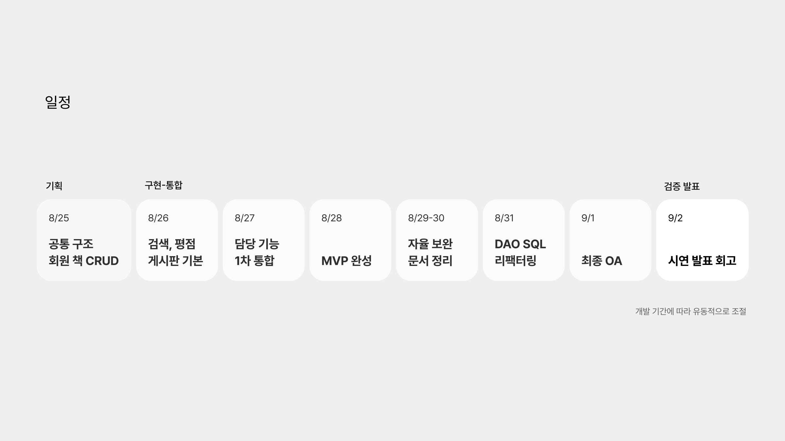
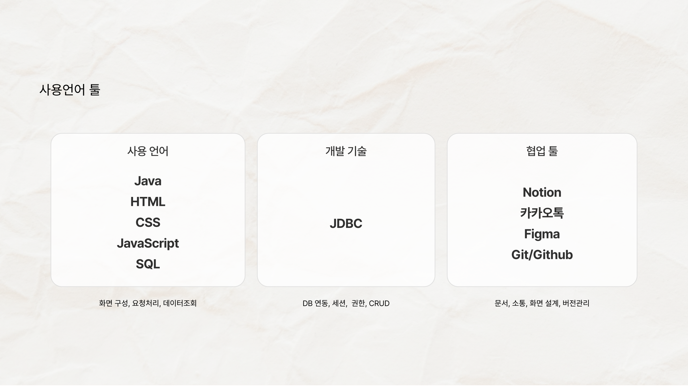
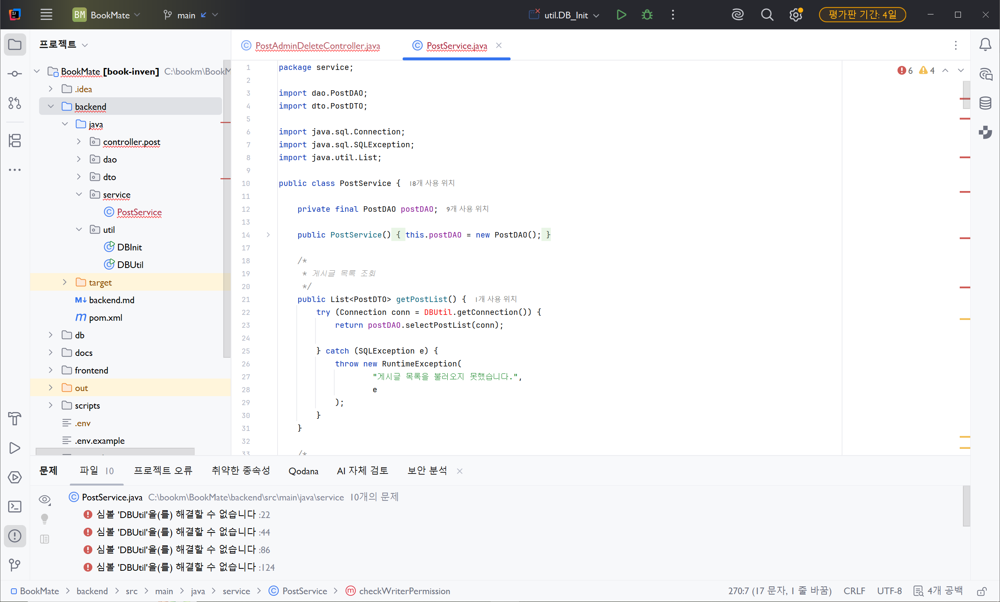
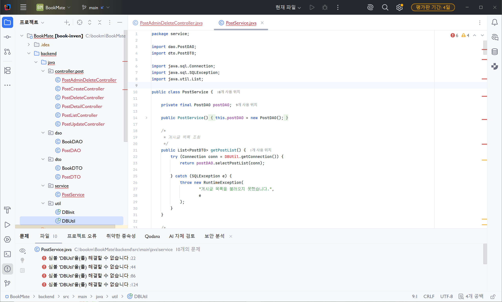
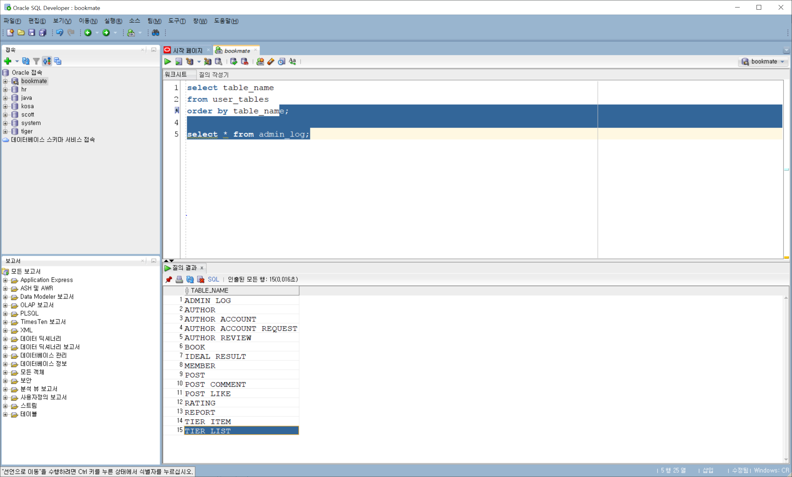

# DAY 27 — BookMate 미니프로젝트 기획과 요구사항 정의

> 2026-08-25 미니프로젝트 기록

Java·JDBC·Oracle·HTML·CSS·JavaScript를 연결하는 첫 번째 팀 미니프로젝트를 시작했다.
프로젝트 주제는 독자가 책을 평가하고 독서 취향을 나눌 수 있는 커뮤니티 **BookMate**다.

이번 작업에서는 **기획 발표 자료(PPT)와 제안서 구성**, **요구사항정의서 작성**을 주로
담당했다. 발표 자료에는 서비스가 해결하려는 문제, 핵심 기능, 역할 분담, 일정과 기술
스택을 한 흐름으로 정리했다. 요구사항정의서에서는 내가 맡은 커뮤니티·관리자·승인
영역을 기능 단위로 나누고 구현과 검증에 사용할 기준을 구체화했다.

## 프로젝트 목표

기존 서점의 판매량·전문가 추천 중심 탐색을 보완해, 사용자가 직접 남긴 평가와 취향을
바탕으로 새로운 책을 발견하고 비슷한 독서 취향의 사용자와 소통할 수 있는 서비스를
만드는 것이 목표다.

주요 기능은 다음과 같다.

- 읽은 책의 평점과 후기 등록
- S·A·B·C·D 등급으로 만드는 개인 티어리스트
- 읽은 책과 독서 기록 관리
- 회원 간 독서 취향 일치율 확인
- 책 이상형 월드컵

## 내가 맡은 작업

### 1. 기획 발표 자료와 제안서

발표자가 서비스의 필요성과 구현 범위를 쉽게 설명할 수 있도록 다음 순서로 자료를
구성했다.

1. 기존 서비스의 한계와 BookMate의 목표
2. 사용자가 경험할 핵심 기능 다섯 가지
3. 팀 역할과 공통 협업 원칙
4. 기획부터 통합·검증·발표까지의 일정
5. 사용 언어, JDBC와 협업 도구








### 2. 요구사항정의서

모호한 기능 설명이 구현 단계에서 서로 다르게 해석되지 않도록 각 요구사항에 아래
항목을 공통으로 적용했다.

- 요구사항 ID와 기능명
- 기능을 사용하는 사용자와 입력값
- 서버와 데이터베이스의 처리 내용
- 화면에 표시할 출력 결과
- 필수·중요·선택 우선순위
- 기능이 완성됐다고 판단할 완료 기준
- 진행 상태와 비고

내 담당 영역은 게시판·댓글·관리자·책 승인·작가 승인과 운영 권한이다. 공개 기록에는
팀원 이름을 제외하고 대표 요구사항만 요약했다.

| ID | 기능 | 핵심 처리 | 완료 기준 |
| --- | --- | --- | --- |
| POST-001 | 게시글 목록 | 삭제되지 않은 공개 게시글 조회 | 제목·작성자·작성일·조회수가 표시된다. |
| POST-003 | 게시판 페이징 | 전체 건수와 현재 페이지 범위 계산 | 첫·마지막 페이지의 이동이 정확하다. |
| POST-004 | 게시글 등록 | 필수값 검증 후 작성자와 함께 저장 | 로그인 회원의 글이 상세 화면에 표시된다. |
| POST-006 | 게시글 삭제 | 작성자 또는 관리자 권한 확인 | 권한이 없는 사용자의 요청은 차단된다. |
| POST-008 | 스포일러 보호 | 초기 본문을 숨기고 요청 시 공개 | 사용자 선택 전에는 본문이 노출되지 않는다. |
| COMMENT-001 | 댓글 등록 | 필수값 검증 후 댓글 저장 | 작성자와 작성일이 댓글 목록에 표시된다. |
| ADMIN-003 | 책 승인 | 대기 책을 승인 상태로 변경 | 승인 직후 일반 책 목록에서 조회된다. |
| ADMIN-001 | 관리자 접근 제한 | 로그인 세션의 관리자 권한 확인 | 일반 회원은 관리자 화면에 접근할 수 없다. |
| ADMIN-009 | 관리자 처리 내역 | 처리자·대상·유형·사유·일시 저장 | 관리자 작업 이력을 나중에 조회할 수 있다. |

## Java·JDBC 구조 확인

팀의 초기 백엔드는 요청을 받는 Controller, 비즈니스 흐름을 조정하는 Service,
SQL을 실행하는 DAO, 데이터를 전달하는 DTO와 DB 연결을 담당하는 util 패키지로
나누었다.

```text
Controller → Service → DAO → Oracle Database
                    ↘ DTO
              DBUtil → Connection
```

초기 통합 화면에서는 `DBUtil`을 찾지 못하는 오류가 보여, 소스 루트와 패키지 선언,
import, 빌드 설정을 함께 확인해야 한다는 점도 알게 됐다. 완성된 결과만 기록하는 것이
아니라 통합 중 발견한 문제와 다음 점검 항목을 남기는 것도 협업에 중요하다.





## Oracle 스키마 확인

Oracle에는 회원, 책·작가, 평가, 티어리스트, 이상형 월드컵, 게시판·댓글, 관리자 이력을
위한 15개 테이블이 구성되어 있었다. 요구사항 ID와 실제 테이블을 연결해 보면 문서의
기능이 어느 데이터에 의존하는지 더 명확하게 확인할 수 있다.

```text
MEMBER
AUTHOR · AUTHOR_ACCOUNT · AUTHOR_ACCOUNT_REQUEST · AUTHOR_REVIEW
BOOK · RATING
TIER_LIST · TIER_ITEM
IDEAL_RESULT
POST · POST_COMMENT · POST_LIKE
REPORT · ADMIN_LOG
```



## 회고

이번 작업을 통해 요구사항정의서는 단순한 기능 목록이 아니라 개발자와 기획자가 같은
완료 상태를 바라보게 만드는 기준이라는 점을 배웠다. 특히 입력값, 처리 내용과 완료
기준을 함께 적어 두면 Controller·Service·DAO와 SQL을 설계할 때 빠뜨릴 부분을 줄일 수
있다. 앞으로는 구현 결과와 요구사항 ID를 함께 연결해 진행 상태를 갱신할 계획이다.

> 원본 제안서와 요구사항정의서에는 팀원 식별 정보가 포함되어 있어 공개 저장소에는
> 포함하지 않았다. 이 페이지에는 공개 가능한 슬라이드와 익명화한 요구사항 요약만
> 사용했다.
