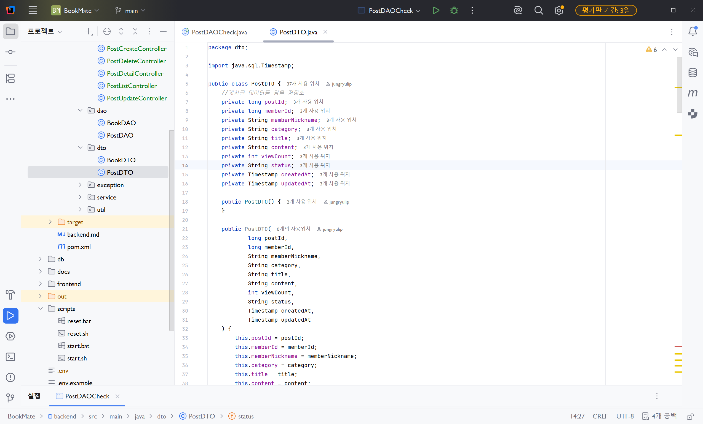
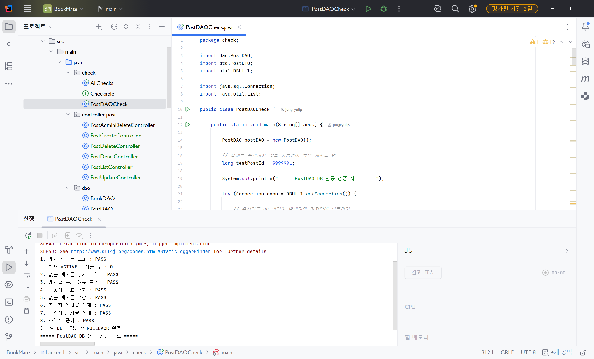
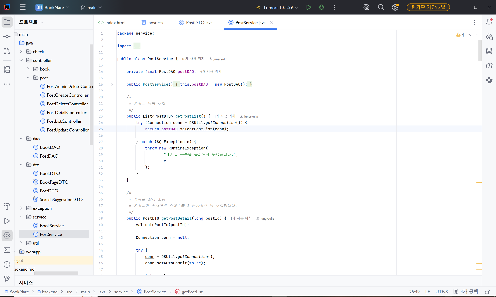
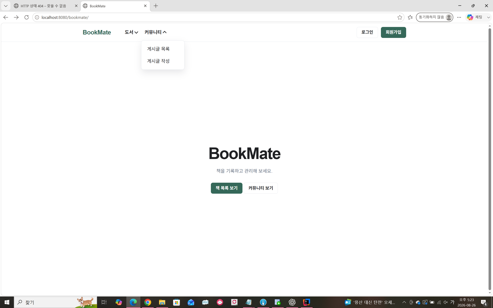
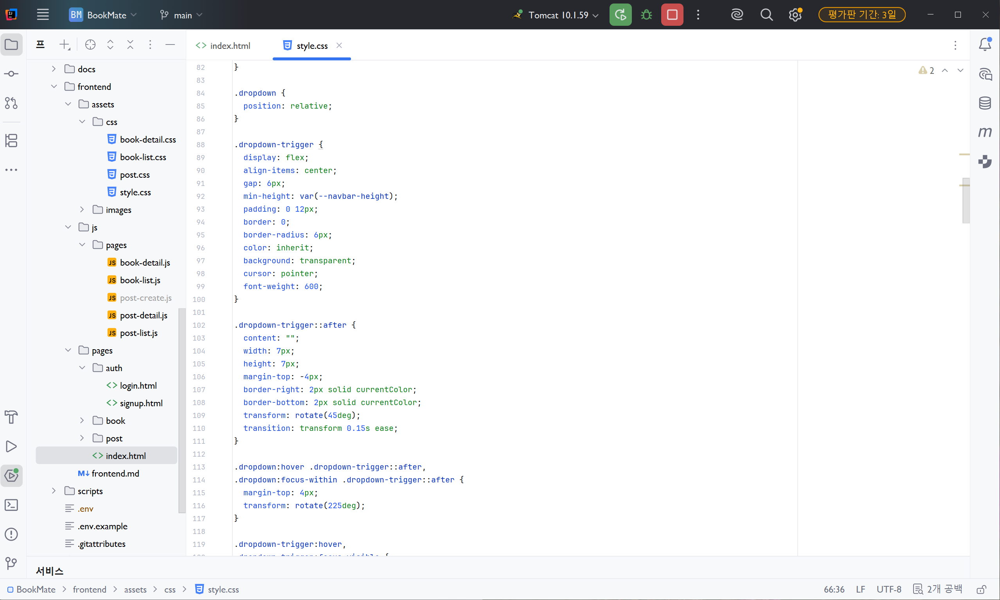
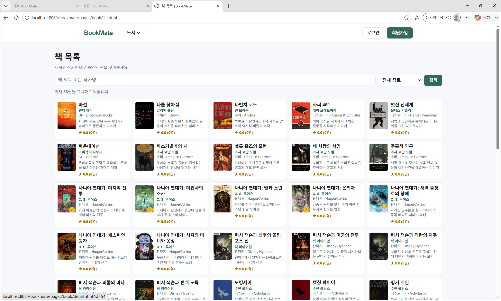
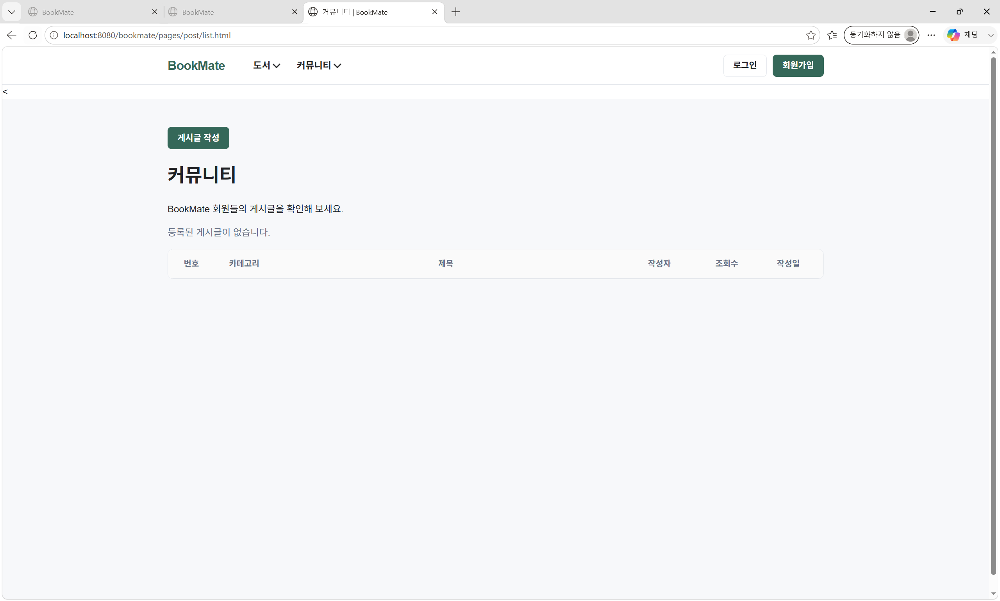

# DAY 28 — BookMate 게시판 기능 구현과 웹 실행 환경

> 2026-08-26 미니프로젝트 기록

BookMate 프로젝트를 브라우저에서 실행할 수 있도록 Maven과 Tomcat 환경을 점검하고,
커뮤니티 게시판의 백엔드와 프런트엔드를 연결했다. 이번 작업의 중심은 게시글 데이터를
다루는 **PostDAO·PostDTO·PostService**, 요청을 받는 **Controller**, 목록·상세·작성
화면을 구성하는 **HTML·CSS·JavaScript**였다.

## 오늘의 작업 흐름

```text
Browser
  ↓ fetch / JSON
Controller
  ↓ 요청 검증·응답 상태
Service
  ↓ 권한·트랜잭션·비즈니스 규칙
DAO
  ↓ PreparedStatement
Oracle POST table
  ↕
PostDTO
```

## Maven과 Tomcat 실행 환경

백엔드를 Maven으로 빌드하고 Tomcat 10에 배포하는 실행 구성을 확인했다.

- Maven `clean package`로 빌드 결과 생성
- Tomcat 10.1.59 애플리케이션 서버 연결
- `WAR exploded` 방식으로 개발 중 변경 사항 배포
- `/bookmate` 컨텍스트 경로와 `localhost:8080` 실행 주소 확인
- Java 21 프로젝트 SDK 사용

환경 설정 화면에는 로컬 경로와 `.env`가 함께 표시되어 있어 공개 이미지에서는
제외했다. 저장소에는 비밀번호와 실제 데이터베이스 접속값을 올리지 않는 원칙을
유지했다.

## 게시글 백엔드 구현

### PostDTO

DAO, Service와 Controller 사이에서 게시글 데이터를 전달하도록 `PostDTO`를 구성했다.
게시글 번호·회원 번호·닉네임·카테고리·제목·내용뿐 아니라 조회수, 상태, 생성일과
수정일까지 한 객체에서 관리한다.



### PostDAO

`POST` 테이블을 기준으로 게시글 CRUD와 관리 기능을 구현했다.

- 삭제되지 않은 게시글 목록과 상세 조회
- 게시글 등록과 수정
- 작성자 삭제와 관리자 삭제
- 조회수 증가, 게시글 존재 여부와 작성자 번호 조회
- 데이터를 바로 지우지 않고 상태값을 바꾸는 소프트 삭제

DB 연동 검증용 `main()`에서는 목록·상세·존재 여부·작성자·수정·삭제·조회수 기능을
순서대로 확인했다. 테스트가 실제 데이터를 남기지 않도록 마지막에 `rollback()`을
실행했고 모든 항목이 PASS인 것을 확인했다.



### PostService와 Controller

Service에서는 DB 연결과 트랜잭션 경계를 관리하고, 입력값과 권한을 검증한 다음 DAO를
호출한다. 등록·수정·삭제가 실패하면 롤백하고, 정상 처리된 경우에만 커밋하도록 했다.

특히 수정과 삭제 전에는 현재 로그인한 회원이 작성자인지 확인하고, 관리자 삭제는
역할이 `ADMIN`인지 검사했다. Controller는 목록·상세·등록·수정·삭제 요청을 각각
담당하며 JSON 요청과 응답, HTTP 상태 코드를 처리한다.



## 커뮤니티 화면 연결

프런트엔드에는 게시글 목록·상세·작성 페이지와 각 화면의 JavaScript를 추가했다.
메인 화면과 내비게이션에도 커뮤니티로 이동하는 링크와 드롭다운 메뉴를 연결했다.





목록 화면에서는 `fetch()`로 게시글 API를 호출해 테이블 행을 만들고, 상세 화면은
URL의 `postId`를 읽어 데이터를 표시한다. 작성 화면은 폼의 기본 제출을 막고 JSON으로
변환해 등록 API에 전송한다.

```javascript
titleLink.textContent = post.title;
contentElement.textContent = post.content || "";
```

사용자 입력을 `innerHTML`로 넣지 않고 `textContent`로 출력해 스크립트가 실행되지
않도록 했다. 상세 주소에 게시글 번호를 넣을 때는 `encodeURIComponent()`를 사용했고,
로그인이 필요한 요청에서 401 응답이 오면 로그인 화면으로 이동하도록 구성했다.





## 회고

오늘은 화면 하나를 만드는 것보다 계층 사이의 책임을 나누는 일이 더 중요하다는 것을
배웠다. DTO는 데이터 전달, DAO는 SQL 실행, Service는 트랜잭션과 규칙, Controller는
HTTP 요청과 응답을 담당하도록 구분하면 오류가 발생한 위치를 찾기 쉬워진다. 다음에는
실제 로그인 세션을 연결해 작성·수정·삭제 권한을 통합 검증하고, 빈 목록뿐 아니라 여러
카테고리의 게시글이 표시되는 흐름까지 확인할 계획이다.

