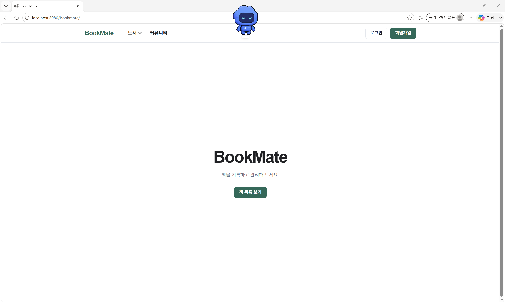
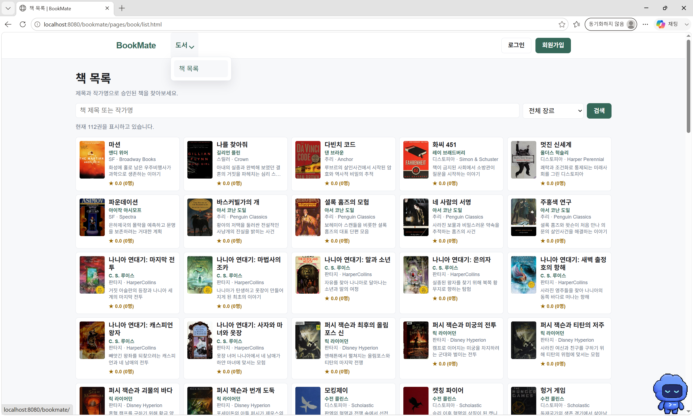
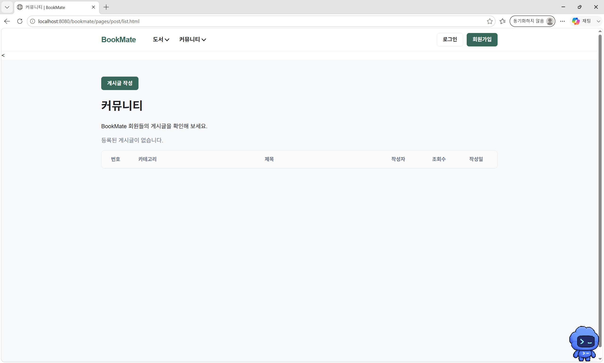
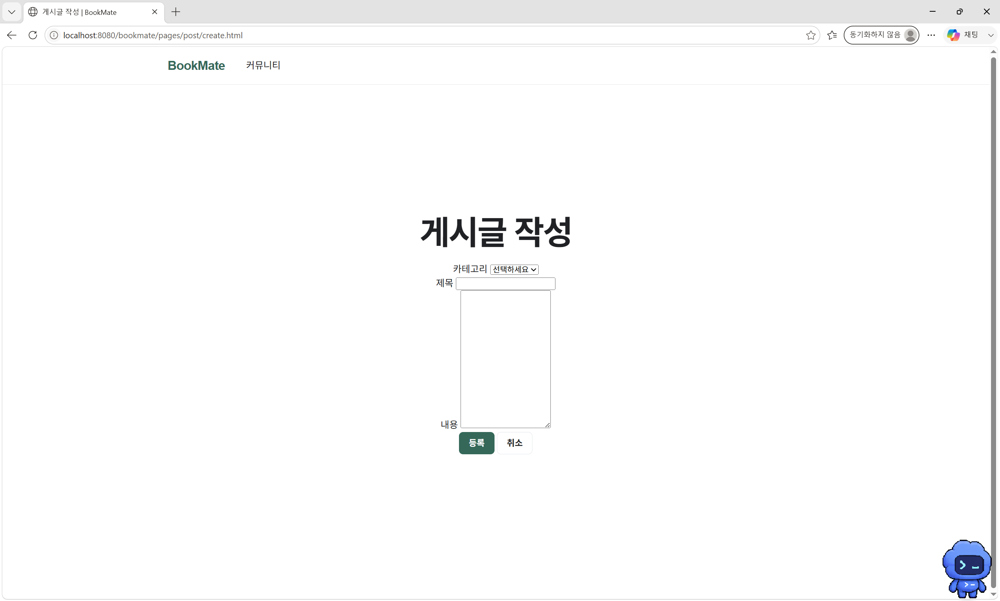
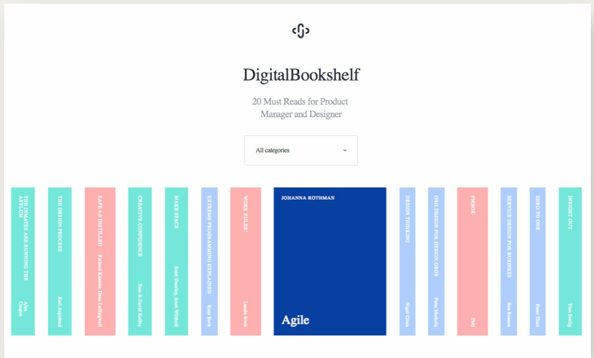
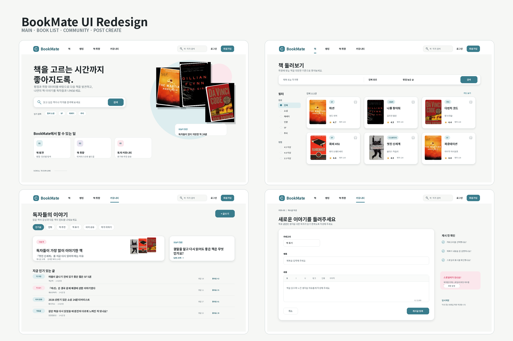

# DAY 29 — BookMate UI 리디자인과 디자인 시스템

> 2026-08-27 미니프로젝트 기록 · 디자인 작업

BookMate의 기존 화면을 살펴보고, 서비스의 핵심인 **책 발견·취향 공유·독자 커뮤니티**가
더 잘 드러나도록 사이트 구조와 화면을 다시 설계했다. 오늘 기록은 데이터 연동 전 단계의
디자인 결과만 다루며, Java·JDBC·Oracle을 연결한 구현 내용은 다음 기록에 추가할 예정이다.

## 오늘의 작업 범위

```text
기존 화면 확인
  ↓
사이트맵과 화면 우선순위 정리
  ↓
색상·타이포그래피·간격·컴포넌트 규칙 정의
  ↓
메인·책·랭킹·책 취향·커뮤니티 와이어프레임
  ↓
메인·책 목록·커뮤니티·게시글 작성 UI 리디자인
```

## 기존 화면 분석

기존 화면은 필요한 기능이 배치되어 있었지만, 화면마다 내비게이션과 여백이 다르고
콘텐츠가 없을 때 넓은 빈 공간이 생겼다. 책 목록은 많은 정보를 한 번에 보여 주는 장점이
있지만 카드 안의 제목·저자·설명·평점이 비슷한 강도로 보여 탐색 순서를 잡기 어려웠다.

| 화면 | 확인한 점 | 개선 방향 |
| --- | --- | --- |
| 메인 | 첫 화면에서 서비스의 차별점이 약함 | 검색과 핵심 기능을 한눈에 보여 주는 히어로 구성 |
| 책 목록 | 한 화면에 카드가 많고 정보 위계가 약함 | 필터와 정렬을 분리하고 카드 정보를 간결하게 정리 |
| 커뮤니티 | 게시글이 없을 때 화면이 비어 보임 | 인기 주제·오늘의 질문·게시글 목록으로 탐색 흐름 제공 |
| 게시글 작성 | 입력 요소가 작고 작성 안내가 부족함 | 넓은 에디터, 작성 확인 목록, 스포일러 안내 추가 |

<details>
<summary>개선 전 화면 보기</summary>

### 메인



### 책 목록



### 커뮤니티 목록



### 게시글 작성



</details>

## 정보 구조와 화면 흐름

공통 헤더에서 **책·랭킹·책 취향·커뮤니티**로 이동하도록 구조를 단순화했다. 메인은
서비스 소개에서 시작해 책을 발견하고, 다른 사람의 취향을 살펴본 뒤, 독자들의 이야기로
이어지는 흐름으로 설계했다.

```text
공통 영역
├─ 로고·통합 검색·로그인·마이페이지
├─ 책: 목록·상세·작가·평점
├─ 랭킹: 실시간·주간·월간
├─ 책 취향: 티어리스트·이상형 월드컵
├─ 커뮤니티: 목록·상세·작성
└─ 관리자: 회원·책 승인·게시글 관리

메인 화면
소개·검색 → 인기 책 → 책 취향 → 커뮤니티 → 푸터
```

스크롤 스냅은 각 구간의 목적이 분명할 때만 사용하고, 모바일에서는 약하게 적용하거나
해제하도록 했다. 키보드 이동과 `prefers-reduced-motion`도 고려해 시각 효과가 사용성을
방해하지 않게 정리했다.

## 디자인 시스템

책 표지가 가장 먼저 보이도록 따뜻한 화이트와 그레이를 바탕으로 사용했다. 주요 행동에는
바다색, 삭제·오류·스포일러처럼 주의가 필요한 상태에는 핑크를 제한적으로 사용했다.

- 기본 배경 `#F8F9F7`, 카드 `#FFFFFF`, 보조 배경 `#F1F3F4`
- 본문 `#1F2328`, 보조 텍스트 `#5C6670`, 테두리 `#D9DEE2`
- 주요 색 `#397C8C`, 호버 `#2D6674`, 선택 배경 `#DCECEF`
- 주의 색 `#D94F70`, 주의 배경 `#FBE7EC`
- 최대 콘텐츠 폭 1,200px, 카드 안쪽 여백 20~24px, 기본 간격 8·16·24·32px
- 카드 모서리 12~16px, 버튼과 입력창 모서리 8px, 그림자는 약하게 적용

색상만으로 상태를 구분하지 않고 배지와 텍스트를 함께 사용한다. 한 화면의 강한 기본
버튼은 하나만 두고, 나머지는 외곽선·텍스트 버튼으로 위계를 조절한다.

자세한 기준은 [BookMate 디자인 가이드](./DESIGN_GUIDE.md)에 분리해 두었다.

## 와이어프레임

메인, 책 목록, 랭킹, 책 취향, 디자인 시스템을 긴 화면 단위로 구성했다. 이 단계에서는
기능별 정보 우선순위와 공통 컴포넌트가 화면 사이에서 일관되게 반복되는지를 확인했다.



- [전체 와이어프레임과 디자인 시스템 PDF](./assets/bookmate-wireframes.pdf)

## UI 리디자인 결과

최종 시안에는 메인, 책 둘러보기, 커뮤니티 목록, 게시글 작성 화면을 담았다.



### 메인

- 한 문장으로 서비스 가치를 설명하는 히어로 문구
- 제목·작가 통합 검색과 인기 검색어
- 책 발견·책 취향·독자 커뮤니티로 이어지는 핵심 기능 카드
- 책 표지를 활용한 시각적 초점과 오늘의 발견 정보

### 책 둘러보기

- 검색·장르·평점·정렬을 분리한 탐색 도구
- 표지, 장르, 제목, 저자, 평점을 정돈한 카드
- 즐겨찾기와 선택 상태를 알아보기 쉬운 아이콘·배지로 표현

### 커뮤니티

- 카테고리 탭과 글쓰기 버튼을 상단에 배치
- 이번 주 주제와 오늘의 질문으로 빈 화면을 보완
- 게시글은 댓글·좋아요·카테고리 정보를 빠르게 훑을 수 있는 목록으로 구성

### 게시글 작성

- 제목과 내용을 충분히 입력할 수 있는 넓은 편집 영역
- 카테고리·제목·스포일러 표시를 확인하는 체크리스트
- 주의가 필요한 스포일러 설정만 핑크색 안내로 강조
- 임시 저장과 게시글 등록 행동을 구분

- [BookMate UI 리디자인 PDF](./assets/bookmate-ui-redesign.pdf)

## 회고

오늘은 예쁜 화면을 만드는 것보다 서비스의 기능과 사용자의 행동 순서를 먼저 정하는
것이 중요하다는 점을 배웠다. 현재 화면의 문제를 정리한 뒤 사이트맵과 공통 규칙을 만들자
메인·책·커뮤니티 화면이 하나의 서비스처럼 연결되었다. 다음에는 이 디자인을 실제 화면에
적용하고, 데이터가 준비되면 목록·검색·필터·게시글 작성 흐름까지 연결해 확인할 계획이다.
