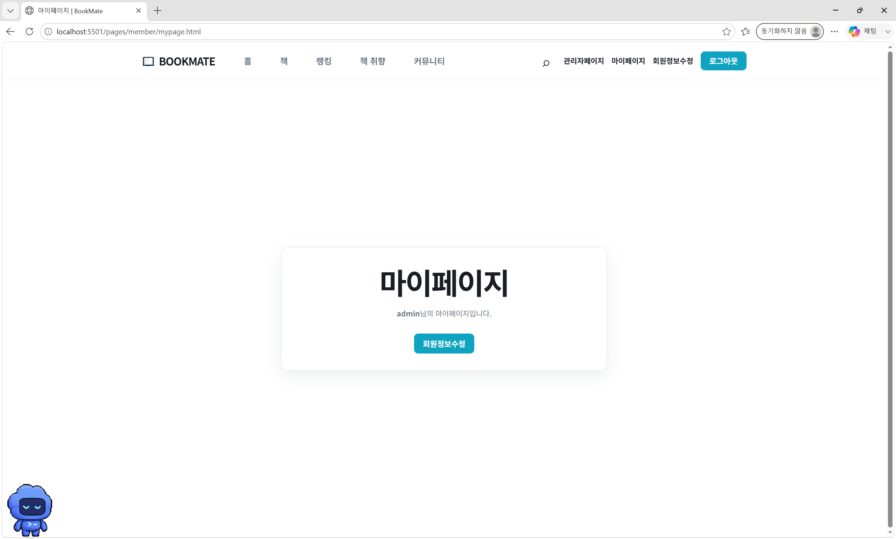
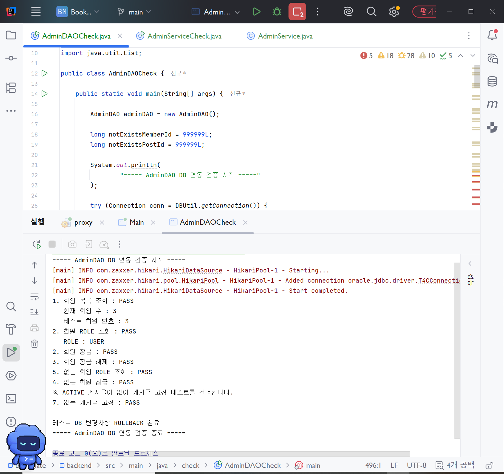
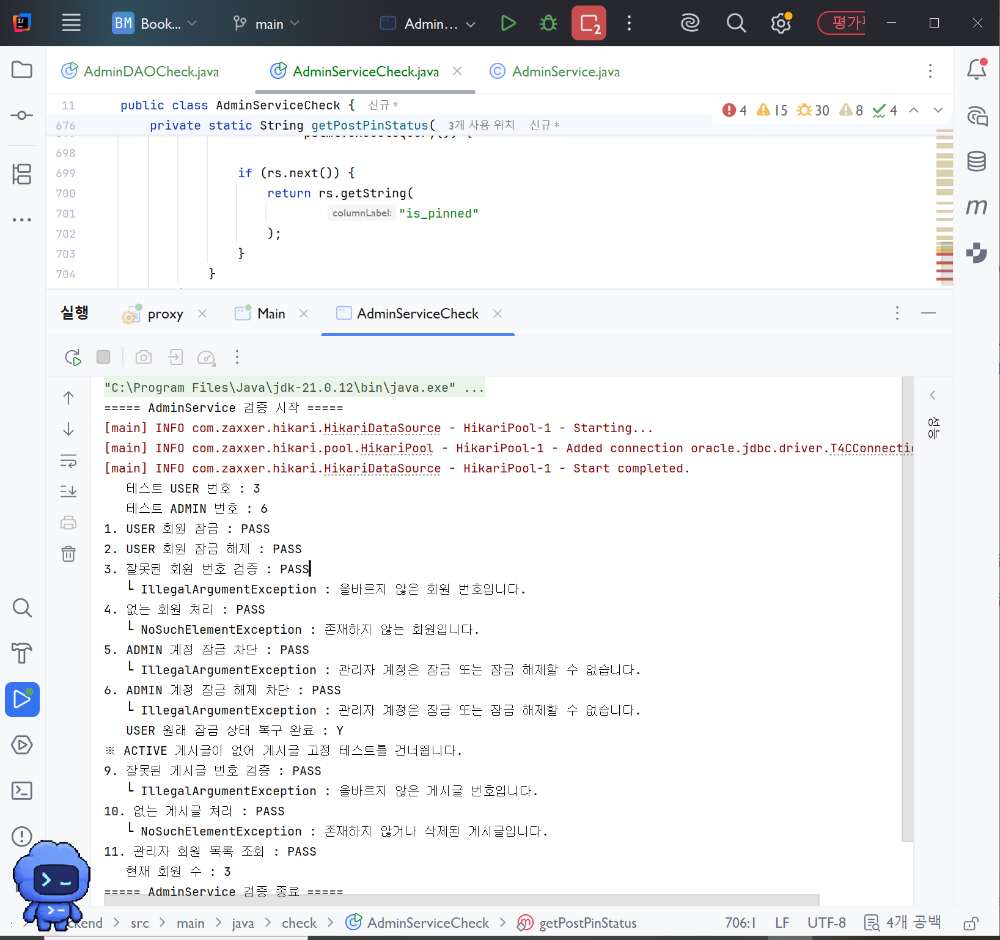
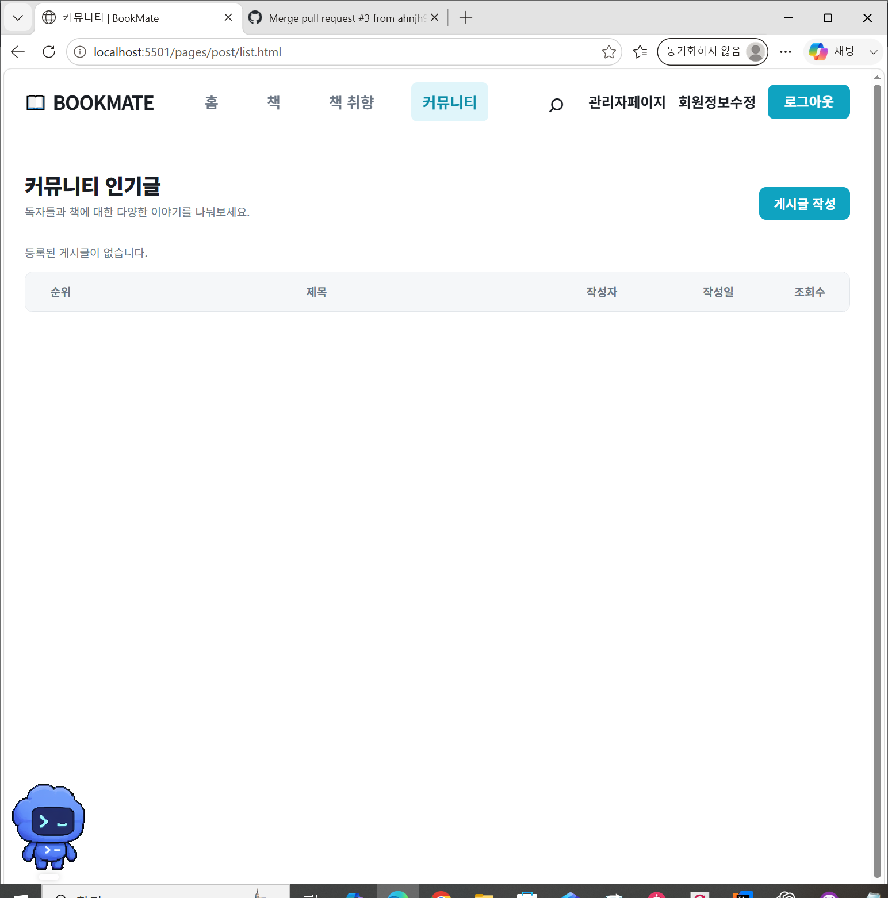
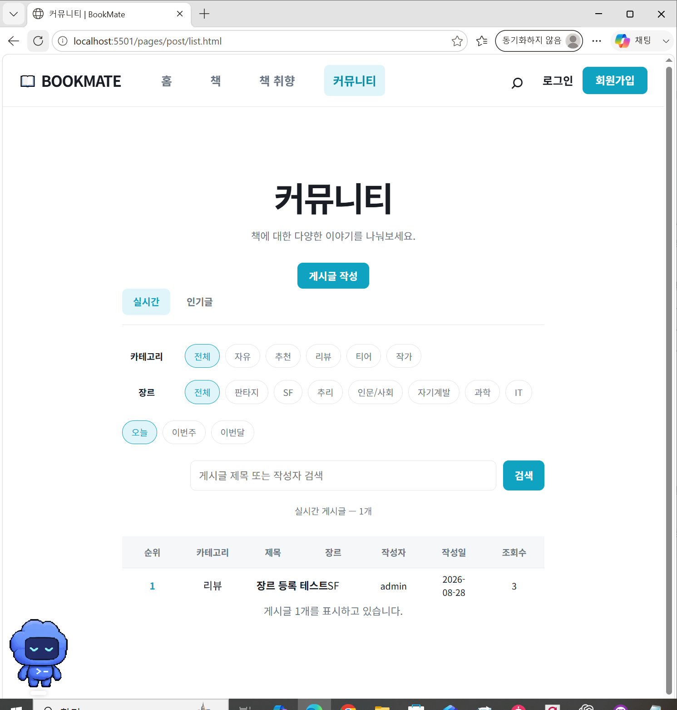
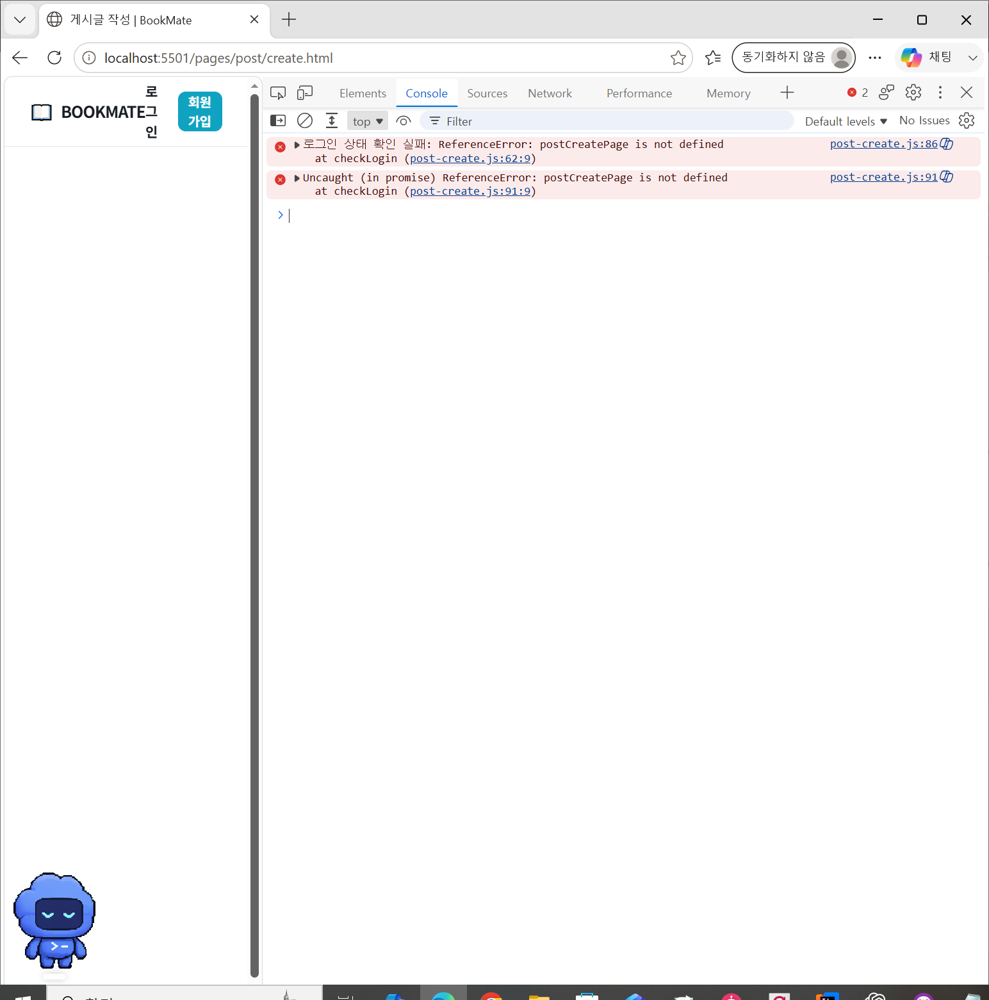
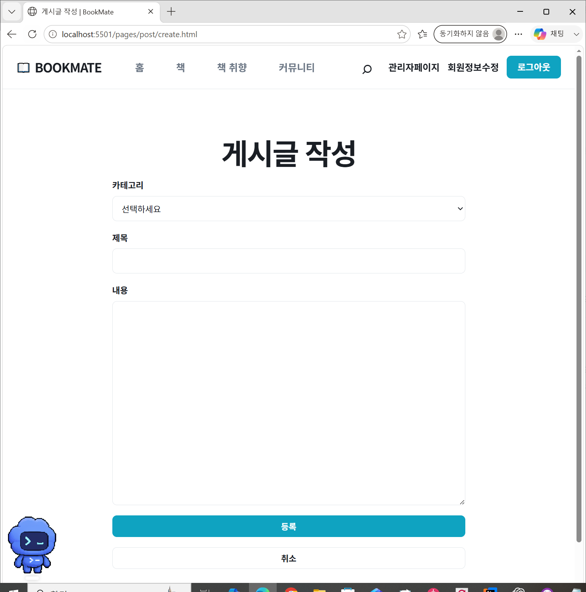
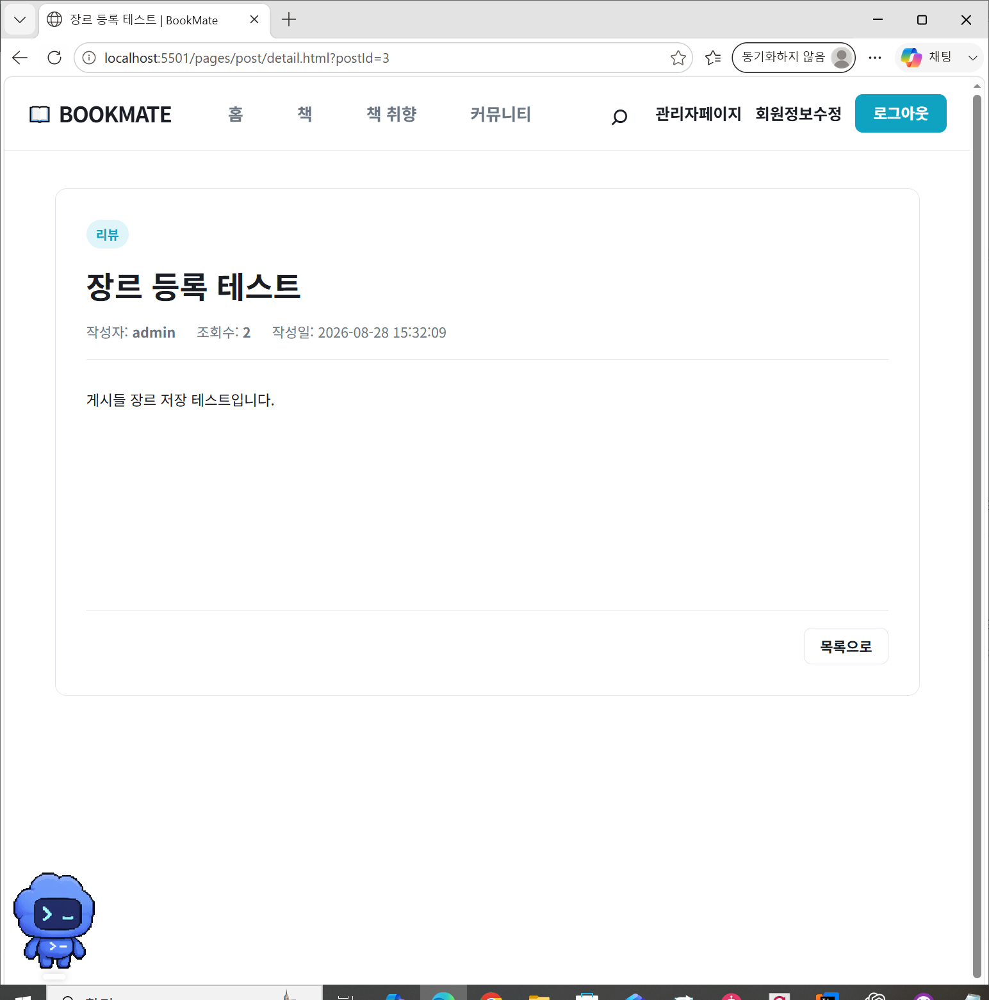
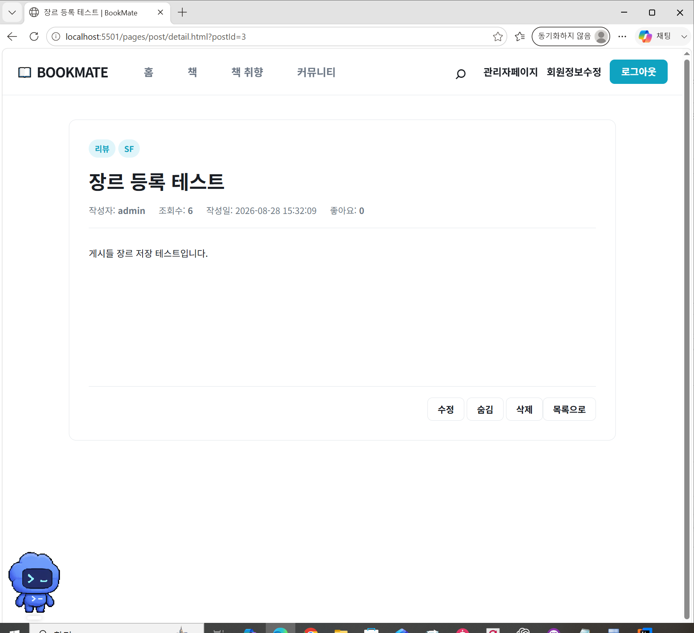
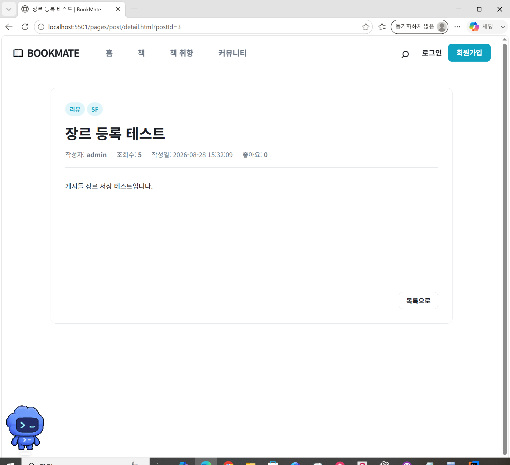

# DAY 30 — BookMate 관리자·커뮤니티 기능 연동과 검증

> 2026-08-28 미니프로젝트 기록 · Java, JDBC, Oracle, JavaScript

BookMate의 로그인 세션과 권한에 맞춰 공통 헤더를 연결하고, 관리자 회원 관리와
커뮤니티 게시판 기능을 실제 데이터로 확인했다. 화면이 보이는 것에서 끝내지 않고
DAO와 Service 계층을 별도로 실행해 정상 처리와 예외 처리까지 검증했다.

## 오늘의 작업 흐름

```text
세션·권한별 공통 헤더 확인
  ↓
관리자 회원 목록과 잠금·해제 기능 연결
  ↓
커뮤니티 목록·필터·검색 화면 정리
  ↓
게시글 작성·상세·작성자 권한 연결
  ↓
DAO·Service 정상/예외 시나리오 검증
  ↓
테스트 데이터 원상복구
```

## 세션과 권한에 맞는 공통 헤더

세션 확인 결과에 따라 로그인·회원가입 또는 마이페이지·회원정보수정·로그아웃 메뉴를
보여 주고, 관리자 권한일 때는 관리자 페이지로 이동할 수 있도록 공통 내비게이션을
연결했다. 각 화면에서 서로 다른 헤더가 보이지 않도록 공통 컴포넌트를 사용하고,
페이지 이동 뒤에도 로그인 상태가 유지되는지 확인했다.



## 관리자 회원 관리

관리자 화면에서는 회원 목록과 계정 상태를 조회하고 일반 회원을 잠그거나 잠금 해제할
수 있도록 연결했다. Service 계층에는 화면 조작만으로 우회할 수 없도록 다음 규칙을
두었다.

- 회원 번호는 1 이상의 값만 허용한다.
- 존재하지 않는 회원은 별도의 예외로 처리한다.
- 일반 회원만 잠금·해제할 수 있고 관리자 계정은 대상에서 제외한다.
- 테스트 뒤에는 회원의 원래 잠금 상태를 복구한다.

### DAO DB 연동 검증

`AdminDAOCheck`에서 회원 목록과 역할을 조회하고 일반 회원의 잠금·해제 결과가 DB에
반영되는지 확인했다. 없는 회원과 게시글 번호도 함께 검사했으며, 테스트가 실제 데이터에
영향을 남기지 않도록 트랜잭션을 `ROLLBACK`했다.



### Service 비즈니스 규칙 검증

`AdminServiceCheck`에서는 정상적인 회원 잠금·해제뿐 아니라 잘못된 번호, 존재하지 않는
회원, 관리자 계정 잠금 시도를 검증했다. 기대한 `IllegalArgumentException`과
`NoSuchElementException`이 발생하는지 확인해 입력 검증과 권한 규칙이 Service 계층에서
동작하는 것을 확인했다.



활성 게시글이 없는 상태에서는 정상 고정·해제 테스트를 건너뛰고, 잘못된 게시글 번호와
존재하지 않는 게시글에 대한 예외 처리만 확인했다. 데이터가 준비된 뒤 고정·해제의 정상
흐름을 다시 검증할 예정이다.

## 커뮤니티 목록과 필터

처음에는 게시글 데이터가 없어 목록이 빈 상태로 표시되었다. 게시글 등록과 조회를 연결한
뒤 카테고리, 장르, 기간, 제목·작성자 검색 조건을 한 화면에 정리하고 실시간 글과 인기글을
전환할 수 있도록 구성했다.

### 데이터 연결 전



### 필터와 게시글 연결 후



필터 버튼과 검색 조건은 화면의 상태로 관리하고, 조건이 바뀌면 서버에 필요한 값만 전달해
목록을 다시 그리는 흐름으로 정리했다. 게시글에는 카테고리와 장르, 작성자, 작성일,
조회수를 표시해 한 줄에서도 핵심 정보를 확인할 수 있게 했다.

## 게시글 작성 오류 해결

게시글 작성 화면을 연결하는 과정에서 `postCreatePage is not defined`라는
`ReferenceError`가 발생했다. 로그인 확인 함수가 아직 준비되지 않은 변수를 참조하는
흐름을 확인하고 초기화 순서와 참조 대상을 정리했다.



수정 후에는 로그인한 사용자가 카테고리, 제목, 내용을 입력해 게시글을 등록할 수 있도록
작성 화면을 다시 확인했다. 입력값을 전송하기 전에 필수 항목을 검사하고, 취소 시에는
커뮤니티 목록으로 돌아가도록 구성했다.



## 게시글 상세와 작성자 권한

상세 화면에는 카테고리와 장르, 제목, 작성자, 조회수, 작성일, 좋아요 정보를 표시했다.
초기 화면에서 빠져 있던 장르와 작성자용 기능을 연결한 뒤 세션 사용자와 게시글 작성자를
비교해 버튼 노출을 구분했다.

### 상세 정보 연결 전



### 작성자가 보는 상세 화면

작성자는 자신의 글에서 수정·숨김·삭제 버튼을 사용할 수 있다.



### 다른 사용자가 보는 상세 화면

작성자가 아닌 사용자는 글 내용과 목록 이동만 볼 수 있고, 글을 변경하는 버튼은 노출되지
않도록 했다.



## 검증 결과

| 검증 항목 | 결과 |
| --- | --- |
| 관리자 회원 목록·회원 역할 조회 | PASS |
| 일반 회원 잠금·잠금 해제 | PASS |
| 잘못된 회원 번호·없는 회원 처리 | PASS |
| 관리자 계정 잠금·해제 차단 | PASS |
| 잘못된 게시글 번호·없는 게시글 처리 | PASS |
| 테스트 후 회원 상태 복구·DAO 트랜잭션 롤백 | 완료 |
| 활성 게시글 고정·해제 | 데이터 부재로 다음 검증에서 진행 |

## 회고

오늘은 프런트 화면, 세션, Service 규칙, DAO와 DB가 한 기능 안에서 어떻게 이어지는지
확인했다. 특히 관리자 기능은 버튼을 숨기는 것만으로 권한을 보호할 수 없고, Service에서
역할과 대상 데이터를 다시 검증해야 한다는 점을 배웠다. 또한 성공 시나리오만 확인하면
구현이 완료된 것처럼 보일 수 있으므로 잘못된 번호, 없는 데이터, 권한이 다른 계정까지
테스트하고 변경 내용을 되돌리는 과정이 중요했다.

공개 기록에는 기능 확인에 필요한 화면만 사용했으며, 실제 이메일 주소와 세션 쿠키 값이
보이는 캡처 및 로컬 실행 경로가 포함된 원본 로그는 제외했다.
