# DAY 31 — BookMate 게시글 수정·삭제·숨김과 작성자 권한

> 2026-08-29 미니프로젝트 기록 · Java Servlet, JDBC, JavaScript

수업 진도와 별개로 BookMate 커뮤니티의 게시글 관리 기능을 자율적으로 보완했다.
작성자가 자신의 글을 수정·삭제·숨김 처리할 수 있도록 프런트 화면부터 Servlet,
Service, DAO까지 연결하고, 비회원과 다른 사용자는 작성자 전용 기능에 접근하지
못하도록 권한을 구분했다.

오늘 작업은 BookMate 저장소의
[`feature/post-controller` 커밋](https://github.com/ahnjh97/BookMate/commit/372d06abda2250818f44f46e447ba826f2cad6b1)으로 올렸고,
[`Pull Request #6`](https://github.com/ahnjh97/BookMate/pull/6)을 통해 `main` 브랜치에 병합했다.

## 오늘 구현한 기능

```text
게시글 상세에서 로그인 사용자와 작성자 비교
  ↓
작성자에게 수정·숨김·삭제 버튼 표시
  ↓
수정 화면에서 기존 데이터 조회·편집·저장
  ↓
숨김·삭제 요청을 Controller → Service → DAO로 전달
  ↓
작성자 권한 재검증과 트랜잭션 처리
  ↓
처리된 게시글을 커뮤니티 목록에서 제외
```

## GitHub에 반영한 변경

이번 커밋에서는 Java 백엔드와 JavaScript·HTML 프런트엔드의 총 8개 파일을 변경했다.

| 영역 | 주요 변경 |
| --- | --- |
| Controller | `PostHideController` 추가, 삭제 요청 처리와 오류 응답 정리 |
| Service | 수정·삭제·숨김 전 작성자 권한 검증, 트랜잭션 commit·rollback 처리 |
| DAO | 게시글 상태를 `HIDDEN_BY_WRITER`로 바꾸는 소프트 숨김 쿼리 추가 |
| 상세 화면 | 로그인 사용자에 따라 작성자용 버튼과 일반 사용자용 버튼 구분 |
| 수정 화면 | 기존 게시글 조회, 입력값 변경 감지, 수정 API 호출과 이탈 경고 구현 |
| 페이지 이동 | 일반 게시글과 티어리스트 게시글의 수정 경로를 구분해 연결 |

변경된 파일은 다음과 같다.

- `backend/src/main/java/controller/post/PostDeleteController.java`
- `backend/src/main/java/controller/post/PostHideController.java`
- `backend/src/main/java/dao/PostDAO.java`
- `backend/src/main/java/service/PostService.java`
- `frontend/js/pages/post-detail.js`
- `frontend/js/pages/post-update.js`
- `frontend/pages/post/detail.html`
- `frontend/pages/post/update.html`

## 게시글 수정

상세 화면에서 작성자에게만 수정 버튼이 보이도록 하고, 수정 페이지를 새로 연결했다.
페이지를 열면 게시글 번호와 로그인 세션을 확인한 뒤 기존 카테고리, 장르, 제목과 내용을
폼에 채운다. 저장 시 `/api/posts/update`로 변경 내용을 전송하고 완료 후 상세 화면으로
돌아가도록 구성했다.

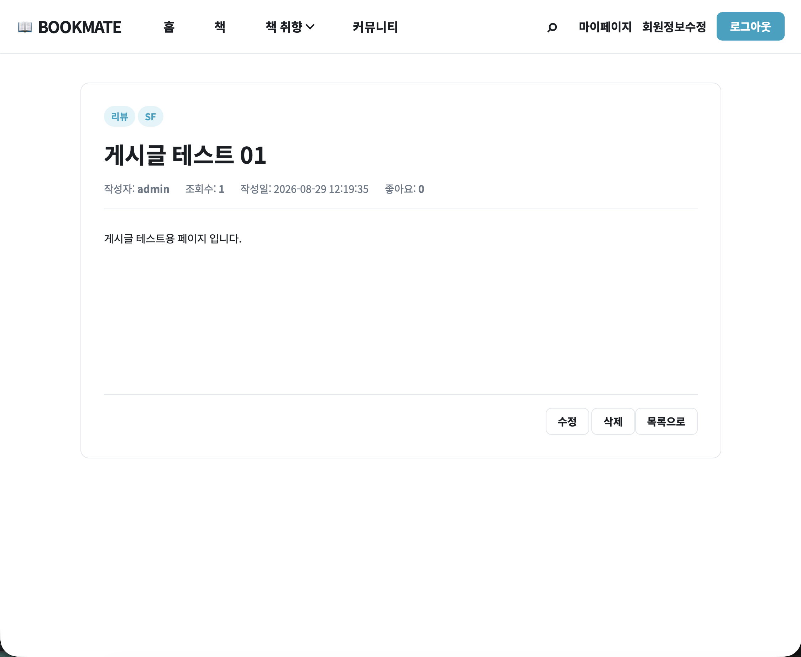

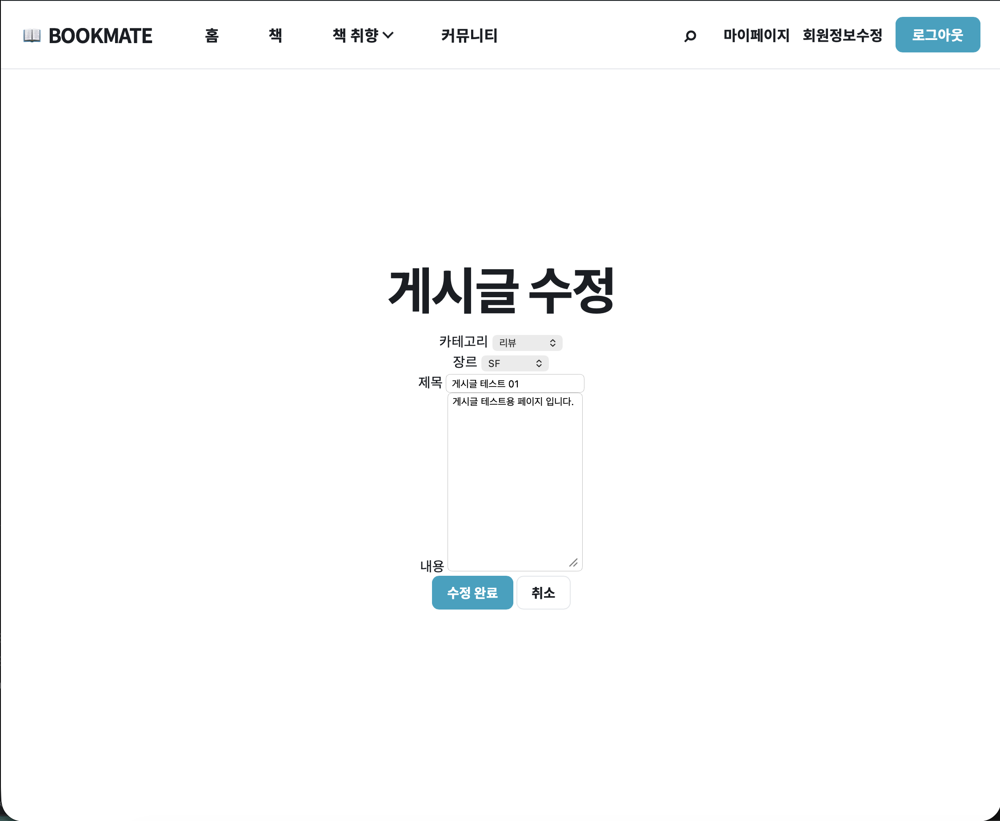

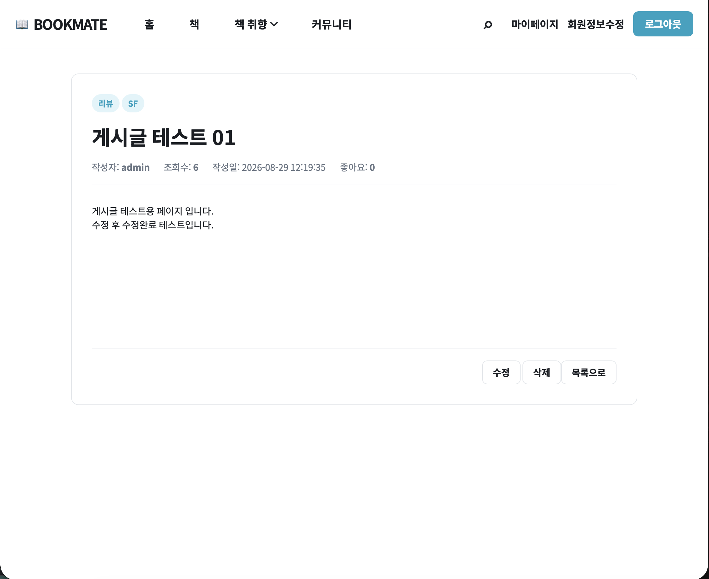

입력 도중 취소하거나 새로고침하면 작성 중인 내용이 사라질 수 있으므로 변경 여부를
기록하고 이탈 확인을 거치게 했다. 반대로 저장 완료나 정상적인 화면 이동에서는 불필요한
경고가 나타나지 않도록 제출·이동 상태를 별도로 관리했다.

## 작성자 권한 구분

버튼을 감추는 프런트 처리만으로는 권한을 보호할 수 없기 때문에 두 단계로 확인했다.

1. 상세 화면에서 로그인 회원 번호와 게시글 작성자 번호를 비교해 버튼을 구분한다.
2. Service에서 DB의 실제 작성자 번호를 다시 조회해 수정·삭제·숨김 권한을 검증한다.

다른 회원이 글을 보면 좋아요·신고·목록 버튼만 표시되고, 비회원에게는 작성자 전용 기능과
회원용 기능을 모두 숨겼다.

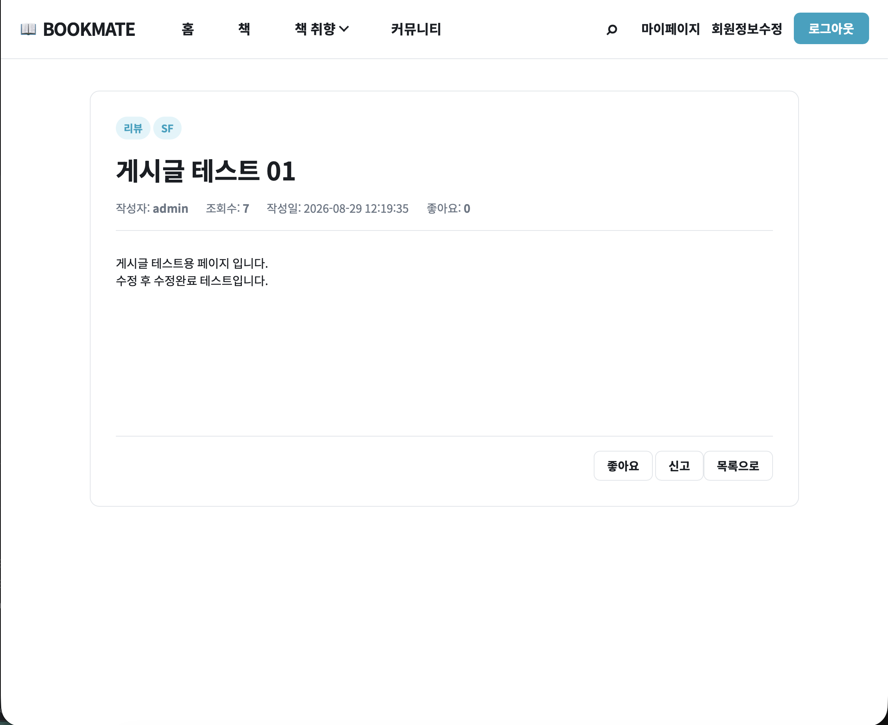

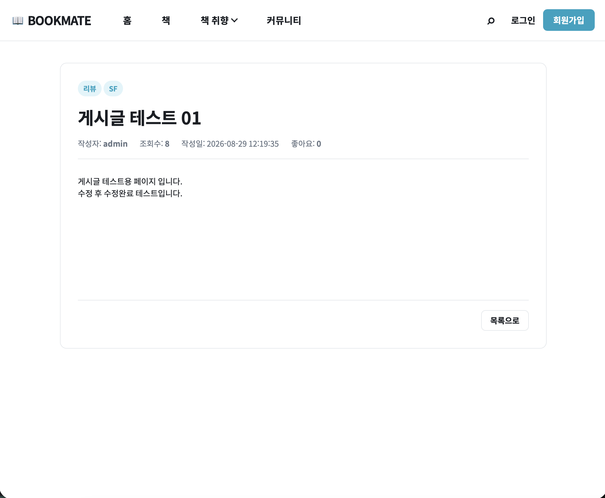

## 게시글 숨김

삭제와 별도로 작성자가 게시글을 숨길 수 있도록 `PostHideController`를 추가했다.
숨김 요청은 세션, 게시글 번호와 작성자 권한을 확인한 뒤 DAO에서 상태를
`HIDDEN_BY_WRITER`로 변경한다. 데이터 자체는 남기되 활성 게시글 조회 조건에서 제외해
커뮤니티 목록에 나타나지 않도록 했다.

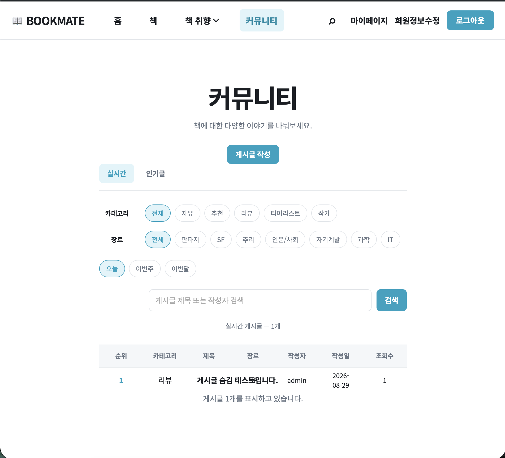

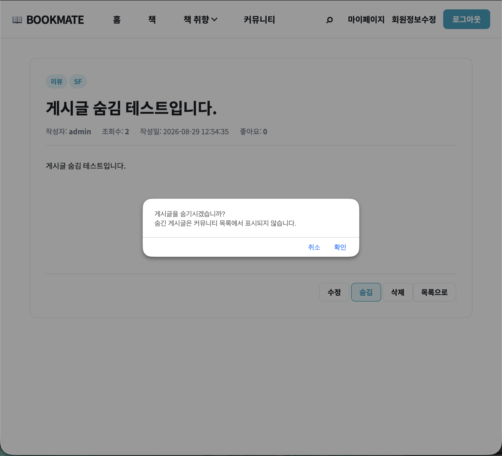

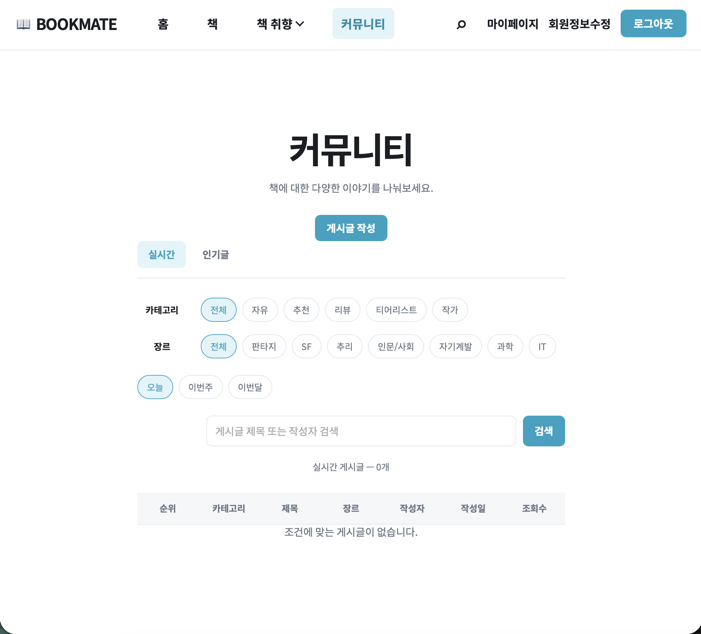

## 게시글 삭제

작성자가 삭제를 선택하면 확인 대화상자를 보여 주고 `/api/posts/delete`에 게시글 번호를
전송한다. 백엔드에서는 로그인 여부와 작성자 권한을 다시 검사한 뒤 소프트 삭제하고,
완료 후 커뮤니티 목록으로 이동해 삭제된 글이 조회되지 않는지 확인했다.

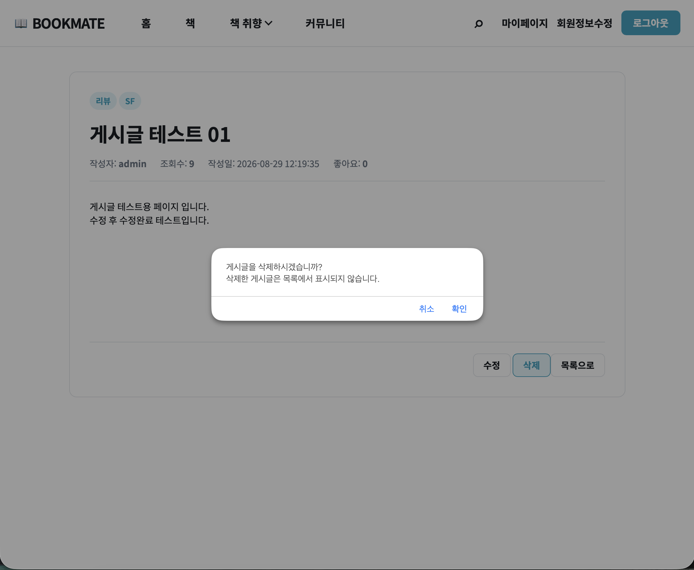

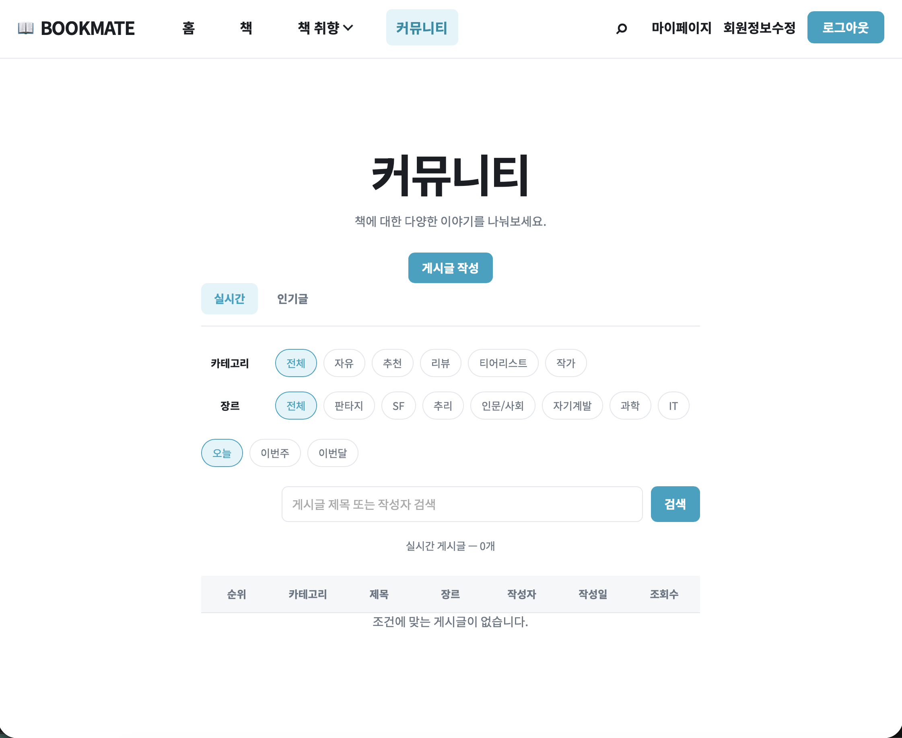

## 오류를 통해 확인한 점

테스트 중 변경한 코드가 실행 환경에 제대로 반영되지 않았을 때 브라우저에서
`The string did not match the expected pattern.` 오류가 나타났다. 화면에 보이는 메시지만
보고 원인을 단정하지 않고 Maven 반영 상태와 서버 재실행 여부를 먼저 점검한 뒤, 최신
코드가 실행되는 상태에서 수정·숨김·삭제 흐름을 다시 검증했다.

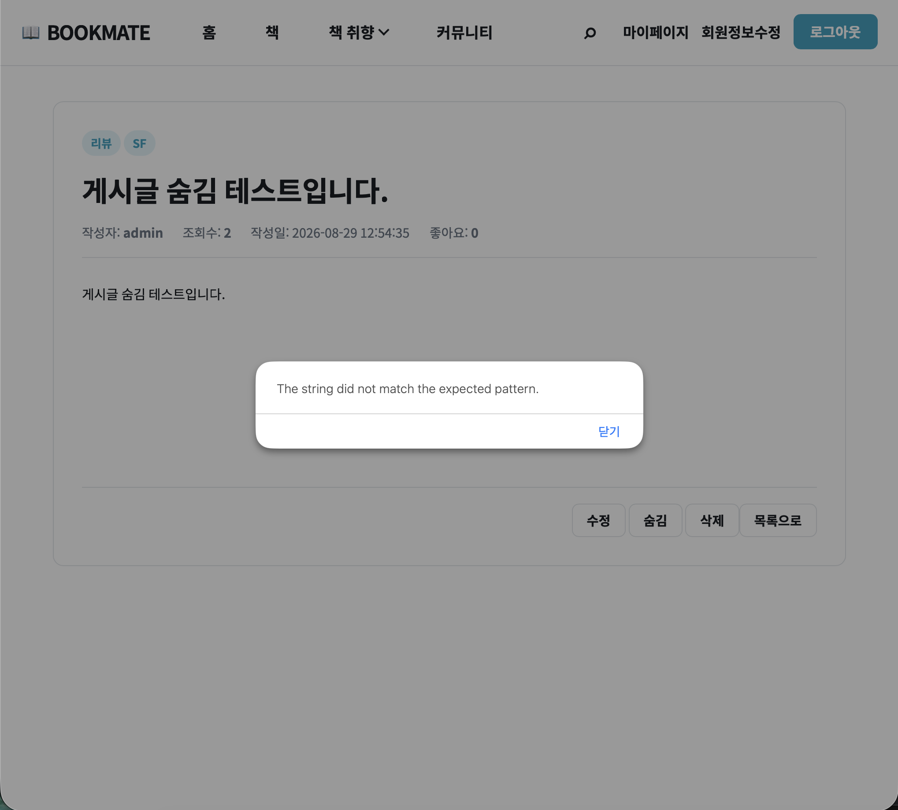

## 검증 결과

| 검증 항목 | 결과 |
| --- | --- |
| 작성자 상세 화면의 수정·숨김·삭제 버튼 | PASS |
| 게시글 기존 값 조회와 수정 결과 반영 | PASS |
| 다른 회원의 작성자 전용 기능 차단 | PASS |
| 비회원의 작성자·회원 전용 기능 차단 | PASS |
| 작성자 게시글 숨김과 목록 제외 | PASS |
| 작성자 게시글 소프트 삭제와 목록 제외 | PASS |
| 기능 브랜치의 PR 생성 및 `main` 병합 | 완료 |

## 회고

오늘은 화면의 버튼 하나를 추가하는 작업도 실제로는 세션 확인, API 요청, Service의
비즈니스 규칙, DAO의 상태 변경과 목록 조회 조건까지 함께 맞아야 완성된다는 점을 다시
확인했다. 특히 작성자 권한을 프런트와 백엔드에서 모두 검증하고, 삭제와 숨김을 상태값으로
구분한 덕분에 사용자에게 보이는 동작과 데이터 관리 규칙을 명확하게 나눌 수 있었다.
