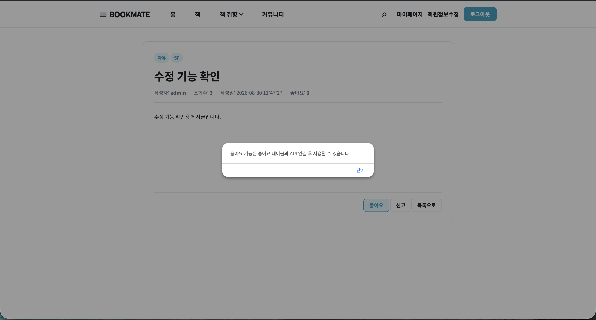
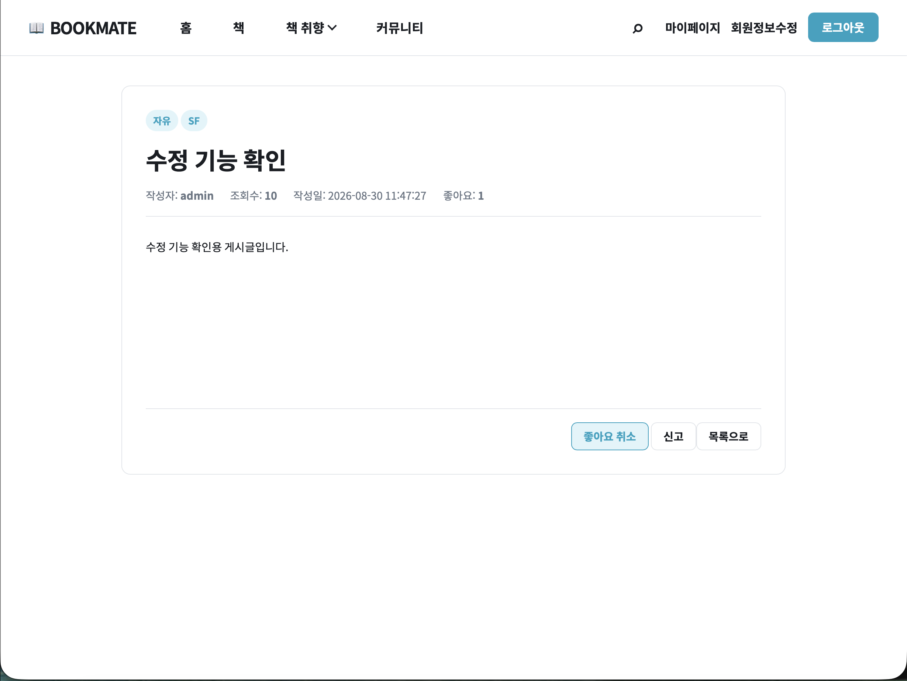
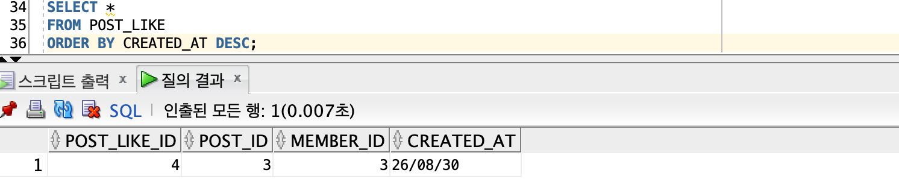
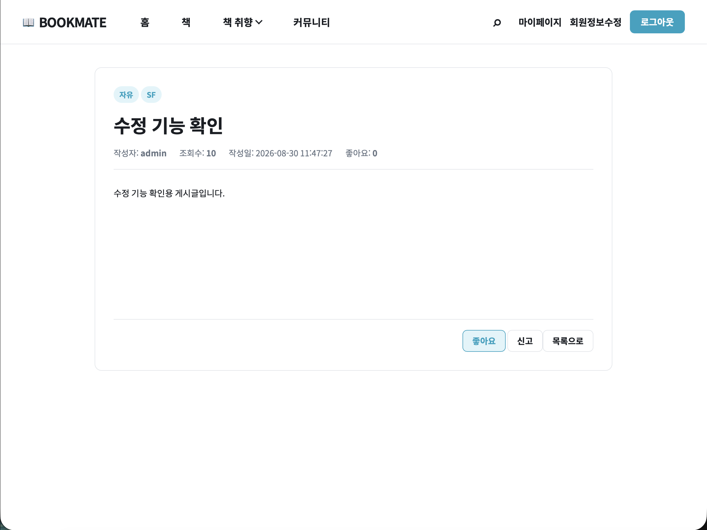
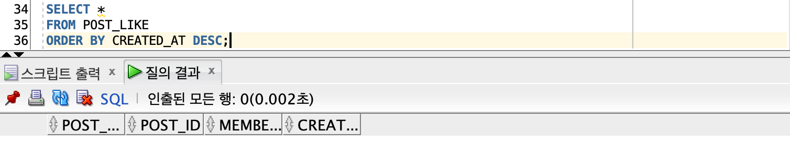
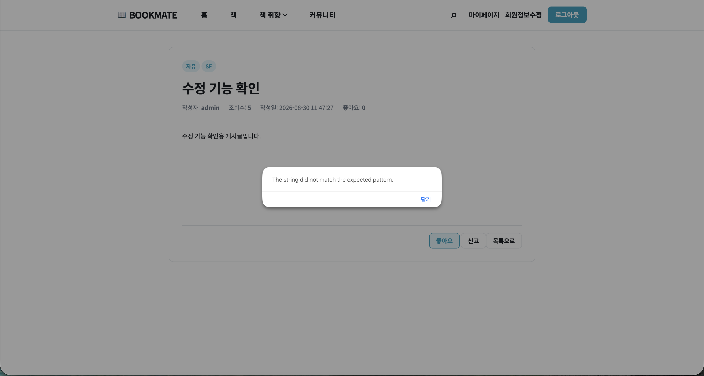

# DAY 32 — BookMate 게시글 좋아요 등록·취소와 상태 동기화

> 2026-08-30 미니프로젝트 기록 · Java Servlet, JDBC, JavaScript

오늘은 수업 진도와 별개로 BookMate 커뮤니티의 게시글 좋아요 기능을 자율적으로 구현했다.
버튼만 바꾸는 데서 끝내지 않고 로그인 회원, 게시글과 `POST_LIKE` 테이블을 연결해 좋아요
등록·취소 결과가 화면과 DB에 함께 반영되도록 만들었다. 게시글 상세를 다시 불러와도 좋아요
수와 현재 회원의 좋아요 상태가 유지되도록 조회 API도 확장했다.

오늘 작업은 BookMate 저장소의
[`feature/post-controller` 커밋](https://github.com/ahnjh97/BookMate/commit/98b43dee8d794669a8317cff31f3b7cdcc8d6da9)으로 올렸고,
[`Pull Request #7`](https://github.com/ahnjh97/BookMate/pull/7)을 통해 `main` 브랜치에 병합했다.

## 오늘 구현한 흐름

```text
게시글 상세 조회
  ↓
세션의 로그인 회원과 POST_LIKE 상태 확인
  ↓
좋아요 수와 liked 상태를 화면에 표시
  ↓
버튼 클릭 시 /api/posts/like 요청
  ↓
기존 좋아요가 없으면 INSERT, 있으면 DELETE
  ↓
트랜잭션 완료 후 최신 좋아요 수와 상태 반환
  ↓
버튼 문구·좋아요 수 갱신 및 DB 결과 확인
```

## GitHub에 반영한 변경

커밋 기준으로 백엔드 5개와 프런트엔드 3개, 총 8개 파일을 변경했다.

| 영역 | 주요 변경 |
| --- | --- |
| Controller | 상세 조회 응답에 `likeCount`와 `liked`를 추가하고 좋아요 토글 API 구현 |
| Service | 게시글·회원 번호 검증, 좋아요 등록·취소 판단과 트랜잭션 처리 |
| DAO | `POST_LIKE` 등록·삭제·존재 여부·게시글별 개수 조회 쿼리 구현 |
| DTO | 좋아요 번호, 게시글 번호, 회원 번호, 생성 시각을 담는 객체 추가 |
| 상세 화면 | 좋아요 수 표시, 버튼 상태 전환, API 호출 결과 즉시 반영 |
| 목록 화면 | 현재 분류에 맞지 않던 티어리스트 카테고리 버튼 정리 |

변경된 파일은 다음과 같다.

- `backend/src/main/java/controller/post/PostDetailController.java`
- `backend/src/main/java/controller/post/PostLikeController.java`
- `backend/src/main/java/dao/PostLikeDAO.java`
- `backend/src/main/java/dto/PostLikeDTO.java`
- `backend/src/main/java/service/PostLikeService.java`
- `frontend/js/pages/post-detail.js`
- `frontend/pages/post/detail.html`
- `frontend/pages/post/list.html`

## 좋아요 등록과 중복 방지

좋아요 요청은 로그인 세션의 회원 번호와 요청 본문의 게시글 번호를 사용한다. Service에서
먼저 게시글이 실제로 존재하는지 확인하고, 같은 회원과 게시글의 `POST_LIKE` 데이터가
있는지를 조회한다. 기존 데이터가 없다면 새 행을 등록하고, 이미 있다면 다시 추가하지 않고
취소 흐름으로 전환해 회원별 중복 좋아요를 방지했다.





좋아요 등록 후 화면의 개수가 `1`로 바뀌고 버튼 문구가 `좋아요 취소`로 전환되는 것을
확인했다. 같은 시점에 DB의 `POST_LIKE` 테이블에도 게시글과 회원을 연결한 행이 생성됐다.



## 좋아요 취소와 상태 동기화

이미 좋아요를 누른 회원이 같은 버튼을 다시 누르면 해당 게시글·회원 조합의 행을 삭제한다.
등록이나 취소가 끝난 뒤 같은 트랜잭션에서 게시글의 최신 좋아요 개수를 다시 조회해 응답에
담았고, 프런트에서는 그 값을 사용해 숫자와 버튼 문구를 즉시 갱신했다.





상세 조회 API에도 전체 좋아요 수와 현재 로그인 회원의 좋아요 여부를 포함했다. 그래서
화면을 새로고침하거나 상세 페이지에 다시 들어와도 DB를 기준으로 `좋아요` 또는
`좋아요 취소` 상태가 복원된다.

## 트랜잭션과 예외 처리

좋아요 토글은 조회와 등록·삭제, 개수 재조회가 하나의 작업이므로 수동 트랜잭션으로 묶었다.
정상 처리하면 commit하고, SQL 또는 실행 중 예외가 발생하면 rollback한 뒤 연결을 닫도록
구성했다. 로그인하지 않은 요청, 잘못된 게시글 번호, 존재하지 않는 게시글도 각각 알맞은
오류 응답으로 구분했다.

구현 중에는 기존 안내 메시지가 계속 나타나는 상태와
`The string did not match the expected pattern.` 메시지도 확인했다. 화면의 메시지만으로
원인을 단정하지 않고 실행 중인 코드, 요청 경로와 Servlet 매핑, 최신 빌드 반영 여부를
차례로 점검한 뒤 등록·취소와 DB 결과까지 다시 검증했다.



## 검증 결과

| 검증 항목 | 결과 |
| --- | --- |
| 로그인 회원의 좋아요 등록 | PASS |
| 동일 회원·게시글 중복 좋아요 방지 | PASS |
| 좋아요 취소와 DB 행 삭제 | PASS |
| 등록·취소 직후 좋아요 수 갱신 | PASS |
| 버튼의 `좋아요`·`좋아요 취소` 상태 전환 | PASS |
| 상세 화면 재조회 후 상태 유지 | PASS |
| 비로그인·잘못된 요청의 오류 처리 | 코드 경로 확인 |
| 기능 브랜치의 PR 생성 및 `main` 병합 | 완료 |

## 회고

오늘은 화면의 좋아요 버튼을 DB 데이터와 일치시키는 전체 흐름을 연결했다. 특히 단순 INSERT가
아니라 기존 상태를 확인해 등록과 취소를 나누고, 하나의 트랜잭션에서 최신 개수까지 계산해
반환하면서 상태 중심으로 기능을 설계하는 방법을 익혔다. 화면, API와 DB를 각각 확인한 덕분에
버튼만 바뀌고 데이터는 남는 문제를 피하고, 새로고침 뒤에도 같은 상태를 유지할 수 있었다.
