# DAY 33 — BookMate 댓글·신고와 관리자 콘텐츠 관리

> 2026-08-31 미니프로젝트 기록 · Java Servlet, JDBC, Oracle, JavaScript

오늘은 BookMate 커뮤니티의 댓글과 신고 기능을 자율적으로 구현하고, 관리자가 게시글과
댓글을 각각 관리할 수 있도록 관리자 화면을 확장했다. 게시글 상세에서 댓글을 조회·등록하고
작성자가 자신의 댓글을 수정하거나 소프트 삭제할 수 있게 했다. 게시글과 댓글 신고는 공통
흐름으로 연결하고 본인 콘텐츠 및 중복 신고를 차단했다.

작업은 두 단계로 나누어 BookMate 저장소에 올렸다. 댓글과 신고 기능은
[`9db7deb` 커밋](https://github.com/ahnjh97/BookMate/commit/9db7deb3562e3b88f4fcd78d3223536184d449c2)과
[`Pull Request #8`](https://github.com/ahnjh97/BookMate/pull/8)로, 관리자 댓글 관리 기능은
[`d5fc8d0` 커밋](https://github.com/ahnjh97/BookMate/commit/d5fc8d0839eef77c3902547f187251f3820b87f7)과
[`Pull Request #9`](https://github.com/ahnjh97/BookMate/pull/9)로 `main` 브랜치에 병합했다.

## 오늘 구현한 흐름

```text
게시글 상세
  ├─ 댓글 목록 조회·등록
  ├─ 작성자 본인 댓글 수정
  └─ 작성자 본인 댓글 삭제 → POST_COMMENT 상태를 DELETED로 변경

게시글 또는 댓글 신고
  ├─ 신고 사유와 상세 사유 입력
  ├─ 대상·본인 콘텐츠·중복 신고 검증
  └─ REPORT에 PENDING 상태로 저장

관리자 페이지
  ├─ 게시글 관리 화면
  └─ 댓글 관리 화면 → 목록 조회·삭제·상태 처리
```

## GitHub에 반영한 변경

첫 번째 작업에서는 댓글·신고 기능과 관련된 22개 파일을 변경했고, 두 번째 작업에서는
관리자 콘텐츠 관리와 관련된 18개 파일을 변경했다.

| 영역 | 주요 변경 |
| --- | --- |
| 댓글 Controller | 댓글 목록·등록·수정·삭제 API 추가 |
| 댓글 Service·DAO | 입력과 작성자 권한 검증, 트랜잭션, `ACTIVE`·`DELETED` 상태 처리 |
| 신고 Service·DAO | 게시글·댓글 공통 신고, 본인 및 중복 신고 방지, `PENDING` 저장 |
| 게시글 상세 화면 | 댓글 목록과 작성 폼, 작성자 전용 수정·삭제, 신고 모달 연결 |
| 커뮤니티 목록 | 목록 탐색을 위한 페이지 이동 UI 보완 |
| 관리자 기능 | 관리자 댓글 API와 게시글·댓글 관리 화면 분리 |
| 관리자 UI | 대시보드와 콘텐츠 관리 내비게이션을 일관된 화면으로 정리 |

대표적으로 `PostCommentController` 계열, `PostCommentService`, `PostCommentDAO`,
`ReportCreateController`, `ReportService`, `ReportDAO`, `AdminCommentController`,
`AdminService`와 게시글·관리자 화면의 HTML·CSS·JavaScript를 함께 수정했다.

## 댓글 조회와 등록

게시글 상세를 열면 `ACTIVE` 상태인 댓글을 작성 순서대로 조회한다. 로그인한 회원은 내용을
입력해 댓글을 등록할 수 있고, Service에서 게시글과 회원 번호 및 댓글 내용을 검증한다.
댓글 내용은 공백을 제외한 1자 이상 1,000자 이하만 허용하도록 제한했다.

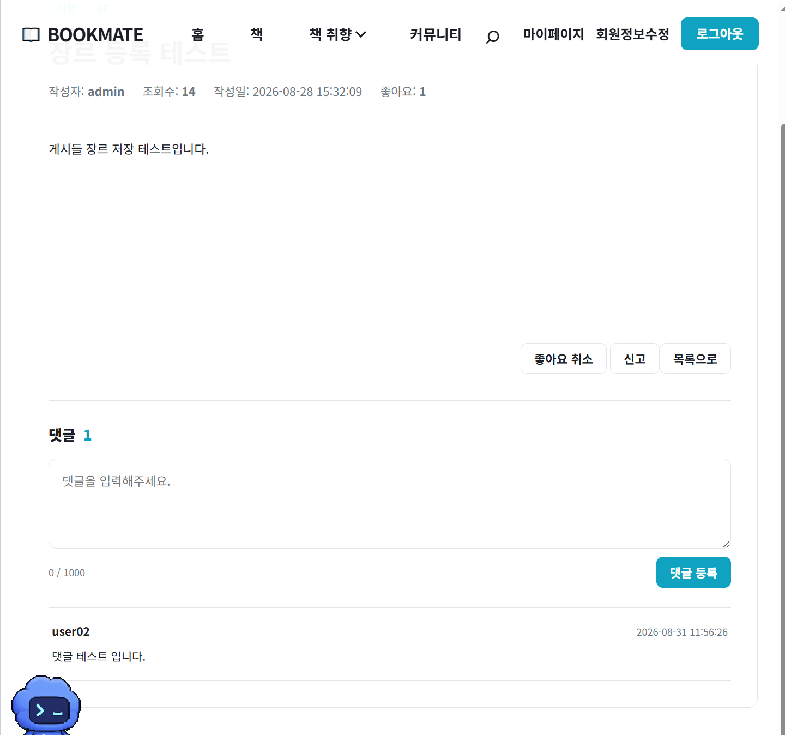

## 작성자 수정과 소프트 삭제

댓글 수정과 삭제는 현재 로그인한 회원이 댓글 작성자인지 Service에서 다시 확인한 뒤 처리한다.
수정할 때는 내용과 수정 시각을 갱신하고, 삭제할 때는 행을 바로 지우지 않고 상태를
`DELETED`로 바꾸며 수정 시각을 함께 기록한다. 다른 회원이 요청하면 권한 오류가 발생하도록
구성해 화면의 버튼 노출 여부와 별개로 서버에서도 작성자 권한을 보호했다.

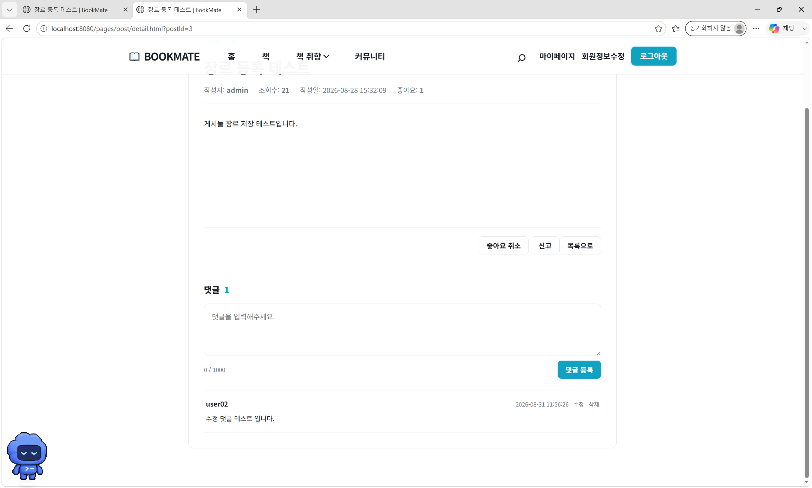

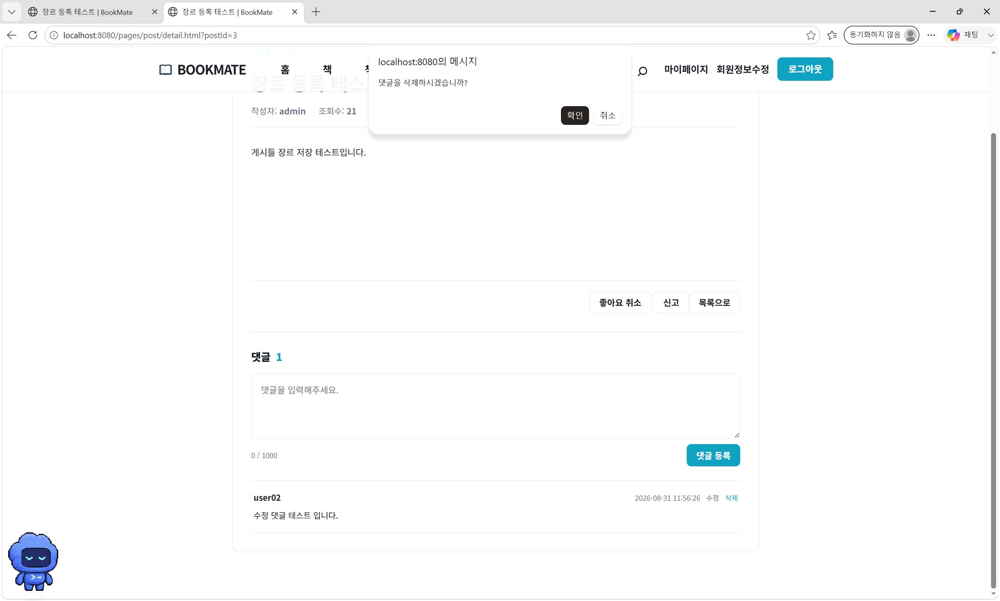

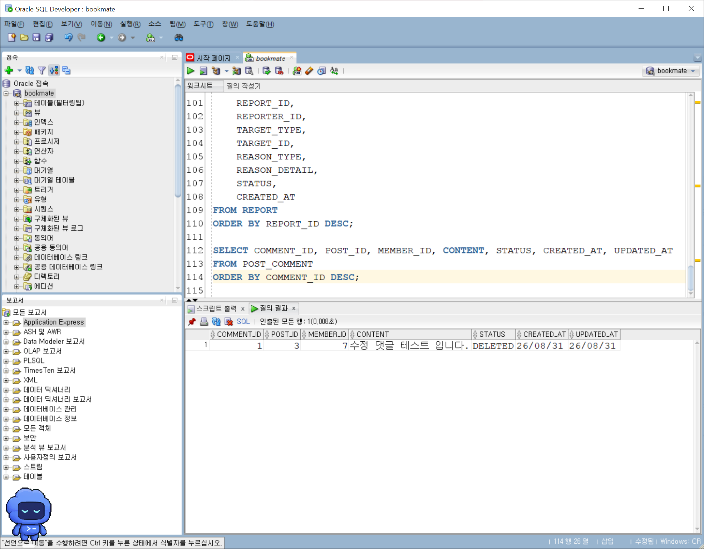

## 게시글·댓글 공통 신고

신고 기능은 대상 유형을 `POST` 또는 `COMMENT`로 구분하고 같은 신고 API 흐름을 사용한다.
스팸, 욕설·비방, 부적절한 콘텐츠, 기타 중에서 사유를 선택하고 필요한 경우 상세 내용을
입력할 수 있도록 모달을 연결했다. 신고가 접수되면 `REPORT` 테이블에 `PENDING` 상태로
저장된다.

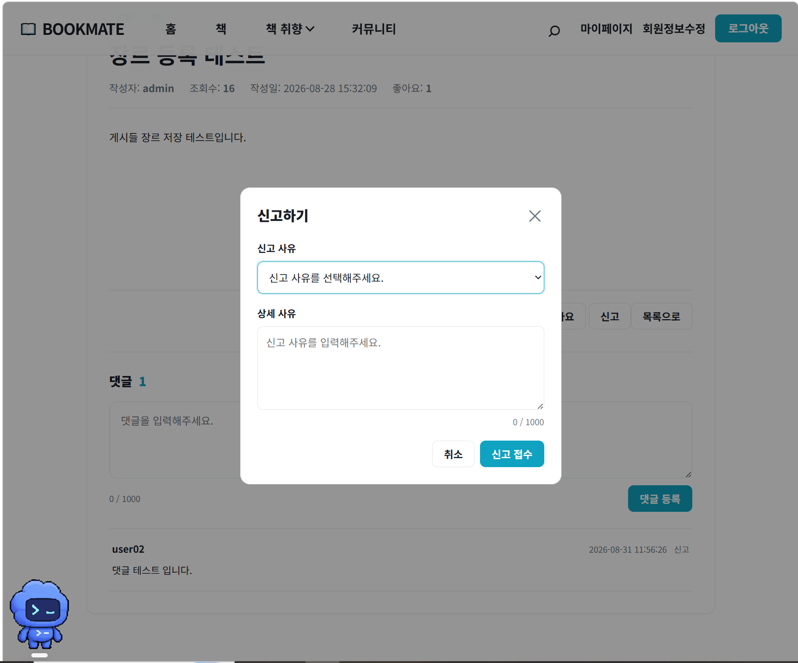

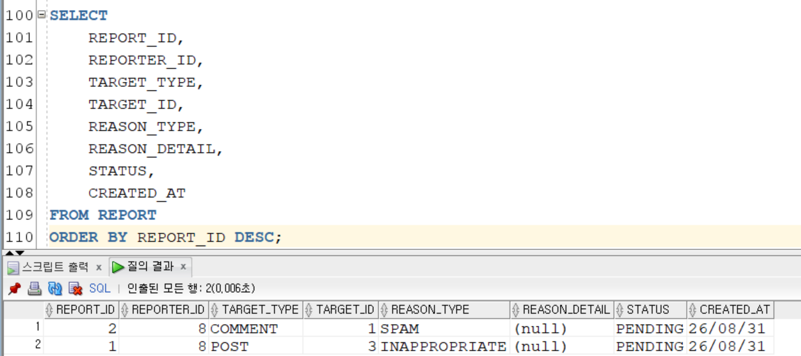

같은 사용자가 같은 대상을 다시 신고했는지 `reporter_id`, `target_type`, `target_id` 조합으로
확인하고, 이미 신고한 대상이면 새 행을 추가하지 않는다. 자신의 게시글이나 댓글을 신고하는
요청도 Service에서 차단했다.

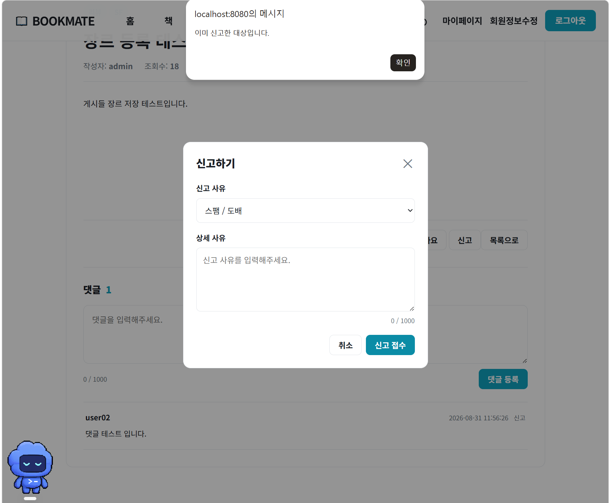

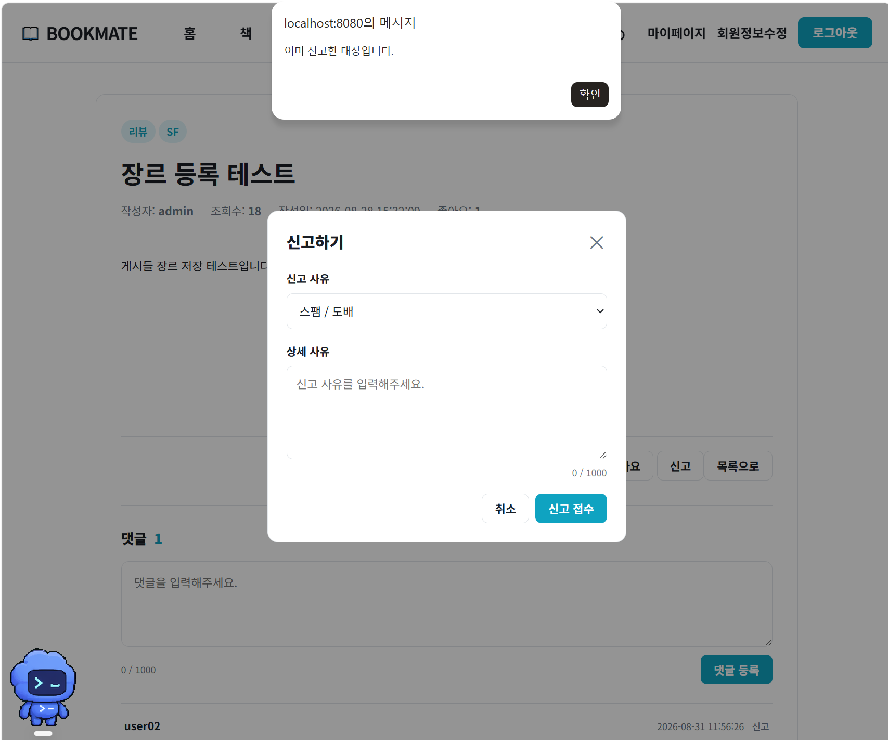

## 커뮤니티 목록 탐색 보완

댓글과 신고 기능을 상세 화면에 연결하면서 커뮤니티 목록의 페이지 이동 영역도 함께 정리했다.
목록에서 여러 페이지를 탐색한 뒤 게시글 상세로 들어가는 흐름이 자연스럽게 이어지도록
페이지 번호와 이동 버튼의 위치를 확인했다.

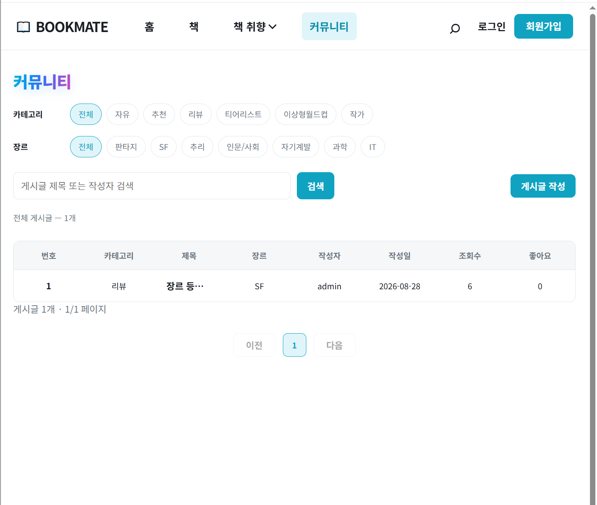

## 관리자 게시글·댓글 관리

처음에는 회원과 콘텐츠 관리 기능이 한 화면에 모여 있었지만, 관리 기능이 늘어나면서 게시글과
댓글을 별도 화면으로 분리했다. 관리자는 댓글 목록을 조회하고 삭제 및 상태 처리를 할 수 있으며,
사이드 내비게이션으로 대시보드·회원·게시글·댓글 관리 화면을 오갈 수 있게 구성했다.

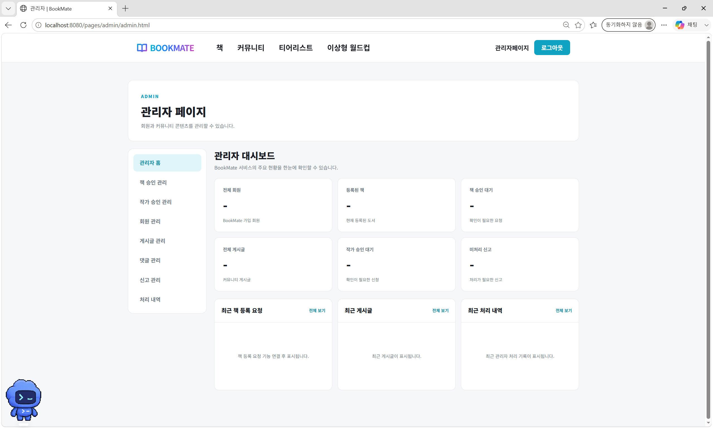

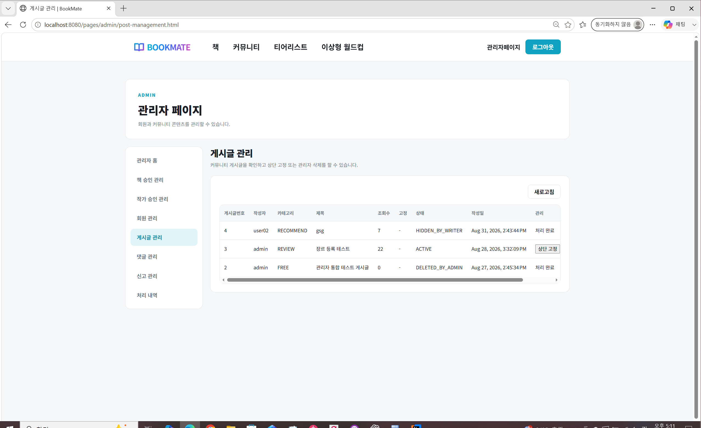

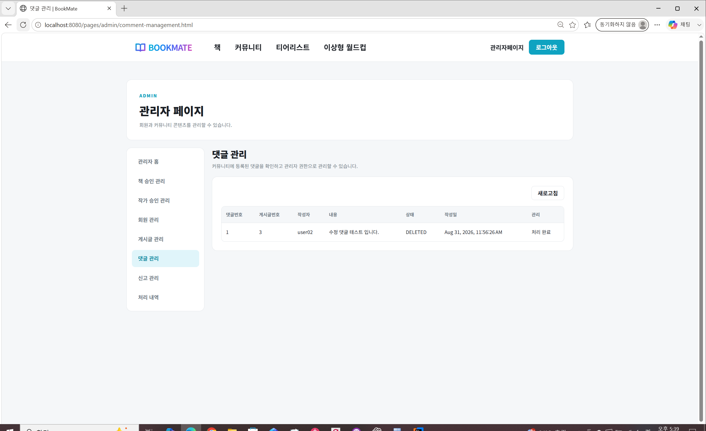

## 검증 결과

| 검증 항목 | 결과 |
| --- | --- |
| 게시글 상세의 댓글 목록 조회와 등록 | 화면 확인 |
| 작성자 본인의 댓글 수정 | 화면 확인 |
| 댓글 삭제 후 `DELETED` 상태 변경 | 화면·DB 확인 |
| 댓글 신고 모달과 `PENDING` 저장 | 화면·DB 확인 |
| 게시글·댓글 중복 신고 차단 | 화면 확인 |
| 본인 콘텐츠 신고 차단 | 코드 경로 확인 |
| 관리자 게시글·댓글 관리 화면 분리 | 화면 확인 |
| 관리자 댓글 목록·삭제·상태 처리 | 코드 경로 확인 |
| 두 기능 브랜치의 PR 생성 및 `main` 병합 | 완료 |

## 회고

오늘은 댓글 CRUD를 단순한 화면 기능으로만 보지 않고 작성자 권한과 데이터 상태까지 함께
설계했다. 소프트 삭제를 사용해 기록을 유지하고, 신고 대상을 게시글과 댓글로 일반화하면서
공통 로직을 만드는 방법도 익혔다. 또한 기능이 많아진 관리자 페이지를 역할별 화면으로
분리해 사용자 기능과 운영자 기능을 함께 생각해 볼 수 있었다. 화면, 서버 로직과 DB 상태를
나누어 확인한 과정이 기능의 정상 동작과 예외 처리를 검증하는 데 도움이 됐다.
