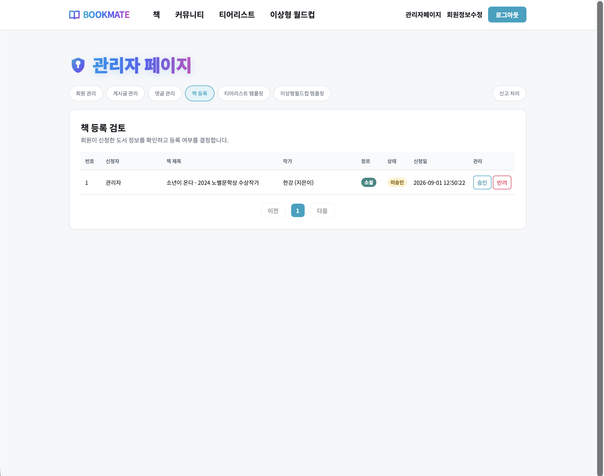
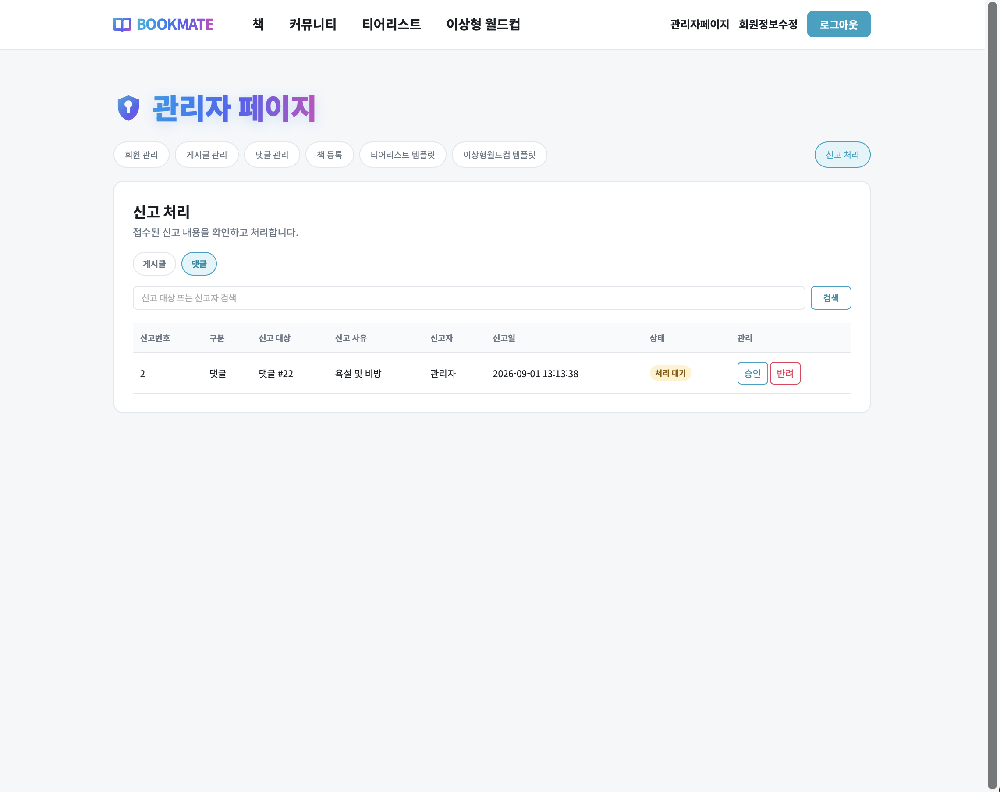
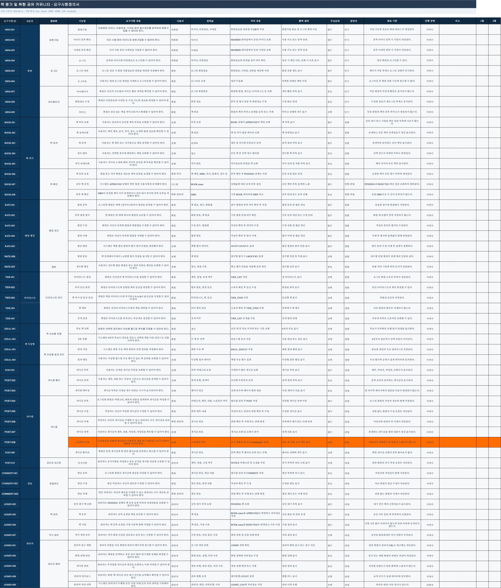
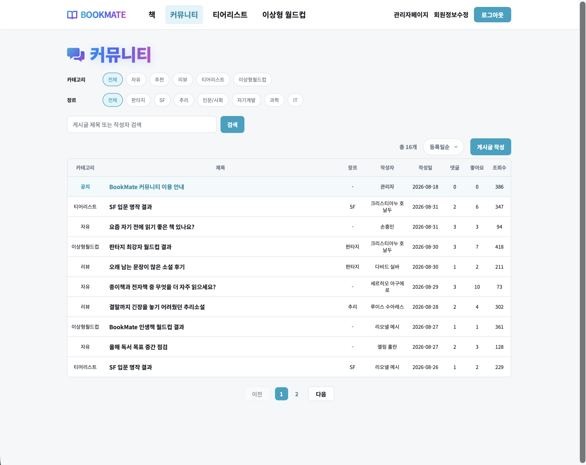
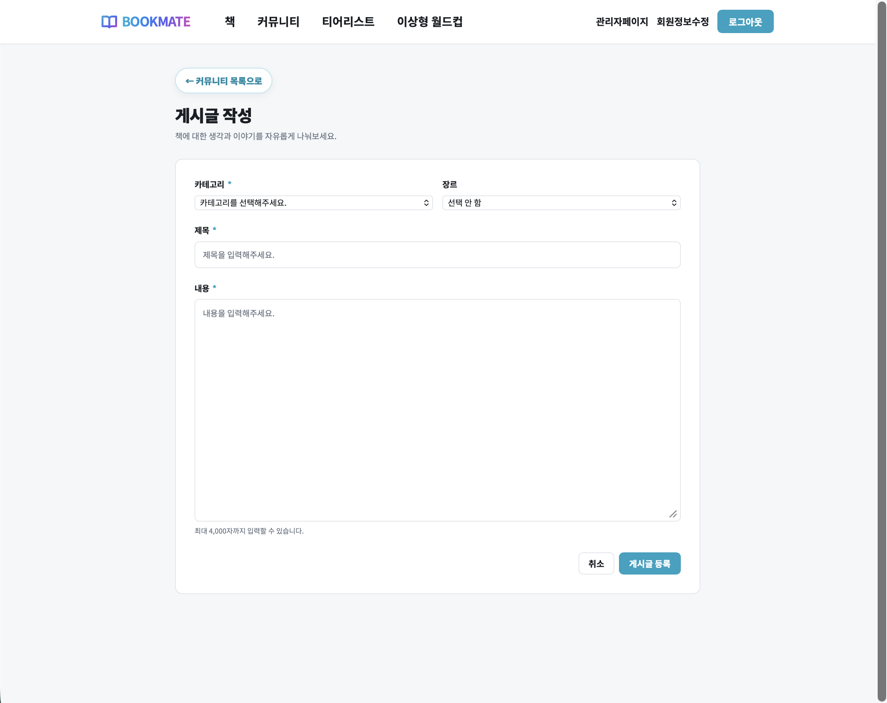
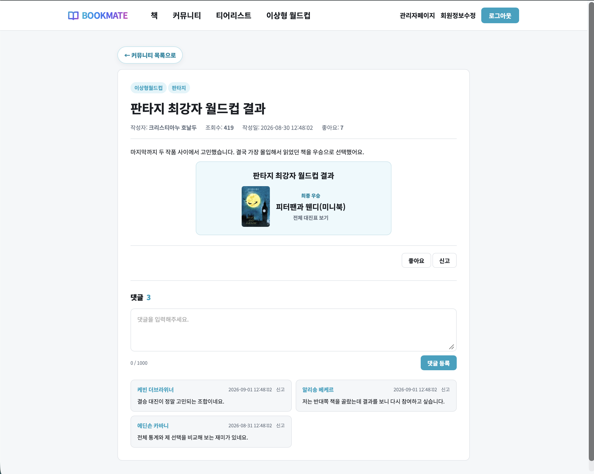
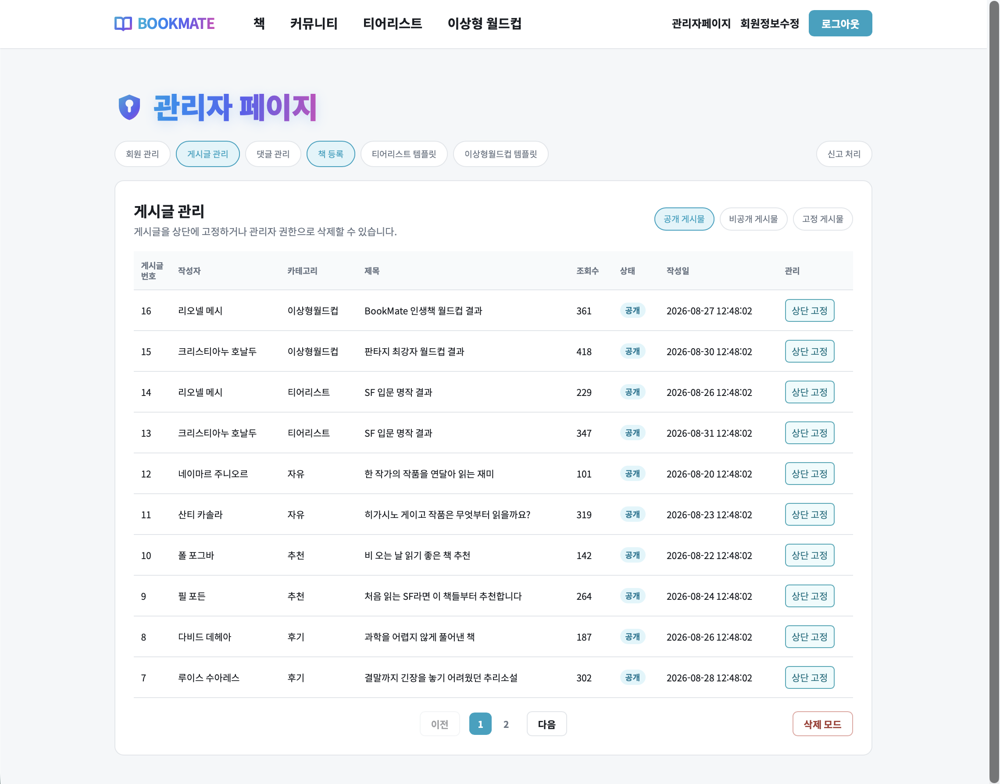
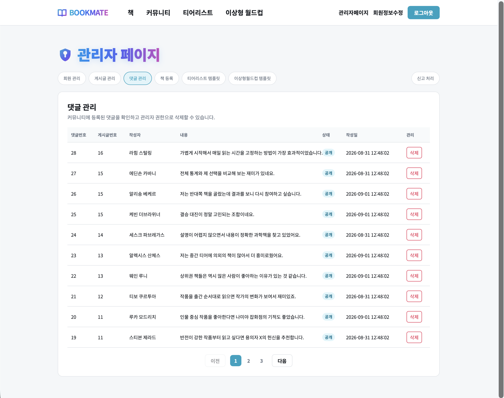
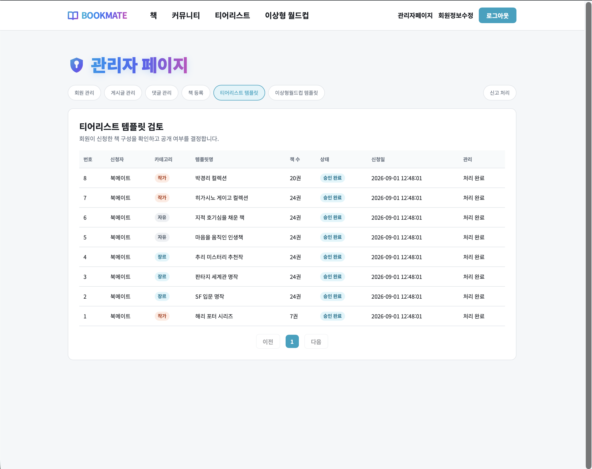
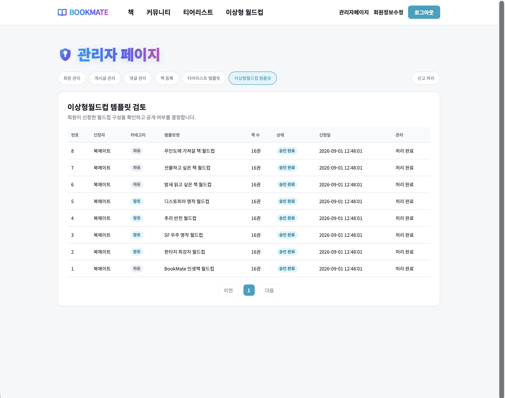

# DAY 34 — BookMate 관리자 승인·신고 처리와 GPT 협업

> 2026-09-01 미니프로젝트 기록 · Java Servlet, JDBC, Oracle, JavaScript, GPT 협업

오늘은 BookMate 관리자 기능을 확장하고, GPT를 활용해 기존 코드와 새 기능을 병합하며 오류
원인을 점검했다. GitHub에는 책 등록 승인 화면, 게시글·댓글 신고 처리 API와 관리자 UI를
단계별로 올렸다. 실제 데이터 구조에 없는 사용자 신고 항목은 후속 수정에서 제거해 지원 범위와
화면을 일치시켰다. 프로젝트 전체 화면과 요구사항정의서도 최종 상태로 정리했다.

## GitHub에 올린 작업

오늘 직접 올린 기능 커밋과 Pull Request는 다음 세 단계다.

| 단계 | GitHub 기록 | 반영 내용 |
| --- | --- | --- |
| 책 승인 | [`5ac1850` 커밋](https://github.com/ahnjh97/BookMate/commit/5ac185055c0b59ef3d6b6884d348223ccfcdfcf1) · [PR #10](https://github.com/ahnjh97/BookMate/pull/10) | 책 승인 목록·상세 UI, 승인 요청 DTO 구조 |
| 신고 처리 | [`051c4d6` 커밋](https://github.com/ahnjh97/BookMate/commit/051c4d63c4533e5713ba6249ca89710fee7c5719) · [PR #11](https://github.com/ahnjh97/BookMate/pull/11) | 신고 조회·유형 필터·검색, 승인·반려와 처리 정보 저장 |
| 범위 수정 | [`a91c0d8` 커밋](https://github.com/ahnjh97/BookMate/commit/a91c0d8e962e4192a50cc31a2b3167976d20d2d9) · [PR #12](https://github.com/ahnjh97/BookMate/pull/12) | 지원하지 않는 사용자 신고 필터 제거 |

세 PR은 모두 `main` 브랜치에 병합됐다. PR #10에서는 10개 파일, PR #11에서는 7개 파일,
PR #12에서는 1개 파일을 변경했다.

## 오늘 작업한 흐름

```text
회원의 책 등록 요청
  ↓
관리자 책 승인 목록·상세 화면에서 요청 정보 검토
  ↓
승인 또는 반려를 위한 UI와 DTO 구조 준비

게시글·댓글 신고 접수
  ↓
관리자가 유형별 목록 조회·검색
  ↓
PENDING 신고를 APPROVED 또는 REJECTED로 처리
  ↓
관리자 번호·메모·처리 시각 저장

GPT 협업
  ├─ 기존 관리자 코드와 신고 처리 코드 병합 검토
  ├─ 지원하지 않는 사용자 신고 항목 발견 및 제거 범위 정리
  ├─ 스포일러 값 저장·조회 누락 지점 진단
  └─ 프로젝트 시연 영상의 화질·압축 상태 분석
```

## 책 등록 승인 화면

사용자가 신청한 책을 관리자가 검토할 수 있도록 승인 목록과 상세 화면을 추가했다.
`BookRequestDTO`에는 신청자, 책 제목·작가·출판사·ISBN·장르·출간일·설명·이미지·출처와
승인 상태, 거절 사유, 검토자와 처리 시각을 담을 수 있는 구조를 만들었다. 목록 화면에서는
승인 대기 데이터를 확인하고 승인 또는 반려 작업으로 이어질 수 있게 구성했다.



이번 커밋의 범위는 승인 목록·상세 UI와 DTO 구조까지다. 실제 승인·반려 API가 완료된 것으로
과장하지 않고, 다음 백엔드 연결을 위한 화면과 데이터 틀을 준비한 작업으로 기록한다.

## 관리자 신고 조회와 처리

`/api/admin/reports`에서 게시글과 댓글 신고 목록을 유형별로 조회하고 검색어로 신고자,
사유, 상세 내용과 대상 번호를 찾을 수 있게 했다. 관리자는 대기 중인 신고를 승인 또는 반려할
수 있으며, 처리 시 `admin_id`, 관리자 메모와 `processed_at`을 함께 저장한다.




Service에서는 처리 상태를 `APPROVED`와 `REJECTED`로 제한하고, 이미 `PENDING`이 아닌 신고는
다시 처리하지 못하게 검증한다. DAO의 상태 변경 조건에도 `status = 'PENDING'`을 넣고 전체
작업을 트랜잭션으로 묶어 중복 처리와 일부 저장을 방지했다. 처리 중 충돌은 `409 Conflict`로
구분하도록 Controller의 응답도 정리했다.

## 실제 지원 범위에 맞춘 후속 수정

첫 신고 관리 화면에는 사용자 신고 필터가 포함되어 있었지만 별도의 사용자 신고 유형은
지원하지 않았다. GPT와 코드를 다시 확인한 뒤 존재하지 않는 사용자 신고 메뉴를 제거하고,
기능 추가는 `feat`, 잘못 노출된 항목의 제거는 `fix`로 커밋 목적을 구분했다.

이 과정에서 기능을 많이 보여주는 것보다 DB와 API가 실제로 지원하는 범위만 노출하는 것이
중요하다는 점을 확인했다.

## GPT와 함께 점검한 내용

### 1. 관리자 코드 충돌 병합

기존 `admin.js`의 회원·게시글·댓글·책·티어리스트·월드컵 관리, 빠른 툴팁과 날짜 포맷 기능은
유지하면서 신고 탭·검색·조회·처리 로직을 합쳤다. 충돌을 해결할 때 어느 한쪽 파일을 통째로
선택하지 않고, 기존 기능과 새 기능의 초기화 순서와 상태 변수를 비교해 필요한 부분을 병합했다.

### 2. 스포일러 기능 원인 진단

게시글 작성 화면에서는 `isSpoiler` 값을 `Y` 또는 `N`으로 전송하고 있었지만 기능이 나타나지
않는 문제를 점검했다. GPT와 프런트 요청, Controller·Service, DAO, DB 순서로 추적한 결과
`POST` 등록 SQL과 상세 조회에 `is_spoiler` 저장·조회가 빠졌을 가능성을 핵심 원인으로
좁혔다. 이 항목은 완료 기능이 아니라 다음 수정에서 검증할 진단 결과로 남긴다.

최종 요구사항정의서에도 스포일러 포함 여부와 내용 가리기 흐름을 표시해 구현 범위를 다시
확인했다.



### 3. 프로젝트 시연 영상 점검

GPT로 원본 시연 영상을 분석해 단순 해상도 부족보다 작은 글자와 UI 경계가 부드럽게 번지는
문제가 크다는 결론을 얻었다. 4K 단순 확대보다 1080p 유지, 약한 선명화와 반복 인코딩 최소화가
적합하다는 기준을 세웠다.

준비한 `bookMate_enhanced.mp4`는 1920×1080, 29.97fps, 5분 12초, H.264 High Profile과
AAC 오디오로 확인했다. 약 58MB의 영상은 저장소 크기를 불필요하게 늘리지 않도록 공개 일지에
직접 포함하지 않고 분석 결과와 대표 화면만 기록했다.

## 통합 화면 정리

최종 화면에서는 홈, 커뮤니티, 게시글 작성과 상세가 같은 로고·내비게이션·색상 체계를 사용한다.
관리자 페이지 역시 게시글, 댓글, 책 등록, 티어리스트, 이상형 월드컵과 신고 처리를 한 화면의
탭 구조로 연결했다.
















## 검증 결과

| 검증 항목 | 결과 |
| --- | --- |
| 책 승인 목록·상세 UI와 DTO 구조 | 커밋·화면 확인 |
| 게시글·댓글 신고 유형별 조회와 검색 | 코드·화면 확인 |
| 신고 승인·반려와 관리자 처리 정보 저장 | 코드 경로 확인 |
| 이미 처리된 신고의 재처리 방지 | 코드 경로 확인 |
| 지원하지 않는 사용자 신고 필터 제거 | 후속 커밋 확인 |
| 스포일러 저장·조회 누락 지점 | 원인 후보 진단, 추가 검증 필요 |
| 프로젝트 영상 메타데이터와 압축 상태 | 분석 완료 |
| PR #10·#11·#12의 `main` 병합 | 완료 |

## 회고

오늘은 기능 추가뿐 아니라 실제 데이터 구조와 UI의 범위를 다시 맞추는 과정이 중요했다.
신고 상태를 트랜잭션으로 처리하고 이미 완료된 신고를 막으면서 운영 기능의 일관성을 배웠다.
또한 GPT를 전체 코드의 대체물이 아니라 충돌 지점 비교, 누락된 데이터 흐름 추적, 커밋 목적
정리와 영상 품질 분석에 활용했다. 완료된 GitHub 작업과 아직 진단 단계인 스포일러 문제를
구분해 기록하면서 포트폴리오의 정확성도 유지할 수 있었다.
