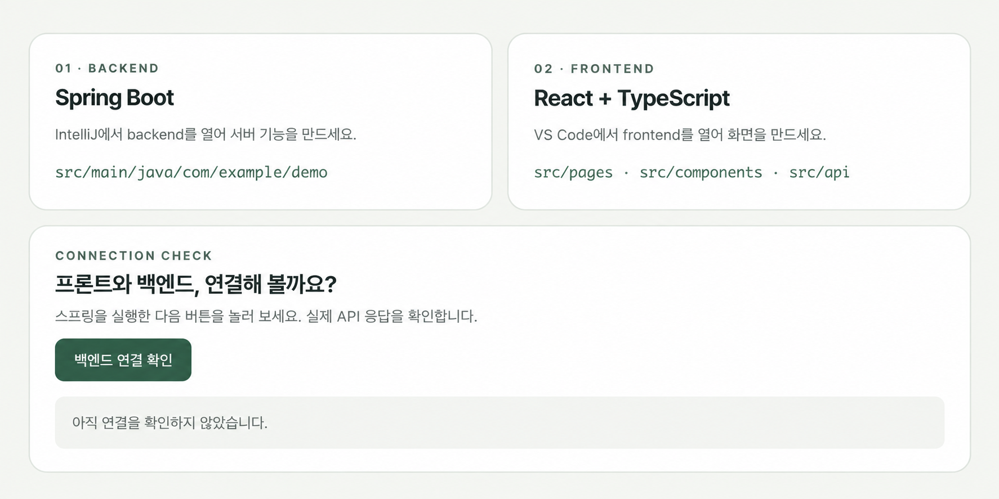

# DAY 52 — 미니프로젝트 II 개발환경 설정과 통합 구조 확인

> 2026-09-23 · Spring Boot, Gradle, React, TypeScript, 통합 저장소, 개발환경 설정

오늘은 미니프로젝트 II의 기능을 바로 구현하기보다 팀원들이 같은 환경에서 작업할 수 있도록
기본 프로젝트의 구성을 확인하고 실행 준비를 맞췄다. 제공된 프로젝트는 Spring Boot 백엔드와
React·TypeScript 프론트엔드를 하나의 Git 저장소에서 관리하는 구조였다. IntelliJ에서 백엔드와
Gradle 구성을 확인하고 프론트 화면을 실행했으며, 백엔드 실행과 API 연결 확인은 다음 작업으로
이어가기로 했다.

## 1. 오늘의 목표

- 프로젝트를 내려받아 로컬 개발 도구에서 열기
- 백엔드·프론트엔드·DB·문서 폴더의 역할 구분하기
- Spring Boot와 Gradle 실행 구조 확인하기
- React·TypeScript 기본 화면이 실행되는지 확인하기
- 운영체제별 실행 스크립트와 환경 설정 방식 살펴보기
- 프론트엔드와 백엔드 연결을 검증할 다음 단계 정리하기

## 2. 통합 프로젝트 구조

하나의 저장소 안에서 애플리케이션 전체를 관리할 수 있도록 영역이 나뉘어 있었다.

```text
project/
├── backend/     Spring Boot·Gradle 백엔드
├── frontend/    React·TypeScript 프론트엔드
├── db/          데이터베이스 관련 자료
├── docs/        프로젝트 문서
└── .github/     GitHub 협업 설정
```

이 구조에서는 프론트엔드와 백엔드의 코드를 분리하면서도 이슈, 문서와 변경 이력을 한 저장소에서
함께 관리할 수 있다. 다만 각 영역의 실행 명령과 환경 변수는 서로 다르므로 처음에 공통 실행
절차를 맞추는 과정이 중요하다.

## 3. Spring Boot·Gradle 환경 확인

IntelliJ에서 백엔드 모듈과 Gradle 작업 목록을 확인하고 `bootRun` 실행을 시도했다. 첫 실행은
정상 완료되지 않았으므로, 오류 원인을 단정하기보다 다음 실행에서 전체 로그와 환경 설정을
차례로 점검하기로 했다.

```bash
# 백엔드 개발 서버 실행 예시
./gradlew bootRun

# 컴파일과 테스트를 포함한 빌드 예시
./gradlew clean build
```

실행이 중단될 때는 Java 버전, Gradle Wrapper 권한, 환경 변수, 사용 중인 포트와 데이터베이스
연결 설정을 하나씩 확인해야 한다. 화면에 표시된 마지막 문장만으로 원인을 결정하지 않고
`--stacktrace`나 자세한 로그를 확인하는 것도 필요하다.

## 4. React·TypeScript 기본 화면 실행

프론트엔드에서는 제공된 기본 화면이 브라우저에 표시되는 것을 확인했다. 화면을 통해 백엔드는
Spring Boot, 프론트엔드는 React와 TypeScript로 구성되어 있으며 `pages`, `components`, `api`
영역을 나누어 관리한다는 점을 확인할 수 있었다.



이 화면은 프로젝트의 최종 기능이 아니라 프론트엔드와 백엔드의 연결을 확인하기 위한 시작용
화면이다. 따라서 오늘 기록에서는 직접 구현한 결과로 표현하지 않고, 개발환경이 준비되는
과정을 보여 주는 자료로만 사용했다.

## 5. 환경 설정과 실행 스크립트

프로젝트에는 Windows와 macOS 등 서로 다른 환경에서 초기 설정과 실행을 돕는 스크립트가
준비되어 있었다. 팀 프로젝트에서는 이런 스크립트의 역할을 문서화하면 각자 다른 운영체제를
사용하더라도 같은 순서로 프로젝트를 시작할 수 있다.

환경 설정을 관리할 때는 다음 원칙도 함께 지켜야 한다.

- 비밀번호·API 키·DB 접속 정보는 Git에 직접 기록하지 않는다.
- 개인 환경 파일은 `.gitignore`로 제외하고 예시 파일만 공유한다.
- 필요한 Java·Node.js 버전과 실행 명령을 문서에 명확히 남긴다.
- 실행 스크립트가 실패하면 어떤 단계에서 멈췄는지 로그로 확인한다.

## 6. 다음 연결 확인 순서

기본 화면에는 아직 백엔드 연결을 확인하지 않았다는 상태가 표시되었다. 다음 작업에서는 아래
순서로 실제 연결을 검증할 예정이다.

1. Spring Boot가 끝까지 정상 기동하는지 확인한다.
2. 백엔드 포트와 간단한 확인용 API 경로를 점검한다.
3. 프론트엔드의 API 기본 주소와 환경 변수를 맞춘다.
4. 필요한 경우 CORS 허용 범위를 설정한다.
5. 연결 버튼의 요청과 응답을 브라우저 개발자 도구에서 확인한다.
6. 팀 공통 실행 절차를 README에 정리한다.

## 오늘의 정리

- 미니프로젝트 II의 통합 저장소와 주요 폴더 역할을 확인했다.
- Spring Boot·Gradle 백엔드와 React·TypeScript 프론트엔드 구성을 파악했다.
- IntelliJ에서 백엔드 실행을 시도하고 실패 시 확인할 항목을 정리했다.
- 제공된 프론트엔드 기본 화면이 실행되는 것을 확인했다.
- 백엔드 정상 기동과 API 연결은 아직 완료되지 않은 다음 단계로 구분했다.
- 팀원이 같은 환경을 만들 수 있도록 실행 절차와 비밀정보 관리가 중요하다는 점을 익혔다.

> 원본 IDE 화면에는 팀 저장소명, 내부 폴더와 실행 스크립트가 표시되어 있어 공개하지 않았다.
> 대표 화면도 팀 이름과 프로젝트 소개 영역을 제외하고 기술 구성과 연결 상태 부분만 남긴
> 공개용 사본을 사용했다. 실제 프로젝트 저장소나 설정 파일은 수정하거나 복사하지 않았다.
