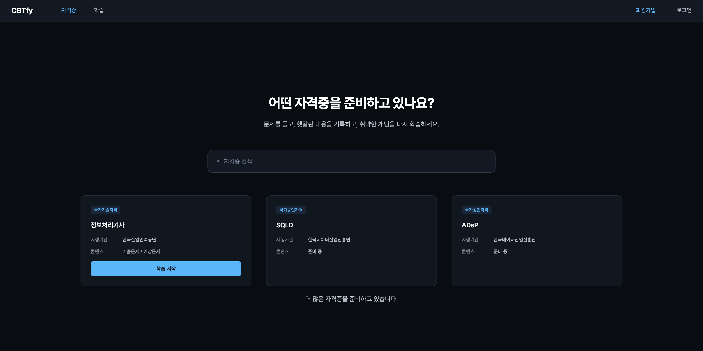
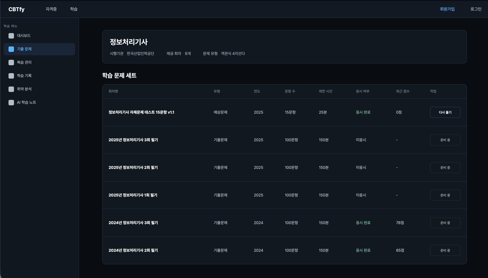
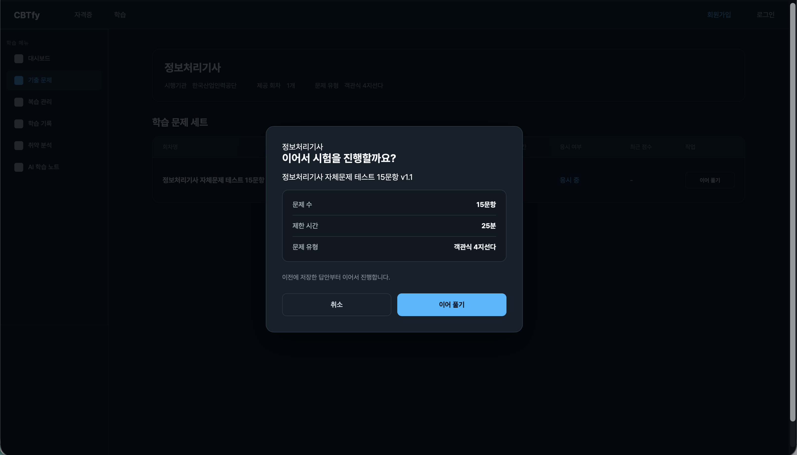
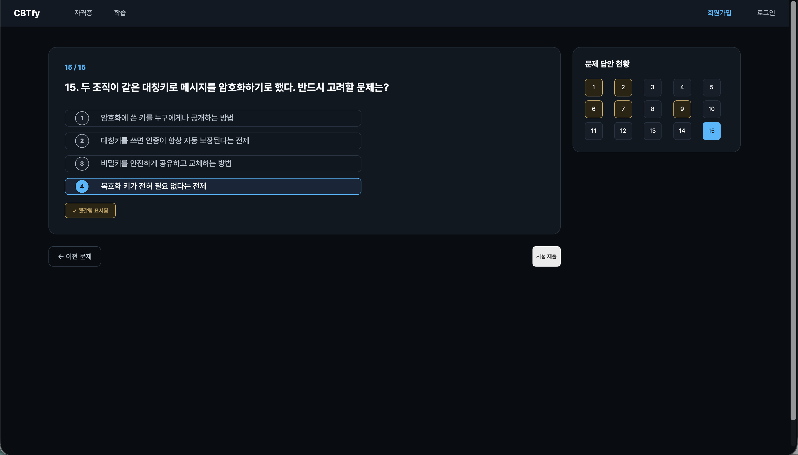
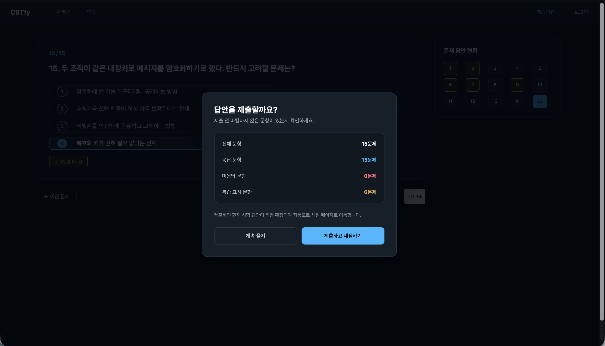
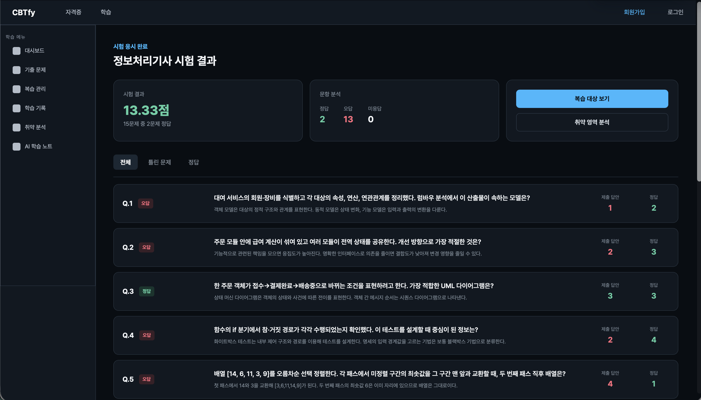

# DAY 56 — 비회원 시험 응시 흐름을 프론트부터 백엔드까지 연결하기

> 2026-10-01 · CBTfy, Spring Boot, React, 시험 응시, 답안 저장, 자동 채점

오늘은 미니프로젝트 II에서 **홈의 자격증 선택부터 회차 선택, 문제 풀이, 제출, 채점 결과와 오답
확인까지** 이어지는 시험 응시 흐름을 구현했다. 화면만 연결하는 데서 끝내지 않고 문제·회차 조회,
응시 기록 생성, 답안 저장과 자동 채점 API를 Spring Boot로 만들고 React 화면에서 호출했다.

이 기록은 팀 저장소의 전체 변경이 아니라, 2026년 10월 1일에 `jungryulip` 계정으로 직접 반영한
커밋과 해당 코드만 확인해 정리했다.

## 1. 오늘의 목표

- 홈에서 응시할 자격증을 검색하고 선택할 수 있게 하기
- 선택한 자격증의 시험 회차와 응시 상태를 보여 주기
- 문제와 보기를 API로 불러오고 선택한 답을 즉시 저장하기
- 이전 답안을 복원해 진행 중인 시험을 이어서 풀 수 있게 하기
- 헷갈리는 문제를 화면에서 표시하고 제출 전 개수를 확인하기
- 제출 시 서버에서 자동 채점하고 정답·오답·해설을 결과 화면에 보여 주기

## 2. 내가 작업한 범위

오늘 직접 작성한 네 개의 커밋을 기준으로 작업 범위를 확인했다.

| 시간 | 작업 | 주요 범위 |
| --- | --- | --- |
| 09:26 | 홈 화면 자격증 카드와 검색 UI | 자격증 검색, 정보처리기사 선택, 화면 이동 |
| 12:14 | 문제 조회 API와 기본 문제풀이 화면 | 문제·버전·보기 조회, 문제/선택지 UI |
| 15:05 | 답안 저장과 채점 결과 화면 | 응시 시작, 답안 저장·수정, 제출·채점, 결과 조회 |
| 17:10 | 회차 선택·이어풀기·복습 표시 | 회차 상태, 기존 응시 복원, 시작 모달, 헷갈림 표시 UI |

팀원이 같은 날 작업한 로그인 상태 관리, 공통 API 구조와 라우터 골격 등은 오늘의 개인 작업 범위에
포함하지 않았다.

## 3. 시간순 작업 기록

### 오전 — 홈 선택과 문제 조회 연결

먼저 홈에 정보처리기사·SQLD·ADsP 카드를 배치하고 검색어에 따라 카드를 거를 수 있게 했다. 현재
응시 가능한 정보처리기사를 선택하면 자격증별 회차 화면으로 이동하도록 라우팅을 연결했다.

공용 DB 연결 상태와 문제 데이터를 확인한 뒤, 문제·문제 버전·보기 모델과 저장소를 구성했다. 서버는
선택한 시험 회차의 문제를 번호순으로 반환하고, 프론트는 문제 본문과 네 개의 보기를 받아 기본
문제풀이 화면에 표시하도록 했다.

### 점심 이후 — 응시·답안·제출 API 검증

응시를 시작하면 제한 시간과 전체 문항 수를 포함한 `IN_PROGRESS` 응시 기록을 생성하도록 했다.
답안을 선택할 때마다 같은 응시·문제 조합의 값을 새로 만들거나 수정하고, 응시 당시의 문제 본문,
보기, 정답과 해설을 스냅샷으로 함께 저장했다. 문제가 나중에 수정되어도 당시 채점 기준을 보존하기
위한 구조다.

Postman과 DB에서 응시 생성, 답안 저장·변경, 제출과 결과 조회를 차례로 확인했다. 제출 시에는 저장된
답과 정답 스냅샷을 비교하고, `정답 수 ÷ 전체 문항 수 × 100`으로 점수를 계산한 뒤 응시 상태를
`SUBMITTED`로 바꾸도록 했다.

### 오후 — 회차 선택부터 결과 화면까지 완성

시험 회차별 문항 수, 제한 시간, 응시 여부, 최근 점수와 작업 버튼을 표시했다. 진행 중인 시험에는
`이어 풀기`, 새 시험에는 `시험 시작`, 제출한 시험에는 상태와 점수를 구분해 보여 주었다. 기존
응시의 답안을 다시 불러와 선택 상태를 복원하고, 문제 번호 패널에서 현재·응답·미응답·헷갈림 상태를
구분했다.

마지막으로 제출 확인 모달과 결과 화면에 공통 다크 테마를 적용했다. 결과 화면에서는 전체·틀린 문제·
정답 필터를 제공하고, 각 문제의 제출 답안과 정답, 해설을 함께 비교할 수 있게 했다.

## 4. 사용자 흐름

### 1) 홈에서 자격증 선택

비회원 화면에서도 자격증 목록을 볼 수 있고, 사용 가능한 정보처리기사의 `학습 시작`을 누르면 회차
선택 화면으로 이동한다.

### 2) 시험 회차와 응시 상태 확인

회차별 유형, 연도, 문항 수, 제한 시간, 응시 상태와 최근 점수를 한 표에서 확인하도록 구성했다.

### 3) 시험 시작 또는 이어 풀기

시작 전 문제 수와 제한 시간을 확인한다. 진행 중인 응시 기록이 있으면 새 기록을 만들지 않고 기존
답안부터 이어서 풀 수 있다.

### 4) 문제 풀이와 헷갈림 표시

답을 선택하면 서버에 바로 저장하고, 이전·다음 버튼이나 문제 번호로 이동한다. 잘 모르겠는 문제는
헷갈림 상태로 표시해 제출 전 다시 확인할 수 있게 했다.

### 5) 제출 전 응답 상태 확인

전체·응답·미응답·헷갈림 표시 문항 수를 확인하고, 더 풀거나 제출·채점 중 하나를 선택한다.

### 6) 점수와 오답 확인

채점 결과와 정답·오답·미응답 수를 요약하고, 문항별 제출 답안과 정답, 해설을 비교할 수 있게 했다.

## 5. 백엔드에서 구현한 흐름

| 기능 | 요청 | 처리 내용 |
| --- | --- | --- |
| 회차 조회 | `GET /api/certs/{certId}/exam-sets` | 회차 정보와 최신 응시 상태·점수 반환 |
| 문제 조회 | `GET /api/exam-sets/{examSetId}/questions` | 문제 버전과 네 개의 보기 반환 |
| 응시 시작 | `POST /api/attempts` | 응시 기록, 만료 시각과 전체 문항 수 저장 |
| 답안 저장 | `POST /api/answers` | 선택 답과 문제·정답·해설 스냅샷 저장 |
| 답안 복원 | `GET /api/attempts/{attemptId}/answers` | 진행 중인 답안 상태 반환 |
| 제출·채점 | `POST /api/attempts/{attemptId}/submit` | 정오 판정, 점수 계산과 제출 상태 확정 |
| 결과 조회 | `GET /api/attempts/{attemptId}/result` | 점수와 문항별 제출 답·정답·해설 반환 |

## 6. 프론트엔드에서 구현한 흐름

- `HomePage`: 자격증 카드, 검색 필터와 자격증별 이동
- `ExamSetPage`: 회차 목록, 응시 상태와 시작·이어풀기 선택
- `ExamStartModal`: 문항 수·제한 시간 확인과 시작 동작
- `ExamPage`: 문제·보기, 답안 저장, 번호 이동, 헷갈림 표시와 제출 요약
- `ExamResultPage`: 점수 요약, 정오답 필터와 문항별 결과
- `questions`, `examSets`, `attempts` API 모듈: 각 화면과 Spring Boot API 연결

## 7. 현재 구현 범위와 다음 보완점

화면은 비회원이 바로 진입하는 흐름으로 구성했지만, 현재 개발 버전에서는 응시 기록을 구분하기 위해
임시 회원 ID를 사용한다. 따라서 완전한 익명 응시를 위해서는 브라우저 세션이나 임시 식별자를
발급하고 서버에서 검증하는 단계가 더 필요하다.

헷갈림 표시는 현재 문제풀이 화면과 제출 요약에는 반영되지만, 새 표시를 서버에 저장하는 요청은 아직
연결되지 않았다. 다음 단계에서는 답안과 함께 복습 표시를 저장하고 새로고침·재접속 후에도 유지되게
보완할 예정이다. 회차 화면의 준비 중 항목도 실제 DB 데이터로 차례로 교체할 계획이다.

## 8. 공개 전 보안 점검

- DB·Postman·테이블 명세 화면은 접속 정보, 내부 API와 테스트 계정이 보여 공개하지 않았다.
- 개인 이름이 표시된 시험 시작 화면과 스타일 적용 전 중간 화면도 제외했다.
- 팀 저장소명, 팀원 계정, 브랜치와 설정 파일은 포트폴리오에 복사하지 않았다.
- `.DS_Store`를 제외하고 개인정보·비밀번호·토큰이 없는 최종 화면 다섯 장만 사용했다.
- 화면의 문항은 개발 검증용으로만 사용하고, 실제 기출문제·교재 원문은 출처와 이용 범위를 확인한 뒤 공개해야 한다.
- 백엔드·프론트엔드 팀 프로젝트 파일은 읽기만 했으며 수정하지 않았다.

## 오늘의 정리

- 홈의 자격증 선택부터 회차 선택과 시험 시작까지 연결했다.
- 문제 조회와 답안 저장 API를 만들고 React 문제풀이 화면에 연동했다.
- 진행 중인 답안을 복원해 이어서 풀 수 있는 흐름을 구성했다.
- 제출 시 서버에서 자동 채점하고 결과·오답·해설을 보여 주었다.
- 헷갈림 표시 UI와 제출 전 상태 집계를 구현하고 서버 저장을 다음 보완점으로 남겼다.
