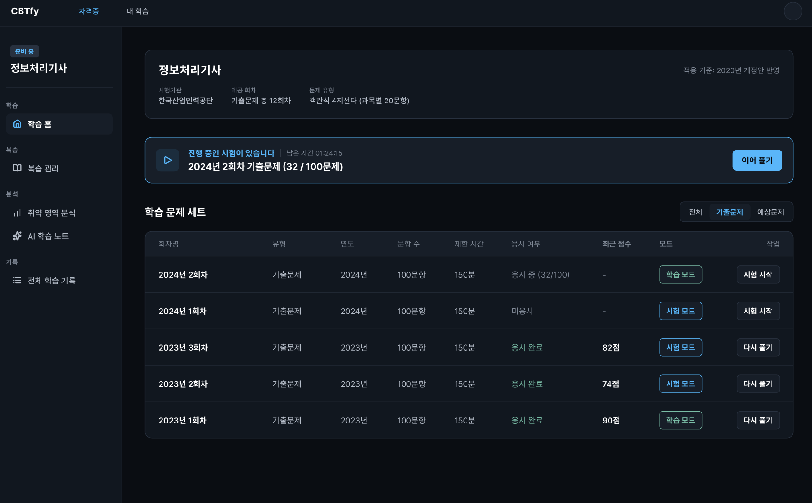

# DAY 57 — 프론트 변경사항 정리와 UI 디자인 수정

> 2026-10-02 · 미니프로젝트 II, Frontend, UI Design

오늘은 팀 프로젝트 파일에 충돌이 발생해 코드 작업을 잠시 멈췄다. 대신 내가 맡은 시험 화면을
다시 살펴보며 프론트에서 수정하고 발전시킬 부분을 정리하고, 화면의 정보 구조와 상태 표현을
UI 디자인으로 구체화했다.

## 오늘 작업한 내용

- 파일 충돌로 기능 개발을 잠시 중단하고 작업 범위를 다시 확인
- 담당 프론트 화면에서 수정하고 발전시킬 사항 정리
- 시험 회차, 응시 상태와 작업 버튼이 잘 구분되도록 UI 디자인 수정

## 프론트 UI 디자인 수정안

레퍼런스와 사용자 이름이 보이는 화면은 제외하고, 개인정보가 없는 UI 수정안만 올렸다.

## 오늘의 정리

파일 충돌로 기능 개발은 잠시 멈췄지만, 담당 화면의 프론트 변경사항을 정리하고 UI 디자인을
수정했다.
