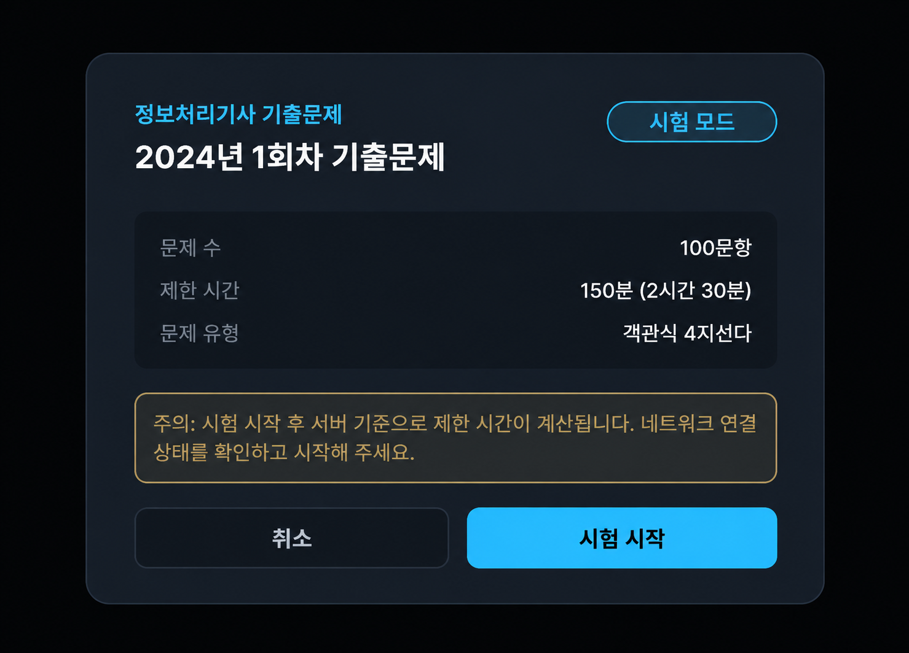
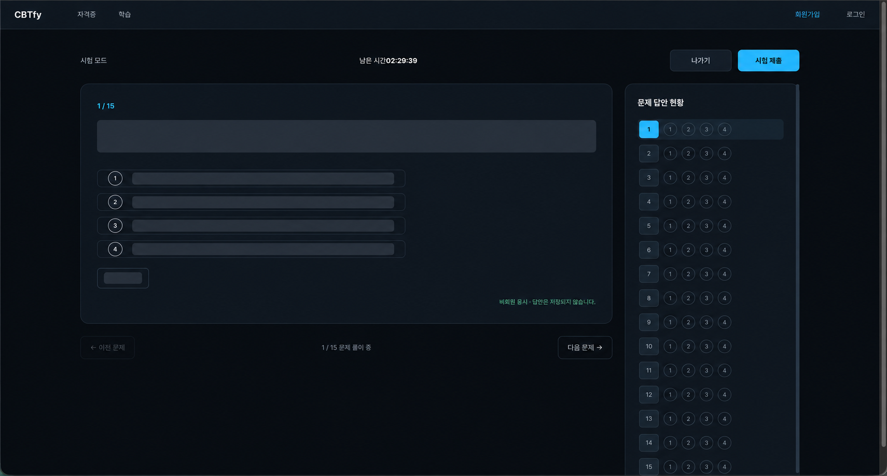

# DAY 58 — 비회원 시험 응시와 공개 채점 흐름 구현

> 2026-10-03 · 미니프로젝트 II, React, Spring Boot, 비회원 시험, 자동 채점

오늘은 [PR #26](https://github.com/ybc9786/kosa_project/pull/26)에서 로그인하지 않은 사용자도
시험을 풀고 결과를 확인할 수 있도록 비회원 시험 흐름을 구현했다. 비회원 답안은 회원 학습 기록과
분리해 프론트 상태에서만 관리하고, 제출할 때 공개 채점 API로 점수와 문항별 결과를 받도록 구성했다.

이 기록은 PR에 포함된 이전 브랜치 이력이 아니라, 10월 3일에 직접 작성한
`feat: 비회원 시험 응시 및 공개 채점 기능 추가` 커밋을 기준으로 정리했다.

## 오늘 작업한 내용

### 비회원 시험 흐름 분리

- 비회원 시험을 `/exam?examSetId={id}` 경로로 연결
- 로그인 여부와 응시 기록 번호에 따라 회원·비회원 흐름 구분
- 비회원 답안은 React 상태에서만 관리하고 새로고침이나 페이지 이탈 시 초기화
- 비회원에게 시험 모드, 제한 시간, 답안 미저장 안내 표시
- 회원용 시험 시작·자동 저장·이어 풀기·결과 조회 흐름은 그대로 유지

### 공개 채점 API 구현

| 기능 | 요청 | 처리 내용 |
| --- | --- | --- |
| 비회원 채점 | `POST /api/exam-sets/{examSetId}/grade` | 시험 회차와 답안 목록을 받아 채점 |
| 요청 검증 | `GuestExamGradeRequest` | 문항 ID와 1~4번 선택지 값 검증 |
| 결과 반환 | `GuestExamGradeResponse` | 점수, 정답 수, 전체 문항 수와 문항별 결과 반환 |

서버는 시험에 속한 문제의 현재 버전을 기준으로 정답을 비교한다. 선택하지 않은 문항은 오답으로
단정하지 않고 미응답 상태로 남기며, 비회원 채점 과정에서는 `EXAM_ATTEMPT`나 `USER_ANSWER` 같은
회원 학습 기록을 만들지 않는다.

### 시험 화면과 모드 UI 정리

- 시험 시작 모달에 시험 모드와 학습 모드 전환 UI 추가
- 비회원은 기록이 남지 않는 시험 모드로 고정
- 회원은 시험 모드의 제한 시간과 학습 모드의 무제한 풀이를 구분
- 진행 중인 회원 응시에서는 기존 모드를 유지하면 이어 풀기, 모드를 바꾸면 초기화 안내 표시
- 문제 이동, 남은 시간, 답안 현황과 제출 확인 화면을 하나의 흐름으로 연결
- 학습 모드에서 메모와 하이라이트 UI를 사용할 수 있도록 구성

## 공개용 화면

### 시험 시작 정보 확인

시험 제목, 문제 수, 제한 시간과 문제 유형을 확인한 뒤 시험을 시작한다. 공개 이미지에는 원본 화면의
사용자 이름과 프로필이 포함되지 않도록 모달 영역만 사용했다.

### 비회원 문제 풀이 화면

비회원 화면에서는 로그인 없이 문제를 이동하고 답을 고른 뒤 제출할 수 있다. 우측 답안 현황과 남은
시간은 유지하되, 공개할 필요가 없는 기출문제 본문과 선택지는 가렸다.

## 확인 결과와 남은 작업

PR에 기록된 `./gradlew clean build` 결과는 성공했으며 기존 회원 시험 코드와 새 공개 채점
Controller·Service의 컴파일도 확인했다. 다만 실제 브라우저에서 비회원이 마지막 제출까지 완료하는
전체 흐름 검증은 후속 작업으로 남아 있다.

## 공개 전 보안 점검

- 실명·프로필이 보이는 원본 화면은 업로드하지 않았다.
- DB 테이블·제약 구조가 보이는 화면과 SQL 파일은 제외했다.
- 기출문제 100문항, 정답과 해설 원문은 업로드하지 않았다.
- DevTools, 내부 테스트 화면과 팀 설정 파일은 제외했다.
- PR #26의 오늘 변경분에서 새 API 키·토큰·비밀번호·개인키는 발견되지 않았다.
- 팀 프로젝트 원본은 읽기만 했으며 포트폴리오 작업으로 수정하지 않았다.

## 오늘의 정리

- 비회원과 회원 시험 흐름을 응시 기록 생성 여부에 따라 분리했다.
- 비회원 답안을 프론트 상태로 관리하고 공개 채점 API에 제출하도록 연결했다.
- 시험·학습 모드와 시작 안내를 정리하고 기존 회원 기능을 유지했다.
- 점수와 문항별 정오답 결과를 반환하되 미응답 상태도 구분했다.
