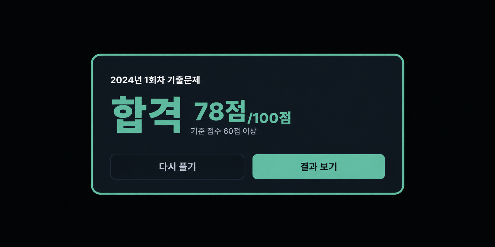
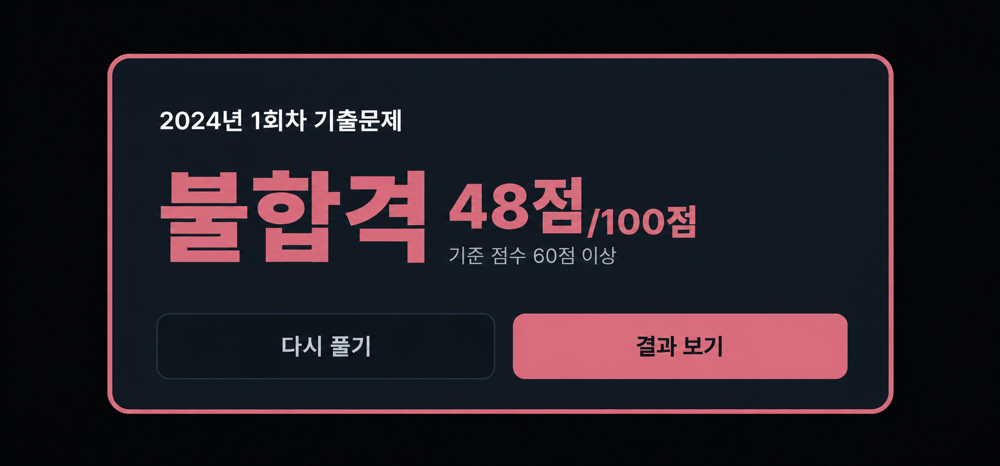
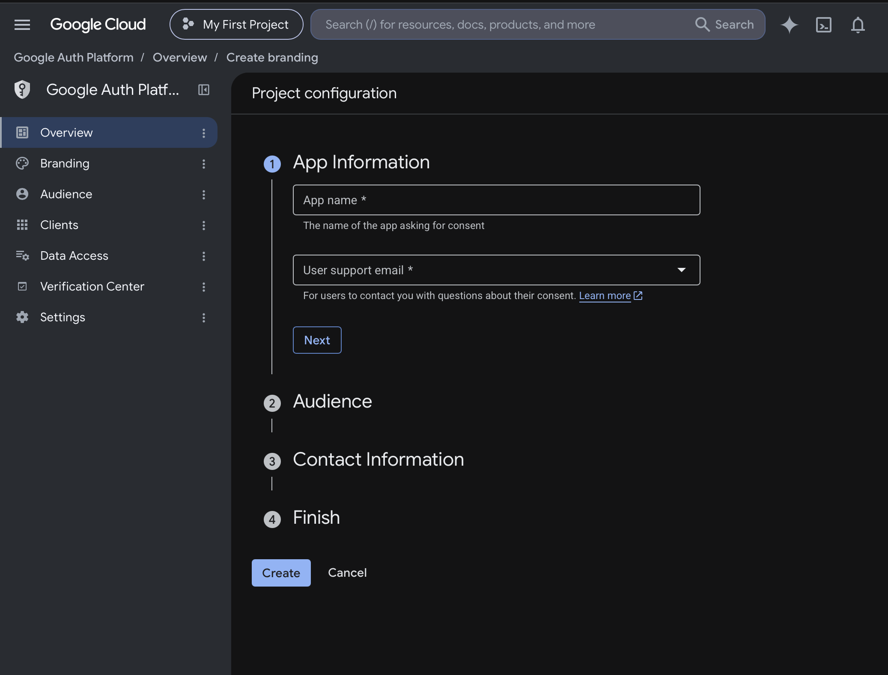
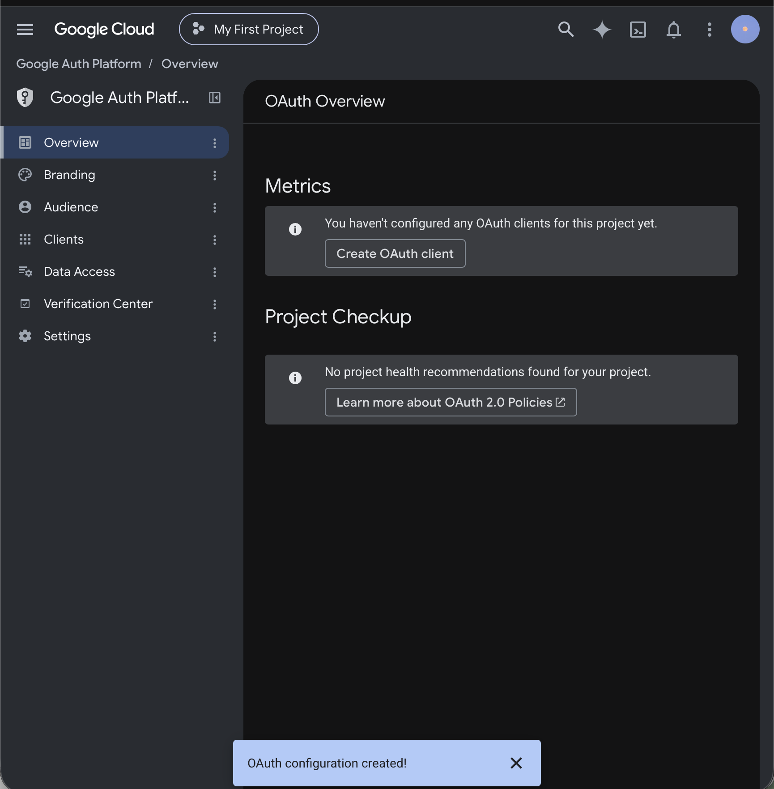
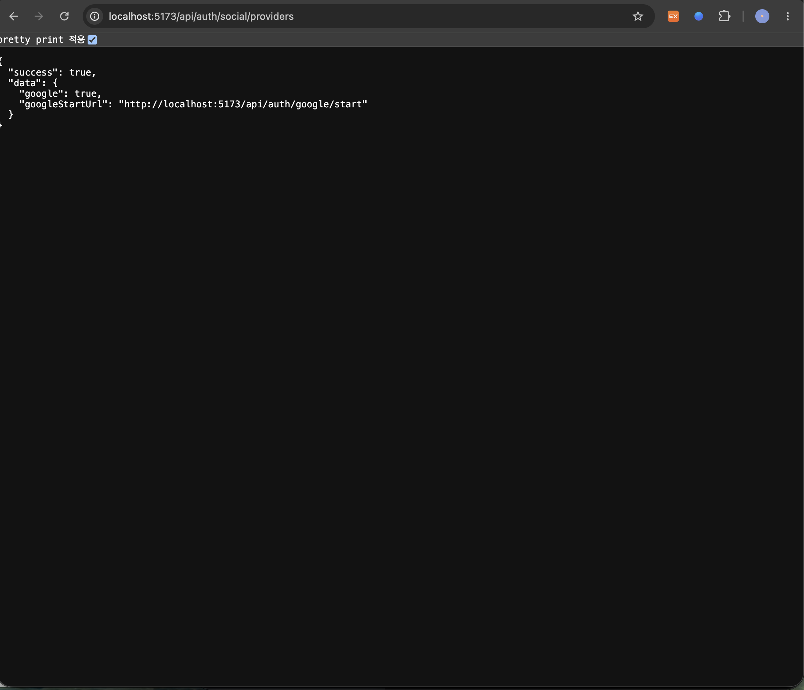
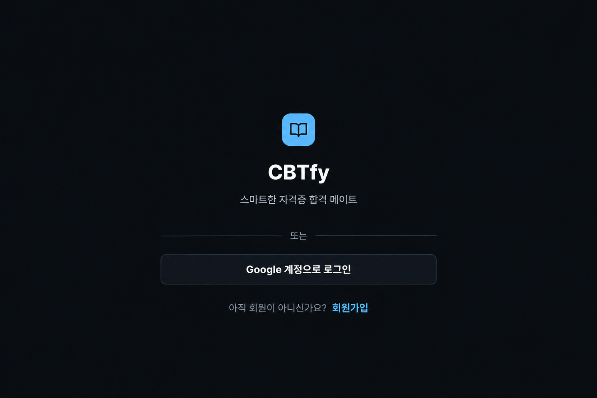
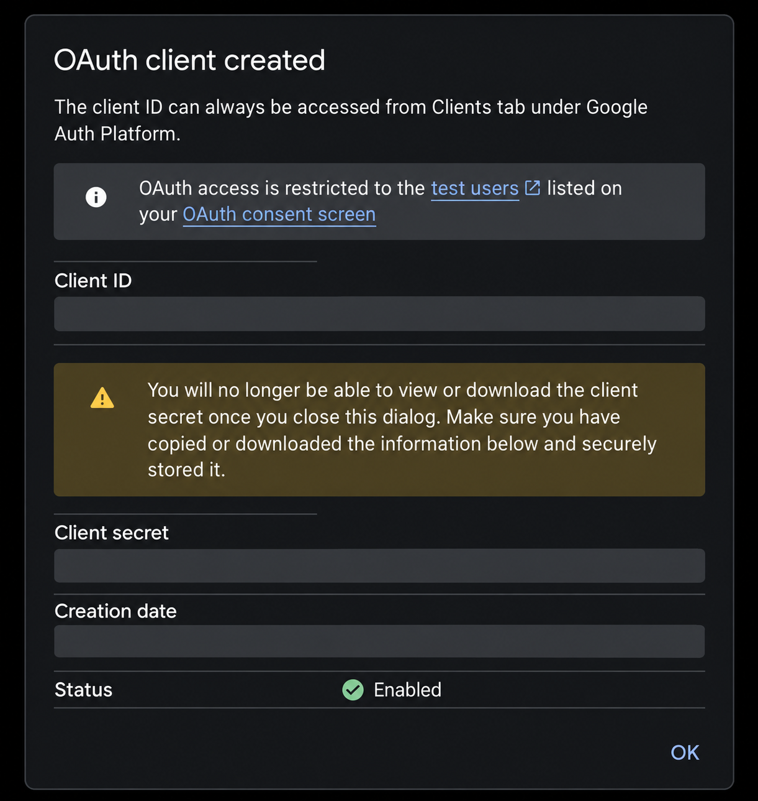

# DAY 59 — 학습 모드 기록 도구와 Google 소셜 로그인 연동

> 2026-10-06 · 미니프로젝트 II, React, Spring Boot, 학습 메모, Google OAuth 2.0

오늘은 [PR #31](https://github.com/ybc9786/kosa_project/pull/31)을 통해 학습 모드에서 문제 위에
메모와 표시를 남기고 다시 불러오는 기능을 정리해 `develop` 브랜치에 반영했다. PR을 마친 뒤에는
Google 계정으로 로그인할 수 있도록 OAuth 클라이언트와 백엔드·프론트 흐름을 연결하는 작업을
이어 갔다.

이 기록은 PR에 함께 보이는 이전 브랜치 이력이 아니라 10월 6일에 작성한
`feat: 학습 모드 메모·표시 기능과 문제 이동 패널 공통화` 커밋을 중심으로 정리했다. Google 로그인은
아직 작업 중인 기능이므로 완료된 PR 내용과 구분해 기록했다.

## 오늘 작업한 내용

### 학습 모드 메모·표시 기능

- 응시 시작 시 시험 모드와 학습 모드를 선택하고 응시 기록에 모드를 저장
- 로그인한 회원의 학습 모드에서 메모·하이라이트·밑줄·그리기·지우개 사용
- 여러 그림 획을 하나의 기록으로 저장하고 실행 취소·다시 실행 지원
- 문제 이동·페이지 이탈·제출 전에 작성 중인 기록을 저장
- 새로고침하거나 다시 로그인해도 저장한 기록 복원
- 한글 메모 입력 시 자모가 분리되던 문제를 수정하고 직접 키워드 입력은 제거
- 제출이 끝난 기록은 수정하지 못하도록 학습 단계와 제출 상태를 구분

### 문제 이동과 학습 화면 공통화

- 시험 모드와 학습 모드가 같은 문제 이동 패널과 번호 버튼을 사용
- 답 선택, 복습 체크, 현재 문항 상태를 버튼 모양으로 간결하게 표현
- 넓은 화면에서는 문제 정보와 메모 영역을 고정하고 메모 목록만 내부 스크롤
- `문제 이동`과 `내 메모` 버튼으로 풀이 영역과 기록 영역을 오갈 수 있도록 구성
- AI 요약 분석에 메모와 강조 문장을 함께 전달하고 분석 화면에 학습 기록 영역 추가

### 데이터 구조와 API

- 학습·시험 모드를 구분하는 응시 정보 추가
- 학습 표시를 조회·등록·수정·삭제·복원하는 API 구성
- 메모, 강조 범위, 밑줄과 그림 데이터를 문제·응시 기록에 연결
- 공용 DB에는 기존 데이터를 바꾸지 않고 필요한 구조만 추가

## 작은 UI 보완 — 합격·불합격 결과 팝업

시험 제출 후 점수에 따라 합격과 불합격 상태가 바로 구분되도록 색상과 문구를 다듬었다. 두 화면은
오늘 작업의 핵심 기능이라기보다 결과 피드백을 명확하게 만드는 UI 수정 사항으로 정리했다.

## Google 소셜 로그인 연동 작업

### OAuth 설정 준비

Google Auth Platform에서 앱 정보와 동의 화면을 구성하고 OAuth 클라이언트를 생성했다. 클라이언트
ID와 시크릿은 코드나 공개 이미지에 남기지 않고 환경변수로만 주입하도록 구성했다.

### 백엔드 연결 확인

- 사용 가능한 소셜 로그인 제공자를 확인하는 API 구성
- Google 설정이 준비됐을 때만 로그인 시작 주소를 반환
- 로그인 시작, Google 콜백, 신규 계정 가입 확인 흐름을 분리
- 기존에 연결된 계정은 일반 로그인과 같은 세션을 사용
- 처음 로그인한 Google 계정은 닉네임과 필수 동의를 확인한 뒤 회원 생성

### 프론트 로그인 화면 연결

로그인·회원가입 화면에 Google 계정 버튼을 추가하고, 처음 사용하는 계정은 별도의 가입 확인 화면으로
이동하도록 프론트 흐름을 연결하고 있다.

OAuth 클라이언트 생성 완료 화면은 ID·시크릿·생성 시각을 모두 가린 공개용 사본만 사용했다.

## 확인 결과와 남은 작업

PR에 기록된 확인 결과는 다음과 같다.

- 프론트 TypeScript 검사 통과, 저장 관련 테스트 21개 통과
- DB 연결이 필요 없는 백엔드 테스트 125개 통과
- 학습 모드·학습 표시 마이그레이션을 반복 실행해도 기존 데이터가 유지되는 것 확인
- 여러 획 그림, 지우개 처리와 연결 메모 동기화 테스트 추가

DB 연결이 필요한 통합 테스트, 마지막 UI 수정분의 실제 브라우저 동작, 공용 DB에 연결한 저장·복원,
실제 AI 모델 호출과 프로덕션 프론트 빌드는 PR 작성 시점에 확인하지 못한 항목으로 남았다. Google
소셜 로그인도 현재 작업 중이므로 콜백부터 신규 가입·재로그인까지 전체 흐름을 추가로 검증해야 한다.

## 공개 전 보안 점검

- `수정` 표시가 붙은 화면과 오류 확인용 화면은 결과 자료에서 제외했다.
- DB 테이블·제약 조건이 보이는 화면과 SQL 파일은 업로드하지 않았다.
- 수업 자료 PDF 두 개와 `.DS_Store`는 업로드하지 않았다.
- 합격·불합격 화면의 실명과 프로필은 제거하고 팝업만 사용했다.
- 로그인 화면의 아이디·비밀번호 입력 영역은 제거했다.
- OAuth Client ID·Client Secret·생성 시각은 공개용 이미지에서 완전히 가렸다.
- 팀 프로젝트의 설정 파일과 로컬 환경변수 파일은 포트폴리오에 복사하지 않았다.

## 오늘의 정리

- 학습 모드에 메모·표시·그리기 저장과 복원 흐름을 구현했다.
- 시험·학습 모드가 공통 문제 이동 패널을 사용하도록 화면 구조를 정리했다.
- 학습 기록을 AI 요약 분석 자료와 연결했다.
- 합격·불합격 팝업을 작은 UI 수정 사항으로 보완했다.
- Google OAuth 클라이언트를 준비하고 소셜 로그인 연동 작업을 시작했다.
