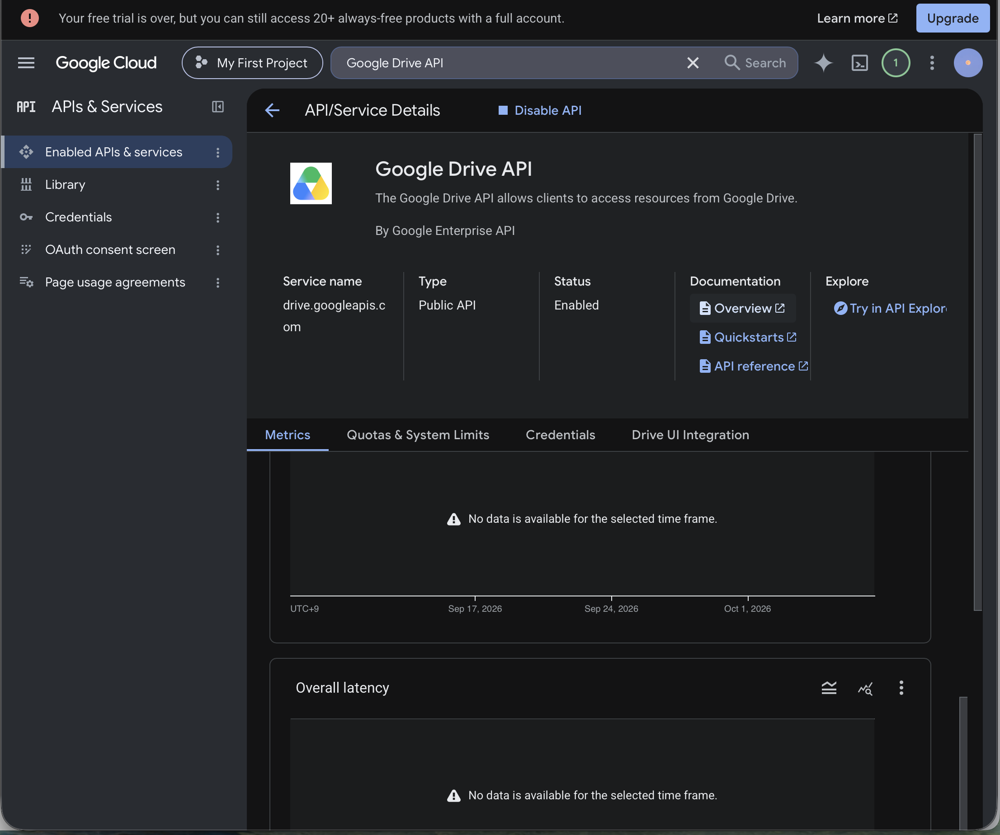
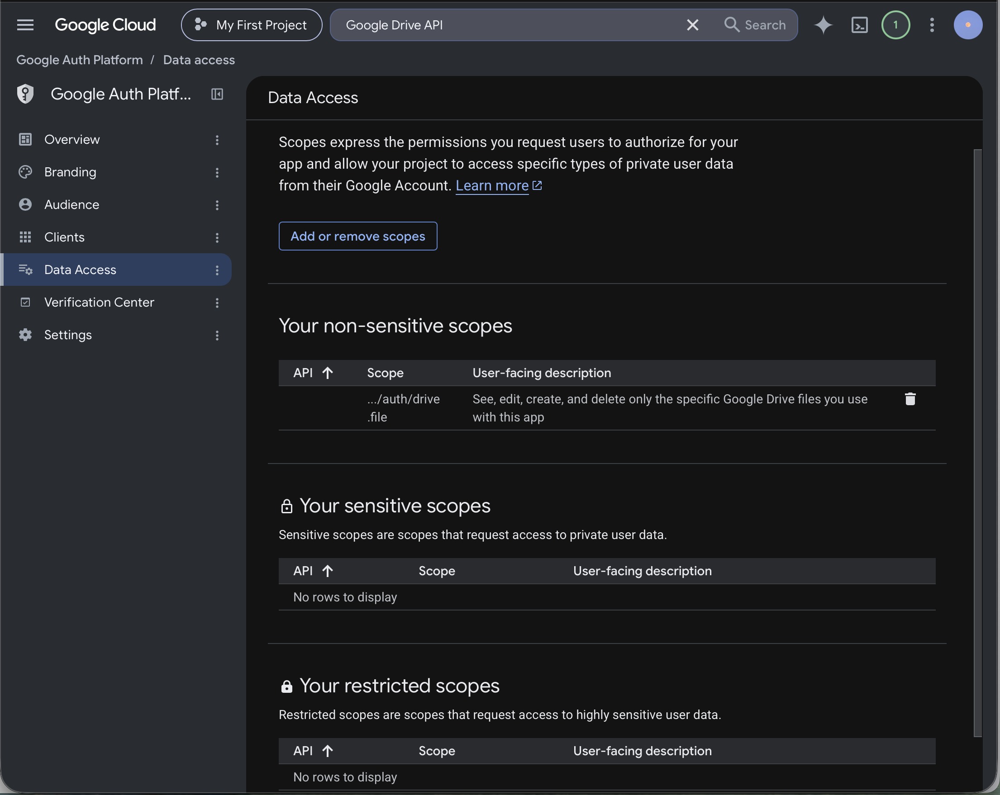
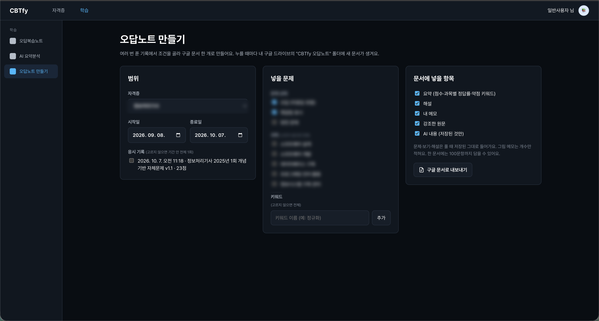
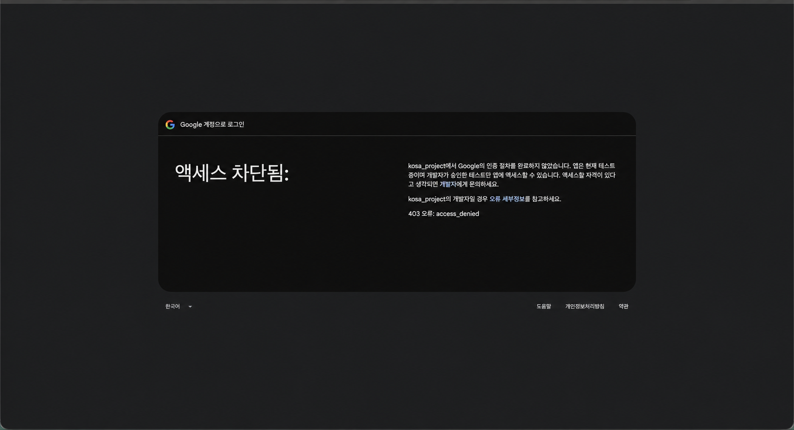
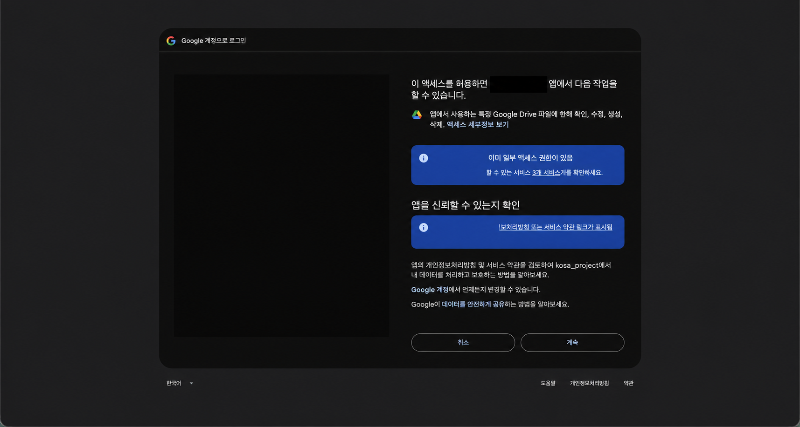
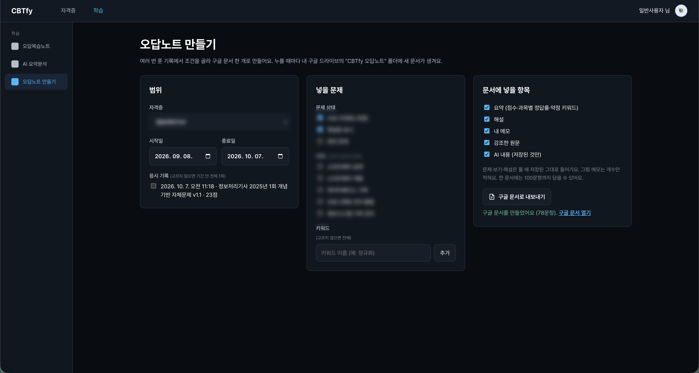
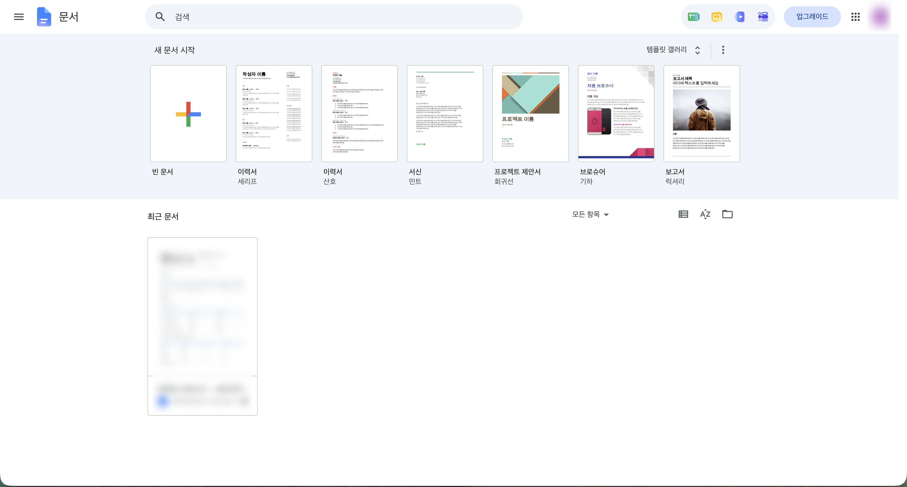
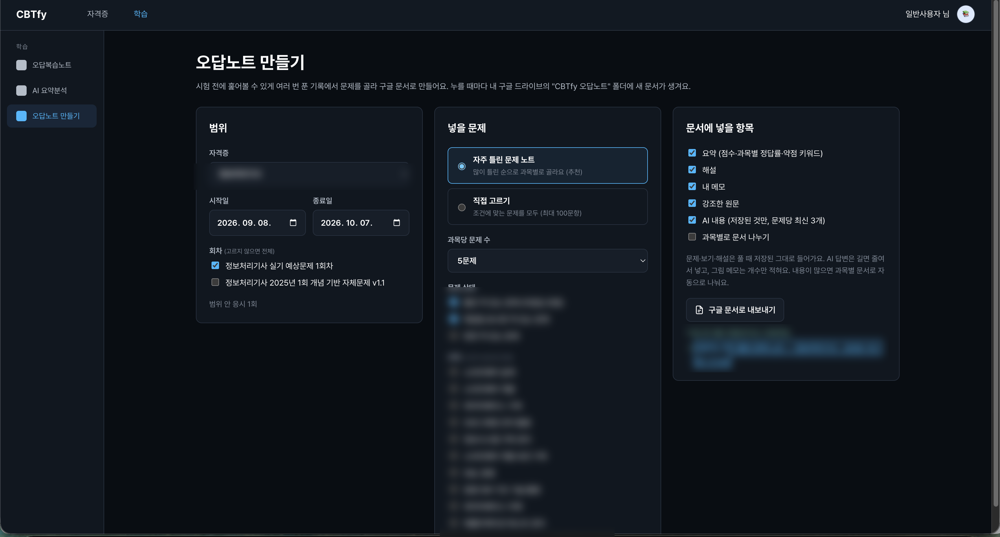
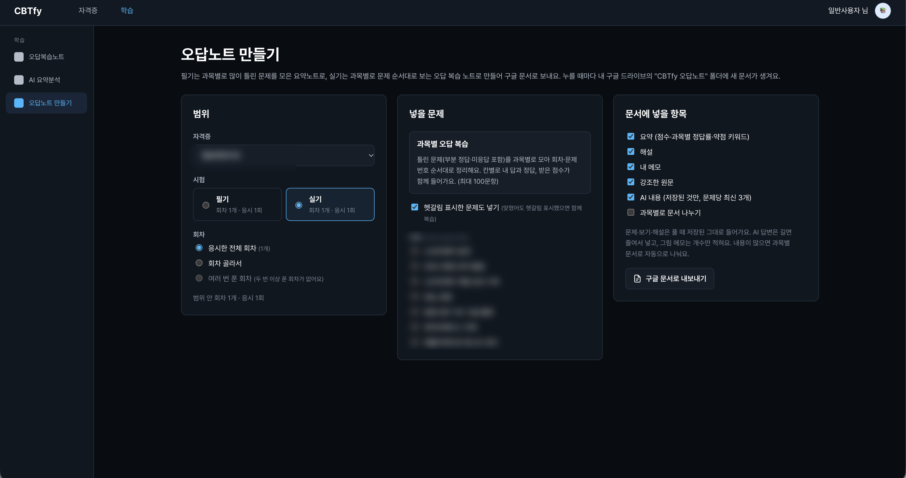
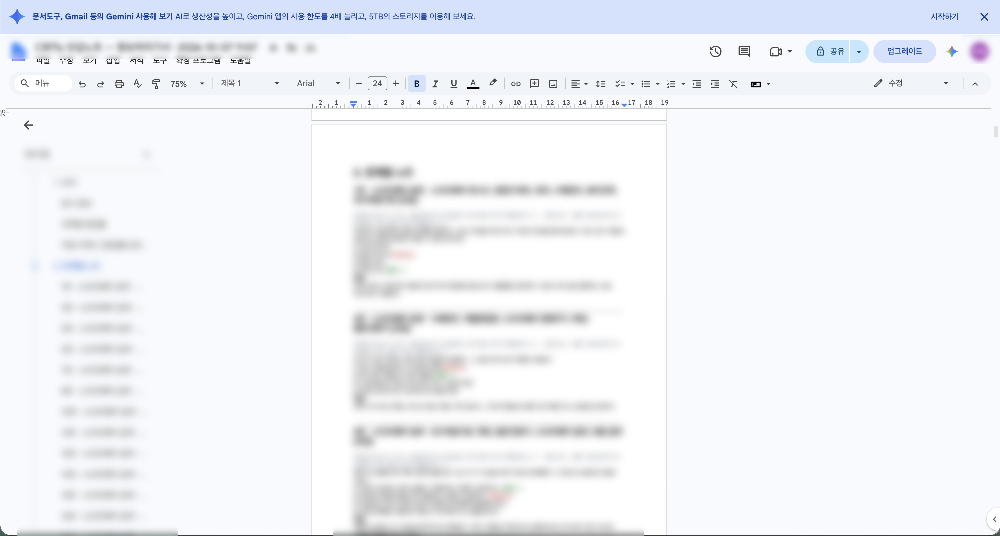

# DAY 60 — Google Drive 오답노트 내보내기 연동과 검증

> 2026-10-07 · 미니프로젝트 II, Spring Boot, React, Google OAuth 2.0, Google Drive API

오늘은 [PR #39](https://github.com/ybc9786/kosa_project/pull/39)에 Google 계정 연결과
Google 문서 오답노트 내보내기 기능을 정리했다. 기존 계정에 Google 계정을 연결하고,
학습 기록에서 고른 문제와 메모를 Google Drive의 문서로 만드는 흐름을 백엔드부터
프론트까지 연결했다.

PR을 작성할 때는 실제 Drive 문서 생성이 미확인 항목으로 남아 있었다. 이후 개발용 OAuth
클라이언트로 권한 요청과 문서 생성을 다시 검증해, 78문항 오답노트가 만들어지고 Google
Drive에서 확인되는 단계까지 진행했다. 운영 환경 검증과 실제 Oracle 환경의 새 조회 SQL
확인은 별도의 남은 작업으로 구분했다.

## 오늘 작업한 내용

### Google 로그인과 계정 연결

- 아이디·비밀번호 로그인과 Google 로그인을 함께 제공
- 처음 로그인하는 Google 계정은 필수 약관 동의를 거친 뒤 가입하도록 분리
- 기존 회원이 마이페이지에서 Google 계정을 연결하거나 해제할 수 있도록 구성
- 로그인·계정 연결·Drive 내보내기가 하나의 콜백 주소를 사용하되 `state`의 목적값으로 흐름을 구분
- `state`, PKCE, `nonce`, ID 토큰과 이메일 인증 여부를 검증하고 로그인 성공 시 세션 ID를 재발급
- Google로만 가입한 회원은 비밀번호 로그인·변경을 제한하고 최근 로그인으로 탈퇴를 확인

### Drive API와 최소 권한 설정

Google Cloud에서 Drive API를 활성화하고, 앱이 직접 만들거나 사용한 파일만 다룰 수 있는
`drive.file` 범위를 추가했다. Drive 권한은 로그인할 때 미리 요구하지 않고 사용자가 오답노트를
내보낼 때만 요청하도록 나눴다.

### 여러 학습 기록을 한 문서로 구성

`/my/note-export` 화면에서 다음 조건을 조합해 오답노트를 만들 수 있도록 구성했다.

- 필기와 실기 기록을 구분하고 응시한 전체 회차·선택 회차·여러 번 푼 한 회차 중 범위 선택
- 필기는 과목별로 자주 틀린 5·10·20문제를 모으고, 실기는 과목 → 회차 → 문제 순서로 정렬
- 헷갈림 표시 문제 포함 여부와 과목별 문서 분리 여부 선택
- 요약, 해설, 개인 메모, 강조 문장과 저장된 AI 내용을 문서 항목으로 선택
- 주관식 답안을 칸별 정답·득점과 부분 정답 상태까지 표현

## OAuth 오류를 확인하고 권한 흐름 검증하기

처음에는 개발 중인 OAuth 앱의 테스트 사용자 조건을 만족하지 못해 `403 access_denied`가
발생했다. 오류 원인을 확인한 뒤 테스트 사용자와 데이터 접근 범위를 정리하고, Google Drive
파일 권한 동의 화면을 다시 거쳐 내보내기를 진행했다.

계정 정보가 있던 영역은 공개용 이미지에서 불투명하게 제거했다.

## Google 문서 생성과 Drive 확인

내보내기 요청은 서버의 백그라운드 작업으로 처리하고, 프론트는 작업 상태를 조회해 진행 상황과
완성된 문서 링크를 보여 주도록 구성했다. 문서는 사용자의 Drive 안 `CBTfy 오답노트` 폴더에
생성된다.

개발 환경에서 실제 계정을 연결한 뒤 78문항 문서가 만들어지는 것을 확인했고, Google Drive의
최근 문서와 생성된 오답노트 본문까지 확인했다.

## 필기·실기별 오답노트 UI 보완

필기 기록은 자주 틀린 문제 중심으로, 실기 기록은 회차와 문제 순서 중심으로 선택할 수 있도록
화면을 나눴다. 한 화면에서 범위와 문서 구성 항목을 확인한 뒤 Google 문서로 내보낼 수 있다.

## 함께 반영한 저장 기능

- 복습 화면의 AI 답변을 문제별 메모로 저장하고 최대 10개까지 관리
- AI 요약분석 후속 대화를 DB에 저장해 다시 로그인해도 이어서 확인
- 관련 테이블이 아직 없는 환경에서는 기존 세션 저장 방식으로 동작하도록 처리
- Google 연결·내보내기, 필기·실기 문서 구성, 주관식 부분 정답, Drive 업로드와 쿠키 동작 테스트 추가

## 확인 결과

- PR #39: `feature` → `develop`, 현재 리뷰를 기다리는 Open 상태
- GitHub Actions 프론트 검사: TypeScript·Vite 빌드 성공, 테스트 48개 통과
- 백엔드 검사: DB 연결 제외 테스트 301개 통과, `bootJar` 성공
- 로컬 검증: Google 계정 연결, `drive.file` 동의, 78문항 Google 문서 생성과 Drive 확인
- 미확인: 운영 도메인의 OAuth 전체 흐름과 실제 Oracle 환경의 새 조회 SQL

## 공개 전 보안 점검

- OAuth Client ID·Client Secret·인증 코드·액세스 토큰은 이미지와 일지에 포함하지 않았다.
- 계정 선택 화면과 회원정보가 보이는 원본 이미지는 업로드하지 않았다.
- 403 오류와 권한 동의 화면은 계정 이름·이메일 영역을 불투명하게 제거한 사본만 사용했다.
- Google 문서 URL과 파일 ID는 공개하지 않았고, 자격증명·문항·개인 메모는 흐림 처리된 화면만 사용했다.
- `.DS_Store`, 로컬 환경변수와 프로젝트 설정 파일은 포트폴리오에 복사하지 않았다.
- 팀 프로젝트 저장소는 읽기 전용으로 확인했으며 이번 일지 작업으로 수정하지 않았다.

## 오늘의 정리

- Google 로그인과 기존 회원 계정 연결 흐름을 완성했다.
- `drive.file` 최소 권한으로 오답노트를 Google 문서로 내보내는 기능을 구현했다.
- 필기·실기와 여러 응시 범위를 한 화면에서 조합하도록 내보내기 UI를 구성했다.
- OAuth 403 원인을 해결하고 실제 Drive 문서 생성과 결과 확인까지 검증했다.
- CI와 자동 테스트로 로그인·문서 생성·업로드·쿠키 흐름을 점검했다.
