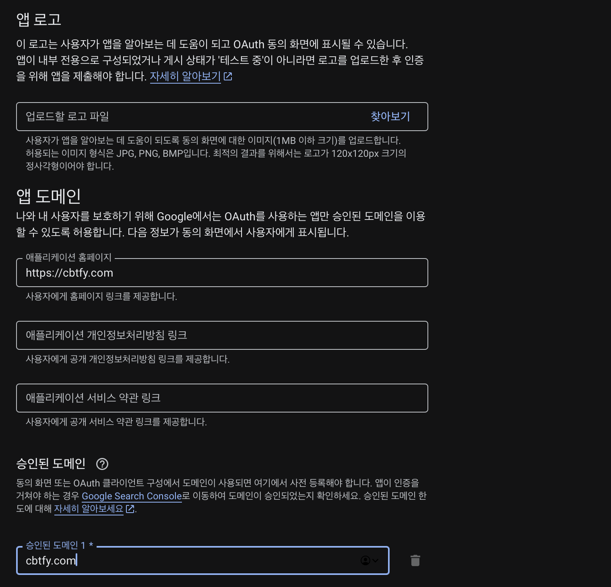
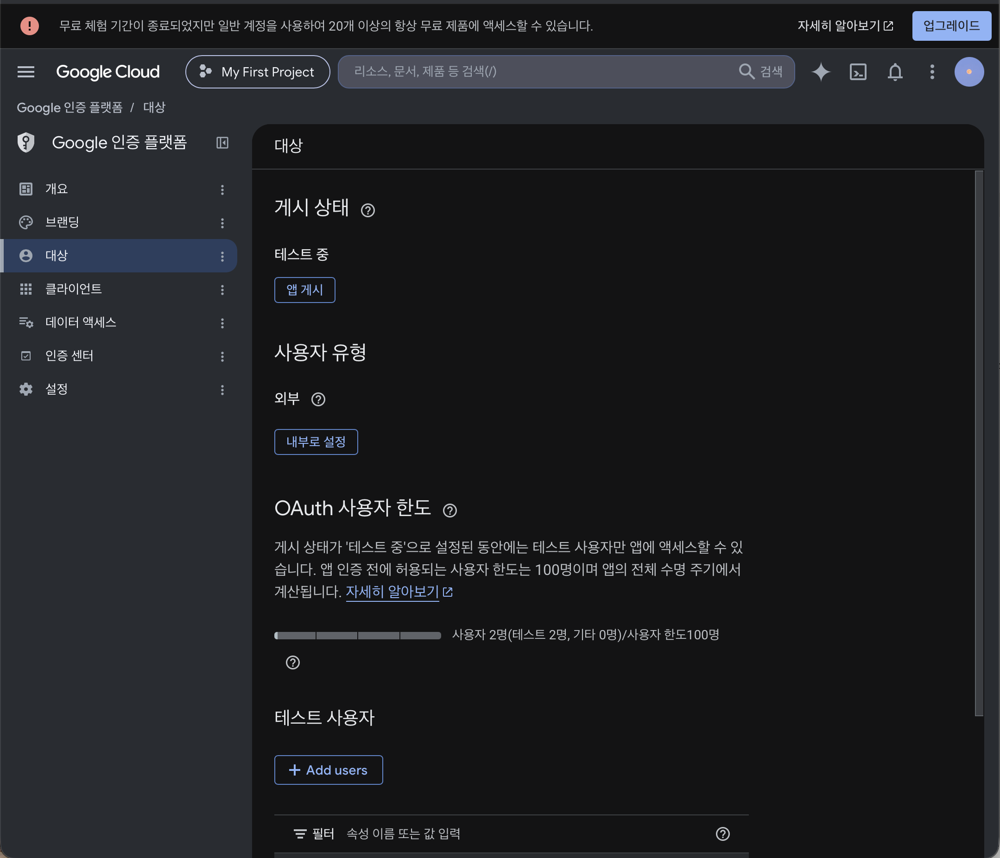
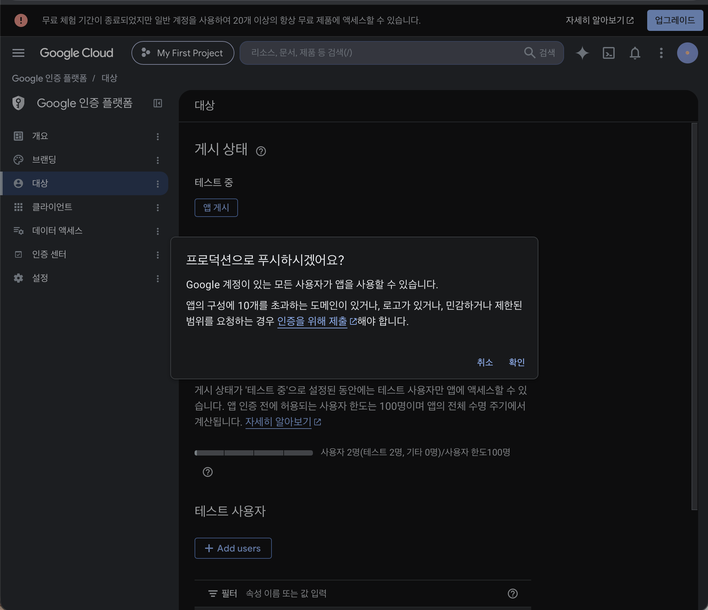
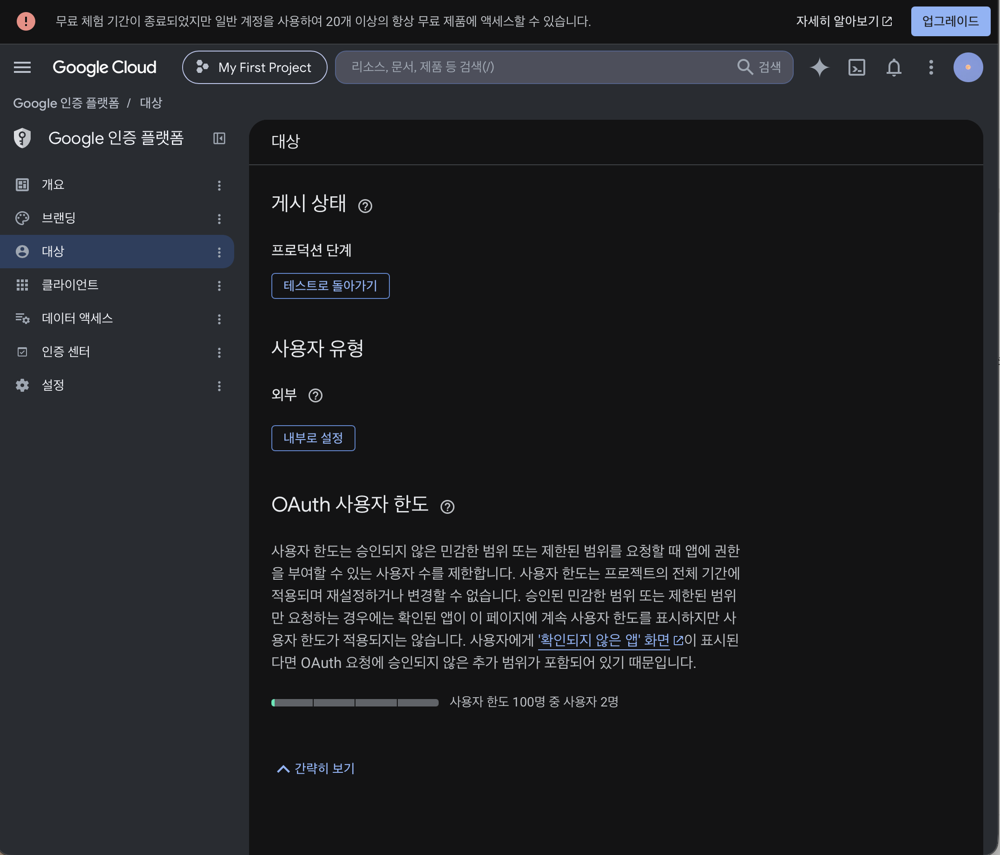
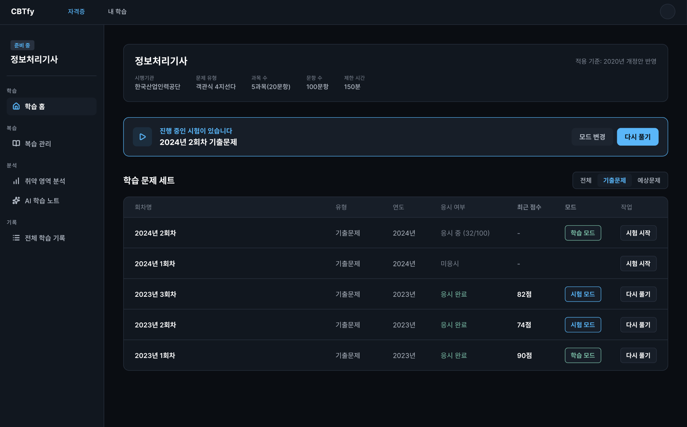
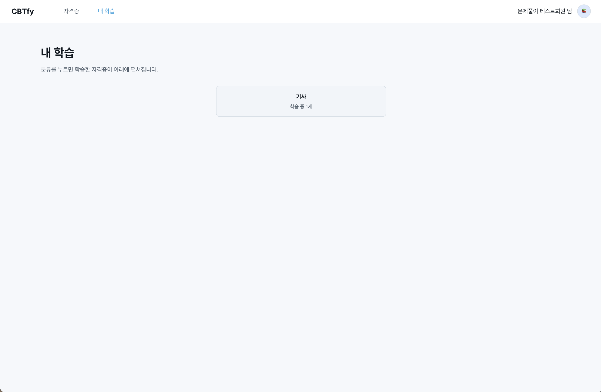
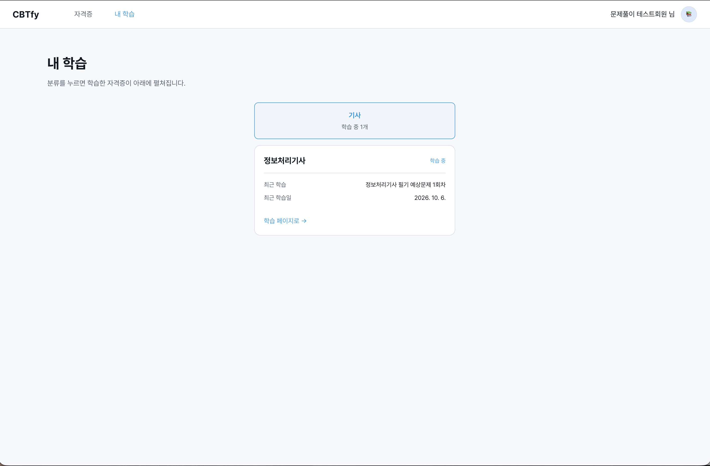

# DAY 61 — Google 앱 게시 준비와 라이트 모드 UI 개편

> 2026-10-08 · 미니프로젝트 II, React, Spring Boot, Google OAuth 2.0, UI Theme

오늘은 Google 기능을 다시 확인하면서 앱을 프로덕션으로 게시하기 위한 화면과 문서를 준비하고,
이후에는 CBTfy 프론트 전반을 다듬었다. 오전 작업은
[PR #44](https://github.com/ybc9786/kosa_project/pull/44), 오후 작업은
[PR #47](https://github.com/ybc9786/kosa_project/pull/47)에 나누어 반영했으며 두 PR 모두 `develop`에
병합되었다.

PR #47의 병합 기록에는 전날 진행한 Google 계정 연결·Drive 내보내기 커밋도 포함되어 있어,
이 일지에는 10월 8일에 새로 작업한 정책 페이지, 테마, 학습 UI와 탈퇴 복구 변경만 구분해
정리했다.

## Google 앱 게시에 필요한 페이지 준비

Google 인증 플랫폼에서 앱을 프로덕션으로 게시하려면 서비스 정보와 공개 정책 페이지를
확인할 수 있어야 한다. 이에 맞춰 개인정보처리방침과 이용약관을 정적 페이지로 만들고,
홈 하단과 Google 가입 동의 화면에서도 바로 열 수 있도록 연결했다.

- `privacy.html`, `terms.html`, `legal.css`로 로그인 없이 읽을 수 있는 정책 페이지 구성
- 수집 항목·이용 목적·보유 기간·Google 사용자 데이터 처리 범위 등을 문서화
- 홈 화면과 Google 가입 동의 항목에 정책 페이지 링크 추가
- 사이트 제목과 설명을 CBTfy 서비스에 맞게 정리하고 `noscript` 안내 추가
- Google OAuth 브랜딩에 홈페이지와 승인 도메인을 등록

## 테스트 상태에서 프로덕션으로 게시

OAuth 대상 화면에서 앱의 사용자 유형과 테스트 상태를 다시 확인한 뒤 게시 절차를 진행했다.
게시 전 확인 창을 거쳐 상태가 프로덕션 단계로 바뀐 것을 확인했다.

Google 화면으로 이동한 뒤 브라우저의 뒤로가기로 돌아오면 로그인·가입·Drive 내보내기 버튼이
`이동 중` 상태에 남는 문제도 함께 수정했다. `pageshow` 이벤트에서 브라우저가 이전 화면을
복원한 경우를 감지해 버튼 잠금을 해제하고, 이 동작을 자동 테스트로 확인했다.

## 라이트·다크 모드 구현

기본 다크 모드에 더해 라이트 모드를 선택할 수 있도록 테마 구조를 만들었다.

- `ThemeContext`에서 현재 테마와 전환 함수를 한 곳에서 관리
- `data-theme`과 CSS 토큰으로 주요 화면의 배경·글자·테두리 색상 통일
- 프로필 메뉴에 라이트·다크 모드 전환 버튼 추가
- 선택한 모드를 브라우저 저장소에 보관하고 다른 탭의 변경도 동기화
- 저장소를 사용할 수 없는 환경에서도 현재 탭에서는 테마 전환이 유지되도록 처리

## 내 학습 화면과 프론트 전반 정리

제출한 학습 기록을 자격증별로 묶어 찾기 쉽게 만들고, 분류 카드를 누르면 해당 자격증의
최근 학습 정보를 펼쳐 볼 수 있도록 구성했다. 화면을 접은 상태와 펼친 상태 모두 라이트 모드
색상 토큰이 일관되게 적용되는지 확인했다.

함께 다듬은 프론트 화면은 다음과 같다.

- 학습 홈을 자격증 정보, 진행 중 시험, 문제 세트 표로 재구성
- 회차 필터, 이어 풀기와 첫 미응답 문제 이동 연결
- GNB를 상단에 고정하고 학습 화면의 LNB 메뉴를 공통 구조로 정리
- 취약 영역 분석과 AI 요약을 `AI 학습 노트`로 통합하고 기록 페이지를 분리
- 복습·분석 화면에 과목 필터를 추가하고 AI 카드의 높이와 여백 조정
- 코드 블록 표시, 제출 후 합격·불합격 결과 창, 다시 풀기·결과 보기 흐름 보완

## 회원 탈퇴와 복구 흐름 보완

- 로그인 상태에서는 별도 비밀번호·확인 문구 없이 탈퇴를 신청하도록 요청 구조 단순화
- 탈퇴 직후 로그아웃하고 계정과 학습 기록을 30일 동안 보관
- 유예 기간 안에는 기존 일반 로그인 또는 Google 로그인으로 계정 복구
- 30일이 지난 탈퇴 회원의 관련 데이터를 주기적으로 정리하는 서버 작업 추가
- 취약 영역 분석 API에 선택 과목 필터 추가

## 확인 결과

- PR #44: 12개 파일 변경, GitHub Actions 백엔드·프론트 검사 성공
- PR #44 로컬 확인: TypeScript 검사와 프론트 테스트 53개 통과
- PR #47: 79개 파일 변경, GitHub Actions 백엔드·프론트 검사 성공
- PR #47 로컬 확인: 프론트 빌드·테스트 64개, 관련 서버 테스트 47개와 공백 검사 통과
- Google 인증 플랫폼에서 앱이 프로덕션 단계로 전환된 화면 확인
- 미확인: 실제 DB의 탈퇴 만료 데이터 삭제 통합 동작과 운영 환경의 로그인 복구·Google 인증 전체 흐름

## 공개 전 보안 점검

- 오늘 폴더의 PDF는 업로드하지 않았다.
- 실제 이메일, 계정 정보와 개인 작업 대화가 함께 보이던 실배포 화면은 제외했다.
- 이메일이 표시된 회원 탈퇴 화면도 원본 전체를 제외하고 기능 내용만 글로 정리했다.
- OAuth Client ID·Client Secret·인증 코드·토큰·개인키·DB 비밀번호는 이미지와 일지에 포함하지 않았다.
- 두 PR의 추가 내용에서도 비밀값 형식을 점검했으며 공개하면 안 되는 자격증명은 발견되지 않았다.
- 팀 프로젝트 저장소는 읽기 전용으로 확인했으며 이번 일지 작업으로 수정하지 않았다.

## 오늘의 정리

- Google 앱 게시에 필요한 정책 페이지와 공개 링크를 만들고 프로덕션 게시 상태를 확인했다.
- Google 화면에서 뒤로 돌아올 때 버튼이 잠기는 문제를 복원 이벤트 처리로 해결했다.
- CSS 토큰과 React Context를 이용해 라이트·다크 모드를 구현하고 선택 상태를 저장했다.
- 내 학습, 학습 홈, 분석·복습·AI 노트와 문제 풀이 화면의 구조와 스타일을 정리했다.
- 탈퇴 후 30일 복구와 만료 데이터 정리 흐름을 추가하고 자동 검사로 변경 범위를 확인했다.
