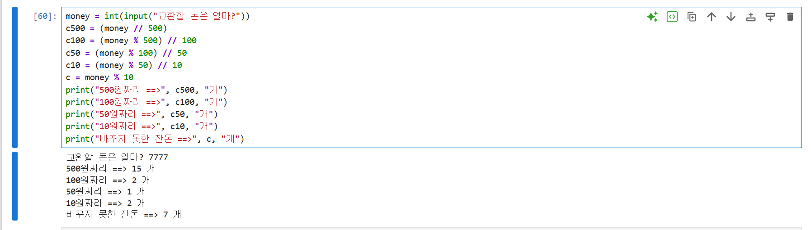
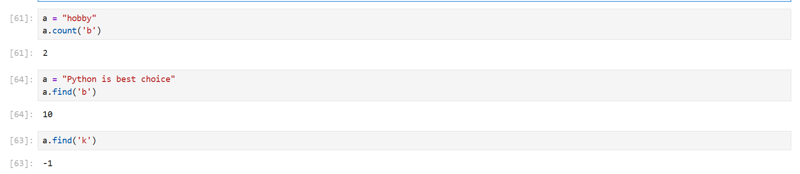
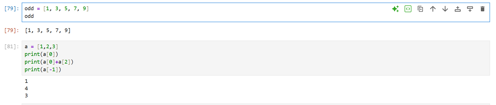
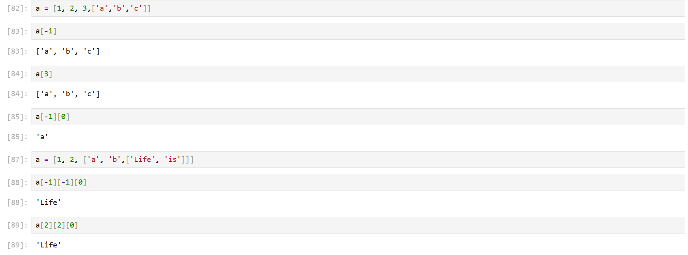
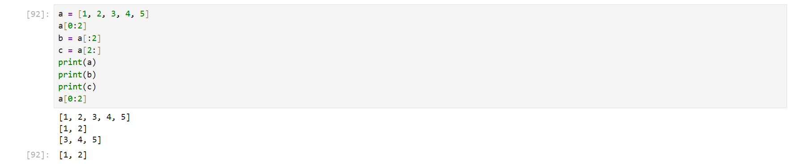
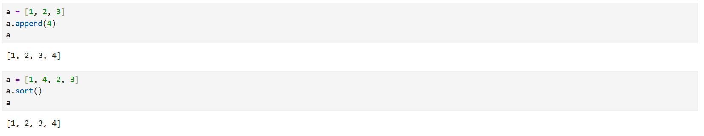
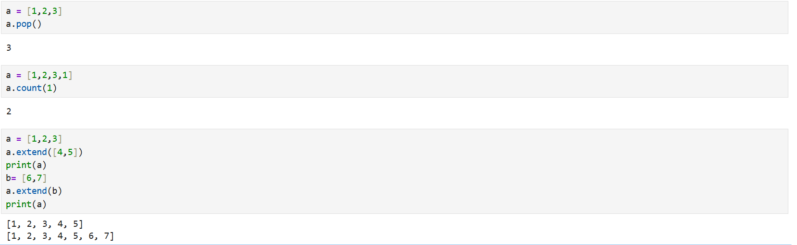

# DAY 48 — Python 기초: 숫자·문자열과 리스트

> 2026-09-18 · Python 입문, 숫자형, 문자열, 인덱싱·슬라이싱, 포매팅, 리스트

오늘은 Python의 특징과 실행 환경을 살펴보고 숫자형·변수·입력을 이용한 기초 연산을
실습했다. 문자열을 만들고 인덱싱·슬라이싱·포매팅과 주요 메서드를 사용했으며, 리스트의
생성·조회·수정과 여러 리스트 메서드를 연습했다.

## 1. Python과 실행 환경

Python은 문법이 비교적 간결한 인터프리터 언어다. 데이터 분석·시각화, 머신러닝, 웹,
데이터베이스, 자동화와 GUI 등 다양한 분야에서 활용할 수 있다. 이번 실습에서는 Spyder와
Jupyter Notebook을 사용해 코드를 한 줄씩 또는 셀 단위로 실행하고 결과를 바로 확인했다.

## 2. 숫자형과 연산자

정수와 실수를 변수에 저장하고 산술 연산자를 사용했다. `/`는 나눗셈 결과를 실수로 반환하고,
`//`는 나눈 몫을 내림한 결과를 반환한다.

```python
a = 9
b = 2

print(a + b)   # 11
print(a - b)   # 7
print(a * b)   # 18
print(a / b)   # 4.5
print(a ** b)  # 81
print(a % b)   # 1
print(a // b)  # 4
```

`input()`으로 받은 값은 문자열이므로 계산 전에 `int()` 또는 `float()`로 형을 변환해야 한다.

```python
price = int(input("금액을 입력하세요: "))
coin_500 = price // 500
remainder = price % 500
```



## 3. 문자열 만들기와 다루기

문자열은 작은따옴표 또는 큰따옴표로 감싸 만들 수 있다. 문자열 안에 따옴표를 넣을 때는
서로 다른 따옴표를 사용하거나 역슬래시로 이스케이프한다. `\n`은 줄바꿈을 나타낸다.

```python
message = "Python's favorite food is perl"
multiline = "첫 번째 줄\n두 번째 줄"

print("Py" + "thon")
print("Python " * 2)
print(len("Python"))
```

문자열은 0부터 시작하는 인덱스로 한 글자를 선택할 수 있고, 음수 인덱스는 뒤에서부터
센다. 슬라이싱은 시작 위치부터 끝 위치 직전까지 새로운 문자열을 만든다.

```python
word = "python1"

print(word[0])    # p
print(word[-1])   # 1
print(word[3:])   # hon1
print(word[:3])   # pyt
print(word[:-1])  # python
```

## 4. 문자열 포매팅

`%` 연산자를 이용한 포매팅과 f-string을 함께 연습했다. f-string은 문자열 앞에 `f`를 붙이고
중괄호 안에 변수나 식을 넣는 방식이라 읽기 쉽다.

```python
name = "홍길동"
age = 30

print("이름: %s, 나이: %d" % (name, age))
print(f"이름: {name}, 나이: {age}")
```

## 5. 문자열 메서드

문자열 메서드로 문자 개수를 세고 위치를 찾거나, 공백과 내용을 정리하고 문자열을 나눴다.

- `count()` : 특정 문자열의 개수 확인
- `find()`, `index()` : 특정 문자열의 위치 확인
- `join()` : 구분자를 사이에 넣어 문자열 연결
- `lower()` : 소문자로 변환
- `strip()` : 양쪽 공백 제거
- `replace()` : 특정 문자열 교체
- `split()` : 구분자를 기준으로 문자열 분리



## 6. 리스트 생성과 인덱싱

리스트는 여러 값을 순서대로 저장하는 자료형이다. 서로 다른 자료형을 함께 넣을 수 있으며,
문자열처럼 인덱싱과 슬라이싱을 사용할 수 있다.

```python
numbers = [1, 2, 3]
mixed = [1, "Python", True]

print(numbers[0])   # 1
print(numbers[-1])  # 3
print(numbers[1:])  # [2, 3]
```



리스트 안에 다른 리스트를 넣어 중첩 구조를 만들고, 인덱스를 연달아 사용해 안쪽 값에
접근했다.

```python
matrix = [[1, 2, 3], [4, 5, 6]]
print(matrix[1][2])  # 6
```



## 7. 리스트 슬라이싱과 수정

슬라이싱으로 리스트의 일부를 가져오고, 인덱스나 슬라이스에 값을 대입해 내용을 바꿨다.
`del`을 사용하면 특정 항목이나 범위를 삭제할 수 있다.

```python
values = [1, 2, 3, 4, 5]
print(values[:2])
print(values[2:])

values[1] = 20
values[2:4] = [30, 40]
del values[0]
```



## 8. 리스트 메서드

리스트를 수정하고 검색하는 주요 메서드를 실행해 각 동작과 반환 결과를 확인했다.

- `append()` : 맨 뒤에 값 추가
- `sort()` : 오름차순 정렬
- `reverse()` : 현재 순서를 반대로 변경
- `index()` : 값의 첫 번째 위치 확인
- `insert()` : 원하는 위치에 값 삽입
- `remove()` : 처음 만나는 값을 삭제
- `pop()` : 값을 꺼내면서 삭제
- `count()` : 값의 개수 확인
- `extend()` : 다른 목록의 요소를 이어 붙이기





## 오늘의 정리

- Python의 활용 분야와 Spyder·Jupyter Notebook의 기본 실행 방식을 익혔다.
- 숫자형 변수와 산술 연산자를 사용하고 입력값을 숫자로 변환했다.
- 문자열의 인덱싱·슬라이싱·포매팅과 주요 메서드를 연습했다.
- 리스트를 만들고 중첩 리스트의 값에 접근했다.
- 리스트의 항목과 범위를 수정·삭제하고 여러 메서드로 데이터를 관리했다.
- 평균 점수와 동전 개수 계산, 문자열·리스트 조회 문제로 배운 문법을 복습했다.

> 공개 자료에는 수업 PDF와 원본 노트를 포함하지 않았다. 전체 프로그램 화면에는 로컬 사용자
> 경로와 PDF 탭 제목이 표시된 경우가 있어 제외했으며, 코드와 실행 결과만 잘린 안전한 화면만
> 선별했다.
